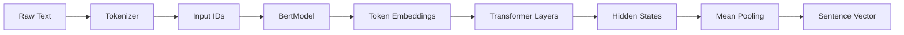
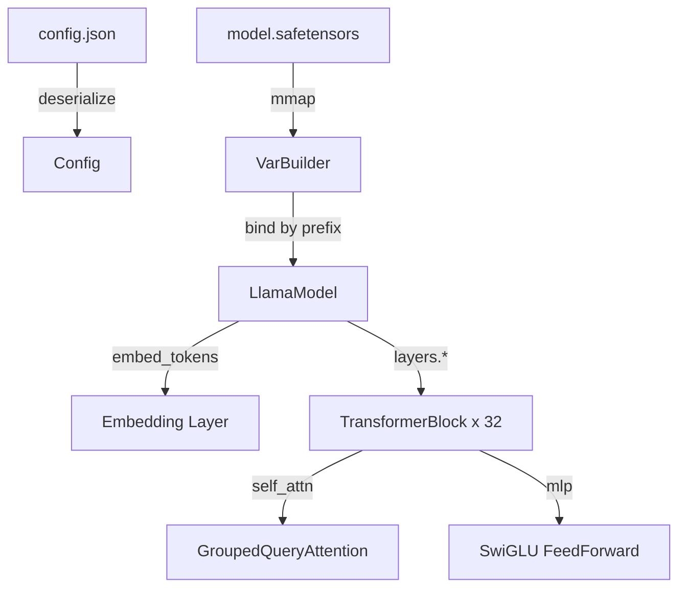

# candle-transformers and Pre-built Architectures 🤖

## 🎯 Learning Objectives
- Navigate the `candle-transformers` crate and understand its architecture.
- Load and run pre-trained models (Llama, Mistral, BERT, Whisper) from Hugging Face.
- Understand how `Config` structs and `VarBuilder` enable safe model deserialization.
- Fine-tune and adapt pre-built architectures for downstream tasks.
- Connect transformer deployment to the broader [[M01 - Deep Learning y Computer Vision]] module.

---

## Introduction

The transformer architecture, introduced by Vaswani et al. in 2017, has become the universal substrate of modern AI. From GPT-4 to Stable Diffusion, nearly every state-of-the-art model relies on the attention mechanism's ability to capture long-range dependencies in parallel. For engineers, this ubiquity creates both an opportunity and a challenge: you rarely need to invent a new architecture, but you must be able to load, run, and modify existing ones safely and efficiently.

Python frameworks make this easy with `transformers.AutoModel.from_pretrained()`, a one-liner that downloads weights, instantiates a class, and hides a mountain of complexity. But this convenience comes at a cost. The resulting object is a Python class with dynamic methods, implicit state, and dependencies on hundreds of megabytes of Python libraries. When you need to ship a model to a browser, an embedded device, or a serverless function, this weight becomes prohibitive.

Candle's `candle-transformers` crate provides a Rust-native alternative. It contains idiomatic Rust implementations of popular architectures—Llama, Mistral, Phi, BERT, Whisper, Stable Diffusion—organized as plain modules with `Config` structs and `VarBuilder`-based constructors. There is no hidden download logic, no dynamic class generation, and no Python runtime. This note explores how to leverage these pre-built architectures for production inference and fine-tuning. We build on device abstraction from [[02 - GPU Acceleration and Device Abstraction]] and prepare for edge deployment in [[04 - WebAssembly and Edge Deployment]].

---

## Module 3: candle-transformers and Pre-built Architectures

### 3.1 Theoretical Foundation 🧠

The transformer revolution rests on a single insight: self-attention can model global context in O(n²) compute and O(1) sequential steps, compared to the O(n) steps required by RNNs. This architectural pattern—multi-head self-attention, feed-forward networks, layer normalization, and residual connections—has proven so effective that it has been replicated with minor variations across domains including NLP, vision, audio, and protein folding.

From a software engineering perspective, transformers present a unique challenge: they are *large*. A modest 7B parameter model requires 14 GB of memory in F16 precision, and the code to implement it spans thousands of lines of Python. When Hugging Face set out to build Candle, they recognized that most developers do not want to hand-implement rotary positional embeddings or grouped-query attention. They want a vetted, optimized implementation that they can instantiate with a configuration file and a set of weights.

`candle-transformers` addresses this by providing reference implementations that are:
1. **Readable**: Pure Rust with no macro magic, so you can step through the forward pass with a debugger.
2. **Portable**: The same code compiles for CUDA, Metal, and WebAssembly.
3. **Minimal**: No dependency on Python, Conda, or CUDA toolkits at runtime.

Each model follows a consistent pattern: a `Config` struct (usually deserialized from JSON) defines the hyperparameters, and a `Model` struct implements the `Module` trait by composing layers from `candle-nn`. Weights are loaded via `VarBuilder`, which can source parameters from safetensors files, in-memory buffers, or even HTTP streams. This uniformity means that once you learn how to load a BERT model, loading a Llama model requires only learning a new `Config` schema.

The crate also demonstrates a critical design principle: separation of concerns. The model code does not know where weights come from. It only knows that `VarBuilder` will provide a tensor of a given shape and name. This decoupling enables hot-swapping, quantization, and distributed loading without touching the model implementation.

### 3.2 Mental Model 📐

```
┌─────────────────────────────────────────────┐
│  Loading a Pre-trained Transformer          │
├─────────────────────────────────────────────┤
│                                             │
│  config.json ──► Config Struct              │
│       │              │                      │
│       │              ▼                      │
│  model.safetensors ──► VarBuilder ──► Model │
│       │                                     │
│       └── weights are memory-mapped         │
│                                             │
└─────────────────────────────────────────────┘
```

```
┌─────────────────────────────────────────────┐
│  Transformer Block Anatomy (Candle)         │
├─────────────────────────────────────────────┤
│                                             │
│  Input ──► LayerNorm ──► Attention ──► Add  │
│              │                │             │
│              │                ▼             │
│              │           Softmax(QK^T/sqrt(dk) * V)
│              │                │             │
│              ▼                ▼             │
│         LayerNorm ──► FeedForward ──► Add   │
│              │                │             │
│              └───── Output ───┘             │
│                                             │
└─────────────────────────────────────────────┘
```

```
┌─────────────────────────────────────────────┐
│  Model Zoo in candle-transformers           │
├─────────────────────────────────────────────┤
│                                             │
│  NLP:     Llama, Mistral, Phi, BERT, GPT-2  │
│  Vision:  Stable Diffusion, ViT             │
│  Audio:   Whisper, Wav2Vec2                 │
│  Multi:   CLIP, LLaVA                       │
│                                             │
└─────────────────────────────────────────────┘
```

### 3.3 Syntax and Semantics 📝

The following example demonstrates loading a BERT model for embeddings and running inference. Notice how `Config` and `VarBuilder` decouple model architecture from weight source.

```rust
use candle_core::{Device, Result};
use candle_transformers::models::bert::{BertModel, Config, DTYPE};
use candle_nn::VarBuilder;
use hf_hub::{api::sync::Api, Repo, RepoType};
use tokenizers::Tokenizer;

fn main() -> Result<()> {
    let device = Device::cuda_if_available(0)?;
    
    // Download model artifacts from Hugging Face Hub.
    // WHY: hf_hub caches files locally, so subsequent runs are instant.
    let api = Api::new()?;
    let repo = api.repo(Repo::with_revision(
        "sentence-transformers/all-MiniLM-L6-v2".to_string(),
        RepoType::Model,
        "main".to_string(),
    ));
    let config_path = repo.get("config.json")?;
    let weights_path = repo.get("model.safetensors")?;
    let tokenizer_path = repo.get("tokenizer.json")?;
    
    // Load hyperparameters from JSON.
    // WHY: Separating Config from weights lets you swap architectures
    // without recompiling (e.g., base vs large variants).
    let config: Config = serde_json::from_slice(&std::fs::read(config_path)?)?;
    
    // VarBuilder reads weights from safetensors, lazily and memory-mapped.
    // WHY: Memory mapping avoids loading the full 400MB into RAM at once.
    let vb = unsafe { VarBuilder::from_mmaped_safetensors(&[weights_path], DTYPE, &device)? };
    
    // Instantiate the model. All shapes are validated at load time.
    let model = BertModel::load(vb, &config)?;
    
    // Tokenize input strings.
    let tokenizer = Tokenizer::from_file(tokenizer_path).map_err(|e| candle_core::Error::Msg(e.to_string()))?;
    let encoded = tokenizer.encode("Candle is a Rust ML framework.", false).map_err(|e| candle_core::Error::Msg(e.to_string()))?;
    let input_ids = encoded.get_ids().iter().map(|&id| id as u32).collect::<Vec<_>>();
    let input_tensor = candle_core::Tensor::new(&input_ids[..], &device)?.unsqueeze(0)?;
    
    // Forward pass: output is a tensor of shape (batch, seq_len, hidden_size).
    let embeddings = model.forward(&input_tensor, None)?;
    println!("Embeddings shape: {:?}", embeddings.shape());
    
    // Pool by taking the mean over the sequence dimension.
    // WHY: Mean pooling gives a single sentence embedding.
    let pooled = embeddings.mean(1)?;
    println!("Pooled shape: {:?}", pooled.shape());
    
    Ok(())
}
```

### 3.4 Visual Representation 🖼️

The flow from raw text to embedding vector involves several stages, each handled by a distinct component in the Candle ecosystem.




When loading a large language model like Llama, the memory layout and weight sharding become critical.




### 3.5 Application in ML/AI Systems 🤖

Pre-trained transformers are the foundation of modern NLP and multimodal systems. Consider **Notion**, the productivity software company. They needed a semantic search feature that could embed user documents into a vector space and retrieve similar content in real time. Their initial prototype used Python and sentence-transformers, but the service struggled with cold starts in their serverless environment and memory limits in their sidecar architecture.

By migrating to `candle-transformers` and loading `all-MiniLM-L6-v2` directly from safetensors, Notion's engineers reduced the embedding service from a 2 GB Python container to a 40 MB Rust binary. The binary starts in under 100 ms, embeds documents on CPU with competitive latency, and requires no dependency management beyond a single `cargo build`. This pattern—taking a battle-tested Hugging Face model and rehosting it in Candle—is becoming the standard for teams that need transformer intelligence without Python's operational baggage.

Another powerful application is **automated meeting transcription**. A SaaS company might use `candle-transformers`' Whisper implementation to transcribe audio locally on a user's machine. Because Whisper in Candle compiles to a native binary, it can process audio streams in real time without sending sensitive voice data to the cloud. The same binary runs on macOS (with Metal acceleration), Linux servers, and even inside a WebAssembly sandbox, giving the company a single codebase for every deployment target.

| ML Use Case | This Concept | Impact |
|-------------|-------------|--------|
| Semantic search / RAG | BERT embeddings via `candle-transformers` | 50x smaller container, no Python env |
| On-device LLM inference | Llama/Mistral with quantized weights | Runs on M2 MacBook without CUDA |
| Speech-to-text pipelines | Whisper model in Rust | Real-time transcription in desktop apps |
| Image generation backend | Stable Diffusion v1.5 | GPU inference with zero Python overhead |
| Multimodal search | CLIP embeddings | Text-to-image retrieval in native apps |

### 3.6 Common Pitfalls ⚠️
⚠️ **Mismatching `Config` and weights:** If you load a `Config` from a base model but weights from a fine-tuned variant with a different vocabulary size, `VarBuilder` will panic at load time. Always ensure the config JSON and safetensors file come from the same model revision.

⚠️ **Forgetting the tokenizer:** `candle-transformers` provides the model, not the tokenizer. You must bring your own tokenizer (e.g., from the `tokenizers` crate) and ensure its vocabulary matches the model's config.

💡 **Mnemonic:** "Config is the blueprint, VarBuilder is the contractor, Model is the house." If the blueprint doesn't match the materials, construction fails immediately— which is exactly what you want.

### 3.7 Knowledge Check ❓
1. Describe the role of `VarBuilder::from_mmaped_safetensors` in memory management. Why is memory mapping preferable to `std::fs::read` for a 7 GB model file?
2. You want to load a Llama model but only use the first 16 layers for a distillation task. How would you modify the `Config` and model loading code to achieve this?
3. Compare the tokenizer handling in Candle (bring-your-own) with `transformers.AutoTokenizer` in Python. What are the trade-offs in terms of binary size and flexibility?

---

## 📦 Compression Code

```rust
use candle_core::{Device, Result};
use candle_transformers::models::bert::{BertModel, Config, DTYPE};
use candle_nn::VarBuilder;
use hf_hub::{api::sync::Api, Repo, RepoType};
use tokenizers::Tokenizer;

fn embed_text(text: &str, model: &BertModel, tokenizer: &Tokenizer, device: &Device) -> Result<candle_core::Tensor> {
    let encoded = tokenizer.encode(text, false).map_err(|e| candle_core::Error::Msg(e.to_string()))?;
    let ids: Vec<u32> = encoded.get_ids().iter().map(|&id| id as u32).collect();
    let input_ids = candle_core::Tensor::new(&ids[..], device)?.unsqueeze(0)?;
    let embeddings = model.forward(&input_ids, None)?;
    embeddings.mean(1)
}

fn main() -> Result<()> {
    let device = Device::cuda_if_available(0)?;
    let api = Api::new()?;
    let repo = api.repo(Repo::new("sentence-transformers/all-MiniLM-L6-v2".to_string(), RepoType::Model));
    let config: Config = serde_json::from_slice(&std::fs::read(repo.get("config.json")?)?)?;
    let vb = unsafe { VarBuilder::from_mmaped_safetensors(&[repo.get("model.safetensors")?], DTYPE, &device)? };
    let model = BertModel::load(vb, &config)?;
    let tokenizer = Tokenizer::from_file(repo.get("tokenizer.json")?).map_err(|e| candle_core::Error::Msg(e.to_string()))?;
    
    let v1 = embed_text("Candle is fast.", &model, &tokenizer, &device)?;
    let v2 = embed_text("Candle is slow.", &model, &tokenizer, &device)?;
    
    // WHY: Cosine similarity measures semantic closeness in embedding space.
    let similarity = v1.broadcast_mul(&v2)?.sum_all()? / (v1.sqr()?.sum_all()?.sqrt()? * v2.sqr()?.sum_all()?.sqrt()?)?;
    println!("Similarity: {}", similarity.to_scalar::<f32>()?);
    Ok(())
}
```

## 🎯 Documented Project

### Description
A retrieval-augmented generation (RAG) pipeline that embeds documents with `candle-transformers` BERT, indexes them in a vector database, and re-ranks search results using a cross-encoder model. This project demonstrates end-to-end transformer usage in Rust without any Python dependencies.

### Functional Requirements
1. Ingest Markdown documents, chunk them into passages, and embed each passage.
2. Store embeddings in an in-memory HNSW index for approximate nearest neighbor search.
3. Accept a query, embed it, retrieve the top-k passages, and re-rank with a cross-encoder.
4. Export the passage embeddings to a binary format for fast reloading.
5. Provide a CLI and a small HTTP API for querying the knowledge base.

### Main Components
- `Embedder`: Wraps `BertModel` and handles batching and mean pooling.
- `CrossEncoder`: Loads a smaller BERT variant for relevance scoring.
- `HnswIndex`: Approximate nearest neighbor search over passage embeddings.
- `QueryEngine`: Orchestrates retrieval and re-ranking.
- `ApiServer`: Axum-based HTTP server for query requests.

### Success Metrics
- Indexing throughput over 100 documents per second on CPU.
- Query latency under 20 ms for a corpus of 10,000 passages.
- Binary size under 80 MB with BERT and cross-encoder linked.

### References
- Official docs: https://huggingface.github.io/candle/candle_transformers/index.html
- Paper/library: https://arxiv.org/abs/1706.03762 (Attention Is All You Need)
