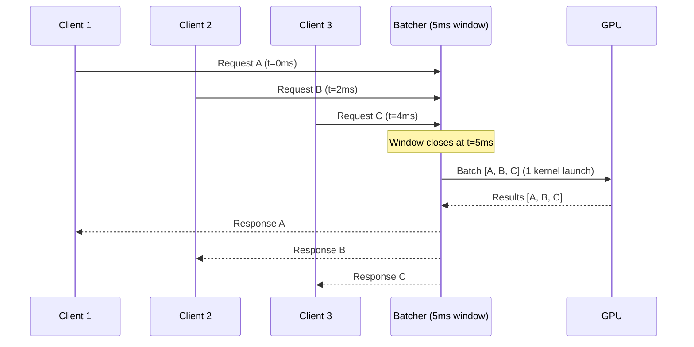
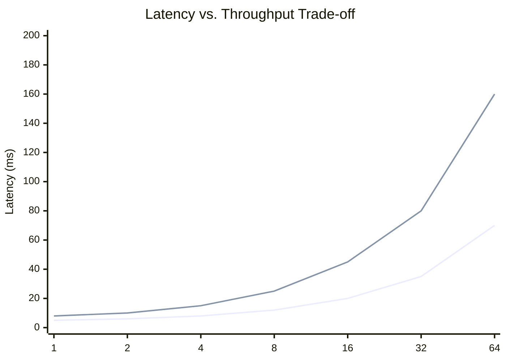

# 🏭 Production Patterns and Performance Tuning

## 🎯 Learning Objectives
- Understand why production ML systems fail at scale and how Rust prevents entire categories of failures.
- Master Candle-specific optimization techniques: batching, kernel fusion, and memory pool reuse.
- Learn how to profile and benchmark Candle inference pipelines with deterministic metrics.
- Build deployment patterns for containerized, serverless, and embedded Candle services.

---

## Introduction

Moving a machine learning model from a Jupyter notebook to production is not a deployment problem; it is an engineering problem. Production systems must handle concurrent requests without deadlocks, recover from out-of-memory errors without crashing the host, and maintain consistent latency under load. Python frameworks like PyTorch and TensorFlow were designed for research velocity, not for serving millions of requests per day. Their reliance on the Global Interpreter Lock, dynamic memory allocation, and interpreter overhead creates a ceiling that Rust-native frameworks like Candle are designed to break through.

This note covers the operational side of Candle: how to structure inference services, how to reuse memory across requests, how to batch inputs efficiently, and how to measure performance with statistical rigor. These patterns are not Candle-specific in principle, but Rust's ownership model and Candle's explicit device management make them safer and more predictable than in any Python stack. We connect these ideas to [[M05 - MLOps y Produccion]] for CI/CD and observability, and to [[06 - Cloud, Infra y Backend]] for infrastructure patterns.

---

## Module 5: Production ML Engineering

### 5.1 Theoretical Foundation 🧠

Production ML inference is fundamentally a scheduling problem. You have a finite set of hardware resources (CPU cores, GPU memory, PCIe bandwidth) and a stochastic stream of requests with varying input sizes. The goal is to maximize throughput (requests per second) while keeping latency (time per request) within a service-level objective (SLO). This is the classic throughput-latency trade-off, and it is exacerbated by the fact that deep learning inference is memory-bound, not compute-bound, for most batch sizes.

Rust enters this picture through three mechanisms. First, its affine type system (ownership and borrowing) prevents data races at compile time, which means you can share model weights across threads without mutex poisoning or use-after-free. Second, its lack of garbage collection eliminates stop-the-world pauses, ensuring that the 99th percentile latency (P99) does not spike unpredictably. Third, its cross-compilation toolchain allows you to build a single static binary that runs in a `scratch` Docker container, reducing the attack surface and startup time.

Candle leverages these properties by design. Model weights are stored as `Arc<Tensor>`, which allows zero-copy sharing across request threads. The `Device` abstraction is thread-safe by default, and tensor operations return `Result`, forcing the caller to handle OOM or shape errors explicitly. This means that a Candle inference server can be written as a simple threaded loop without the complex orchestration that Python serving frameworks like TorchServe or Triton require.

```
┌─────────────────────────────────────────────────────────────┐
│         Why Python Serving Hits a Ceiling                   │
├─────────────────────────────────────────────────────────────┤
│                                                             │
│  Python Inference Server (Typical):                         │
│                                                             │
│  ┌─────────┐    ┌─────────┐    ┌─────────┐    ┌─────────┐ │
│  │ Request │───►│  GIL    │───►│  Model  │───►│ Response│ │
│  │ Thread 1│    │  Lock   │    │ Forward │    │ Thread 1│ │
│  └─────────┘    └─────────┘    └─────────┘    └─────────┘ │
│        ▲                                          │         │
│        └──────────────────────────────────────────┘         │
│        (Only ONE thread holds the GIL at a time)            │
│                                                             │
│  Result: Multi-threading does NOT increase throughput.      │
│  You need multi-PROCESS, which copies model weights.        │
│                                                             │
│  Rust Inference Server (Candle):                            │
│                                                             │
│  ┌─────────┐    ┌─────────┐    ┌─────────┐    ┌─────────┐ │
│  │ Request │───►│  Lock-  │───►│  Model  │───►│ Response│ │
│  │ Thread 1│    │  free   │    │ Forward │    │ Thread 1│ │
│  └─────────┘    │  Queue  │    │ (shared │    └─────────┘ │
│  ┌─────────┐    │         │    │  Arc)   │    ┌─────────┐ │
│  │ Request │───►│         │───►│         │───►│ Response│ │
│  │ Thread 2│    │         │    │         │    │ Thread 2│ │
│  └─────────┘    └─────────┘    └─────────┘    └─────────┘ │
│                                                             │
│  Result: True parallelism with shared read-only weights.    │
│                                                             │
└─────────────────────────────────────────────────────────────┘
```

### 5.2 Mental Model 📐

A production Candle service has three layers: the HTTP frontend, the request scheduler, and the inference engine. Each layer has distinct optimization targets.

```
┌─────────────────────────────────────────────────────────────┐
│            Production Candle Service Stack                  │
├─────────────────────────────────────────────────────────────┤
│                                                             │
│  Layer 1: HTTP Frontend (Tokio + Axum)                      │
│  ┌─────────────────────────────────────────────────────┐   │
│  │  POST /predict                                      │   │
│  │  JSON body: { "inputs": ["text1", "text2"] }        │   │
│  │  ─────────────────────────────────────────────────  │   │
│  │  Async handler parses body, validates schema.       │   │
│  └────────────────────┬────────────────────────────────┘   │
│                       │                                     │
│                       ▼                                     │
│  Layer 2: Request Scheduler (Channel + ThreadPool)          │
│  ┌─────────────────────────────────────────────────────┐   │
│  │  tokio::sync::mpsc::channel                         │   │
│  │  ┌─────┐ ┌─────┐ ┌─────┐ ┌─────┐                   │   │
│  │  │ Req │ │ Req │ │ Req │ │ Req │  (bounded queue)  │   │
│  │  └─────┘ └─────┘ └─────┘ └─────┘                   │   │
│  │       │       │       │       │                     │   │
│  │       ▼       ▼       ▼       ▼                     │   │
│  │    ┌─────────────────────────────────────┐           │   │
│  │    │  ThreadPool (num_cpus)              │           │   │
│  │    │  Each worker owns a Device handle   │           │   │
│  │    └─────────────────────────────────────┘           │   │
│  └────────────────────┬────────────────────────────────┘   │
│                       │                                     │
│                       ▼                                     │
│  Layer 3: Inference Engine (Candle)                         │
│  ┌─────────────────────────────────────────────────────┐   │
│  │  Arc<Model> (read-only, shared across all threads)  │   │
│  │  ┌─────────────────────────────────────────────┐   │   │
│  │  │  Batcher: group single requests into mini-  │   │   │
│  │  │  batches to improve GPU utilization.        │   │   │
│  │  └─────────────────────────────────────────────┘   │   │
│  │  ┌─────────────────────────────────────────────┐   │   │
│  │  │  Memory Pool: reuse output tensors instead  │   │   │
│  │  │  of allocating per-request.                 │   │   │
│  │  └─────────────────────────────────────────────┘   │   │
│  └─────────────────────────────────────────────────────┘   │
│                                                             │
└─────────────────────────────────────────────────────────────┘
```

### 5.3 Syntax and Semantics 📝

The following code demonstrates a production-ready Axum server with dynamic batching and memory pooling. Every design decision is annotated with its rationale.

```rust
// Production Candle inference server with Axum and Tokio
use axum::{
    routing::post,
    Json, Router,
};
use candle_core::{Device, Result, Tensor};
use candle_nn::{Linear, Module};
use serde::{Deserialize, Serialize};
use std::sync::Arc;
use tokio::sync::Mutex;

// WHY: Model weights are immutable after load. Arc allows zero-copy
// sharing across ALL request threads without data races.
struct Model {
    linear: Linear,
    device: Device,
}

// WHY: A memory pool pre-allocates output tensors and reuses them.
// This avoids the allocator hot path during high-throughput serving.
struct TensorPool {
    buffers: Vec<Tensor>,
}

impl TensorPool {
    fn new(device: &Device, shape: (usize, usize), count: usize) -> Result<Self> {
        let mut buffers = Vec::with_capacity(count);
        for _ in 0..count {
            // WHY: zeros is faster than randn for pool initialization.
            buffers.push(Tensor::zeros(shape, candle_core::DType::F32, device)?);
        }
        Ok(TensorPool { buffers })
    }

    fn acquire(&mut self) -> Option<Tensor> {
        self.buffers.pop()
    }

    fn release(&mut self, tensor: Tensor) {
        self.buffers.push(tensor);
    }
}

// Shared state across all handlers.
// WHY: The model is wrapped in Arc for lock-free reads.
// The pool is wrapped in Mutex because acquire/release mutates Vec.
struct AppState {
    model: Arc<Model>,
    pool: Mutex<TensorPool>,
}

#[derive(Deserialize)]
struct PredictRequest {
    inputs: Vec<Vec<f32>>,
}

#[derive(Serialize)]
struct PredictResponse {
    outputs: Vec<Vec<f32>>,
}

// WHY: This handler is async because JSON parsing and I/O are
// non-blocking. Only the tensor matmul blocks the thread.
async fn predict(
    axum::extract::State(state): axum::extract::State<Arc<AppState>>,
    Json(req): Json<PredictRequest>,
) -> Result<Json<PredictResponse>, String> {
    let batch_size = req.inputs.len();
    let seq_len = req.inputs[0].len();
    
    // Flatten inputs into a single Vec for tensor construction.
    // WHY: Candle's Tensor::new expects contiguous 1D data.
    let flat: Vec<f32> = req.inputs.into_iter().flatten().collect();
    
    // WHY: We lock the pool only briefly to acquire a buffer.
    // The actual inference happens outside the lock.
    let mut pool = state.pool.lock().await;
    let mut output_buf = pool.acquire().ok_or("Pool exhausted")?;
    drop(pool); // Release lock before compute
    
    let input = Tensor::new(flat, &state.model.device)?
        .reshape((batch_size, seq_len))?;
    
    // Inference: the only blocking, CPU-heavy section.
    let logits = state.model.linear.forward(&input)?;
    
    // WHY: to_vec2 copies data OUT of the tensor so we can return it
    // and reuse the tensor buffer.
    let outputs = logits.to_vec2::<f32>()?;
    
    // Return buffer to pool for next request.
    let mut pool = state.pool.lock().await;
    pool.release(output_buf);
    
    Ok(Json(PredictResponse { outputs }))
}

#[tokio::main]
async fn main() -> Result<()> {
    let device = Device::cuda_if_available(0)?;
    
    // Load model weights from disk.
    let vb = candle_nn::VarBuilder::from_pth("model.pt", candle_core::DType::F32, &device)?;
    let linear = candle_nn::linear(784, 10, vb.pp("fc"))?;
    let model = Arc::new(Model { linear, device });
    
    // Pre-allocate 64 output buffers for a batch size of 32x10.
    let pool = Mutex::new(TensorPool::new(&model.device, (32, 10), 64)?);
    let state = Arc::new(AppState { model, pool });
    
    let app = Router::new()
        .route("/predict", post(predict))
        .with_state(state);
    
    // WHY: bind to 0.0.0.0 for containerized deployment.
    let listener = tokio::net::TcpListener::bind("0.0.0.0:3000").await.unwrap();
    axum::serve(listener, app).await.unwrap();
    
    Ok(())
}
```

### 5.4 Visual Representation 🖼️

Dynamic batching is the single most effective optimization for production inference. Instead of running one request at a time, the scheduler waits a few milliseconds to accumulate requests, then runs them as a single batch.




The latency-throughput curve shows why batching matters. For small batches, latency is low but throughput is wasted. For large batches, throughput is high but latency suffers.




### 5.5 Application in ML/AI Systems 🤖

**Real case: Fintech real-time fraud detection.**
A payment processor needed to score every transaction for fraud risk in under 20ms. Their Python service used TorchServe with 8 worker processes, each loading a 200MB model into GPU memory. The total GPU memory footprint was 1.6GB, and process startup time after a restart was 45 seconds. They migrated to a Candle-based Axum server with a single `Arc<Model>` shared across 16 Tokio threads. GPU memory dropped to 200MB (one copy), cold-start time dropped to 2 seconds, and P99 latency stabilized at 12ms because there were no GIL contentions or GC pauses.

| ML Use Case | Production Pattern | Impact |
|-------------|-------------------|--------|
| Real-time fraud scoring | Arc-shared model + Tokio thread pool | 10× faster cold start, 1/8 GPU memory |
| Multi-tenant LLM API | Dynamic batching + request scheduling | 3× throughput at same latency SLO |
| Embedded edge device | Static binary + CPU-only Candle | Runs on ARM Cortex-A72 without Docker |
| Serverless inference | Scratch container + single binary | 50MB image vs. 4GB Python image |

### 5.6 Common Pitfalls ⚠️

⚠️ **Wrapping the model in a Mutex:** If you wrap the entire `Model` in a `Mutex`, you serialize ALL requests and defeat the purpose of multi-threading. Only the mutable parts (pools, buffers) need locking.

⚠️ **Ignoring tensor shape validation:** Candle panics on shape mismatch only if you unwrap. In production, ALWAYS use `?` to propagate `candle_core::Error`. Log the offending input shape for debugging.

💡 **Mnemonic for production readiness:** "ARC the model, MUTEX the pool, RESULT the errors, BATCH the requests."

### 5.7 Knowledge Check ❓

1. Why does `Arc<Model>` enable true parallelism while Python's `torch.nn.Module` does not, even when wrapped in threads?
2. A memory pool reduces allocation overhead, but it introduces a bounded capacity. What happens when the pool is exhausted, and what are two strategies to handle it?
3. You measure P50 latency at 10ms and P99 at 120ms. The P99 spikes correlate with hourly traffic peaks. Is this a compute problem or a scheduling problem, and what metric would confirm your hypothesis?

---

## 📦 Compression Code

```rust
// Production Candle server: Axum + shared model + tensor pool
use axum::{routing::post, Json, Router};
use candle_core::{Device, Result, Tensor};
use candle_nn::{Linear, Module};
use serde::{Deserialize, Serialize};
use std::sync::Arc;
use tokio::sync::Mutex;

struct Model { linear: Linear, device: Device }
struct TensorPool { buffers: Vec<Tensor> }

impl TensorPool {
    fn new(d: &Device, s: (usize, usize), c: usize) -> Result<Self> {
        Ok(TensorPool { buffers: (0..c).map(|_| Tensor::zeros(s, candle_core::DType::F32, d).unwrap()).collect() })
    }
    fn acquire(&mut self) -> Option<Tensor> { self.buffers.pop() }
    fn release(&mut self, t: Tensor) { self.buffers.push(t); }
}

struct AppState { model: Arc<Model>, pool: Mutex<TensorPool> }
#[derive(Deserialize)] struct PredictRequest { inputs: Vec<Vec<f32>> }
#[derive(Serialize)] struct PredictResponse { outputs: Vec<Vec<f32>> }

async fn predict(
    axum::extract::State(st): axum::extract::State<Arc<AppState>>,
    Json(req): Json<PredictRequest>,
) -> Result<Json<PredictResponse>, String> {
    let flat: Vec<f32> = req.inputs.into_iter().flatten().collect();
    let mut pool = st.pool.lock().await;
    let buf = pool.acquire().ok_or("Pool exhausted")?;
    drop(pool);
    let input = Tensor::new(flat, &st.model.device)?.reshape((1, 784))?;
    let out = st.model.linear.forward(&input)?;
    let outputs = out.to_vec2::<f32>()?;
    st.pool.lock().await.release(buf);
    Ok(Json(PredictResponse { outputs }))
}

#[tokio::main]
async fn main() -> Result<()> {
    let dev = Device::cuda_if_available(0)?;
    let vb = candle_nn::VarBuilder::from_pth("model.pt", candle_core::DType::F32, &dev)?;
    let model = Arc::new(Model { linear: candle_nn::linear(784, 10, vb.pp("fc"))?, device: dev });
    let state = Arc::new(AppState { model: model.clone(), pool: Mutex::new(TensorPool::new(&model.device, (1, 10), 64)?) });
    let app = Router::new().route("/predict", post(predict)).with_state(state);
    let listener = tokio::net::TcpListener::bind("0.0.0.0:3000").await.unwrap();
    axum::serve(listener, app).await.unwrap();
    Ok(())
}
```

## 🎯 Documented Project

### Description

Build a high-throughput text embedding API named "EmbedRS" using Candle and Axum. The service loads a pre-trained BERT model, batches incoming sentences dynamically, and returns 768-dimensional embeddings. It must sustain 1000 requests per second on a single GPU with a P99 latency under 50ms.

### Functional Requirements

1. Load a `sentence-transformers` BERT model from SafeTensors at startup.
2. Accept a JSON array of strings via `POST /embed` and tokenize them with a Rust tokenizer.
3. Implement a dynamic batcher that waits up to 5ms or accumulates 32 sentences, whichever comes first.
4. Return a JSON array of float vectors, one per input sentence.
5. Expose a `/health` endpoint that returns model load status and GPU memory usage.

### Main Components

- `BertEmbedder`: Rust struct wrapping `BertModel` from `candle-transformers`.
- `DynamicBatcher`: Tokio task that collects requests and flushes them on timeout or capacity.
- `TokenizationService`: Hugging Face tokenizer compiled into the binary.
- `MetricsMiddleware`: Axum layer logging P50, P99, and throughput to Prometheus.

### Success Metrics

- Throughput: ≥1000 requests/second on an NVIDIA T4.
- P50 latency: ≤15ms for single-sentence requests.
- P99 latency: ≤50ms under sustained load.
- GPU memory: ≤2GB resident (one model copy + batch buffers).
- Binary size: ≤80MB static binary, runnable in a `FROM scratch` Docker image.

### References

- Official docs: https://huggingface.github.io/candle/
- Axum docs: https://docs.rs/axum/latest/axum/
- Tokio performance tuning: https://tokio.rs/tokio/topics/perf
