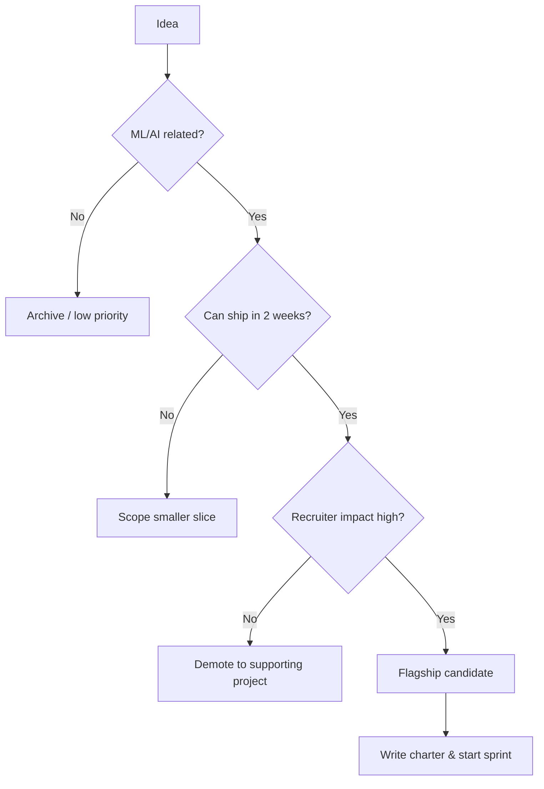

# 📋 Project Planning Guide for Software Engineering

## Overview

This guide gives you a repeatable framework for choosing, scoping, and shipping software engineering projects that target ML/AI engineering roles. Hiring managers review dozens of portfolios; a random collection of notebooks is not enough. You need a curated portfolio that tells a story: you can build reliable systems, ship on time, and iterate with feedback.

We cover a time-boxed sprint strategy (two-week cycles) and a portfolio pyramid built around one flagship project supported by two smaller projects. This structure maximizes recruiter impact while keeping scope realistic for someone studying after work or school. By the end, you will have a project roadmap you can execute immediately.

## Prerequisites

- Basic Python programming and Git workflows
- A GitHub account and at least one previous Python project
- Familiarity with command-line basics (bash/PowerShell)
- Markdown editing (Obsidian or VS Code)

## Learning Objectives

1. Evaluate project ideas through a "portfolio impact vs. effort" lens
2. Scope work into two-week sprints with clear deliverables
3. Structure a portfolio pyramid: one flagship + two supporting projects
4. Write a one-page project charter before writing code
5. Define done criteria that recruiters can verify in under 60 seconds

## Official Resources & Links

| Resource | Type | URL | Why It Matters |
|----------|------|-----|----------------|
| GitHub Docs | Docs | https://docs.github.com/en | Host portfolio, issues, and project boards |
| Docker Docs | Docs | https://docs.docker.com/get-started/ | Containerize every project you ship |
| FastAPI Docs | Docs | https://fastapi.tiangolo.com/ | Reference for API projects in your plan |
| Google SRE Book | Book | https://sre.google/sre-book/table-of-contents/ | Teaches reliability thinking that separates juniors from seniors |
| Notion – Project Management | Template | https://www.notion.so/templates/project-management | Sprint planning and Kanban for solo builders |

## Architecture & Planning

### Project Selection Decision Tree



Key design decisions:
- Recruiter impact is judged by whether a hiring manager can understand the value in 30 seconds from a README.
- Two-week sprints force scope cuts and prevent six-month death marches.
- Supporting projects demonstrate breadth; the flagship demonstrates depth.

## Step-by-Step Implementation Guide

1. **Audit your current portfolio**
   - What: List every project on your GitHub.
   - Why: You cannot plan without knowing what you already have.
   - Command: Open your GitHub profile and export repo names into a Markdown table.
   - Expected output: A Markdown table with columns: Project | Domain | Completeness | Action.

2. **Brainstorm 10 ideas and rank them**
   - What: Write 10 one-liner project ideas.
   - Why: Quantity first, then quality. The best ideas often appear late in the list.
   - Snippet: Use a simple scoring matrix (Impact 1-5, Effort 1-5). Pick lowest Effort + highest Impact.

3. **Select the flagship and two supporters**
   - What: Choose 1 flagship (high complexity, end-to-end ML system) and 2 supporters (focused tools or demos).
   - Why: Recruiters remember one strong story, not ten half-finished repos.
   - Example: Flagship = end-to-end recommendation API; Supporters = data validation CLI + model monitoring dashboard.

4. **Write a one-page project charter for each**
   - What: A Markdown file in each repo: `PROJECT_CHARTER.md`.
   - Why: It proves you can scope work before writing code.
   - Template sections: Problem, Solution, Success Metrics, Tech Stack, Risks, Timeline.

5. **Set up two-week sprints in GitHub Projects**
   - What: Create a GitHub Project board with columns: Backlog, Sprint, In Progress, Review, Done.
   - Why: Public boards show process discipline to recruiters.
   - Command: GitHub repo → Projects → New board → Link issues.

6. **Define done criteria for every task**
   - What: Every issue must include a Definition of Done (e.g., "Code merged, tests pass, README updated").
   - Why: Prevents endless polishing and gives clear stopping rules.
   - Example checklist: Code written | Tests passing | README screenshot added | Docker builds.

7. **Build the first slice of the flagship**
   - What: Ship a working API endpoint or training script in the first sprint.
   - Why: Early working code validates the architecture and keeps motivation high.
   - Expected output: A curl-able endpoint or a training log you can screenshot.

8. **Review and demo at the end of each sprint**
   - What: Record a 2-minute Loom video walking through what you built.
   - Why: Video demos convert LinkedIn scrollers into profile visitors.

9. **Package for portfolio**
   - What: Write a top-level README with architecture diagram, setup instructions, and results.
   - Why: Recruiters will not read code; they read READMEs.

10. **Cross-link projects in your vault**
    - What: Use Obsidian `[[...]]` links between notes.
    - Why: A connected knowledge base accelerates interview storytelling.

## Guide Class / Example

```markdown
# PROJECT_CHARTER.md Template

## Project: End-to-End Sentiment API

### Problem
Developers need a fast, containerized sentiment endpoint with observability.

### Solution
A FastAPI service wrapping a DistilBERT model, deployed via Docker with Prometheus metrics.

### Success Metrics
- p95 latency < 100ms on CPU
- Test coverage > 80%
- GitHub Actions CI/CD passing

### Tech Stack
- Python 3.11, FastAPI, Docker, pytest, GitHub Actions

### Risks
- Model size may exceed free-tier container limits
- Mitigation: Use ONNX optimization if needed

### Timeline
- Sprint 1: API skeleton + health check
- Sprint 2: Model integration + tests
- Sprint 3: Docker + CI/CD + README polish
```

## Common Pitfalls & Checklist

- ⚠️ **Picking six flagship projects.** One deep project beats six shallow ones.
- ⚠️ **Skipping the charter.** Without scope boundaries, projects grow forever.
- ⚠️ **Perfectionism before shipping.** A working v1 with a video is better than a perfect v0.
- ⚠️ **Ignoring the README.** Recruiters judge the repo before the code.

| Task | Status | Notes |
|------|--------|-------|
| Portfolio audit complete | [ ] | List all repos |
| 10 ideas brainstormed | [ ] | Score impact vs effort |
| Flagship + 2 supporters chosen | [ ] | Write down selections |
| Charters written | [ ] | One per project |
| Sprint boards created | [ ] | GitHub Projects |
| First slice shipped | [ ] | Working code in main |
| README published | [ ] | Diagram + setup + results |

## Deployment & Portfolio Integration

- **How to deploy:** This is a planning artifact, not a service. Host the charter and sprint board publicly on GitHub.
- **How to present it on GitHub and LinkedIn:** Pin your flagship repo. Post a LinkedIn thread showing the before/after of your portfolio audit and the decision tree you used.
- **What recruiters want to see:** Evidence of self-directed scoping, public sprint boards, and a README that explains the business problem, not just the model.

## Next Steps

- Start building the API layer with [[01 - FastAPI for ML - Project Guide]]
- Design system architecture with [[02 - System Design for ML - Project Guide]]
