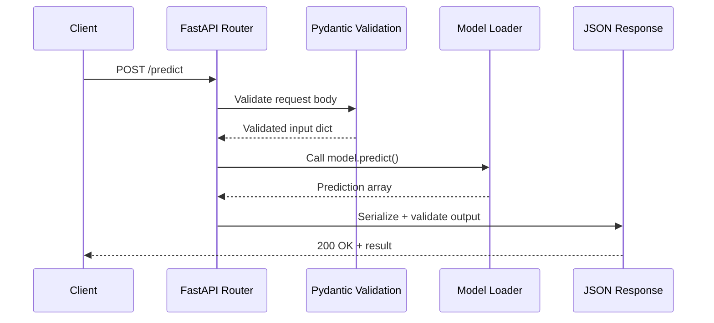

# ⚡ FastAPI for ML — Project Guide

## Overview

This guide teaches you how to productionize a machine learning model behind a modern, high-performance API using FastAPI. In ML engineering, a model that only runs in a Jupyter notebook has zero business value. You must wrap it in a service that validates inputs, handles concurrent requests, and exposes health and batch endpoints.

You will build three APIs: a health check, a single-row prediction endpoint, and a batch inference endpoint. You will also learn how to use Pydantic for strict input validation and how to write async endpoints for IO-bound tasks such as downloading artifacts or logging to external systems. This project is a staple portfolio piece because it demonstrates the exact skills ML platform teams hire for.

## Prerequisites

- Python 3.10+ installed locally
- Basic understanding of HTTP and REST concepts
- A trained model artifact (scikit-learn, ONNX, or PyTorch) or willingness to train a simple one
- Docker installed (optional but recommended for final deployment)

## Learning Objectives

1. Scaffold a FastAPI application with automated OpenAPI documentation
2. Define strict request and response schemas using Pydantic
3. Implement sync and async prediction endpoints with proper error handling
4. Add a health check and a batch inference route
5. Containerize the API with Docker and test it end-to-end

## Official Resources & Links

| Resource | Type | URL | Why It Matters |
|----------|------|-----|----------------|
| FastAPI Documentation | Docs | https://fastapi.tiangolo.com/ | The primary framework reference |
| Pydantic Documentation | Docs | https://docs.pydantic.dev/ | Validation and settings management |
| Uvicorn Documentation | Docs | https://www.uvicorn.org/ | ASGI server that runs FastAPI |
| Starlette Documentation | Docs | https://www.starlette.io/ | Low-level ASGI toolkit under FastAPI |
| Pydantic Settings | Docs | https://docs.pydantic.dev/latest/concepts/pydantic_settings/ | Manage environment-based config cleanly |

## Architecture & Planning

### Request Lifecycle Diagram



Key design decisions:
- Input validation happens before any model code runs, preventing garbage-in-garbage-out failures.
- The model is loaded once at startup and shared across requests to avoid expensive reloads.
- Async endpoints are reserved for IO-bound work (e.g., external logging), while CPU-bound inference remains sync to avoid event-loop blocking in simple deployments.

## Step-by-Step Implementation Guide

1. **Create a virtual environment and install dependencies**
   - What: Isolate project dependencies.
   - Why: Reproducible environments are non-negotiable for production APIs.
   - Commands:
     ```bash
     python -m venv venv
     source venv/bin/activate  # Windows: venv\Scripts\activate
     pip install fastapi uvicorn scikit-learn pydantic
     ```
   - Expected output: Clean environment with FastAPI installed.

2. **Train and save a minimal model artifact**
   - What: A scikit-learn classifier saved with `joblib`.
   - Why: You need a real artifact to load in the API.
   - Snippet:
     ```python
     from sklearn.datasets import load_iris
     from sklearn.ensemble import RandomForestClassifier
     import joblib
     X, y = load_iris(return_X_y=True)
     model = RandomForestClassifier().fit(X, y)
     joblib.dump(model, "model.pkl")
     ```

3. **Write Pydantic request/response schemas**
   - What: `PredictRequest` and `PredictResponse` classes.
   - Why: Contracts prevent malformed data from reaching the model.
   - Snippet:
     ```python
     from pydantic import BaseModel
     class PredictRequest(BaseModel):
         sepal_length: float
         sepal_width: float
         petal_length: float
         petal_width: float
     class PredictResponse(BaseModel):
         prediction: int
         prediction_label: str
     ```

4. **Implement the FastAPI application with model loading**
   - What: `main.py` with lifespan-based model initialization.
   - Why: Loading at startup guarantees the model is ready before the first request.
   - See the complete `main.py` in the Guide Class section below.

5. **Add a batch inference endpoint**
   - What: Accept a list of inputs and return a list of predictions.
   - Why: Batch APIs are common in real pipelines and show you understand throughput optimization.
   - Route: `POST /batch_predict`

6. **Write an async health-check endpoint**
   - What: `GET /health` that can optionally check external dependencies.
   - Why: Orchestrators (Kubernetes, Docker Compose) use this to route traffic.
   - Snippet:
     ```python
     @app.get("/health")
     async def health():
         return {"status": "ok", "model_loaded": app.state.model is not None}
     ```

7. **Test locally with Uvicorn and curl**
   - What: Start the server and send requests.
   - Why: Manual verification before writing automated tests.
   - Commands:
     ```bash
     uvicorn main:app --reload
     curl -X POST http://localhost:8000/predict \
       -H "Content-Type: application/json" \
       -d '{"sepal_length":5.1,"sepal_width":3.5,"petal_length":1.4,"petal_width":0.2}'
     ```

8. **Add a Dockerfile and build**
   - What: Multi-stage or single-stage Docker image.
   - Why: Containerization is the standard deployment artifact for ML services.
   - Expected output: `docker build -t fastapi-ml .` succeeds and `docker run -p 8000:8000 fastapi-ml` responds to curl.

9. **Write a README with architecture and setup**
   - What: Document dependencies, how to train the model, how to run the container.
   - Why: Recruiters and hiring managers read READMEs, not raw code.

10. **Push to GitHub and pin the repo**
    - What: Make the repository public, add tags, and pin it to your profile.
    - Why: A public, documented API project is one of the strongest signals for junior ML engineer roles.

## Guide Class / Example

```python
# main.py
from contextlib import asynccontextmanager
from typing import List
import joblib
import numpy as np
from fastapi import FastAPI
from pydantic import BaseModel

# --- Pydantic Schemas ---
class PredictRequest(BaseModel):
    sepal_length: float
    sepal_width: float
    petal_length: float
    petal_width: float

class PredictResponse(BaseModel):
    prediction: int
    prediction_label: str

class BatchPredictRequest(BaseModel):
    items: List[PredictRequest]

class BatchPredictResponse(BaseModel):
    predictions: List[PredictResponse]

# --- Model Loading ---
@asynccontextmanager
async def lifespan(app: FastAPI):
    # Startup
    app.state.model = joblib.load("model.pkl")
    app.state.labels = ["setosa", "versicolor", "virginica"]
    yield
    # Shutdown (cleanup if needed)

app = FastAPI(title="ML Inference API", lifespan=lifespan)

# --- Endpoints ---
@app.get("/health")
async def health():
    return {
        "status": "ok",
        "model_loaded": app.state.model is not None,
    }

@app.post("/predict", response_model=PredictResponse)
async def predict(request: PredictRequest):
    model = app.state.model
    labels = app.state.labels
    features = np.array([[request.sepal_length, request.sepal_width,
                          request.petal_length, request.petal_width]])
    pred = int(model.predict(features)[0])
    return PredictResponse(prediction=pred, prediction_label=labels[pred])

@app.post("/batch_predict", response_model=BatchPredictResponse)
async def batch_predict(request: BatchPredictRequest):
    model = app.state.model
    labels = app.state.labels
    features = np.array([
        [r.sepal_length, r.sepal_width, r.petal_length, r.petal_width]
        for r in request.items
    ])
    preds = model.predict(features).astype(int).tolist()
    return BatchPredictResponse(
        predictions=[
            PredictResponse(prediction=p, prediction_label=labels[p])
            for p in preds
        ]
    )

if __name__ == "__main__":
    import uvicorn
    uvicorn.run("main:app", host="0.0.0.0", port=8000, reload=True)
```

## Common Pitfalls & Checklist

- ⚠️ **Loading the model inside the endpoint.** This causes latency spikes and memory leaks under load.
- ⚠️ **Ignoring Pydantic validation.** Without schemas, users can send invalid shapes and crash the server.
- ⚠️ **Running CPU-bound inference in async def without a thread pool.** For heavy models, use `def` endpoints or offload to a thread pool.
- ⚠️ **Forgetting the health check.** Load balancers and container orchestrators depend on it.

| Task | Status | Notes |
|------|--------|-------|
| Model artifact trained and saved | [ ] | `model.pkl` exists |
| Pydantic schemas defined | [ ] | Request + response |
| Lifespan model loading implemented | [ ] | `main.py` startup event |
| `/predict` endpoint works | [ ] | Tested with curl |
| `/batch_predict` endpoint works | [ ] | List input + list output |
| `/health` endpoint works | [ ] | Returns JSON status |
| Dockerfile builds and runs | [ ] | `docker run` responds |
| README with diagram and setup | [ ] | Recruiter-ready docs |

## Deployment & Portfolio Integration

- **How to deploy:** Build the Docker image and push it to Docker Hub or GitHub Container Registry. Deploy to Render, Railway, AWS ECS, or a small VM. Include the deployment URL in your README.
- **How to present it on GitHub and LinkedIn:** Pin the repo. Share a LinkedIn post with a short Loom video hitting the health and predict endpoints from a terminal.
- **What recruiters want to see:** Clean Pydantic schemas, automated docs at `/docs`, a working Docker setup, and evidence that you understand sync vs async endpoint design.

## Next Steps

- Scale the architecture with [[02 - System Design for ML - Project Guide]]
- Add rigorous testing with [[03 - Testing in ML Systems - Project Guide]]
- Automate delivery with [[04 - CI-CD for ML - Project Guide]]
