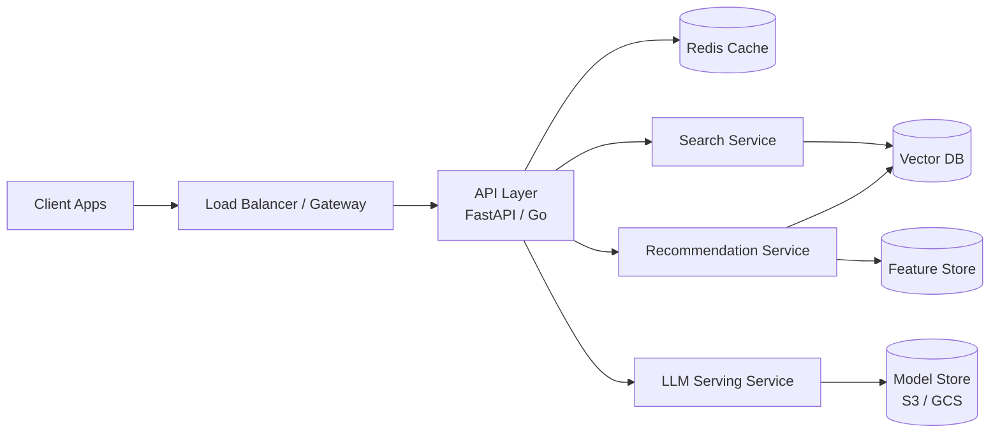

# 🏗️ System Design for ML — Project Guide

## Overview

This guide teaches you how to design scalable, reliable machine learning systems from first principles. Interviews for ML engineer roles almost always include a system design round where you are asked to sketch a recommendation system, a search service, or an LLM serving platform on a whiteboard.

You will design three systems: a recommendation service, a semantic search engine, and an LLM serving architecture. For each, you will make concrete decisions about load balancing, caching with Redis, rate limiting, and horizontal vs vertical scaling. This project lives in architecture diagrams and design documents rather than a single codebase, making it a unique portfolio piece that signals senior thinking even at the junior level.

## Prerequisites

- Completed at least one REST API project (e.g., FastAPI or Flask)
- Basic understanding of databases (SQL and vector stores)
- Familiarity with Docker and container concepts
- General knowledge of cloud primitives (VMs, load balancers, object storage)

## Learning Objectives

1. Design a recommendation system with candidate generation and ranking stages
2. Design a semantic search pipeline with embedding models and vector retrieval
3. Design an LLM serving architecture with batching and autoscaling
4. Choose between horizontal and vertical scaling for ML workloads
5. Integrate Redis caching and rate limiting into a design

## Official Resources & Links

| Resource | Type | URL | Why It Matters |
|----------|------|-----|----------------|
| System Design Primer (GitHub) | Repo | https://github.com/donnemartin/system-design-primer | The canonical open-source system design resource |
| AWS ML Architectures | Docs | https://docs.aws.amazon.com/wellarchitected/latest/machine-learning-lens/welcome.html | Production patterns from the largest cloud provider |
| Martin Fowler – Microservices | Blog | https://martinfowler.com/microservices/ | Foundational writing on service boundaries |
| Redis Documentation | Docs | https://redis.io/docs/ | Caching, rate limiting, and session store reference |
| NGINX Documentation | Docs | https://nginx.org/en/docs/ | Load balancing and reverse proxy patterns |

## Architecture & Planning

### High-Level ML Platform Architecture



Key design decisions:
- **Load Balancer:** Distributes traffic across API replicas; terminates TLS and handles rate limiting.
- **Redis Cache:** Stores hot predictions and feature lookups to reduce model compute load.
- **Vector DB:** Shared between search and recommendations because both rely on embedding retrieval.
- **Horizontal Scaling:** Preferred for stateless API and model serving layers; vertical scaling reserved for GPU-heavy training nodes.

## Step-by-Step Implementation Guide

1. **Pick one system to implement first**
   - What: Recommendation, search, or LLM serving.
   - Why: Designing all three at once leads to shallow work. Choose the one closest to your target job postings.
   - Example: If the jobs mention "recommendation systems," start there.

2. **Write a one-page requirements document**
   - What: Functional requirements (what the system does) and non-functional requirements (latency, throughput, availability).
   - Why: Every design decision must map back to a requirement.
   - Template:
     ```markdown
     ## Requirements
     - FR1: Generate top-10 item recommendations per user
     - NFR1: p95 latency < 100ms
     - NFR2: Support 10,000 RPS
     ```

3. **Sketch the data flow and model boundaries**
   - What: A diagram showing how data moves from ingestion to prediction.
   - Why: Model boundaries define service boundaries. The candidate generation model is often separate from the ranking model.

4. **Design the caching layer with Redis**
   - What: Define cache keys (e.g., `recs:user:{id}`), TTLs, and invalidation strategy.
   - Why: Caching is the cheapest way to improve latency and reduce compute cost.
   - Snippet (Python with redis-py):
     ```python
     import redis, json
     r = redis.Redis(host='localhost', port=6379, decode_responses=True)
     def get_recommendations(user_id: str):
         key = f"recs:user:{user_id}"
         cached = r.get(key)
         if cached:
             return json.loads(cached)
         recs = model.recommend(user_id)
         r.setex(key, 300, json.dumps(recs))
         return recs
     ```

5. **Add rate limiting at the gateway**
   - What: Token bucket or fixed-window rate limiting per API key.
   - Why: Protects downstream model serving from traffic spikes and abuse.
   - Tooling: NGINX `limit_req`, or an application middleware such as `slowapi` for FastAPI.

6. **Prototype the chosen system in Python**
   - What: A minimal runnable service that demonstrates the core loop.
   - Why: A design without a working prototype is just a drawing. Build a small FastAPI service that mimics candidate generation + ranking.
   - Expected output: A service you can curl that returns ranked results.

7. **Implement horizontal scaling patterns**
   - What: Stateless service design, externalized state in Redis/Postgres, and container replication.
   - Why: Stateless services scale horizontally by adding replicas behind a load balancer.
   - Example: Run `docker compose up --scale api=3` and verify round-robin behavior.

8. **Compare horizontal vs vertical scaling for your workload**
   - What: Document a decision matrix for training vs inference.
   - Why: Interviewers will ask why you did not just "use a bigger machine."
   - Matrix:
     - Training: Vertical (GPU-bound) + occasional distributed horizontal
     - Inference: Horizontal (CPU-bound replicas) + caching

9. **Write the design document as a Markdown file**
   - What: `DESIGN.md` in your repo covering requirements, architecture, data model, API contract, and scaling plan.
   - Why: This document is the portfolio artifact. It should be readable in under 10 minutes.

10. **Present the design in a 5-minute Loom video**
    - What: Walk through the diagram and justify each component.
    - Why: Video communication is a force multiplier for remote hiring.

## Guide Class / Example

```python
# minimal_recommendation_service.py
import redis, json, random
from fastapi import FastAPI
from pydantic import BaseModel

app = FastAPI()
r = redis.Redis(host="localhost", port=6379, decode_responses=True)

class RecsResponse(BaseModel):
    user_id: str
    recommendations: list[str]
    source: str

@app.get("/recommendations/{user_id}", response_model=RecsResponse)
def get_recommendations(user_id: str):
    key = f"recs:user:{user_id}"
    cached = r.get(key)
    if cached:
        data = json.loads(cached)
        return RecsResponse(user_id=user_id, recommendations=data, source="cache")

    # Simulate candidate generation + ranking
    candidates = [f"item_{i}" for i in range(1000)]
    recs = random.sample(candidates, 10)
    r.setex(key, 300, json.dumps(recs))
    return RecsResponse(user_id=user_id, recommendations=recs, source="model")
```

## Common Pitfalls & Checklist

- ⚠️ **Designing for day-one scale.** Start simple; add complexity only when requirements demand it.
- ⚠️ **Forgetting cache invalidation.** Stale recommendations are worse than slow recommendations in many domains.
- ⚠️ **Mixing stateful logic into API replicas.** Keep user session state in Redis, not in memory.
- ⚠️ **Ignoring fallback behavior.** If Redis or the model fails, the system should degrade gracefully.

| Task | Status | Notes |
|------|--------|-------|
| Requirements doc written | [ ] | FR + NFR defined |
| Architecture diagram drawn | [ ] | Mermaid or Excalidraw |
| Cache layer prototyped | [ ] | Redis GET/SETEX working |
| Rate limiting added | [ ] | Middleware or gateway rule |
| FastAPI prototype runs | [ ] | `curl` returns results |
| Scaling decision documented | [ ] | Horizontal vs vertical matrix |
| `DESIGN.md` published | [ ] | Complete design doc in repo |
| Loom video recorded | [ ] | 5-minute walkthrough |

## Deployment & Portfolio Integration

- **How to deploy:** Host the prototype API on a free-tier VM or container platform. The design document itself can be rendered beautifully on GitHub with Mermaid support.
- **How to present it on GitHub and LinkedIn:** Create a repo named `ml-system-design`. Pin it. Post a LinkedIn carousel with one slide per design decision (caching, scaling, rate limiting).
- **What recruiters want to see:** A clear requirements-to-decision trail, evidence that you built a working prototype, and trade-off discussions (e.g., "We chose horizontal scaling because inference is stateless").

## Next Steps

- Harden the API with [[03 - Testing in ML Systems - Project Guide]]
- Automate builds with [[04 - CI-CD for ML - Project Guide]]
- Optimize inference with [[05 - Rust for ML Infra - Project Guide]]
