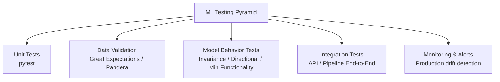

# 🧪 Testing in ML Systems — Project Guide

## Overview

This guide teaches you how to test machine learning systems beyond standard unit tests. In production ML, bugs come from data drift, schema changes, and unexpected model behavior—not just syntax errors. You will build a testing suite that covers unit tests with pytest, integration tests for your API, data validation with Great Expectations, and model behavior tests for invariance, directional expectation, and minimum functionality.

A well-tested ML repo is rare in junior portfolios. By including data validation and model behavior tests, you signal that you understand the difference between traditional software testing and ML-specific testing. This project pairs naturally with a FastAPI service or batch inference pipeline.

## Prerequisites

- A Python project with at least one model training or inference script
- pytest installed and basic familiarity with `assert`
- A dataset (CSV or Parquet) you can use for validation examples
- Optional: A FastAPI or Flask service to integration-test

## Learning Objectives

1. Write unit tests for data preprocessing and feature engineering
2. Validate datasets with Great Expectations and Pandera schemas
3. Test model behavior for invariance, directional expectation, and minimum functionality
4. Run integration tests that exercise the full prediction pipeline
5. Integrate the test suite into a CI runner

## Official Resources & Links

| Resource | Type | URL | Why It Matters |
|----------|------|-----|----------------|
| pytest Documentation | Docs | https://docs.pytest.org/en/stable/ | The standard Python testing framework |
| Great Expectations | Docs | https://docs.greatexpectations.io/docs/ | Industry-standard data validation library |
| Pandera Documentation | Docs | https://pandera.readthedocs.io/en/stable/ | Lightweight dataframe validation |
| Deepchecks | Docs | https://docs.deepchecks.com/stable/ | Model and data testing with built-in suites |
| scikit-learn Testing | Docs | https://scikit-learn.org/stable/developers/develop.html#testing | Patterns from the most used ML library |

## Architecture & Planning

### Testing Pyramid for ML



Key design decisions:
- **Data validation sits at the base.** If input data is wrong, every other test is meaningless.
- **Model behavior tests verify semantics, not just code paths.** They ensure the model responds correctly to controlled input changes.
- **Integration tests validate the glue.** They catch serialization bugs, schema mismatches, and environment issues.

## Step-by-Step Implementation Guide

1. **Set up the test environment**
   - What: Install pytest, Great Expectations, Pandera, and Deepchecks.
   - Why: A dedicated test environment prevents dependency leakage.
   - Command:
     ```bash
     pip install pytest great_expectations pandera deepchecks scikit-learn pandas
     ```

2. **Write unit tests for preprocessing functions**
   - What: Test pure functions (imputation, encoding, scaling) with fixed inputs and expected outputs.
   - Why: Preprocessing bugs are silent and compound quickly.
   - Snippet:
     ```python
     def test_scale_features():
         from src.preprocess import scale
         assert scale([1, 2, 3]) == [0.0, 0.5, 1.0]
     ```

3. **Add Pandera schema validation for input dataframes**
   - What: A schema that enforces column names, types, and ranges.
   - Why: Catches upstream data pipeline changes before they reach the model.
   - Snippet:
     ```python
     import pandera as pa
     from pandera import Column, DataFrameSchema, Check
     schema = DataFrameSchema({
         "sepal_length": Column(float, Check.greater_than(0)),
         "sepal_width": Column(float, Check.greater_than(0)),
         "species": Column(str, Check.isin(["setosa", "versicolor", "virginica"])),
     })
     ```

4. **Create Great Expectations expectations for batch data**
   - What: An expectation suite that checks null rates, value distributions, and column existence.
   - Why: GE integrates with data pipelines and produces human-readable data docs.
   - Command:
     ```bash
     great_expectations init
     great_expectations suite new
     ```
   - Expected output: A `great_expectations/` directory with suites and checkpoints.

5. **Write model behavior tests**
   - What: Three categories of semantic tests.
   - Why: Unit tests cannot catch a model that learned the wrong correlation.
   - Categories:
     - **Invariance:** Changing an irrelevant feature does not change the prediction.
     - **Directional expectation:** Increasing income should not decrease a credit score.
     - **Minimum functionality:** A trivial input returns a sensible baseline.
   - See the complete `test_model.py` in the Guide Class section below.

6. **Build integration tests for the inference pipeline**
   - What: An end-to-end test that loads the model, processes a raw record, and returns a prediction.
   - Why: Catches serialization, environment, and schema mismatches.
   - Snippet:
     ```python
     def test_inference_pipeline():
         from src.pipeline import predict
         result = predict({"sepal_length": 5.1, "sepal_width": 3.5,
                           "petal_length": 1.4, "petal_width": 0.2})
         assert result in ["setosa", "versicolor", "virginica"]
     ```

7. **Add API integration tests with TestClient**
   - What: If you have a FastAPI app, use `fastapi.testclient.TestClient`.
   - Why: Verifies routing, validation, and model loading in a realistic HTTP context.
   - Snippet:
     ```python
     from fastapi.testclient import TestClient
     from main import app
     client = TestClient(app)
     def test_predict_endpoint():
         response = client.post("/predict", json={"sepal_length":5.1,"sepal_width":3.5,
                                                   "petal_length":1.4,"petal_width":0.2})
         assert response.status_code == 200
         assert response.json()["prediction_label"] == "setosa"
     ```

8. **Organize tests with markers and fixtures**
   - What: Use `@pytest.mark.integration` and `conftest.py` fixtures.
   - Why: Allows you to run fast unit tests separately from slower integration tests.
   - Command:
     ```bash
     pytest -m "not integration"   # fast feedback loop
     pytest -m integration         # full suite
     ```

9. **Generate coverage reports**
   - What: Run `pytest --cov=src` and aim for >80% line coverage.
   - Why: Coverage is a simple metric that recruiters and CI systems understand.

10. **Document the testing strategy in the repo README**
    - What: Explain how to run unit, behavior, and integration tests.
    - Why: A testing strategy document shows engineering maturity.

## Guide Class / Example

```python
# tests/test_model.py
import joblib
import numpy as np
import pytest

@pytest.fixture(scope="module")
def model():
    return joblib.load("model.pkl")

# --- Invariance Test ---
def test_invariance_to_measurement_noise(model):
    """Adding tiny noise to an irrelevant feature should not flip the prediction."""
    base = np.array([[5.1, 3.5, 1.4, 0.2]])
    pred_base = model.predict(base)[0]
    for _ in range(10):
        noisy = base.copy()
        noisy[0, 1] += np.random.normal(0, 0.01)
        assert model.predict(noisy)[0] == pred_base

# --- Directional Expectation Test ---
def test_directional_expectation(model):
    """Increasing petal length should not decrease the probability of versicolor
    when other features are held at versicolor-like values."""
    low = np.array([[5.0, 2.3, 3.3, 1.0]])
    high = np.array([[5.0, 2.3, 4.5, 1.5]])
    if hasattr(model, "predict_proba"):
        probs_low = model.predict_proba(low)[0]
        probs_high = model.predict_proba(high)[0]
        # Simplified check: higher petal length should not lower versicolor prob
        assert probs_high[1] >= probs_low[1] - 0.1

# --- Minimum Functionality Test ---
def test_minimum_functionality(model):
    """A very small flower should be classified as setosa."""
    tiny = np.array([[4.3, 3.0, 1.1, 0.1]])
    pred = model.predict(tiny)[0]
    assert pred == 0  # setosa

# --- Input Validation Test ---
def test_invalid_input_shape(model):
    """Model should raise or behave predictably with wrong input shape."""
    bad = np.array([[5.1, 3.5]])
    with pytest.raises(ValueError):
        model.predict(bad)
```

## Common Pitfalls & Checklist

- ⚠️ **Testing only code paths, not model behavior.** A green test suite does not mean the model is correct.
- ⚠️ **Hard-coding model outputs in tests.** Use relative checks (probabilities, invariance) rather than exact labels that change after retraining.
- ⚠️ **Skipping data validation in CI.** Data tests should run before model training, not after.
- ⚠️ **Slow integration tests blocking fast feedback.** Use markers to separate fast unit tests from slow end-to-end tests.

| Task | Status | Notes |
|------|--------|-------|
| pytest installed and basic tests pass | [ ] | `pytest` runs green |
| Pandera schema defined | [ ] | Validates dataframe shape/types |
| Great Expectations suite created | [ ] | `great_expectations/` committed |
| Model behavior tests written | [ ] | Invariance + directional + minimum |
| Integration tests for pipeline | [ ] | Load model + predict end-to-end |
| API integration tests written | [ ] | TestClient + status codes |
| Test markers configured | [ ] | `unit`, `integration`, `behavior` |
| Coverage report >80% | [ ] | `pytest --cov` output |

## Deployment & Portfolio Integration

- **How to deploy:** Testing is part of the codebase, not a separate deployment. Ensure your CI pipeline (GitHub Actions) runs the full suite on every pull request.
- **How to present it on GitHub and LinkedIn:** Add a "Testing Strategy" section to your README with badges for test status and coverage. Share a post about a subtle bug your behavior test caught.
- **What recruiters want to see:** A `tests/` directory with logical structure, a CI badge that is green, and evidence that you distinguish between code tests and model behavior tests.

## Next Steps

- Automate test execution with [[04 - CI-CD for ML - Project Guide]]
- Build the API layer with [[01 - FastAPI for ML - Project Guide]]
- Design the serving architecture with [[02 - System Design for ML - Project Guide]]
