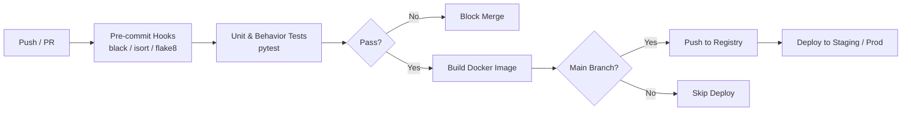

# 🔄 CI-CD for ML — Project Guide

## Overview

This guide teaches you how to build a continuous integration and continuous delivery (CI/CD) pipeline tailored for machine learning projects. In production ML teams, every code change must pass linting, testing, model validation, and deployment stages before reaching users. You will construct a GitHub Actions workflow that enforces code quality with pre-commit hooks, runs pytest, builds a Docker image, and optionally deploys the service.

You will also integrate Data Version Control (DVC) to version datasets and model artifacts alongside your code. A green CI badge and a clean commit history are strong trust signals to recruiters because they prove you can ship reliably in a team setting.

## Prerequisites

- A Python project with a test suite (even a small one)
- A GitHub repository with push access
- Docker installed locally
- Basic familiarity with Git branching and pull requests

## Learning Objectives

1. Configure pre-commit hooks for black, isort, and flake8
2. Build a GitHub Actions workflow that lints, tests, builds, and deploys
3. Version data and models with DVC and remote storage
4. Gate merges on CI success to protect the main branch
5. Document the pipeline so a teammate can onboard in under 10 minutes

## Official Resources & Links

| Resource | Type | URL | Why It Matters |
|----------|------|-----|----------------|
| GitHub Actions Docs | Docs | https://docs.github.com/en/actions | Platform-native CI/CD you will use daily |
| DVC Documentation | Docs | https://dvc.org/doc | Version control for datasets and models |
| pre-commit Documentation | Docs | https://pre-commit.com/ | Automate code quality checks before every commit |
| Semaphore CI | Docs | https://docs.semaphoreci.com/ | Alternative CI platform with strong ML pipeline support |
| Docker Docs | Docs | https://docs.docker.com/build/ci/github-actions/ | Building images inside GitHub Actions |

## Architecture & Planning

### CI/CD Pipeline Flowchart



Key design decisions:
- **Pre-commit hooks run locally.** They provide the fastest feedback loop and keep the CI queue clean.
- **CI gates merges.** No code reaches `main` without passing tests and linting.
- **DVC tracks large artifacts outside Git.** Git is for code; DVC + remote storage is for data and models.
- **Docker images are built only after tests pass.** This avoids pushing broken containers to registries.

## Step-by-Step Implementation Guide

1. **Install pre-commit in your repo**
   - What: `pip install pre-commit` and add `.pre-commit-config.yaml`.
   - Why: Catches style issues before they enter version control.
   - Command:
     ```bash
     pre-commit install
     pre-commit run --all-files
     ```
   - Expected output: black reformats files, isort fixes imports, flake8 reports no errors.

2. **Configure the pre-commit hooks file**
   - What: Define black, isort, flake8, and trailing-whitespace hooks.
   - Why: Standardized formatting eliminates style debates in pull requests.
   - See the complete `.pre-commit-config.yaml` in the Guide Class section below.

3. **Initialize DVC in the repository**
   - What: `dvc init` and configure a remote (e.g., DagsHub, Google Drive, or S3).
   - Why: Models and datasets change independently of code; DVC creates reproducible pipelines.
   - Commands:
     ```bash
     dvc init
     dvc remote add -d myremote s3://mybucket/dvcstore
     dvc add data/train.csv
     git add data/train.csv.dvc .gitignore
     ```

4. **Write the GitHub Actions workflow file**
   - What: `.github/workflows/ml-pipeline.yml`.
   - Why: This is the backbone of the CI/CD system.
   - See the complete workflow in the Guide Class section below.

5. **Add a job that builds and pushes the Docker image**
   - What: A workflow step using `docker/build-push-action`.
   - Why: Container registries are the source of truth for deployable artifacts.
   - Snippet:
     ```yaml
     - name: Build and push
       uses: docker/build-push-action@v5
       with:
         push: true
         tags: ghcr.io/${{ github.repository }}:latest
     ```

6. **Protect the main branch in GitHub**
   - What: Settings → Branches → Add rule → Require status checks to pass.
   - Why: Prevents broken code from being merged directly into production.

7. **Create a DVC pipeline stage for training**
   - What: `dvc.yaml` that defines dependencies and outputs.
   - Why: Reproducible training runs that can be triggered in CI.
   - Snippet:
     ```yaml
     stages:
       train:
         cmd: python src/train.py
         deps:
           - src/train.py
           - data/train.csv
         outs:
           - model.pkl
     ```

8. **Test the full pipeline on a pull request**
   - What: Open a PR with a minor change and verify all checks turn green.
   - Why: Real-world validation that the pipeline works end-to-end.
   - Expected output: All status checks pass and the PR can be merged.

9. **Add deployment step (optional)**
   - What: A job that SSHs into a VM or triggers a platform webhook.
   - Why: Completes the delivery half of CI/CD.
   - Example: Use `appleboy/ssh-action` to run `docker pull` and `docker compose up -d`.

10. **Document the pipeline in `PIPELINE.md`**
    - What: Explain how pre-commit, DVC, and GitHub Actions fit together.
    - Why: Documentation is a professional habit that separates juniors from seniors.

## Guide Class / Example

```yaml
# .github/workflows/ml-pipeline.yml
name: ML Pipeline

on:
  push:
    branches: [main]
  pull_request:
    branches: [main]

jobs:
  lint-and-test:
    runs-on: ubuntu-latest
    steps:
      - uses: actions/checkout@v4
      - name: Set up Python
        uses: actions/setup-python@v5
        with:
          python-version: "3.11"
      - name: Install dependencies
        run: |
          python -m pip install --upgrade pip
          pip install -r requirements.txt
          pip install black isort flake8 pytest
      - name: Lint with black
        run: black --check .
      - name: Lint with isort
        run: isort --check-only .
      - name: Lint with flake8
        run: flake8 .
      - name: Test with pytest
        run: pytest --cov=src --cov-report=xml
      - name: Upload coverage
        uses: codecov/codecov-action@v3

  build-docker:
    needs: lint-and-test
    runs-on: ubuntu-latest
    if: github.ref == 'refs/heads/main'
    steps:
      - uses: actions/checkout@v4
      - name: Set up Docker Buildx
        uses: docker/setup-buildx-action@v3
      - name: Login to GHCR
        uses: docker/login-action@v3
        with:
          registry: ghcr.io
          username: ${{ github.actor }}
          password: ${{ secrets.GITHUB_TOKEN }}
      - name: Build and push
        uses: docker/build-push-action@v5
        with:
          push: true
          tags: ghcr.io/${{ github.repository }}:latest
```

```yaml
# .pre-commit-config.yaml
repos:
  - repo: https://github.com/psf/black
    rev: 23.12.1
    hooks:
      - id: black
        language_version: python3
  - repo: https://github.com/PyCQA/isort
    rev: 5.13.2
    hooks:
      - id: isort
        args: ["--profile", "black"]
  - repo: https://github.com/PyCQA/flake8
    rev: 7.0.0
    hooks:
      - id: flake8
        args: [--max-line-length=100]
  - repo: https://github.com/pre-commit/pre-commit-hooks
    rev: v4.5.0
    hooks:
      - id: trailing-whitespace
      - id: end-of-file-fixer
```

## Common Pitfalls & Checklist

- ⚠️ **Forgetting to install pre-commit on a new clone.** Run `pre-commit install` after every fresh checkout.
- ⚠️ **Storing large model files in Git.** Use DVC or Git LFS for artifacts; keep the repo lightweight.
- ⚠️ **Not caching pip or Docker layers in CI.** Uncached builds waste minutes and consume runner minutes.
- ⚠️ **Allowing direct pushes to main.** Branch protection rules are essential for CI/CD trust.

| Task | Status | Notes |
|------|--------|-------|
| pre-commit installed and running | [ ] | `pre-commit run --all-files` passes |
| `.pre-commit-config.yaml` committed | [ ] | black + isort + flake8 configured |
| DVC initialized with remote | [ ] | `dvc push` works |
| GitHub Actions workflow created | [ ] | `.github/workflows/ml-pipeline.yml` |
| Lint jobs pass in CI | [ ] | black, isort, flake8 green |
| Test jobs pass in CI | [ ] | pytest green with coverage |
| Docker build job succeeds | [ ] | Image pushed to registry |
| Branch protection enabled | [ ] | `main` requires status checks |
| Pipeline documented | [ ] | `PIPELINE.md` in repo |

## Deployment & Portfolio Integration

- **How to deploy:** The CI pipeline builds and pushes a Docker image. Deployment can be a simple webhook or SSH step that pulls the latest image on a staging or production host.
- **How to present it on GitHub and LinkedIn:** Add CI badges to your README. Post a LinkedIn update showing a green pull request with pre-commit, tests, and Docker build all passing.
- **What recruiters want to see:** A protected `main` branch, a green Actions badge, pre-commit configuration, and DVC tracking for reproducibility. These are exactly the practices used by real ML platform teams.

## Next Steps

- Harden testing with [[03 - Testing in ML Systems - Project Guide]]
- Serve the model via [[01 - FastAPI for ML - Project Guide]]
- Optimize inference with [[05 - Rust for ML Infra - Project Guide]]
