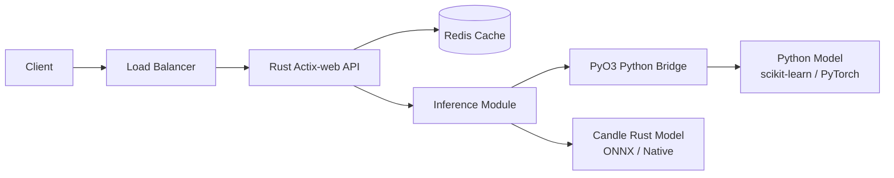

# 🦀 Rust for ML Infra — Project Guide

## Overview

This guide teaches you when and how to use Rust instead of Python for machine learning infrastructure. Python dominates model prototyping, but it struggles with high-throughput inference, strict latency requirements, and low-level systems tasks. Rust offers memory safety, zero-cost abstractions, and performance comparable to C++, making it ideal for inference servers, feature stores, and data pipelines.

You will build a minimal but complete high-performance inference server using Actix-web. You will also learn how to bind Python-trained models into Rust using PyO3, creating a hybrid Python/Rust stack that gives you the ergonomics of Python research and the speed of Rust production. This project is a standout portfolio piece because very few junior candidates demonstrate systems-level ML engineering skills.

## Prerequisites

- Intermediate Python and basic command-line fluency
- Rust toolchain installed (`rustc` and `cargo` via https://rustup.rs/)
- A trained model artifact saved in a format accessible from Rust (ONNX, JSON weights, or a pickled scikit-learn model exposed via PyO3)
- Basic understanding of HTTP and REST concepts

## Learning Objectives

1. Compare Rust and Python across memory safety, concurrency, and deployment footprint
2. Scaffold an Actix-web inference server with sync and async handlers
3. Bind a Python model to Rust using PyO3 and embed it in the server
4. Measure latency and throughput against a pure Python equivalent
5. Package the Rust binary with Docker for distribution

## Official Resources & Links

| Resource | Type | URL | Why It Matters |
|----------|------|-----|----------------|
| The Rust Book | Book | https://doc.rust-lang.org/book/ | The definitive Rust learning resource |
| Actix-web Documentation | Docs | https://actix.rs/docs/ | High-performance web framework for Rust |
| PyO3 Documentation | Docs | https://pyo3.rs/v0.21.0/ | Bind Python and Rust together safely |
| Candle (HuggingFace) | Repo | https://github.com/huggingface/candle | Rust ML framework for inference without Python overhead |
| Tokio Documentation | Docs | https://tokio.rs/ | Async runtime that powers Actix-web |

## Architecture & Planning

### Rust + Python Hybrid Architecture



Key design decisions:
- **Rust handles I/O and routing.** Actix-web async workers manage thousands of concurrent connections with minimal memory.
- **Python model lives behind PyO3.** For models that are hard to port, PyO3 initializes a Python interpreter inside Rust, calls `predict`, and returns the result.
- **Candle is the long-term path.** For greenfield deployments, running pure Rust inference eliminates the Python interpreter entirely and shrinks the Docker image.
- **Redis caching reduces bridge calls.** Because crossing the Python boundary has overhead, cache hot predictions aggressively.

## Step-by-Step Implementation Guide

1. **Install the Rust toolchain**
   - What: `rustup` with the stable toolchain.
   - Why: You cannot build Rust projects without a compiler.
   - Command:
     ```bash
     curl --proto '=https' --tlsv1.2 -sSf https://sh.rustup.rs | sh
     cargo --version
     ```

2. **Create a new Actix-web project**
   - What: `cargo new rust-ml-server` and add dependencies.
   - Why: Cargo manages Rust dependencies and builds reproducibly.
   - Command:
     ```bash
     cargo new rust-ml-server
     cd rust-ml-server
     ```
   - Add to `Cargo.toml`:
     ```toml
     [dependencies]
     actix-web = "4"
     serde = { version = "1", features = ["derive"] }
     tokio = { version = "1", features = ["full"] }
     pyo3 = { version = "0.21", features = ["extension-module"] }
     ```

3. **Write the Actix-web server with a health endpoint**
   - What: A minimal `main.rs` that starts a server on port 8080.
   - Why: Validates the toolchain and dependency setup before adding complexity.
   - See the complete `main.rs` in the Guide Class section below.

4. **Train and export a simple Python model for PyO3 consumption**
   - What: A scikit-learn model saved with `joblib`.
   - Why: PyO3 can load Python modules and call functions; we need a model script ready.
   - Snippet (Python):
     ```python
     from sklearn.datasets import load_iris
     from sklearn.ensemble import RandomForestClassifier
     import joblib
     X, y = load_iris(return_X_y=True)
     model = RandomForestClassifier().fit(X, y)
     joblib.dump(model, "model.pkl")
     ```

5. **Write a PyO3 bridge module in Rust**
   - What: Rust code that starts the Python interpreter, loads a script, and calls `predict`.
   - Why: This is the core integration that makes the hybrid architecture work.
   - Snippet (Rust):
     ```rust
     use pyo3::prelude::*;
     use pyo3::types::PyList;

     pub fn predict(features: Vec<f64>) -> PyResult<i64> {
         pyo3::prepare_freethreaded_python();
         Python::with_gil(|py| {
             let sys = py.import_bound("sys")?;
             sys.getattr("path")?.call_method1("append", ("./python",))?;
             let module = py.import_bound("inference")?;
             let py_features = PyList::new_bound(py, &features);
             let result: i64 = module.getattr("predict")?.call1((py_features,))?.extract()?;
             Ok(result)
         })
     }
     ```

6. **Expose the prediction through an Actix-web POST endpoint**
   - What: Deserialize JSON input, call the bridge, and return the prediction.
   - Why: Completes the request/response lifecycle.
   - See the complete `main.rs` in the Guide Class section below.

7. **Benchmark Rust vs Python locally**
   - What: Use `wrk` or `oha` to hit both servers.
   - Why: Quantitative proof that Rust improves throughput or latency.
   - Command:
     ```bash
     oha -z 30s -c 50 --latency-correction http://localhost:8080/predict
     ```
   - Expected output: Latency distribution and requests/sec comparison.

8. **Add a Dockerfile for the Rust binary**
   - What: Multi-stage build with `rust:1.75-slim` and `debian:bookworm-slim`.
   - Why: Rust binaries are statically linked and produce very small container images.
   - Expected output: `docker build -t rust-ml-server .` produces a <50MB image.

9. **Document the hybrid architecture and build steps**
   - What: A `README.md` explaining when to use Rust vs Python, how PyO3 works, and how to benchmark.
   - Why: Recruiters need context; they will not infer the design decisions from code alone.

10. **Push the repo and share a benchmark result**
    - What: A GitHub repo with the Rust server, Python model, Dockerfile, and benchmark numbers.
    - Why: A performance comparison is one of the most compelling portfolio stories.

## Guide Class / Example

```rust
// src/main.rs
use actix_web::{get, post, web, App, HttpResponse, HttpServer, Result};
use serde::{Deserialize, Serialize};
use pyo3::prelude::*;
use pyo3::types::PyList;

#[derive(Deserialize)]
struct PredictRequest {
    features: Vec<f64>,
}

#[derive(Serialize)]
struct PredictResponse {
    prediction: i64,
}

fn py_predict(features: Vec<f64>) -> PyResult<i64> {
    pyo3::prepare_freethreaded_python();
    Python::with_gil(|py| {
        let sys = py.import_bound("sys")?;
        sys.getattr("path")?.call_method1("append", ("./python",))?;
        let module = py.import_bound("inference")?;
        let py_list = PyList::new_bound(py, &features);
        let result: i64 = module.getattr("predict")?.call1((py_list,))?.extract()?;
        Ok(result)
    })
}

#[get("/health")]
async fn health() -> Result<HttpResponse> {
    Ok(HttpResponse::Ok().json(serde_json::json!({"status": "ok"})))
}

#[post("/predict")]
async fn predict(req: web::Json<PredictRequest>) -> Result<HttpResponse> {
    match py_predict(req.features.clone()) {
        Ok(pred) => Ok(HttpResponse::Ok().json(PredictResponse { prediction: pred })),
        Err(e) => Ok(HttpResponse::InternalServerError().json(serde_json::json!({"error": e.to_string()}))),
    }
}

#[actix_web::main]
async fn main() -> std::io::Result<()> {
    HttpServer::new(|| App::new().service(health).service(predict))
        .bind("127.0.0.1:8080")?
        .run()
        .await
}
```

```python
# python/inference.py
import joblib
import os

_MODEL_PATH = os.environ.get("MODEL_PATH", "model.pkl")
_model = joblib.load(_MODEL_PATH)

def predict(features):
    return int(_model.predict([features])[0])
```

```toml
# Cargo.toml
[package]
name = "rust-ml-server"
version = "0.1.0"
edition = "2021"

[dependencies]
actix-web = "4"
serde = { version = "1", features = ["derive"] }
serde_json = "1"
tokio = { version = "1", features = ["full"] }
pyo3 = { version = "0.21", features = ["extension-module"] }
```

## Common Pitfalls & Checklist

- ⚠️ **Blocking the async runtime with PyO3 GIL calls.** CPU-heavy Python inference should be offloaded to a `web::block` thread pool in Actix-web.
- ⚠️ **Bundling the Python runtime without pinning versions.** Use a `requirements.txt` and a known Python Docker base image.
- ⚠️ **Ignoring memory usage of the embedded Python interpreter.** The Rust binary may be small, but the Python heap can grow unexpectedly under load.
- ⚠️ **Not caching predictions.** The Python bridge adds latency; cache aggressively in Redis.

| Task | Status | Notes |
|------|--------|-------|
| Rust toolchain installed | [ ] | `cargo --version` works |
| Actix-web server runs | [ ] | `cargo run` starts on :8080 |
| Python model trained and saved | [ ] | `model.pkl` exists |
| PyO3 bridge returns predictions | [ ] | Rust calls Python without crash |
| `/predict` endpoint works | [ ] | `curl` returns JSON |
| Benchmark vs Python completed | [ ] | `oha` or `wrk` results saved |
| Dockerfile builds small image | [ ] | Image size < 100MB |
| README with architecture diagram | [ ] | Recruiter-ready explanation |

## Deployment & Portfolio Integration

- **How to deploy:** Build the Docker image with a multi-stage Dockerfile and push it to GitHub Container Registry or Docker Hub. Deploy to any container host; Rust binaries have tiny footprints and fast cold starts.
- **How to present it on GitHub and LinkedIn:** Name the repo `rust-ml-inference-server`. Include a "Benchmarks" section with charts. Post a LinkedIn thread comparing Rust vs Python latency under load.
- **What recruiters want to see:** Evidence that you understand trade-offs (why Rust?), a working PyO3 integration, benchmark numbers, and a tiny Docker image. This signals systems engineering maturity that most junior ML applicants lack.

## Next Steps

- Build the API foundation with [[01 - FastAPI for ML - Project Guide]]
- Design scalable architecture with [[02 - System Design for ML - Project Guide]]
- Automate delivery with [[04 - CI-CD for ML - Project Guide]]
