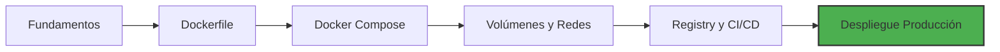

# 🐳 00 - Bienvenida al Curso Docker Profesional

Bienvenido al curso **"Docker Profesional: De los Fundamentos al Despliegue en Producción"**. Este programa está diseñado para llevarte desde los conceptos básicos de la containerización hasta la construcción de pipelines robustos de CI/CD y arquitecturas multi-contenedor listas para producción.

En el contexto actual del **Backend Engineering** y el **ML/AI Engineering**, Docker ya no es una herramienta opcional: es el estándar de facto para empaquetar, distribuir y escalar servicios. Desplegar modelos de machine learning requiere reproducibilidad absoluta: dependencias de Python exactas, versiones de CUDA consistentes, y entornos de entrenamiento idénticos al de inferencia. Docker resuelve este problema eliminando la frase "en mi máquina funciona".

---

## 1. Estructura del Curso

A continuación encontrarás el índice completo del curso con enlaces a cada módulo.

| # | Módulo | Descripción | Enlace |
|---|--------|-------------|--------|
| 00 | Bienvenida | Índice, glosario y objetivos | [[00 - Bienvenida]] |
| 01 | Fundamentos de Docker y Contenedores | Arquitectura, namespaces, cgroups, ciclo de vida | [[01 - Fundamentos de Docker y Contenedores]] |
| 02 | Dockerfile y Buenas Prácticas | Sintaxis, multi-stage builds, seguridad, optimización | [[02 - Dockerfile y Buenas Practicas]] |
| 03 | Docker Compose y Multi-Contenedores | Orquestación local, networking, variables de entorno | [[03 - Docker Compose y Multi-Contenedores]] |
| 04 | Volúmenes, Redes y Persistencia | Almacenamiento, backup, DNS interno, tipos de red | [[04 - Volumenes Redes y Persistencia]] |
| 05 | Docker Registry y CI/CD | Registries, tagging, GitHub Actions, BuildKit | [[05 - Docker Registry y CI-CD]] |
| 06 | Caso Práctico: Despliegue Completo | FastAPI + PostgreSQL + Redis + Nginx en producción | [[06 - Caso Practico - Despliegue Completo con Docker]] |

---

## 2. Diagrama de Arquitectura del Curso

El siguiente diagrama muestra cómo se conectan los conceptos del curso en un flujo de trabajo profesional.

---

## 3. Glosario de Términos Esenciales

| Término | Definición |
|---------|------------|
| **Container** | Instancia ejecutable y aislada de una imagen Docker. Incluye el código, runtime, librerías y configuraciones necesarias. |
| **Image** | Plantilla de solo lectura que define el sistema de archivos y la configuración de un contenedor. |
| **Dockerfile** | Archivo de texto con instrucciones para construir una imagen Docker de forma declarativa. |
| **Layer** | Capa del sistema de archivos generada por cada instrucción en un Dockerfile. Las capas son cacheables y reutilizables. |
| **Cache** | Mecanismo de Docker que almacena capas intermedias para acelerar builds posteriores. |
| **Volume** | Mecanismo de persistencia gestionado por Docker, independiente del ciclo de vida del contenedor. |
| **Bind Mount** | Montaje de un directorio o archivo del host dentro del contenedor, útil para desarrollo. |
| **Network** | Sistema de comunicación entre contenedores. Docker provee DNS interno para resolución por nombre de servicio. |
| **Bridge** | Driver de red por defecto que crea una red privada para contenedores en un solo host. |
| **Overlay** | Driver de red para comunicación entre contenedores en múltiples hosts (Docker Swarm). |
| **Registry** | Servicio de almacenamiento y distribución de imágenes Docker (público o privado). |
| **Docker Hub** | Registry público oficial de Docker. |
| **Docker Compose** | Herramienta para definir y ejecutar aplicaciones multi-contenedor usando un archivo YAML. |
| **Orchestration** | Automatización del despliegue, escalado y gestión de contenedores. |
| **Swarm** | Orquestador nativo de Docker para clustering de nodos. |
| **Kubernetes** | Orquestador de contenedores de código abierto, estándar de la industria para producción a gran escala. |
| **CI/CD** | Integración Continua / Entrega Continua. Automatización de build, test y despliegue. |

---

## 4. Objetivos de Aprendizaje

Al finalizar este curso serás capaz de:

1. Explicar la arquitectura interna de Docker (namespaces, cgroups, UnionFS) y diferenciarlo de las máquinas virtuales.

2. Construir imágenes Docker optimizadas usando multi-stage builds, imágenes base ligeras y estrategias de layer caching.

3. Diseñar aplicaciones multi-contenedor con Docker Compose, incluyendo networking, volúmenes y variables de entorno.

4. Implementar persistencia de datos y redes personalizadas para entornos de producción.

5. Publicar imágenes en registries públicos y privados, aplicando estrategias de versionado semántico.

6. Construir pipelines de CI/CD con GitHub Actions y GitLab CI que integren Docker de forma eficiente.

7. Desplegar una arquitectura completa (FastAPI + PostgreSQL + Redis + Nginx) en producción con monitoreo y backup.

---

## 5. Requisitos Previos

- Conocimientos básicos de línea de comandos (bash/PowerShell).

- Familiaridad con conceptos de redes (IP, puertos, DNS).

- Docker Engine instalado (versión 24.0+ recomendada).

- Docker Compose plugin instalado.

- Editor de código (VS Code recomendado con extensión Docker).

---

## 6. Metodología

Cada nota incluye teoría profunda, tablas comparativas, casos reales, advertencias, tips y bloques de código listos para ejecutar. Al final de cada sesión encontrarás una sección de **📦 Código de Compresión** con los archivos clave resumidos.

⚠️ **Advertencia**: No copies y pegues código en producción sin entender su funcionamiento. Las configuraciones de red y volúmenes pueden exponer datos sensibles si no se configuran correctamente.

💡 **Tip**: Mantén un repositorio Git para este curso. Cada nota puede vivir en una rama o carpeta, y te servirá como referencia profesional en el futuro.

---

*Imagen de portada: [Docker Logo](https://commons.wikimedia.org/wiki/File:Docker_(container_engine)_logo.svg)*

*Imagen complementaria: [Container vs VM diagram](https://commons.wikimedia.org/wiki/File:Virtualización_y_Contenedores.png)*
