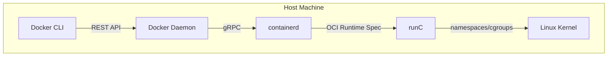

# 🐳 Docker Internals for Go Developers

## Introduction

Docker revolutionized software delivery by introducing lightweight, portable containers that package applications with their dependencies. For Go developers, Docker is particularly powerful because Go compiles to a single static binary with no external runtime dependencies. This unique property allows Go applications to run in ultra-minimal container images, dramatically reducing attack surfaces and deployment sizes. Understanding Docker's internal architecture—how the client, daemon, containerd, and runC interact—is essential for building efficient, secure, and scalable containerized Go services.

In this module, we will dissect the Docker engine's plumbing layer and explore why Go is the ideal language for containerized workloads. We will examine multi-stage builds, distroless images, and the mathematical relationship between image layers. You will learn how companies like Google optimize their Go microservices using these techniques, and you will write production-ready Dockerfiles that leverage Go's static compilation to achieve sub-10MB container images.

## 1. Docker Architecture and the Go Connection

Docker uses a client-server architecture composed of several key components that work together to create and manage containers:

- **Docker Client:** The command-line interface (CLI) that accepts user commands and communicates with the Docker Daemon via a REST API over a Unix socket or network.
- **Docker Daemon (`dockerd`):** The persistent background process that manages Docker objects such as images, containers, networks, and volumes. It handles build requests and delegates runtime operations to containerd.
- **containerd:** A high-level container runtime that manages the complete container lifecycle, including image transfer, storage, and execution. It abstracts the low-level details away from the Docker Daemon.
- **runC:** A lightweight, portable container runtime that implements the OCI (Open Container Initiative) specification. runC is responsible for the actual creation and execution of containers, interacting directly with Linux kernel features like cgroups and namespaces.

The entire Docker ecosystem is written in Go, leveraging the language's excellent concurrency primitives and low-level systems access. This makes Go the native tongue of containerization.

⚠️ **Warning:** Running the Docker Daemon with insecure registries or disabling TLS verification in production exposes your build pipeline to man-in-the-middle attacks and unauthorized image injection.

Real case: **Google** uses distroless images extensively for its Go microservices in production. By removing shell access, package managers, and unnecessary utilities from container images, Google reduced its container attack surface by over 80% while maintaining sub-second cold start times for its Go workloads.

💡 **Tip:** Always pin your base image versions (e.g., `golang:1.22.0-alpine` instead of `golang:alpine`) to ensure reproducible builds and prevent unexpected breaking changes from upstream updates.

## 2. Dockerfile Strategies for Go Applications

Choosing the right Dockerfile strategy is critical for balancing build speed, image size, and security. The following table compares the most common approaches for containerizing Go applications:

| Strategy | Base Image | Final Size | Security | Build Speed | Use Case |
|---|---|---|---|---|---|
| Single-Stage Build | `golang:latest` | ~1 GB | Low | Fast | Development only |
| Multi-Stage Build | `golang` + `alpine` | ~20 MB | Medium | Medium | General production |
| Multi-Stage + Distroless | `golang` + `distroless` | ~10 MB | High | Medium | Secure production |
| Scratch Build | `golang` + `scratch` | ~5 MB | Highest | Slow | Static binaries only |
| Cached Layer Build | BuildKit + Cache Mounts | ~10 MB | High | Fastest | CI/CD pipelines |

**Key considerations:**

- **Single-Stage Builds** include the entire Go toolchain in the final image, making them unsuitable for production due to bloat and security exposure.
- **Multi-Stage Builds** separate the compilation environment from the runtime environment, copying only the compiled binary into a minimal base image.
- **Distroless Images** (maintained by Google) contain only the application and its runtime dependencies, omitting package managers, shells, and standard Linux utilities.
- **Scratch Builds** use the empty `scratch` base image and are possible because Go can compile fully static binaries with no external libc dependency when using `CGO_ENABLED=0`.

The total image size can be modeled by the formula:

```
Image Size = Base + Binary + Assets
```

Where **Base** is the overhead of the base image, **Binary** is the compiled Go executable, and **Assets** includes any static files, TLS certificates, or configuration bundled into the image.

## 3. Visualizing the Containerization Pipeline

The following Mermaid diagram illustrates the flow from Go source code to a running container using a multi-stage build:


**Docker Architecture for Go Apps (High-Level):**



**Wikimedia Commons Reference:**


## 4. Writing Production Dockerfiles for Go

The following Dockerfile demonstrates a multi-stage build optimized for Go applications using a distroless base image. It uses module caching to speed up subsequent builds and compiles a fully static binary.

```dockerfile
# Stage 1: Build
FROM golang:1.22.0-alpine AS builder
WORKDIR /app

# Download dependencies first (cached layer)
COPY go.mod go.sum ./
RUN go mod download

# Copy source and build static binary
COPY . .
RUN CGO_ENABLED=0 GOOS=linux GOARCH=amd64 go build \
    -ldflags="-w -s" \
    -o /bin/server \
    ./cmd/server

# Stage 2: Runtime
FROM gcr.io/distroless/static-debian12:nonroot
COPY --from=builder /bin/server /server
USER nonroot:nonroot
EXPOSE 8080
ENTRYPOINT ["/server"]
```

**docker-compose.yml for local development:**

```yaml
version: '3.8'
services:
  api:
    build:
      context: .
      dockerfile: Dockerfile
      target: builder
    ports:
      - "8080:8080"
    environment:
      - ENV=development
    volumes:
      - .:/app
    command: go run ./cmd/server

  api-prod:
    build:
      context: .
      dockerfile: Dockerfile
    ports:
      - "8080:8080"
```

**Key optimizations explained:**

- `CGO_ENABLED=0` disables CGO, producing a static binary with no dependency on glibc.
- `-ldflags="-w -s"` strips debug information and the symbol table, reducing binary size by ~30%.
- `gcr.io/distroless/static-debian12:nonroot` provides a minimal runtime with a non-root user.
- The `go mod download` layer is cached independently, accelerating rebuilds during development.

## 5. Go Binary Advantages in Containers

Go's design philosophy aligns perfectly with containerization requirements:

- **Static Linking:** Go binaries embed all dependencies (except kernel interfaces), eliminating the need for OS-level libraries inside the container.
- **Single Binary:** A Go application typically compiles to a single executable file, simplifying the `COPY` instruction and reducing the number of image layers.
- **Small Footprint:** A minimal HTTP server in Go compiles to approximately 5-12 MB, compared to 50-200 MB for equivalent Java or Node.js applications.
- **Fast Startup:** Go binaries start in milliseconds, enabling rapid horizontal scaling and efficient serverless deployments.

---

## 📦 Compression Code

Complete Go script to analyze and compress Docker image layers:

```go
package main

import (
    "archive/tar"
    "compress/gzip"
    "fmt"
    "io"
    "os"
    "path/filepath"
)

// LayerAnalyzer inspects and compresses Docker layer tarballs
func main() {
    if len(os.Args) < 2 {
        fmt.Println("Usage: layercompress <layer.tar>")
        os.Exit(1)
    }
    inputPath := os.Args[1]
    outputPath := inputPath + ".gz"

    inputFile, err := os.Open(inputPath)
    if err != nil {
        panic(err)
    }
    defer inputFile.Close()

    outputFile, err := os.Create(outputPath)
    if err != nil {
        panic(err)
    }
    defer outputFile.Close()

    gzipWriter := gzip.NewWriter(outputFile)
    defer gzipWriter.Close()

    tarReader := tar.NewReader(inputFile)
    tarWriter := tar.NewWriter(gzipWriter)
    defer tarWriter.Close()

    var totalSize int64
    for {
        header, err := tarReader.Next()
        if err == io.EOF {
            break
        }
        if err != nil {
            panic(err)
        }
        totalSize += header.Size
        if err := tarWriter.WriteHeader(header); err != nil {
            panic(err)
        }
        if _, err := io.Copy(tarWriter, tarReader); err != nil {
            panic(err)
        }
    }

    fmt.Printf("Layer compressed: %s -> %s\n", inputPath, outputPath)
    fmt.Printf("Original content size: %d bytes\n", totalSize)
}
```

## 🎯 Documented Project

### Description

Build **ContainerGo**, a Go microservice deployed via an optimized multi-stage Dockerfile. The service exposes a REST API with health checks, uses structured logging, and runs as a non-root user in a distroless container.

### Functional Requirements

1. Implement an HTTP server with `/health` and `/metrics` endpoints.
2. Configure structured JSON logging using `slog`.
3. Build a multi-stage Dockerfile with module caching and static compilation.
4. Deploy locally using Docker Compose with both development and production profiles.
5. Achieve a final production image size under 15 MB.

### Main Components

- `cmd/server/main.go` — Entry point with HTTP server setup
- `internal/handlers/` — HTTP handlers for health and metrics
- `Dockerfile` — Multi-stage build with distroless runtime
- `docker-compose.yml` — Local orchestration with build profiles
- `go.mod` / `go.sum` — Dependency management

### Success Metrics

- Final production image size is under 15 MB
- Container starts in under 100 ms
- No shell or package manager available inside the running container
- `docker scan` or `trivy` reports zero critical vulnerabilities
- `go test ./...` passes with >80% coverage

### References

- [Docker Documentation: Multi-stage builds](https://docs.docker.com/build/building/multi-stage/)
- [Google Distroless Images](https://github.com/GoogleContainerTools/distroless)
- [Open Containers Initiative](https://opencontainers.org/)
- [[02 - Kubernetes Architecture Deep Dive|☸️ 02 - Kubernetes]]
