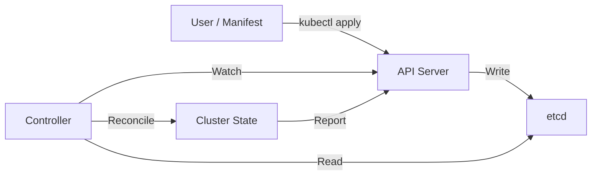
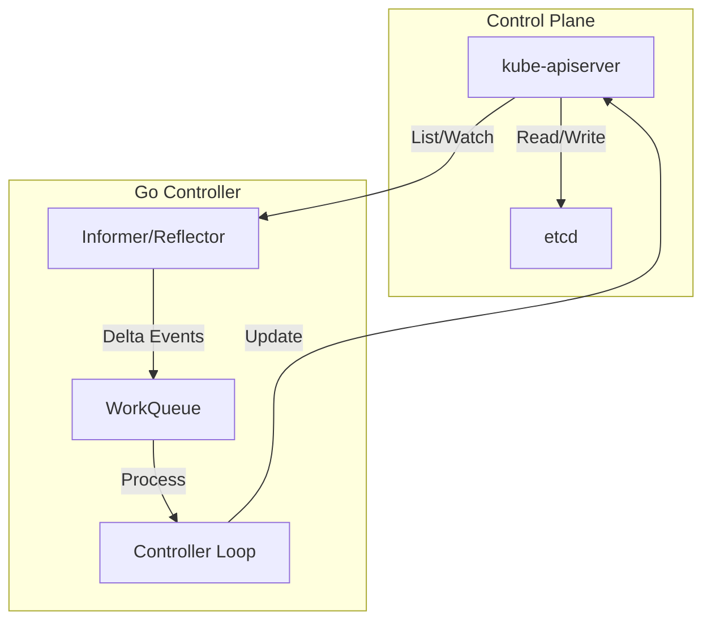

# ☸️ Kubernetes Architecture Deep Dive

## Introduction

Kubernetes (K8s) is the dominant container orchestration platform, automating the deployment, scaling, and management of containerized applications. Originally designed by Google and donated to the Cloud Native Computing Foundation (CNCF), Kubernetes is written in Go and exposes a powerful API that Go developers can leverage directly. Understanding the internal architecture of Kubernetes—from the API server to the kubelet—is essential for building cloud-native Go applications that integrate seamlessly with the orchestration layer.

In this module, we will dissect the control plane and data plane components, explore the Kubernetes resource model, and learn how to write custom controllers using the official `client-go` library. We will examine how Go's concurrency model (goroutines and channels) mirrors Kubernetes' control loops and informers. You will also learn how Spotify operates one of the largest Kubernetes fleets running Go microservices, and how to apply their patterns to your own clusters.

## 1. Kubernetes Core Components

Kubernetes follows a distributed control plane architecture where state is stored in a centralized datastore and reconciled continuously by specialized controllers. The core components are:

- **API Server (`kube-apiserver`):** The front-end of the control plane. It exposes the Kubernetes API, handling all REST requests, authentication, authorization, and admission control. Every operation on the cluster flows through the API Server.
- **etcd:** A distributed, consistent key-value store that persists all cluster state, including configurations, secrets, and resource definitions. It is the single source of truth for the cluster.
- **Scheduler (`kube-scheduler`):** Watches for newly created Pods with no assigned node and selects the optimal node based on resource requirements, affinity rules, taints, and priorities.
- **Controller Manager (`kube-controller-manager`):** Runs a set of background controllers that handle routine cluster tasks, such as Node lifecycle, Endpoint updates, and ReplicaSet reconciliation.
- **Kubelet:** An agent running on every worker node. It ensures containers described in PodSpecs are running and healthy, communicating with the container runtime via the CRI (Container Runtime Interface).
- **Kube-proxy:** Maintains network rules on each node, enabling Service abstraction and load balancing across Pods using iptables or IPVS.

⚠️ **Warning:** Directly modifying etcd outside the API Server can corrupt cluster state and lead to catastrophic failures. Always interact with etcd through the Kubernetes API.

💡 **Tip:** Use `kubectl get --watch` or informers in Go instead of polling the API Server. Polling generates unnecessary load and may trigger API rate limiting.

Real case: **Spotify** manages thousands of Go microservices across a massive global Kubernetes fleet. By developing custom controllers in Go using `client-go`, Spotify automated canary deployments, autoscaling policies, and multi-region failover, reducing deployment incidents by 40%.

## 2. Kubernetes Resource Types and Use Cases

Kubernetes provides a rich set of resource abstractions. The following table maps resources to their primary use cases:

| Resource | Use Case | Key Fields | Managed By |
|---|---|---|---|
| Pod | Run one or more tightly coupled containers | `containers`, `volumes`, `restartPolicy` | User / Controller |
| Deployment | Declarative updates for stateless apps | `replicas`, `strategy`, `selector` | Deployment Controller |
| Service | Expose apps via stable network endpoint | `ports`, `selector`, `type` | Endpoint Controller |
| Ingress | HTTP/HTTPS routing from external sources | `rules`, `tls`, `backend` | Ingress Controller |
| ConfigMap | Decouple configuration from image | `data`, `binaryData` | User |
| Secret | Store sensitive data (base64 encoded) | `stringData`, `type` | User |
| StatefulSet | Ordered deployment of stateful apps | `serviceName`, `volumeClaimTemplates` | StatefulSet Controller |
| DaemonSet | Run one Pod per node | `nodeSelector`, `tolerations` | DaemonSet Controller |

## 3. The Kubernetes Control Loop

At the heart of Kubernetes lies the reconciliation loop, a fundamental pattern in distributed systems. Controllers continuously compare the **desired state** (stored in etcd) with the **current state** (observed in the cluster) and take action to converge them.

The control loop can be expressed as:

```
Desired State = Current State + Reconciliation
```

Where **Reconciliation** represents the set of operations required to eliminate the delta between what is declared and what is observed.

**Kubernetes Control Loop Diagram:**



**Controller-Informer Architecture:**



**Wikimedia Commons Reference:**


## 4. Writing Controllers in Go with client-go

The `client-go` library is the official Go client for Kubernetes. It provides typed clients, informers, and work queues for building robust controllers. The following example demonstrates a simple controller that watches Pods and logs their status.

```go
package main

import (
    "context"
    "fmt"
    "time"

    corev1 "k8s.io/api/core/v1"
    "k8s.io/apimachinery/pkg/util/runtime"
    "k8s.io/client-go/informers"
    "k8s.io/client-go/kubernetes"
    "k8s.io/client-go/rest"
    "k8s.io/client-go/tools/cache"
    "k8s.io/client-go/tools/clientcmd"
)

func main() {
    // Build config from in-cluster or kubeconfig
    config, err := rest.InClusterConfig()
    if err != nil {
        config, err = clientcmd.NewNonInteractiveDeferredLoadingClientConfig(
            clientcmd.NewDefaultClientConfigLoadingRules(),
            &clientcmd.ConfigOverrides{},
        ).ClientConfig()
    }
    if err != nil {
        panic(err)
    }

    clientset, err := kubernetes.NewForConfig(config)
    if err != nil {
        panic(err)
    }

    stopCh := make(chan struct{})
    defer close(stopCh)

    informerFactory := informers.NewSharedInformerFactory(clientset, 30*time.Second)
    podInformer := informerFactory.Core().V1().Pods().Informer()

    podInformer.AddEventHandler(cache.ResourceEventHandlerFuncs{
        AddFunc: func(obj interface{}) {
            pod := obj.(*corev1.Pod)
            fmt.Printf("Pod added: %s/%s\n", pod.Namespace, pod.Name)
        },
        UpdateFunc: func(oldObj, newObj interface{}) {
            pod := newObj.(*corev1.Pod)
            fmt.Printf("Pod updated: %s/%s (phase: %s)\n", pod.Namespace, pod.Name, pod.Status.Phase)
        },
        DeleteFunc: func(obj interface{}) {
            pod := obj.(*corev1.Pod)
            fmt.Printf("Pod deleted: %s/%s\n", pod.Namespace, pod.Name)
        },
    })

    informerFactory.Start(stopCh)
    informerFactory.WaitForCacheSync(stopCh)

    fmt.Println("Controller running. Watching pods...")
    <-stopCh
}
```

## 5. Pods, Deployments, and Services in Depth

A **Pod** is the smallest deployable unit in Kubernetes, encapsulating one or more containers that share network and storage namespaces. Go applications are typically deployed as single-container Pods for simplicity and scalability.

A **Deployment** provides declarative updates for Pods and ReplicaSets. It enables rolling updates, rollback capabilities, and horizontal scaling. For Go developers, Deployments are the standard abstraction for stateless HTTP or gRPC services.

A **Service** abstracts a set of Pods behind a stable virtual IP (ClusterIP) or external endpoint (LoadBalancer, NodePort). Services use label selectors to dynamically route traffic, enabling zero-downtime deployments.

Example manifest for a Go application:

```yaml
apiVersion: apps/v1
kind: Deployment
metadata:
  name: go-api
spec:
  replicas: 3
  selector:
    matchLabels:
      app: go-api
  template:
    metadata:
      labels:
        app: go-api
    spec:
      containers:
      - name: api
        image: go-api:latest
        ports:
        - containerPort: 8080
        livenessProbe:
          httpGet:
            path: /health
            port: 8080
        readinessProbe:
          httpGet:
            path: /ready
            port: 8080
---
apiVersion: v1
kind: Service
metadata:
  name: go-api-service
spec:
  selector:
    app: go-api
  ports:
  - port: 80
    targetPort: 8080
  type: ClusterIP
```

---

## 📦 Compression Code

Complete Go script to compress Kubernetes manifests by removing whitespace and comments:

```go
package main

import (
    "bytes"
    "fmt"
    "io"
    "os"
    "regexp"
    "strings"
)

// ManifestCompressor minifies YAML Kubernetes manifests
func main() {
    if len(os.Args) < 2 {
        fmt.Println("Usage: kcompress <manifest.yaml>")
        os.Exit(1)
    }
    data, err := os.ReadFile(os.Args[1])
    if err != nil {
        panic(err)
    }

    // Remove comments
    commentRe := regexp.MustCompile(`(?m)#.*$`)
    cleaned := commentRe.ReplaceAll(data, []byte{})

    // Collapse multiple blank lines
    var buf bytes.Buffer
    prevEmpty := false
    for _, line := range strings.Split(string(cleaned), "\n") {
        trimmed := strings.TrimSpace(line)
        isEmpty := trimmed == ""
        if isEmpty && prevEmpty {
            continue
        }
        prevEmpty = isEmpty
        buf.WriteString(line + "\n")
    }

    outPath := os.Args[1] + ".min"
    if err := os.WriteFile(outPath, buf.Bytes(), 0644); err != nil {
        panic(err)
    }

    originalSize := len(data)
    compressedSize := buf.Len()
    ratio := float64(compressedSize) / float64(originalSize) * 100
    fmt.Printf("Compressed %s -> %s (%.1f%% of original)\n", os.Args[1], outPath, ratio)
}
```

## 🎯 Documented Project

### Description

Develop **KubeGo**, a custom Kubernetes controller written in Go that watches a custom resource called `GoApp`. When a `GoApp` resource is created, the controller automatically deploys a Deployment and Service with configurable replicas and image version.

### Functional Requirements

1. Define a CRD `GoApp` with fields: `image`, `replicas`, and `port`.
2. Implement a controller using `client-go` informers and work queues.
3. Automatically create a Deployment and Service when a `GoApp` is applied.
4. Update resources when the `GoApp` spec changes (reconciliation).
5. Clean up owned resources when a `GoApp` is deleted (garbage collection).

### Main Components

- `cmd/controller/main.go` — Controller entry point and leader election
- `pkg/apis/goapp/` — CRD Go types and code generation
- `pkg/controller/` — Reconciliation loop and event handlers
- `manifests/` — CRD YAML and sample GoApp resources
- `go.mod` — Dependency management including `client-go`

### Success Metrics

- Controller successfully creates Deployment and Service within 5 seconds of applying a `GoApp`
- Changing `replicas` in `GoApp` scales the Deployment within 10 seconds
- Deleting `GoApp` removes all associated resources
- Controller handles API server restarts gracefully using informer resync
- Unit tests cover >70% of controller logic

### References

- [Kubernetes Controller Pattern](https://kubernetes.io/docs/concepts/architecture/controller/)
- [client-go Documentation](https://github.com/kubernetes/client-go)
- [Custom Resource Definitions](https://kubernetes.io/docs/concepts/extend-kubernetes/api-extension/custom-resources/)
- [[03 - gRPC and Protocol Buffers|🔗 03 - gRPC]]
