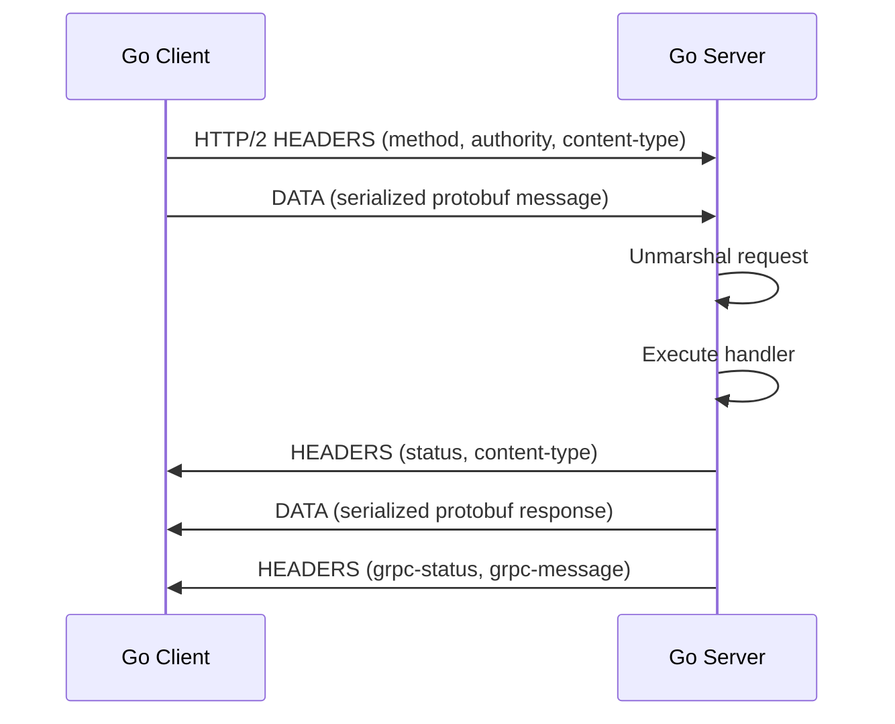
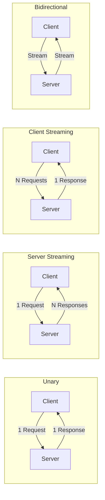

# 🔗 gRPC and Protocol Buffers

## Introduction

Remote Procedure Call (RPC) frameworks allow programs to execute procedures on remote servers as if they were local function calls. gRPC, developed by Google and now a CNCF incubating project, is a high-performance, open-source RPC framework that uses Protocol Buffers (protobuf) as its interface definition language and message format. Built on HTTP/2, gRPC supports bidirectional streaming, flow control, and multiplexing, making it ideal for microservices communication in Go.

In this module, we will explore the fundamentals of RPC, the structure of protobuf messages, and how gRPC leverages HTTP/2 for efficient transport. We will compare gRPC to REST and GraphQL, examine the complete request lifecycle, and implement a production-ready gRPC service in Go featuring unary calls, streaming, and interceptors. You will learn how Netflix standardized on gRPC for internal service communication, reducing latency and infrastructure complexity across thousands of Go microservices.

## 1. RPC Fundamentals and HTTP/2

RPC abstracts network communication behind familiar function call semantics. A client stub serializes arguments, transmits them over the network, and deserializes the return value from the server stub. This model eliminates the need to manually construct HTTP requests and parse JSON responses.

HTTP/2 provides the transport foundation for gRPC with these critical features:

- **Binary Framing:** HTTP/2 splits messages into binary frames, enabling more efficient parsing and reducing protocol overhead compared to HTTP/1.1 text headers.
- **Multiplexing:** Multiple requests and responses can share a single TCP connection via independent streams, eliminating head-of-line blocking.
- **Header Compression:** HPACK compresses HTTP headers, reducing redundant data transfer—especially valuable for repeated RPC metadata.
- **Server Push:** While rarely used in gRPC directly, the protocol's bidirectional nature enables server streaming and push-like patterns.

Because protobuf serializes to a compact binary format and HTTP/2 eliminates connection overhead, the end-to-end latency of gRPC is consistently lower than REST over HTTP/1.1. This relationship can be expressed as:

```
Latency_gRPC < Latency_REST
```

The inequality holds because gRPC benefits from binary serialization (smaller payloads), HTTP/2 multiplexing (fewer connections), and strong typing (no JSON parsing overhead).

⚠️ **Warning:** gRPC relies heavily on HTTP/2. If your load balancer or proxy does not support HTTP/2 (e.g., older Nginx versions without `grpc_pass` or AWS ALB without HTTP/2 enabled), connections will fail or downgrade unpredictably.

💡 **Tip:** Use gRPC health checking (`grpc_health_v1`) instead of generic TCP health checks. It validates that your service is actually responsive to RPC calls, not just accepting TCP connections.

Real case: **Netflix** migrated thousands of internal microservices from REST to gRPC to reduce latency and improve developer productivity. By adopting gRPC with protobuf, Netflix reduced payload sizes by 60% and cut inter-service latency by 30% across its Go-based edge and mid-tier services.

## 2. Protocol Buffers Syntax and Versioning

Protocol Buffers use `.proto` files to define services and messages. The syntax is strongly typed and supports code generation for multiple languages, including Go.

**Key protobuf concepts:**

- **Message:** A structured data unit composed of typed fields, each assigned a unique numbered tag.
- **Service:** A collection of RPC methods, each specifying a request and response message type.
- **Code Generation:** The `protoc` compiler generates Go structs and gRPC interfaces from `.proto` definitions.
- **Versioning:** Field tags enable backward-compatible schema evolution. New fields can be added without breaking existing consumers.

The following table compares gRPC to REST and GraphQL:

| Feature | REST | gRPC | GraphQL |
|---|---|---|---|
| Protocol | HTTP/1.1 | HTTP/2 | HTTP/1.1 or HTTP/2 |
| Payload Format | JSON / XML | Protobuf (binary) | JSON |
| Schema | OpenAPI | protobuf IDL | SDL |
| Streaming | Server-Sent Events | Bidirectional | Subscriptions |
| Latency | Higher | Lower | Medium |
| Browser Support | Native | Requires gRPC-Web | Native |
| Code Generation | Optional | Required (protoc) | Optional |
| Strong Typing | No | Yes | Yes |
| Caching | HTTP caching | Manual | Application-level |

## 3. gRPC Request Lifecycle

The following Mermaid diagram illustrates the complete lifecycle of a unary gRPC call from a Go client to a Go server:



**gRPC Streaming Models:**



**Wikimedia Commons Reference:**


## 4. gRPC in Go: Implementation

The following `.proto` file defines a simple key-value store service:

```protobuf
syntax = "proto3";

package kvstore;
option go_package = "github.com/example/kvstore/proto";

service KVStore {
    rpc Get(GetRequest) returns (GetResponse);
    rpc Set(SetRequest) returns (SetResponse);
    rpc Watch(WatchRequest) returns (stream WatchResponse);
}

message GetRequest {
    string key = 1;
}

message GetResponse {
    string key = 1;
    string value = 2;
    bool found = 3;
}

message SetRequest {
    string key = 1;
    string value = 2;
}

message SetResponse {
    bool success = 1;
}

message WatchRequest {
    string prefix = 1;
}

message WatchResponse {
    string key = 1;
    string value = 2;
    string event_type = 3;
}
```

**Go Server Implementation:**

```go
package main

import (
    "context"
    "fmt"
    "net"
    "sync"

    pb "github.com/example/kvstore/proto"
    "google.golang.org/grpc"
    "google.golang.org/grpc/codes"
    "google.golang.org/grpc/status"
)

type server struct {
    pb.UnimplementedKVStoreServer
    mu   sync.RWMutex
    data map[string]string
}

func (s *server) Get(ctx context.Context, req *pb.GetRequest) (*pb.GetResponse, error) {
    s.mu.RLock()
    defer s.mu.RUnlock()
    val, ok := s.data[req.Key]
    return &pb.GetResponse{Key: req.Key, Value: val, Found: ok}, nil
}

func (s *server) Set(ctx context.Context, req *pb.SetRequest) (*pb.SetResponse, error) {
    s.mu.Lock()
    defer s.mu.Unlock()
    s.data[req.Key] = req.Value
    return &pb.SetResponse{Success: true}, nil
}

func (s *server) Watch(req *pb.WatchRequest, stream pb.KVStore_WatchServer) error {
    return status.Errorf(codes.Unimplemented, "streaming not implemented in this example")
}

func main() {
    lis, err := net.Listen("tcp", ":50051")
    if err != nil {
        panic(err)
    }
    s := grpc.NewServer(
        grpc.UnaryInterceptor(loggingInterceptor),
    )
    pb.RegisterKVStoreServer(s, &server{data: make(map[string]string)})
    fmt.Println("gRPC server listening on :50051")
    if err := s.Serve(lis); err != nil {
        panic(err)
    }
}

func loggingInterceptor(ctx context.Context, req interface{}, info *grpc.UnaryServerInfo, handler grpc.UnaryHandler) (interface{}, error) {
    fmt.Printf("[gRPC] %s\n", info.FullMethod)
    return handler(ctx, req)
}
```

**Go Client Implementation:**

```go
package main

import (
    "context"
    "fmt"
    "log"
    "time"

    pb "github.com/example/kvstore/proto"
    "google.golang.org/grpc"
    "google.golang.org/grpc/credentials/insecure"
)

func main() {
    conn, err := grpc.Dial("localhost:50051", grpc.WithTransportCredentials(insecure.NewCredentials()))
    if err != nil {
        log.Fatalf("did not connect: %v", err)
    }
    defer conn.Close()

    client := pb.NewKVStoreClient(conn)
    ctx, cancel := context.WithTimeout(context.Background(), time.Second)
    defer cancel()

    _, err = client.Set(ctx, &pb.SetRequest{Key: "hello", Value: "world"})
    if err != nil {
        log.Fatalf("Set failed: %v", err)
    }

    resp, err := client.Get(ctx, &pb.GetRequest{Key: "hello"})
    if err != nil {
        log.Fatalf("Get failed: %v", err)
    }
    fmt.Printf("Got: %s = %s (found: %v)\n", resp.Key, resp.Value, resp.Found)
}
```

## 5. Interceptors and Middleware

gRPC interceptors (also called middleware) provide cross-cutting concerns such as authentication, logging, metrics, and retry logic. Go supports both unary and stream interceptors.

A unary interceptor wraps every RPC call, allowing pre-processing and post-processing. This pattern is analogous to HTTP middleware in REST frameworks but operates at the RPC method level.

Common interceptor use cases:

- **Authentication:** Validate JWT tokens or mutual TLS certificates before invoking handlers.
- **Logging:** Record request metadata, duration, and status codes for observability.
- **Metrics:** Emit Prometheus counters and histograms for each RPC method.
- **Retry Logic:** Automatically retry transient failures with exponential backoff.

---

## 📦 Compression Code

Complete Go script to compress protobuf message definitions by stripping comments and unnecessary whitespace:

```go
package main

import (
    "fmt"
    "os"
    "regexp"
    "strings"
)

// ProtoMinifier removes comments and extra whitespace from .proto files
func main() {
    if len(os.Args) < 2 {
        fmt.Println("Usage: protomin <file.proto>")
        os.Exit(1)
    }
    data, err := os.ReadFile(os.Args[1])
    if err != nil {
        panic(err)
    }

    content := string(data)

    // Remove C-style block comments
    blockCommentRe := regexp.MustCompile(`(?s)/\*.*?\*/`)
    content = blockCommentRe.ReplaceAllString(content, "")

    // Remove line comments
    lineCommentRe := regexp.MustCompile(`(?m)//.*$`)
    content = lineCommentRe.ReplaceAllString(content, "")

    // Collapse multiple newlines
    content = regexp.MustCompile(`\n\s*\n`).ReplaceAllString(content, "\n")
    content = strings.TrimSpace(content) + "\n"

    outPath := os.Args[1] + ".min"
    if err := os.WriteFile(outPath, []byte(content), 0644); err != nil {
        panic(err)
    }

    original := len(data)
    compressed := len(content)
    ratio := float64(compressed) / float64(original) * 100
    fmt.Printf("Minified %s -> %s (%.1f%% of original, %d -> %d bytes)\n",
        os.Args[1], outPath, ratio, original, compressed)
}
```

## 🎯 Documented Project

### Description

Build **GRPCatalog**, a Go microservice exposing a gRPC API for a product catalog. The service supports unary CRUD operations for products and a bidirectional streaming endpoint for bulk inventory updates. Implement authentication via metadata interceptors and metrics collection via Prometheus.

### Functional Requirements

1. Define protobuf messages for `Product`, `CreateProductRequest`, `GetProductRequest`, and `UpdateInventoryRequest`.
2. Implement a gRPC server with unary methods: `CreateProduct`, `GetProduct`, `ListProducts`.
3. Implement a bidirectional streaming method `SyncInventory` for real-time inventory updates.
4. Add a unary interceptor that validates an `authorization` metadata token.
5. Instrument all RPC methods with Prometheus histograms for request duration.

### Main Components

- `proto/catalog.proto` — Protobuf service and message definitions
- `cmd/server/main.go` — gRPC server with interceptors
- `cmd/client/main.go` — CLI gRPC client for testing
- `internal/store/` — In-memory product repository
- `internal/interceptors/` — Auth and metrics middleware

### Success Metrics

- Unary RPC latency P99 is under 5 ms for local calls
- Bidirectional stream handles 1000 concurrent inventory messages per second
- Prometheus metrics expose `grpc_request_duration_seconds` per method
- Invalid auth tokens return `codes.Unauthenticated` within 1 ms
- `protoc` generates Go code successfully with no lint errors

### References

- [gRPC Official Documentation](https://grpc.io/docs/)
- [Protocol Buffers Language Guide](https://protobuf.dev/programming-guides/proto3/)
- [Go gRPC Middleware](https://github.com/grpc-ecosystem/go-grpc-middleware)
- [[04 - Service Discovery and Load Balancing|⚖️ 04 - Service Discovery]]
