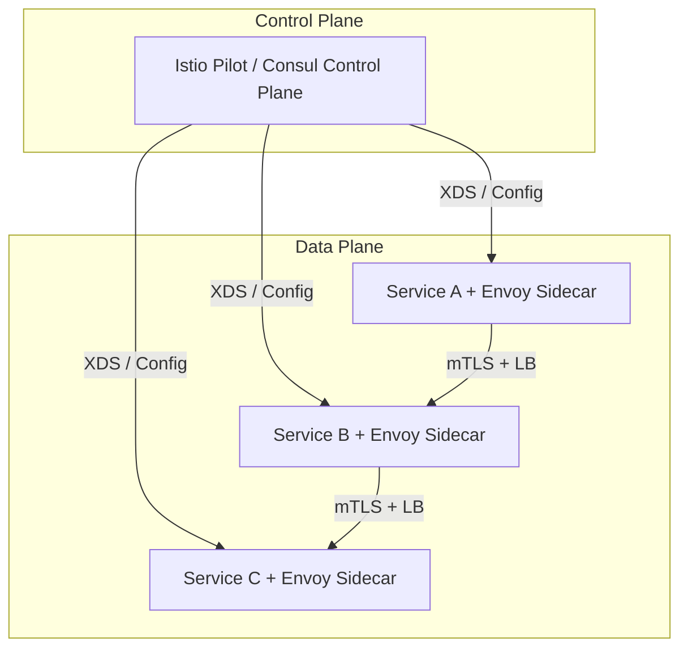
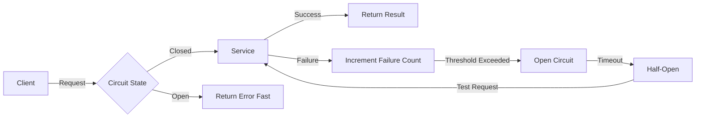

# ⚖️ Service Discovery and Load Balancing

## Introduction

In distributed systems, services must locate and communicate with each other dynamically as instances scale up and down. Service discovery solves the problem of finding the network location (IP and port) of healthy service instances, while load balancing distributes incoming requests across those instances to maximize throughput and minimize latency. For Go developers building cloud-native applications, understanding these patterns is critical for creating resilient, scalable architectures.

This module explores both client-side and server-side service discovery, deep-dives into load balancing algorithms, and examines resilience patterns such as circuit breakers and retries. We will analyze how Uber operates one of the largest microservice fleets in the world, handling service discovery at massive scale. You will implement a custom round-robin load balancer in Go, compare popular proxy solutions, and model service availability using probability theory.

## 1. Service Discovery Patterns

Service discovery patterns fall into two primary categories:

- **Client-Side Discovery:** The client is responsible for determining the network locations of available service instances and load balancing requests among them. The client queries a service registry (such as Consul, etcd, or Eureka), caches the results, and implements load balancing logic directly. This approach reduces network hops but adds complexity to the client code.
- **Server-Side Discovery:** The client makes requests to a known load balancer or reverse proxy (such as Kubernetes DNS, AWS ELB, or an API Gateway), which queries the service registry and forwards the request to an appropriate backend instance. This simplifies clients but introduces a potential single point of failure and additional latency.

**Key service registries:**

- **Consul:** Provides service discovery, health checking, and key-value storage via DNS or HTTP API. Go applications can use the `hashicorp/consul/api` client.
- **etcd:** A distributed key-value store used as Kubernetes' backing store. It can be used directly for service discovery via its watch API.
- **Kubernetes DNS:** Each Service gets a DNS entry (e.g., `my-service.my-namespace.svc.cluster.local`), abstracting Pod IP changes from clients.

⚠️ **Warning:** Stale caches in client-side discovery can route traffic to failed instances. Always implement TTL-based cache invalidation or active health checks to prevent cascading failures.

💡 **Tip:** In Kubernetes environments, prefer server-side discovery via ClusterIP Services. It eliminates the need for sidecar agents in your Go containers and integrates natively with kube-proxy's iptables/IPVS rules.

Real case: **Uber** manages tens of thousands of microservices across multiple regions. Uber's Go-based service mesh, built on top of a custom control plane and Envoy data plane, handles millions of service discovery lookups per second. By using client-side caching with aggressive TTLs and health-aware load balancing, Uber reduced discovery latency from hundreds of milliseconds to under 1 ms.

## 2. Load Balancing Algorithms

Load balancers distribute traffic according to specific algorithms, each suited to different workload characteristics:

| Algorithm | Description | Best For | Complexity |
|---|---|---|---|
| Round Robin | Cycles through backends sequentially | Homogeneous, stateless services | O(1) |
| Least Connections | Routes to the backend with fewest active connections | Long-lived connections (WebSocket, gRPC) | O(n) |
| Consistent Hashing | Maps request keys to backends using a hash ring | Caching, session affinity | O(log n) |
| Weighted Round Robin | Assigns different weights to backends | Heterogeneous instance sizes | O(1) |
| Random | Selects a backend uniformly at random | Uniform load, simple state | O(1) |

The following table compares popular load balancer implementations:

| Feature | Nginx | Envoy | HAProxy |
|---|---|---|---|
| Protocol Support | HTTP, TCP, UDP | HTTP/1, HTTP/2, gRPC, TCP | HTTP, TCP |
| Dynamic Configuration | Via API or reload | XDS API (fully dynamic) | Via socket/API |
| Service Mesh Integration | Limited (with modules) | Native (Istio, Consul) | Limited |
| Observability | Basic logs/metrics | Rich metrics, tracing, logging | Detailed stats |
| Performance | High | Very High | Very High |
| Go SDK | No | Yes (go-control-plane) | No |

## 3. Service Mesh and Circuit Breakers

A **service mesh** is a dedicated infrastructure layer for handling service-to-service communication. It typically consists of a control plane (manages configuration and certificates) and a data plane (intercepts and routes traffic via sidecar proxies like Envoy).

**Service Mesh Architecture:**



**Circuit Breaker Pattern:**



Circuit breakers prevent cascading failures by stopping requests to unhealthy services. When failures exceed a threshold, the circuit "opens," returning errors immediately. After a timeout, the circuit enters a "half-open" state to test recovery.

**Wikimedia Commons Reference:**


## 4. Building a Custom Load Balancer in Go

The following Go code implements a thread-safe round-robin load balancer with health checking:

```go
package main

import (
    "context"
    "fmt"
    "net/http"
    "net/url"
    "sync"
    "sync/atomic"
    "time"
)

// Backend represents a single upstream server
type Backend struct {
    URL     *url.URL
    Healthy atomic.Bool
    mux     sync.RWMutex
}

// LoadBalancer distributes traffic across backends
type LoadBalancer struct {
    backends []*Backend
    current  atomic.Uint64
    client   *http.Client
}

// NewLoadBalancer creates a load balancer with health checking
func NewLoadBalancer(rawURLs []string) (*LoadBalancer, error) {
    var backends []*Backend
    for _, raw := range rawURLs {
        u, err := url.Parse(raw)
        if err != nil {
            return nil, err
        }
        b := &Backend{URL: u}
        b.Healthy.Store(true)
        backends = append(backends, b)
    }

    lb := &LoadBalancer{
        backends: backends,
        client:   &http.Client{Timeout: 5 * time.Second},
    }

    // Start background health checks
    go lb.healthCheckLoop(context.Background(), 10*time.Second)
    return lb, nil
}

// Next returns the next healthy backend using round-robin
func (lb *LoadBalancer) Next() *Backend {
    for i := 0; i < len(lb.backends); i++ {
        idx := int(lb.current.Add(1) % uint64(len(lb.backends)))
        if lb.backends[idx].Healthy.Load() {
            return lb.backends[idx]
        }
    }
    return nil
}

// healthCheckLoop periodically checks backend health
func (lb *LoadBalancer) healthCheckLoop(ctx context.Context, interval time.Duration) {
    ticker := time.NewTicker(interval)
    defer ticker.Stop()
    for {
        select {
        case <-ctx.Done():
            return
        case <-ticker.C:
            for _, b := range lb.backends {
                go func(backend *Backend) {
                    req, err := http.NewRequestWithContext(ctx, "GET", backend.URL.String()+"/health", nil)
                    if err != nil {
                        backend.Healthy.Store(false)
                        return
                    }
                    resp, err := lb.client.Do(req)
                    healthy := err == nil && resp.StatusCode == http.StatusOK
                    backend.Healthy.Store(healthy)
                    if resp != nil {
                        resp.Body.Close()
                    }
                }(b)
            }
        }
    }
}

// ServeHTTP implements the http.Handler interface
func (lb *LoadBalancer) ServeHTTP(w http.ResponseWriter, r *http.Request) {
    backend := lb.Next()
    if backend == nil {
        http.Error(w, "No healthy backends", http.StatusServiceUnavailable)
        return
    }
    backend.URL.Path = r.URL.Path
    backend.URL.RawQuery = r.URL.RawQuery
    proxyReq, err := http.NewRequestWithContext(r.Context(), r.Method, backend.URL.String(), r.Body)
    if err != nil {
        http.Error(w, err.Error(), http.StatusInternalServerError)
        return
    }
    proxyReq.Header = r.Header.Clone()

    resp, err := lb.client.Do(proxyReq)
    if err != nil {
        http.Error(w, err.Error(), http.StatusBadGateway)
        return
    }
    defer resp.Body.Close()

    for k, vv := range resp.Header {
        for _, v := range vv {
            w.Header().Add(k, v)
        }
    }
    w.WriteHeader(resp.StatusCode)
    // In production, stream resp.Body to w
}

func main() {
    backends := []string{
        "http://localhost:8081",
        "http://localhost:8082",
        "http://localhost:8083",
    }
    lb, err := NewLoadBalancer(backends)
    if err != nil {
        panic(err)
    }
    fmt.Println("Load balancer listening on :8080")
    http.ListenAndServe(":8080", lb)
}
```

## 5. Availability and Redundancy

When designing redundant systems, overall availability is calculated based on the availability of individual components. For a system with redundant parallel services, the formula is:

```
Availability = 1 - Π(1 - A_i)
```

Where **A_i** is the availability of the i-th redundant component, and **Π** denotes the product over all components. For example, if three identical services each have 99% availability, the combined availability is:

```
Availability = 1 - (1 - 0.99)^3 = 1 - 0.000001 = 99.9999%
```

This demonstrates that redundancy dramatically improves reliability, but only when failures are independent and the load balancer correctly detects unhealthy instances.

---

## 📦 Compression Code

Complete Go script to compress and encode service endpoint configurations for efficient discovery cache storage:

```go
package main

import (
    "bytes"
    "compress/gzip"
    "encoding/base64"
    "encoding/json"
    "fmt"
    "os"
)

type Endpoint struct {
    Address string `json:"address"`
    Port    int    `json:"port"`
    Weight  int    `json:"weight"`
    Healthy bool   `json:"healthy"`
}

// CompressEndpoints serializes and compresses endpoint lists for cache storage
func main() {
    endpoints := []Endpoint{
        {Address: "10.0.1.10", Port: 8080, Weight: 3, Healthy: true},
        {Address: "10.0.1.11", Port: 8080, Weight: 3, Healthy: true},
        {Address: "10.0.1.12", Port: 8080, Weight: 2, Healthy: false},
    }

    jsonData, err := json.Marshal(endpoints)
    if err != nil {
        panic(err)
    }

    var buf bytes.Buffer
    gzipWriter := gzip.NewWriter(&buf)
    if _, err := gzipWriter.Write(jsonData); err != nil {
        panic(err)
    }
    gzipWriter.Close()

    encoded := base64.StdEncoding.EncodeToString(buf.Bytes())
    fmt.Printf("Original JSON: %d bytes\n", len(jsonData))
    fmt.Printf("Compressed+Encoded: %d bytes\n", len(encoded))
    fmt.Printf("Cache Value: %s\n", encoded)

    // Verify decompression
    decoded, err := base64.StdEncoding.DecodeString(encoded)
    if err != nil {
        panic(err)
    }
    gzipReader, err := gzip.NewReader(bytes.NewReader(decoded))
    if err != nil {
        panic(err)
    }
    var out bytes.Buffer
    out.ReadFrom(gzipReader)
    gzipReader.Close()

    fmt.Printf("Decompressed: %s\n", out.String())
}
```

## 🎯 Documented Project

### Description

Develop **BalanceGo**, a production-ready HTTP reverse proxy and load balancer written in Go. It supports multiple balancing algorithms (round-robin, least-connections, weighted), active health checks, and a circuit breaker pattern to protect downstream services.

### Functional Requirements

1. Implement a reverse proxy that forwards HTTP requests to configured backends.
2. Support round-robin, least-connections, and weighted round-robin algorithms.
3. Perform active health checks on backends every 5 seconds via HTTP `/health`.
4. Implement a circuit breaker that opens after 5 consecutive failures and half-opens after 30 seconds.
5. Expose Prometheus metrics for request count, latency, and backend health status.

### Main Components

- `cmd/proxy/main.go` — Reverse proxy entry point
- `pkg/balancer/` — Load balancing algorithms interface and implementations
- `pkg/health/` — Active health checking goroutines
- `pkg/breaker/` — Circuit breaker state machine
- `pkg/metrics/` — Prometheus instrumentation

### Success Metrics

- Proxy handles 10,000 concurrent connections with <5 ms added latency
- Unhealthy backends are removed from rotation within 10 seconds
- Circuit breaker opens within 1 second of threshold breach
- Prometheus endpoint `/metrics` exposes `proxy_requests_total` and `proxy_backend_health`
- Health check failure detection accuracy is >99%

### References

- [Consul Service Discovery](https://developer.hashicorp.com/consul/docs/concepts/service-discovery)
- [Envoy Proxy Architecture](https://www.envoyproxy.io/docs/envoy/latest/intro/arch_overview)
- [AWS Elastic Load Balancing](https://docs.aws.amazon.com/elasticloadbalancing/)
- [[05 - Infrastructure as Code with Pulumi|🏗️ 05 - IaC with Pulumi]]
