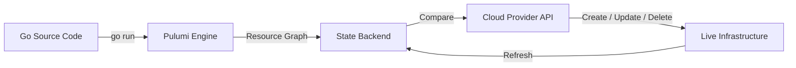
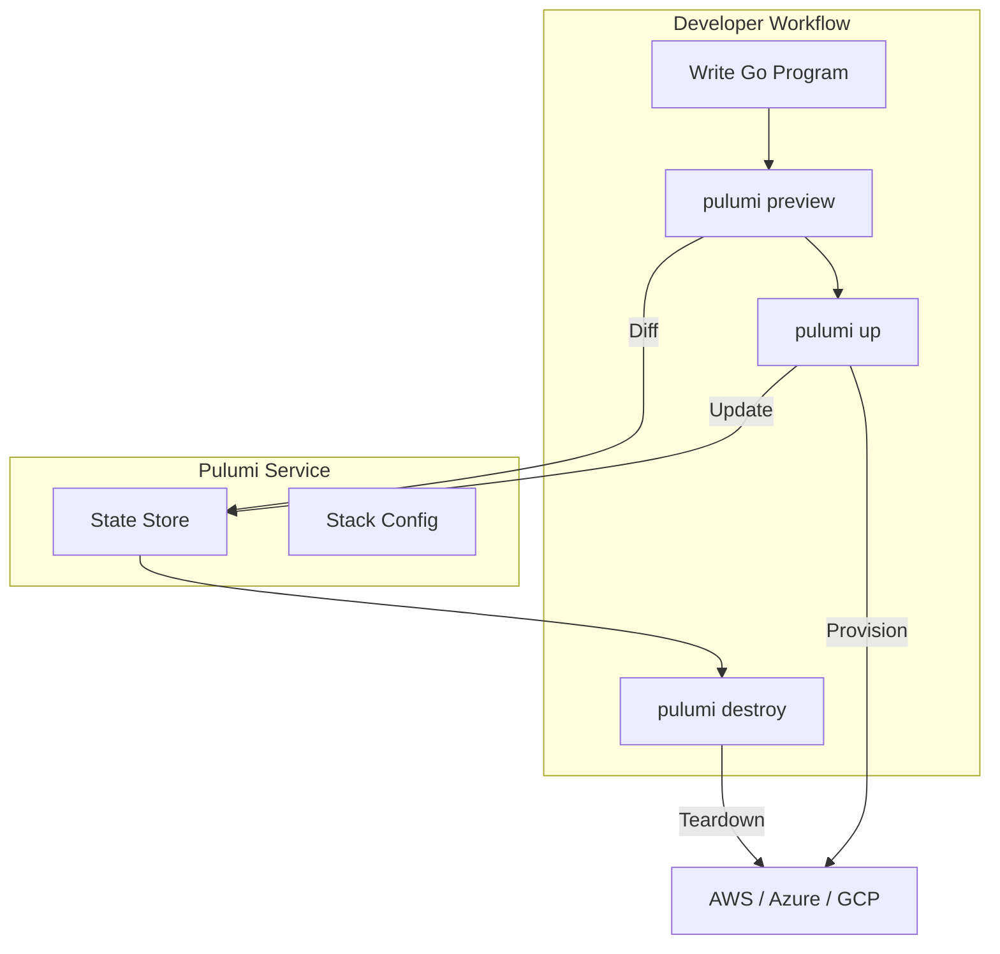

# 🏗️ Infrastructure as Code with Pulumi

## Introduction

Infrastructure as Code (IaC) is the practice of managing and provisioning computing infrastructure through machine-readable configuration files rather than physical hardware configuration or interactive configuration tools. IaC enables version control, automated testing, and repeatable deployments, forming the backbone of modern DevOps practices. While tools like Terraform and AWS CloudFormation have dominated the space, Pulumi introduced a paradigm shift by allowing developers to define infrastructure using familiar general-purpose programming languages—including Go.

This module explores the core concepts of IaC, contrasts imperative and declarative approaches, and dives deep into Pulumi's Go-native SDK. You will learn how to manage state, detect drift, and handle secrets securely. We will compare Pulumi to Terraform and CloudFormation, examine how AWS leverages Pulumi internally, and build a complete Go program that provisions an S3 bucket and a Lambda function with proper IAM roles and event triggers.

## 1. Infrastructure as Code Concepts

IaC tools manage infrastructure through code, but they differ in their approach to defining desired state:

- **Declarative IaC:** You specify the desired end state of the infrastructure, and the tool determines the sequence of operations to achieve it. Terraform and CloudFormation are primarily declarative. You declare "there should be an S3 bucket with these properties," and the tool creates or updates it.
- **Imperative IaC:** You specify the exact steps and procedures to create the infrastructure. Traditional scripting (e.g., AWS CLI scripts) is imperative. This offers more control but makes idempotency and rollback harder to manage.

Pulumi offers a unique hybrid: it uses imperative code (Go, TypeScript, Python) to generate a declarative resource graph. Your program executes to produce a desired state snapshot, which Pulumi then reconciles against the actual cloud state.

**Core IaC concepts:**

- **State Management:** IaC tools maintain a state file tracking the mapping between your code and real infrastructure resources. Pulumi stores state in the Pulumi Service backend, S3, or local files.
- **Drift Detection:** When infrastructure is modified outside the IaC tool (e.g., via the cloud console), the actual state diverges from the desired state. Pulumi detects this drift during `pulumi preview`.
- **Idempotency:** Running the same IaC program multiple times should not create duplicate resources. Pulumi achieves this by tracking resource URNs (Unique Resource Names) in state.
- **Secrets Management:** Pulumi encrypts sensitive values (passwords, API keys) at rest in state files and decrypts them at runtime using passphrases or cloud KMS integrations.

⚠️ **Warning:** Committing unencrypted Pulumi state files or `.pulumi` directories to version control exposes your infrastructure secrets and resource identifiers. Always use remote state backends with encryption enabled.

💡 **Tip:** Use Pulumi's `config` system with `pulumi config set --secret` for sensitive values. Secrets are automatically encrypted using your stack's encryption provider and decrypted transparently in your Go code via `cfg.RequireSecret("apiKey")`.

Real case: **AWS** uses Pulumi internally for several internal platforms and developer tooling initiatives. AWS teams leverage Pulumi's Go SDK to provision multi-account landing zones, VPC peering configurations, and CI/CD pipelines, benefiting from type safety and testability that pure DSLs cannot provide.

## 2. Pulumi vs Terraform vs CloudFormation

The following table compares the three leading IaC platforms:

| Feature | Pulumi | Terraform | AWS CloudFormation |
|---|---|---|---|
| Language | Go, TS, Python, C#, Java | HCL (DSL) | JSON / YAML |
| State Management | Pulumi Cloud, S3, Local | Terraform Cloud, S3, Local | Managed by AWS |
| Cloud Agnostic | Yes (70+ providers) | Yes (3000+ providers) | AWS only |
| Testing | Unit tests in real languages | Integration tests (terratest) | Contract tests |
| IDE Support | Excellent (LSP, types) | Good (syntax highlighting) | Basic |
| Modularity | Component resources | Modules | Nested stacks |
| Policy as Code | CrossGuard (OPA/PaC) | Sentinel / OPA | CloudFormation Guard |
| Secrets | Built-in encryption | External (Vault, AWS SM) | AWS Secrets Manager |
| Drift Detection | `pulumi refresh` | `terraform plan` | Change sets |

Pulumi's key differentiator is its use of real programming languages. In Go, you get compile-time type checking, IDE autocomplete, dependency management via modules, and the ability to write unit tests using standard Go testing tools.

## 3. IaC Workflow Diagram

The following Mermaid diagram illustrates the Pulumi workflow using Go:



**Pulumi Stack Lifecycle:**



**Wikimedia Commons Reference:**


## 4. Writing Pulumi Programs in Go

A Pulumi program in Go defines resources by creating objects from the Pulumi SDK. The program runs within the Pulumi engine, which tracks resource creation, updates dependencies, and manages state.

The following Go program creates an S3 bucket, uploads a Lambda deployment package, creates an IAM role, and wires an S3 event trigger to the Lambda function:

```go
package main

import (
    "fmt"
    "os"

    "github.com/pulumi/pulumi-aws/sdk/v6/go/aws/iam"
    "github.com/pulumi/pulumi-aws/sdk/v6/go/aws/lambda"
    "github.com/pulumi/pulumi-aws/sdk/v6/go/aws/s3"
    "github.com/pulumi/pulumi/sdk/v3/go/pulumi"
)

func main() {
    pulumi.Run(func(ctx *pulumi.Context) error {
        // Create an S3 bucket
        bucket, err := s3.NewBucket(ctx, "cloudgo-bucket", &s3.BucketArgs{
            Bucket: pulumi.String("cloudgo-data-bucket-" + ctx.Stack()),
            Versioning: &s3.BucketVersioningArgs{
                Enabled: pulumi.Bool(true),
            },
        })
        if err != nil {
            return err
        }

        // Create IAM role for Lambda
        assumeRolePolicy := `{
            "Version": "2012-10-17",
            "Statement": [{
                "Action": "sts:AssumeRole",
                "Effect": "Allow",
                "Principal": {"Service": "lambda.amazonaws.com"}
            }]
        }`

        role, err := iam.NewRole(ctx, "lambdaRole", &iam.RoleArgs{
            AssumeRolePolicy: pulumi.String(assumeRolePolicy),
            Name:             pulumi.String("cloudgo-lambda-role"),
        })
        if err != nil {
            return err
        }

        // Attach basic Lambda execution policy
        _, err = iam.NewRolePolicyAttachment(ctx, "lambdaPolicy", &iam.RolePolicyAttachmentArgs{
            Role:      role.Name,
            PolicyArn: pulumi.String("arn:aws:iam::aws:policy/service-role/AWSLambdaBasicExecutionRole"),
        })
        if err != nil {
            return err
        }

        // Attach S3 read policy
        s3Policy := iam.GetPolicyDocumentOutput(ctx, iam.GetPolicyDocumentOutputArgs{
            Statements: iam.GetPolicyDocumentStatementArray{
                iam.GetPolicyDocumentStatementArgs{
                    Effect:    pulumi.String("Allow"),
                    Actions:   pulumi.ToStringArray([]string{"s3:GetObject"}),
                    Resources: pulumi.ToStringArrayOutput([]pulumi.StringOutput{bucket.Arn.ApplyT(func(arn string) string { return arn + "/*" }).(pulumi.StringOutput)}),
                },
            },
        })

        _, err = iam.NewRolePolicy(ctx, "lambdaS3Policy", &iam.RolePolicyArgs{
            Role:   role.Name,
            Policy: s3Policy.Json,
        })
        if err != nil {
            return err
        }

        // Read Lambda deployment package
        lambdaZip, err := os.ReadFile("lambda-handler.zip")
        if err != nil {
            return fmt.Errorf("failed to read lambda zip: %w", err)
        }

        // Create Lambda function
        handler, err := lambda.NewFunction(ctx, "cloudgo-processor", &lambda.FunctionArgs{
            Runtime: pulumi.String("provided.al2"),
            Handler: pulumi.String("bootstrap"),
            Role:    role.Arn,
            Code:    pulumi.NewFileArchive("lambda-handler.zip"),
            Environment: &lambda.FunctionEnvironmentArgs{
                Variables: pulumi.StringMap{
                    "BUCKET_NAME": bucket.Bucket,
                },
            },
            Timeout: pulumi.Int(30),
            MemorySize: pulumi.Int(128),
        })
        if err != nil {
            return err
        }

        // Grant S3 permission to invoke Lambda
        _, err = lambda.NewPermission(ctx, "s3Invoke", &lambda.PermissionArgs{
            Action:    pulumi.String("lambda:InvokeFunction"),
            Function:  handler.Name,
            Principal: pulumi.String("s3.amazonaws.com"),
            SourceArn: bucket.Arn,
        })
        if err != nil {
            return err
        }

        // Create S3 bucket notification
        _, err = s3.NewBucketNotification(ctx, "bucketNotification", &s3.BucketNotificationArgs{
            Bucket: bucket.ID(),
            LambdaFunctions: s3.BucketNotificationLambdaFunctionArray{
                s3.BucketNotificationLambdaFunctionArgs{
                    LambdaFunctionArn: handler.Arn,
                    Events:            pulumi.ToStringArray([]string{"s3:ObjectCreated:*"}),
                    FilterPrefix:      pulumi.String("uploads/"),
                },
            },
        })
        if err != nil {
            return err
        }

        // Export outputs
        ctx.Export("bucketName", bucket.Bucket)
        ctx.Export("lambdaArn", handler.Arn)
        return nil
    })
}
```

## 5. State, Stacks, and Secrets

A **Stack** in Pulumi is an isolated, independently configurable instance of a Pulumi program. Stacks typically map to environments: `dev`, `staging`, `prod`.

**State** is stored as a JSON snapshot of all resources managed by the stack. Pulumi supports multiple backends:

- **Pulumi Cloud:** Managed SaaS backend with team collaboration, state locking, and audit logs.
- **S3 Backend:** Self-managed state in an S3 bucket with DynamoDB for locking.
- **Local Backend:** Filesystem-based state for local development and testing.

**Secrets** in Pulumi are encrypted at rest. When you set a secret configuration value:

```bash
pulumi config set --secret dbPassword "super-secret-123"
```

Pulumi encrypts it using your stack's encryption provider. In Go code, you retrieve it securely:

```go
cfg := config.New(ctx, "")
dbPassword := cfg.RequireSecret("dbPassword") // Returns pulumi.StringOutput, decrypted at runtime
```

---

## 📦 Compression Code

Complete Go script to compress Pulumi state files for archival or migration:

```go
package main

import (
    "archive/zip"
    "fmt"
    "io"
    "os"
    "path/filepath"
    "strings"
    "time"
)

// ArchivePulumiState compresses the .pulumi directory into a timestamped zip
func main() {
    sourceDir := ".pulumi"
    if len(os.Args) > 1 {
        sourceDir = os.Args[1]
    }

    if _, err := os.Stat(sourceDir); os.IsNotExist(err) {
        fmt.Printf("Directory %s does not exist\n", sourceDir)
        os.Exit(1)
    }

    timestamp := time.Now().Format("20060102-150405")
    zipName := fmt.Sprintf("pulumi-state-%s.zip", timestamp)
    zipFile, err := os.Create(zipName)
    if err != nil {
        panic(err)
    }
    defer zipFile.Close()

    archive := zip.NewWriter(zipFile)
    defer archive.Close()

    err = filepath.Walk(sourceDir, func(path string, info os.FileInfo, err error) error {
        if err != nil {
            return err
        }
        if info.IsDir() {
            return nil
        }

        relPath := strings.TrimPrefix(path, sourceDir+string(os.PathSeparator))
        header, err := zip.FileInfoHeader(info)
        if err != nil {
            return err
        }
        header.Name = relPath
        header.Method = zip.Deflate

        writer, err := archive.CreateHeader(header)
        if err != nil {
            return err
        }
        file, err := os.Open(path)
        if err != nil {
            return err
        }
        defer file.Close()
        _, err = io.Copy(writer, file)
        return err
    })

    if err != nil {
        panic(err)
    }

    fmt.Printf("Archived %s to %s\n", sourceDir, zipName)
}
```

## 🎯 Documented Project

### Description

Build **InfraGo**, a Pulumi Go program that provisions a complete cloud-native environment on AWS. It creates a VPC with public and private subnets, an ECS Fargate cluster running a Go container, an RDS PostgreSQL instance, and an Application Load Balancer. All resources are tagged, encrypted, and configured according to AWS Well-Architected best practices.

### Functional Requirements

1. Provision a VPC with 2 public and 2 private subnets across 2 availability zones.
2. Deploy an ECS Fargate service running a Go HTTP container from a private ECR repository.
3. Create an RDS PostgreSQL instance in the private subnets with encryption at rest.
4. Configure an Application Load Balancer in the public subnets forwarding to ECS.
5. Store database credentials in Pulumi secrets and inject them into the ECS task as environment variables.

### Main Components

- `cmd/infra/main.go` — Pulumi program entry point
- `pkg/network/` — VPC, subnets, routing tables, NAT gateways
- `pkg/compute/` — ECS cluster, Fargate task definitions, services
- `pkg/database/` — RDS instance, security groups, subnet groups
- `pkg/loadbalancer/` — ALB, target groups, listeners
- `Pulumi.yaml` / `Pulumi.dev.yaml` — Project and stack configuration

### Success Metrics

- `pulumi up` completes successfully with zero errors
- Go service is accessible via ALB DNS name on port 80
- RDS instance is reachable only from the ECS task security group
- Database credentials never appear in plaintext in state or code
- `pulumi preview` shows no unexpected replacements on subsequent runs

### References

- [Pulumi Go SDK Documentation](https://www.pulumi.com/docs/languages-sdks/go/)
- [AWS Well-Architected Framework](https://docs.aws.amazon.com/wellarchitected/)
- [Pulumi vs Terraform Comparison](https://www.pulumi.com/docs/concepts/vs/terraform/)
- [[06 - Cloud Networking and Observability|📡 06 - Observability]]
