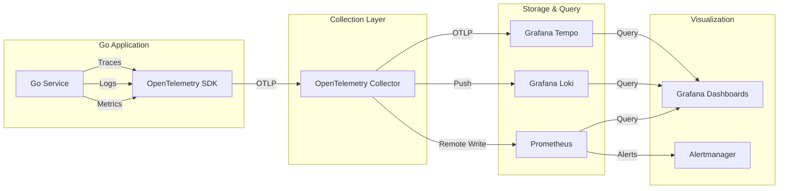
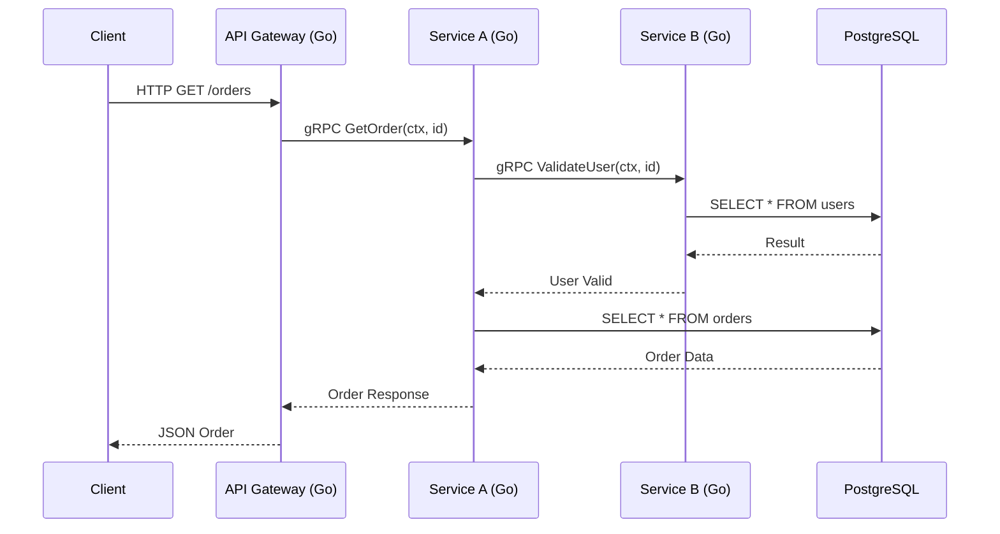

# 📡 Cloud Networking and Observability

## Introduction

Cloud networking forms the backbone of distributed systems, defining how services communicate within and across boundaries. Virtual Private Clouds (VPCs), subnets, security groups, and NAT gateways create isolated, secure environments for applications. However, as systems scale, understanding their behavior becomes increasingly difficult. Observability—the ability to infer internal system states from external outputs—addresses this challenge through three pillars: metrics, logs, and traces. For Go developers, implementing robust observability is essential for maintaining reliability in production.

This module covers cloud networking fundamentals and modern observability practices. You will learn how to instrument Go applications using OpenTelemetry, export telemetry to collectors and backends, and build dashboards that reveal system health. We will examine how GitHub monitors its Go services at scale, compare leading observability tools, and derive the mathematical relationship between detection speed and mean time to recovery (MTTR).

## 1. Cloud Networking Fundamentals

Cloud networking provides the connective tissue for distributed applications. Key concepts include:

- **VPC (Virtual Private Cloud):** A logically isolated network segment within a public cloud provider. A VPC defines the IP address range (CIDR block) and serves as the container for subnets, routing tables, and gateways.
- **Subnets:** Subdivisions of a VPC's IP range, typically categorized as public (with direct internet access via an Internet Gateway) or private (with outbound access via a NAT Gateway). Go microservices should run in private subnets for security.
- **Security Groups:** Stateful virtual firewalls attached to resources (e.g., EC2 instances, ECS tasks). They control inbound and outbound traffic based on protocols, ports, and source/destination IP ranges.
- **NAT (Network Address Translation):** NAT Gateways allow instances in private subnets to initiate outbound connections to the internet (e.g., for downloading dependencies or calling external APIs) while remaining unreachable from the public internet.
- **VPC Peering / Transit Gateway:** Enables private IP connectivity between VPCs or across regions and accounts, essential for multi-service architectures without traversing the public internet.

Go applications deployed in cloud environments must be designed to handle dynamic network conditions: DNS resolution delays, transient packet loss, and variable latency between availability zones. Using Go's `net` package with proper timeouts and connection pooling is essential.

⚠️ **Warning:** Misconfigured security group rules (e.g., allowing 0.0.0.0/0 on port 22 or 3389) expose your infrastructure to brute force and unauthorized access. Always apply the principle of least privilege.

💡 **Tip:** Use cloud provider metadata endpoints (e.g., EC2 IMDS) sparingly in Go. If your application queries instance metadata on every request, it introduces unnecessary latency and may hit rate limits. Cache metadata at startup.

Real case: **GitHub** monitors its Go-based internal services using OpenTelemetry, Prometheus, and a custom tracing pipeline. By instrumenting every gRPC and HTTP call with OpenTelemetry, GitHub reduced its mean time to detect (MTTD) production anomalies from 15 minutes to under 2 minutes, enabling faster incident response across its microservice fleet.

## 2. The Three Pillars of Observability

Observability is built upon three interconnected telemetry types:

| Pillar | Description | Tool Examples | Data Model |
|---|---|---|---|
| **Metrics** | Numeric measurements aggregated over time | Prometheus, InfluxDB, Datadog | Time-series (name, value, timestamp, labels) |
| **Logs** | Discrete timestamped records of events | Loki, ELK Stack, Splunk | Unstructured or structured text (JSON) |
| **Traces** | End-to-end request path through distributed services | Jaeger, Tempo, Zipkin | Tree of spans with parent-child relationships |

**Key differences:**

- Metrics excel at alerting and trend analysis (e.g., "error rate increased by 10%").
- Logs provide granular detail for debugging specific events (e.g., "user 12345 encountered a permission denied error at 14:32:05").
- Traces reveal latency bottlenecks and dependency failures across service boundaries (e.g., "the 500ms delay occurred in the payment service database query").

A complete observability stack correlates all three pillars. For example, a high error rate metric triggers an alert; logs reveal the specific error messages; traces pinpoint the failing service and method.

## 3. Observability Stack Architecture

The following Mermaid diagram illustrates a typical cloud-native observability pipeline for Go applications:



**Trace Propagation Through Services:**



**Wikimedia Commons Reference:**


## 4. OpenTelemetry in Go

OpenTelemetry (OTel) is the CNCF standard for observability. It provides a unified API and SDK for metrics, logs, and traces. In Go, you instrument your application by creating a TracerProvider, MeterProvider, and propagating context across goroutines and RPC boundaries.

The following example demonstrates basic OpenTelemetry instrumentation for a Go HTTP server:

```go
package main

import (
    "context"
    "fmt"
    "log"
    "net/http"
    "time"

    "go.opentelemetry.io/contrib/instrumentation/net/http/otelhttp"
    "go.opentelemetry.io/otel"
    "go.opentelemetry.io/otel/attribute"
    "go.opentelemetry.io/otel/exporters/otlp/otlptrace/otlptracegrpc"
    "go.opentelemetry.io/otel/sdk/resource"
    sdktrace "go.opentelemetry.io/otel/sdk/trace"
    semconv "go.opentelemetry.io/otel/semconv/v1.21.0"
    "go.opentelemetry.io/otel/trace"
    "google.golang.org/grpc"
    "google.golang.org/grpc/credentials/insecure"
)

var tracer trace.Tracer

func initTracer() func() {
    ctx := context.Background()

    conn, err := grpc.DialContext(ctx, "otel-collector:4317",
        grpc.WithTransportCredentials(insecure.NewCredentials()),
        grpc.WithBlock(),
    )
    if err != nil {
        log.Fatalf("failed to create gRPC connection to collector: %v", err)
    }

    exporter, err := otlptracegrpc.New(ctx, otlptracegrpc.WithGRPCConn(conn))
    if err != nil {
        log.Fatalf("failed to create trace exporter: %v", err)
    }

    res, err := resource.New(ctx,
        resource.WithAttributes(
            semconv.ServiceName("cloudgo-api"),
            semconv.ServiceVersion("1.0.0"),
            attribute.String("environment", "production"),
        ),
    )
    if err != nil {
        log.Fatalf("failed to create resource: %v", err)
    }

    tp := sdktrace.NewTracerProvider(
        sdktrace.WithBatcher(exporter),
        sdktrace.WithResource(res),
    )
    otel.SetTracerProvider(tp)
    tracer = tp.Tracer("cloudgo-api")

    return func() {
        ctx, cancel := context.WithTimeout(ctx, 5*time.Second)
        defer cancel()
        if err := tp.Shutdown(ctx); err != nil {
            log.Printf("Error shutting down tracer provider: %v", err)
        }
    }
}

func main() {
    cleanup := initTracer()
    defer cleanup()

    handler := http.HandlerFunc(func(w http.ResponseWriter, r *http.Request) {
        ctx, span := tracer.Start(r.Context(), "handle-request")
        defer span.End()

        span.SetAttributes(attribute.String("http.method", r.Method))
        span.SetAttributes(attribute.String("http.path", r.URL.Path))

        // Simulate work
        time.Sleep(50 * time.Millisecond)

        dbSpan(ctx)

        w.WriteHeader(http.StatusOK)
        fmt.Fprintln(w, "Hello from CloudGo!")
    })

    wrapped := otelhttp.NewHandler(handler, "http-server")

    fmt.Println("Server listening on :8080")
    log.Fatal(http.ListenAndServe(":8080", wrapped))
}

func dbSpan(ctx context.Context) {
    _, span := tracer.Start(ctx, "database-query")
    defer span.End()
    span.SetAttributes(attribute.String("db.system", "postgresql"))
    time.Sleep(20 * time.Millisecond)
}
```

## 5. Metrics, Logs, and Mean Time to Recovery

The effectiveness of an observability system is often measured by **Mean Time To Recovery (MTTR)**, the average duration required to restore service after a failure. MTTR can be decomposed into three phases:

```
MTTR = Detection Time + Diagnosis Time + Resolution Time
```

- **Detection Time:** The interval between failure onset and alert firing. This depends on metric scrape intervals, log aggregation delays, and trace sampling rates.
- **Diagnosis Time:** The time required to identify the root cause using dashboards, log queries, and trace analysis.
- **Resolution Time:** The time required to apply a fix, such as rolling back a deployment, scaling up resources, or patching code.

Reducing each component requires:

- High-resolution metrics (15-second scrape intervals)
- Structured, indexed logs with correlation IDs
- 100% request tracing for critical paths
- Runbooks and automated remediation (e.g., Kubernetes operators that auto-scale or restart failing Pods)

---

## 📦 Compression Code

Complete Go script to compress OpenTelemetry span batches before export, reducing network overhead:

```go
package main

import (
    "bytes"
    "compress/gzip"
    "encoding/json"
    "fmt"
    "os"
    "time"
)

// Span represents a simplified OpenTelemetry span
type Span struct {
    TraceID    string            `json:"trace_id"`
    SpanID     string            `json:"span_id"`
    ParentID   string            `json:"parent_id,omitempty"`
    Name       string            `json:"name"`
    StartTime  time.Time         `json:"start_time"`
    EndTime    time.Time         `json:"end_time"`
    Attributes map[string]string `json:"attributes,omitempty"`
}

// Batch represents a collection of spans for export
type Batch struct {
    Resource string `json:"resource"`
    Spans    []Span `json:"spans"`
}

// CompressBatch serializes and compresses a span batch
func main() {
    batch := Batch{
        Resource: "cloudgo-api-v1.0.0",
        Spans: []Span{
            {
                TraceID:   "abc123",
                SpanID:    "span001",
                Name:      "handle-request",
                StartTime: time.Now().Add(-100 * time.Millisecond),
                EndTime:   time.Now(),
                Attributes: map[string]string{
                    "http.method": "GET",
                    "http.path":   "/api/orders",
                },
            },
            {
                TraceID:   "abc123",
                SpanID:    "span002",
                ParentID:  "span001",
                Name:      "database-query",
                StartTime: time.Now().Add(-50 * time.Millisecond),
                EndTime:   time.Now().Add(-30 * time.Millisecond),
                Attributes: map[string]string{
                    "db.system": "postgresql",
                },
            },
        },
    }

    jsonData, err := json.Marshal(batch)
    if err != nil {
        panic(err)
    }

    var buf bytes.Buffer
    gzipWriter := gzip.NewWriter(&buf)
    if _, err := gzipWriter.Write(jsonData); err != nil {
        panic(err)
    }
    gzipWriter.Close()

    compressed := buf.Bytes()
    fmt.Printf("Original JSON: %d bytes\n", len(jsonData))
    fmt.Printf("Gzipped: %d bytes (%.1f%% of original)\n", len(compressed), float64(len(compressed))/float64(len(jsonData))*100)

    // Write to file for inspection
    if err := os.WriteFile("spans.json.gz", compressed, 0644); err != nil {
        panic(err)
    }
    fmt.Println("Written to spans.json.gz")
}
```

## 🎯 Documented Project

### Description

Develop **ObserveGo**, a Go microservice instrumented with OpenTelemetry, exposing metrics via Prometheus and traces via OTLP. The service runs in a Kubernetes cluster and integrates with a complete observability stack: Prometheus for metrics, Grafana Loki for logs, and Tempo for traces. All telemetry is correlated using a shared trace ID.

### Functional Requirements

1. Instrument a Go HTTP API with OpenTelemetry tracing for all incoming requests.
2. Emit custom Prometheus metrics (`request_duration_seconds`, `request_count_total`) from the Go application.
3. Implement structured JSON logging with a `trace_id` field extracted from the OpenTelemetry context.
4. Export traces via OTLP to an OpenTelemetry Collector running in the cluster.
5. Create a Grafana dashboard that overlays request rate (Prometheus), error logs (Loki), and latency heatmaps (Tempo) filtered by `trace_id`.

### Main Components

- `cmd/api/main.go` — Instrumented Go HTTP server
- `internal/telemetry/` — OpenTelemetry initialization and middleware
- `internal/metrics/` — Prometheus registry and custom metrics
- `internal/logger/` — Structured logging with trace correlation
- `manifests/` — Kubernetes deployments for API, Collector, Prometheus, Loki, Tempo, and Grafana

### Success Metrics

- 100% of HTTP requests generate a trace with at least 2 spans (handler + DB)
- Prometheus metrics are scrapeable at `/metrics` with <10 ms response time
- Log entries contain a valid `trace_id` matching the active OpenTelemetry trace
- Grafana dashboard displays correlated metrics, logs, and traces within 5 seconds of query time
- P99 request latency is visible in Tempo and Prometheus with <5% discrepancy

### References

- [OpenTelemetry Go Documentation](https://opentelemetry.io/docs/instrumentation/go/)
- [Prometheus Best Practices](https://prometheus.io/docs/practices/)
- [Grafana LGTM Stack](https://grafana.com/go/observabilitycon/2023/lgtm/)
- [[01 - Docker Internals for Go Developers|🐳 01 - Docker Internals]]
