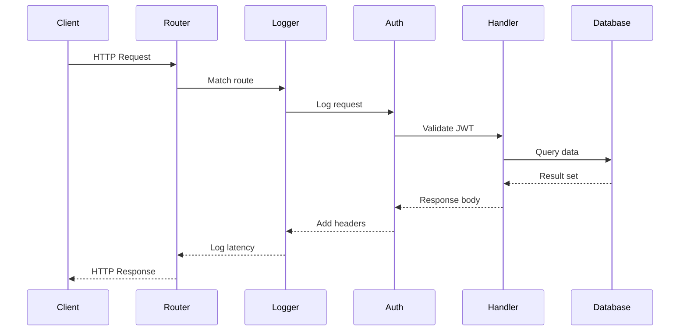

# 🚀 Building APIs with Gin and Fiber

## Introduction

Building robust HTTP APIs is the cornerstone of microservice architecture. In Go, developers are blessed with a powerful standard library, `net/http`, that provides everything needed to handle HTTP requests. However, as services grow in complexity, frameworks like Gin and Fiber emerge as force multipliers — offering routing, middleware chains, request binding, and validation with minimal overhead.

Understanding the anatomy of an HTTP request lifecycle in Go is essential before adopting any framework. From the moment a TCP connection is accepted to the final byte being flushed to the client, every stage offers opportunities for optimization, security enforcement, and observability. This module explores both the conceptual foundations and practical implementation of high-performance APIs using Gin and Fiber.

By mastering these frameworks, you will be able to build APIs that scale horizontally, handle thousands of concurrent connections, and integrate seamlessly with the broader microservice ecosystem. The concepts learned here directly feed into [[02 - Middleware, Auth, and JWT|authentication middleware]] and [[03 - Database Integration (SQL, NoSQL)|database-backed endpoints]] in subsequent modules.

## 1. HTTP Routing and Middleware Chains

HTTP routing is the process of mapping incoming request URLs and methods to specific handler functions. In microservices, routing decisions often include version negotiation (e.g., `/v1/users` vs `/v2/users`), path parameter extraction, and query string parsing.

Middleware functions act as interceptors in the request/response lifecycle. They form a chain where each middleware can:
- Inspect or modify the incoming request
- Short-circuit the chain (e.g., authentication failure)
- Inspect or modify the outgoing response
- Execute cleanup logic after the handler returns

The order of middleware execution is critical. A typical chain looks like: Logger → Recovery → CORS → Auth → RateLimiter → Handler. Reversing Auth and RateLimiter could allow unauthenticated requests to consume rate limit quota, or worse, expose sensitive endpoints.

⚠️ **Warning:** Middleware ordering is not commutative. Always place recovery middleware at the top of the chain to catch panics in subsequent layers, including other middleware.

💡 **Tip:** Use middleware groups in Gin or Fiber to apply common middleware only to specific route subsets, avoiding unnecessary overhead on public endpoints like health checks.

Real case: **Twitch** uses Fiber for their real-time chat APIs. Fiber's zero-allocation HTTP parser and low-latency routing engine allow Twitch to handle millions of concurrent WebSocket connections with minimal GC pressure. By keeping the per-request allocation count near zero, they maintain predictable p99 latency during live streaming events.

## 2. Framework Comparison

Choosing the right framework depends on your performance requirements, team familiarity, and ecosystem needs.

| Feature | Gin | Fiber | Echo | Standard Library |
|---------|-----|-------|------|------------------|
| Performance | High | Very High (fasthttp) | High | Moderate |
| Memory Allocations | Low | Near Zero | Low | Baseline |
| Routing | Radix tree | Radix tree | Radix tree | ServeMux (Go 1.22+) |
| Middleware Chaining | Native | Native | Native | Manual wrapping |
| Request Binding | JSON/XML/Query/Form | JSON/XML/Query/Form | JSON/XML/Query/Form | Manual unmarshaling |
| Validation | Built-in (validator.v8) | External | Built-in | External |
| WebSocket Support | External (gorilla/websocket) | Built-in | External | External |
| Static File Serving | Built-in | Built-in | Built-in | `http.FileServer` |
| Learning Curve | Low | Very Low | Low | Moderate |
| Community Size | Very Large | Large | Large | N/A (built-in) |

Gin offers the most mature ecosystem and extensive documentation, making it ideal for teams new to Go. Fiber, built on top of `fasthttp`, prioritizes raw throughput and minimal latency — a critical factor for real-time systems. Echo sits comfortably between the two, while the standard library remains the choice for minimal dependencies and maximum control.

## 3. Request/Response Lifecycle

Understanding how a request flows through a Go HTTP server reveals optimization opportunities and debugging strategies.




The diagram above illustrates a typical request passing through routing, logging, authentication, business logic, and database layers before returning to the client. Each arrow represents a function call in the middleware chain.


In microservices, this lifecycle is replicated across dozens of services. The cumulative latency of middleware chains becomes a primary optimization target.

## 4. Building a REST API with Gin

Below is a complete CRUD API for a product catalog service using Gin. It demonstrates routing, middleware, request binding, validation, and route groups.

```go
package main

import (
	"net/http"
	"strconv"
	"time"

	"github.com/gin-gonic/gin"
	"github.com/go-playground/validator/v10"
)

type Product struct {
	ID          uint      `json:"id"`
	Name        string    `json:"name" validate:"required,min=2,max=100"`
	Description string    `json:"description"`
	Price       float64   `json:"price" validate:"required,gt=0"`
	CreatedAt   time.Time `json:"created_at"`
}

var products = []Product{
	{ID: 1, Name: "Go in Action", Price: 39.99, CreatedAt: time.Now()},
}
var nextID uint = 2

func main() {
	r := gin.New()
	r.Use(gin.Logger())
	r.Use(gin.Recovery())
	r.Use(corsMiddleware())

	api := r.Group("/api/v1")
	{
		api.GET("/products", listProducts)
		api.GET("/products/:id", getProduct)
		api.POST("/products", createProduct)
		api.PUT("/products/:id", updateProduct)
		api.DELETE("/products/:id", deleteProduct)
	}

	r.Static("/static", "./static")
	r.Run(":8080")
}

func listProducts(c *gin.Context) {
	c.JSON(http.StatusOK, products)
}

func getProduct(c *gin.Context) {
	id, err := strconv.Atoi(c.Param("id"))
	if err != nil {
		c.JSON(http.StatusBadRequest, gin.H{"error": "invalid id"})
		return
	}
	for _, p := range products {
		if p.ID == uint(id) {
			c.JSON(http.StatusOK, p)
			return
		}
	}
	c.JSON(http.StatusNotFound, gin.H{"error": "product not found"})
}

func createProduct(c *gin.Context) {
	var req Product
	if err := c.ShouldBindJSON(&req); err != nil {
		c.JSON(http.StatusBadRequest, gin.H{"error": err.Error()})
		return
	}
	validate := validator.New()
	if err := validate.Struct(req); err != nil {
		c.JSON(http.StatusBadRequest, gin.H{"error": err.Error()})
		return
	}
	req.ID = nextID
	nextID++
	req.CreatedAt = time.Now()
	products = append(products, req)
	c.JSON(http.StatusCreated, req)
}

func updateProduct(c *gin.Context) {
	id, err := strconv.Atoi(c.Param("id"))
	if err != nil {
		c.JSON(http.StatusBadRequest, gin.H{"error": "invalid id"})
		return
	}
	var req Product
	if err := c.ShouldBindJSON(&req); err != nil {
		c.JSON(http.StatusBadRequest, gin.H{"error": err.Error()})
		return
	}
	for i, p := range products {
		if p.ID == uint(id) {
			products[i].Name = req.Name
			products[i].Description = req.Description
			products[i].Price = req.Price
			c.JSON(http.StatusOK, products[i])
			return
		}
	}
	c.JSON(http.StatusNotFound, gin.H{"error": "product not found"})
}

func deleteProduct(c *gin.Context) {
	id, err := strconv.Atoi(c.Param("id"))
	if err != nil {
		c.JSON(http.StatusBadRequest, gin.H{"error": "invalid id"})
		return
	}
	for i, p := range products {
		if p.ID == uint(id) {
			products = append(products[:i], products[i+1:]...)
			c.JSON(http.StatusNoContent, nil)
			return
		}
	}
	c.JSON(http.StatusNotFound, gin.H{"error": "product not found"})
}

func corsMiddleware() gin.HandlerFunc {
	return func(c *gin.Context) {
		c.Writer.Header().Set("Access-Control-Allow-Origin", "*")
		c.Writer.Header().Set("Access-Control-Allow-Methods", "GET, POST, PUT, DELETE, OPTIONS")
		if c.Request.Method == "OPTIONS" {
			c.AbortWithStatus(204)
			return
		}
		c.Next()
	}
}
```

## 5. Fiber for High-Performance APIs

Fiber provides an Express.js-inspired API while leveraging `fasthttp` for extreme performance. Its zero-allocation parser and optimized JSON encoder make it ideal for high-throughput services.

```go
package main

import (
	"log"

	"github.com/gofiber/fiber/v2"
	"github.com/gofiber/fiber/v2/middleware/logger"
	"github.com/gofiber/fiber/v2/middleware/recover"
)

func main() {
	app := fiber.New(fiber.Config{
		Prefork:               true,
		DisableStartupMessage: false,
	})

	app.Use(recover.New())
	app.Use(logger.New())

	app.Get("/api/v1/health", func(c *fiber.Ctx) error {
		return c.JSON(fiber.Map{"status": "ok"})
	})

	// WebSocket endpoint for real-time updates
	app.Get("/ws", func(c *fiber.Ctx) error {
		// WebSocket upgrade logic
		return c.SendString("WebSocket endpoint")
	})

	log.Fatal(app.Listen(":3000"))
}
```

The formula for API throughput is:

$$Throughput = \frac{Requests}{Second}$$

To maximize throughput, minimize allocations per request, reuse buffers, and enable connection keep-alive. Fiber's `Prefork` option spawns multiple OS processes to utilize all CPU cores, effectively increasing throughput by parallelizing request handling across cores.

---

## 📦 Compression Code

Complete Go script that benchmarks Gin vs Fiber for a simple JSON endpoint and reports throughput.

```go
package main

import (
	"fmt"
	"net/http"
	"sync"
	"time"

	"github.com/gin-gonic/gin"
	"github.com/gofiber/fiber/v2"
)

func main() {
	gin.SetMode(gin.ReleaseMode)
	g := gin.New()
	g.GET("/bench", func(c *gin.Context) {
		c.JSON(200, gin.H{"message": "hello"})
	})
	go g.Run(":8081")

	app := fiber.New()
	app.Get("/bench", func(c *fiber.Ctx) error {
		return c.JSON(fiber.Map{"message": "hello"})
	})
	go app.Listen(":3001")

	time.Sleep(500 * time.Millisecond)

	fmt.Println("Benchmarking Gin (8081) vs Fiber (3001)...")
	benchmark("http://localhost:8081/bench", "Gin")
	benchmark("http://localhost:3001/bench", "Fiber")

	select {}
}

func benchmark(url, name string) {
	var wg sync.WaitGroup
	start := time.Now()
	requests := 10000

	for i := 0; i < requests; i++ {
		wg.Add(1)
		go func() {
			defer wg.Done()
			resp, err := http.Get(url)
			if err == nil {
				resp.Body.Close()
			}
		}()
	}
	wg.Wait()
	elapsed := time.Since(start).Seconds()
	fmt.Printf("%s: %d requests in %.3fs = %.0f req/sec\n", name, requests, elapsed, float64(requests)/elapsed)
}
```

## 🎯 Documented Project

### Description

**GoShop API Gateway** — A RESTful API gateway for an e-commerce microservices platform, built with Gin. It routes client requests to downstream services (user service, product service, order service) and handles cross-cutting concerns like logging, CORS, and request validation.

### Functional Requirements
1. Expose CRUD endpoints for products, users, and orders under versioned paths (`/api/v1/...`).
2. Validate all incoming request payloads using struct tags and return 400 Bad Request for invalid data.
3. Implement centralized error handling and recovery middleware to prevent server crashes.
4. Serve static assets (product images) efficiently using built-in static file middleware.
5. Log every request with method, path, status code, and latency for observability.

### Main Components
- **Router**: Gin engine with grouped routes for each microservice domain.
- **Middleware Stack**: Logger, Recovery, CORS, and custom authentication (preparation for Module 02).
- **Handlers**: Controller functions binding JSON to structs and returning standardized responses.
- **Static Server**: `gin.Static` for serving uploaded product images.
- **Validator**: `go-playground/validator` for declarative input validation.

### Success Metrics
- API p99 latency under 50ms for cached responses.
- Zero unhandled panics in production due to recovery middleware.
- 100% request coverage by structured access logs.
- Static file serving throughput of at least 500 MB/s.
- Successful validation of 99.9% of incoming payloads without manual checks.

### References
- [Gin Web Framework](https://gin-gonic.com/)
- [Fiber Documentation](https://docs.gofiber.io/)
- [fasthttp GitHub](https://github.com/valyala/fasthttp)
- [Go net/http ServeMux (Go 1.22+)](https://go.dev/doc/go1.22#enhanced_routing_patterns)
- [Twitch Engineering Blog](https://blog.twitch.tv/)
