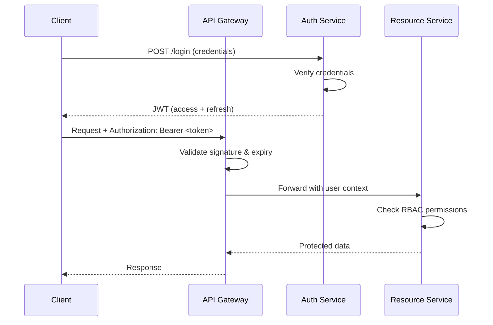

# 🔐 Middleware, Auth, and JWT

## Introduction

In distributed systems, security cannot be an afterthought. Every microservice boundary is a potential attack vector, and the communication between services must be authenticated, authorized, and audited. Middleware in Go provides the perfect abstraction for enforcing these cross-cutting security concerns without polluting business logic.

Authentication answers the question "Who are you?" while authorization determines "What are you allowed to do?". In microservices, the stateless nature of HTTP conflicts with traditional session-based authentication, leading to the widespread adoption of JSON Web Tokens (JWT). This module dissects the middleware pattern, explores authentication strategies, and implements production-grade JWT validation in Go.

The patterns established here integrate deeply with [[01 - Building APIs with Gin and Fiber|API routing frameworks]] and set the foundation for [[03 - Database Integration (SQL, NoSQL)|persisting user sessions]] in persistent storage.

## 1. Middleware Pattern and Execution Order

Middleware in Go is implemented as functions that wrap `http.Handler` (or framework-specific handlers). The wrapping creates a onion-like execution model where each layer can modify the request before it reaches the handler and the response after the handler returns.

The execution order follows the chain construction. If middleware A wraps middleware B, which wraps handler H, the call order is: A (pre) → B (pre) → H → B (post) → A (post). This LIFO pattern is powerful for resource management — opening a database transaction in pre-handlers and committing or rolling back in post-handlers.

⚠️ **Warning:** Never perform heavy I/O operations (like database queries) inside middleware that runs on every request unless absolutely necessary. Use caching or lazy loading to minimize latency impact on protected routes.

💡 **Tip:** In Gin, use `c.Abort()` to stop middleware chain execution immediately. In Fiber, call `c.Next()` explicitly only when you need post-handler logic; otherwise return early to short-circuit.

Real case: **Auth0** uses Go extensively in their identity platform. Their authentication middleware handles millions of token validations per second across globally distributed edge nodes. By keeping JWT verification logic stateless and using ECDSA signatures with pre-cached public keys, they achieve sub-millisecond validation latency without centralized session stores.

## 2. Authentication and Authorization Strategies

Modern microservices employ diverse strategies depending on trust boundaries and client types.

| Strategy | State | Transport | Best For | Complexity |
|----------|-------|-----------|----------|------------|
| Session-Based (Cookies) | Stateful | Cookie + Server Store | Monoliths, browsers | Low |
| JWT (Signed Tokens) | Stateless | Authorization Header | Microservices, SPAs | Medium |
| OAuth2 (Authorization Code) | Stateful | Redirect + Token | Third-party integrations | High |
| OpenID Connect | Stateful | JWT ID Tokens | Federated identity | High |
| mTLS (Mutual TLS) | Stateless | TLS Certificates | Service-to-service | Medium |
| API Keys | Stateless | Header/Query | Internal services, bots | Low |

Session-based authentication stores user state server-side, making revocation instant but requiring sticky sessions or shared session stores. JWT pushes state to the client, enabling horizontal scaling but complicating token revocation. OAuth2 and OpenID Connect delegate authentication to identity providers, reducing credential exposure but introducing network dependencies.

## 3. JWT Architecture and Auth Flow

JSON Web Tokens consist of three parts: Header (algorithm), Payload (claims), and Signature. The signature ensures integrity, while claims carry identity and authorization metadata.




The diagram above shows the standard OAuth2 implicit flow adapted for microservices. The API Gateway terminates TLS, validates the JWT signature using a shared secret or public key, and forwards the extracted claims to downstream services via request headers or gRPC metadata.

## 4. JWT Middleware Implementation

Below is a production-ready JWT middleware for Gin that validates HS256 signatures, checks expiration, and extracts custom claims.

```go
package main

import (
	"fmt"
	"net/http"
	"strings"
	"time"

	"github.com/gin-gonic/gin"
	"github.com/golang-jwt/jwt/v5"
)

var jwtSecret = []byte("super-secret-key-change-in-production")

type CustomClaims struct {
	UserID uint   `json:"user_id"`
	Role   string `json:"role"`
	jwt.RegisteredClaims
}

func JWTMiddleware() gin.HandlerFunc {
	return func(c *gin.Context) {
		authHeader := c.GetHeader("Authorization")
		if authHeader == "" {
			c.AbortWithStatusJSON(http.StatusUnauthorized, gin.H{"error": "missing authorization header"})
			return
		}

		parts := strings.SplitN(authHeader, " ", 2)
		if len(parts) != 2 || strings.ToLower(parts[0]) != "bearer" {
			c.AbortWithStatusJSON(http.StatusUnauthorized, gin.H{"error": "invalid authorization header format"})
			return
		}

		tokenStr := parts[1]
		token, err := jwt.ParseWithClaims(tokenStr, &CustomClaims{}, func(token *jwt.Token) (interface{}, error) {
			if _, ok := token.Method.(*jwt.SigningMethodHMAC); !ok {
				return nil, fmt.Errorf("unexpected signing method: %v", token.Header["alg"])
			}
			return jwtSecret, nil
		})

		if err != nil || !token.Valid {
			c.AbortWithStatusJSON(http.StatusUnauthorized, gin.H{"error": "invalid or expired token"})
			return
		}

		claims, ok := token.Claims.(*CustomClaims)
		if !ok {
			c.AbortWithStatusJSON(http.StatusUnauthorized, gin.H{"error": "invalid token claims"})
			return
		}

		c.Set("userID", claims.UserID)
		c.Set("role", claims.Role)
		c.Next()
	}
}

func RBACMiddleware(allowedRoles ...string) gin.HandlerFunc {
	return func(c *gin.Context) {
		role, exists := c.Get("role")
		if !exists {
			c.AbortWithStatusJSON(http.StatusForbidden, gin.H{"error": "role not found in context"})
			return
		}

		userRole, ok := role.(string)
		if !ok {
			c.AbortWithStatusJSON(http.StatusForbidden, gin.H{"error": "invalid role type"})
			return
		}

		for _, r := range allowedRoles {
			if r == userRole {
				c.Next()
				return
			}
		}

		c.AbortWithStatusJSON(http.StatusForbidden, gin.H{"error": "insufficient permissions"})
	}
}

func GenerateToken(userID uint, role string) (string, error) {
	claims := CustomClaims{
		UserID: userID,
		Role:   role,
		RegisteredClaims: jwt.RegisteredClaims{
			ExpiresAt: jwt.NewNumericDate(time.Now().Add(24 * time.Hour)),
			IssuedAt:  jwt.NewNumericDate(time.Now()),
			Issuer:    "goshop-auth",
		},
	}

	token := jwt.NewWithClaims(jwt.SigningMethodHS256, claims)
	return token.SignedString(jwtSecret)
}

func main() {
	r := gin.Default()

	r.POST("/login", func(c *gin.Context) {
		// In production, verify against database
		token, err := GenerateToken(1, "admin")
		if err != nil {
			c.JSON(http.StatusInternalServerError, gin.H{"error": err.Error()})
			return
		}
		c.JSON(http.StatusOK, gin.H{"token": token})
	})

	authorized := r.Group("/api")
	authorized.Use(JWTMiddleware())
	{
		authorized.GET("/profile", func(c *gin.Context) {
			userID, _ := c.Get("userID")
			role, _ := c.Get("role")
			c.JSON(http.StatusOK, gin.H{"user_id": userID, "role": role})
		})

		admin := authorized.Group("/admin")
		admin.Use(RBACMiddleware("admin"))
		admin.GET("/dashboard", func(c *gin.Context) {
			c.JSON(http.StatusOK, gin.H{"message": "admin dashboard"})
		})
	}

	r.Run(":8080")
}
```

The formula for token validity is:

$$Token\ Expiry = issued\_at + TTL$$

Where TTL (Time To Live) should be short for access tokens (15 minutes) and longer for refresh tokens (7-30 days). Never store sensitive data in JWT payloads unless encrypted with JWE, as the payload is merely Base64Url-encoded and readable by anyone.

---

## 📦 Compression Code

Complete Go script demonstrating middleware chaining, JWT generation, and validation without external web frameworks.

```go
package main

import (
	"context"
	"fmt"
	"net/http"
	"strings"
	"time"

	"github.com/golang-jwt/jwt/v5"
)

var secret = []byte("demo-secret")

type Middleware func(http.Handler) http.Handler

func Chain(mw ...Middleware) Middleware {
	return func(final http.Handler) http.Handler {
		for i := len(mw) - 1; i >= 0; i-- {
			final = mw[i](final)
		}
		return final
	}
}

func LoggerMiddleware(next http.Handler) http.Handler {
	return http.HandlerFunc(func(w http.ResponseWriter, r *http.Request) {
		start := time.Now()
		next.ServeHTTP(w, r)
		fmt.Printf("[%s] %s %s\n", time.Since(start), r.Method, r.URL.Path)
	})
}

func JWTAuthMiddleware(next http.Handler) http.Handler {
	return http.HandlerFunc(func(w http.ResponseWriter, r *http.Request) {
		header := r.Header.Get("Authorization")
		if header == "" {
			http.Error(w, "unauthorized", http.StatusUnauthorized)
			return
		}
		parts := strings.SplitN(header, " ", 2)
		if len(parts) != 2 || parts[0] != "Bearer" {
			http.Error(w, "invalid header", http.StatusUnauthorized)
			return
		}
		token, err := jwt.Parse(parts[1], func(t *jwt.Token) (interface{}, error) {
			return secret, nil
		})
		if err != nil || !token.Valid {
			http.Error(w, "invalid token", http.StatusUnauthorized)
			return
		}
		if claims, ok := token.Claims.(jwt.MapClaims); ok {
			ctx := context.WithValue(r.Context(), "user", claims["sub"])
			next.ServeHTTP(w, r.WithContext(ctx))
		} else {
			next.ServeHTTP(w, r)
		}
	})
}

func main() {
	handler := http.HandlerFunc(func(w http.ResponseWriter, r *http.Request) {
		user := r.Context().Value("user")
		fmt.Fprintf(w, "Hello, %v!", user)
	})

	stack := Chain(LoggerMiddleware, JWTAuthMiddleware)
	http.Handle("/protected", stack(handler))

	http.HandleFunc("/token", func(w http.ResponseWriter, r *http.Request) {
		t := jwt.NewWithClaims(jwt.SigningMethodHS256, jwt.MapClaims{
			"sub": "alice",
			"exp": time.Now().Add(time.Hour).Unix(),
		})
		s, _ := t.SignedString(secret)
		fmt.Fprint(w, s)
	})

	fmt.Println("Server on :8080")
	http.ListenAndServe(":8080", nil)
}
```

## 🎯 Documented Project

### Description

**GoShop Auth Service** — A centralized authentication and authorization microservice for the GoShop platform. It issues signed JWTs upon credential verification, validates tokens on every protected request, and enforces role-based access control (RBAC) across the service mesh.

### Functional Requirements
1. Authenticate users via username/password and return short-lived access tokens plus refresh tokens.
2. Validate JWT signatures and claims on every incoming request to protected API endpoints.
3. Enforce RBAC with at least three roles: `customer`, `vendor`, and `admin`.
4. Support token refresh flow to obtain new access tokens without re-entering credentials.
5. Log all authentication attempts (success and failure) for security auditing.

### Main Components
- **Auth Handler**: Gin handlers for `/login`, `/refresh`, and `/logout` endpoints.
- **JWT Middleware**: Reusable middleware extracting and validating Bearer tokens.
- **RBAC Middleware**: Permission checker using claims-derived roles.
- **Token Service**: Utility for generating, parsing, and refreshing JWTs with configurable TTL.
- **Audit Logger**: Structured logging of all auth events to stdout (preparing for Module 06 integration).

### Success Metrics
- Token validation latency p99 under 5ms.
- Zero successful authentication bypasses due to middleware bugs.
- 100% coverage of protected endpoints by JWT and RBAC middleware.
- Support for 10,000 concurrent token validations per instance.
- Complete audit trail with user ID, timestamp, IP, and outcome.

### References
- [RFC 7519 - JSON Web Token (JWT)](https://tools.ietf.org/html/rfc7519)
- [OAuth 2.0 Authorization Framework](https://oauth.net/2/)
- [OpenID Connect Core 1.0](https://openid.net/specs/openid-connect-core-1_0.html)
- [Auth0 Architecture](https://auth0.com/blog/)
- [golang-jwt/jwt](https://github.com/golang-jwt/jwt)
