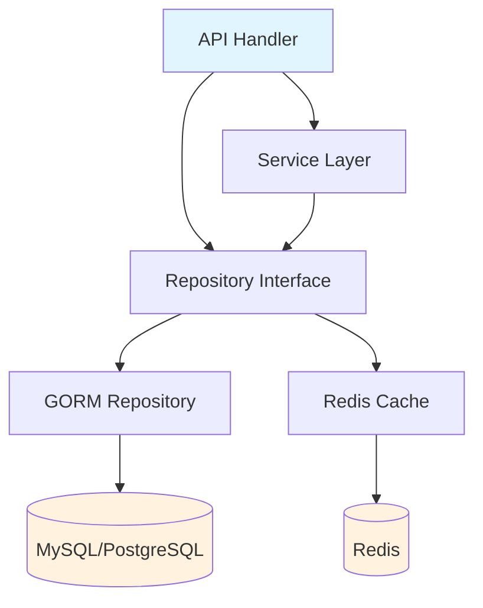

# 💾 Database Integration (SQL, NoSQL)

## Introduction

Data persistence is the backbone of any non-trivial microservice. Go's `database/sql` package provides a robust foundation for SQL interactions, but the ecosystem offers powerful abstractions ranging from full ORMs to lightweight query builders and NoSQL drivers. Understanding the trade-offs between these tools is essential for building services that are both performant and maintainable.

Connection management becomes critical at scale. Opening a new database connection for every request is a recipe for latency spikes and resource exhaustion. Connection pooling, query optimization, and caching strategies separate production-grade services from prototypes. This module explores the full spectrum of database integration in Go, from raw SQL to document stores and in-memory caches.

The repository patterns established here provide the data layer for [[01 - Building APIs with Gin and Fiber|API handlers]] and are secured by [[02 - Middleware, Auth, and JWT|authentication middleware]]. Proper database design also simplifies [[04 - Testing Microservices in Go|testing strategies]] through interface-based repositories.

## 1. Connection Pooling and database/sql

Go's `database/sql` manages a pool of connections automatically. When a query is executed, the package attempts to reuse an idle connection; if none is available and the pool hasn't reached its limit, it opens a new one. Understanding these mechanics prevents connection leaks and starvation.

Key pool settings:
- **MaxOpenConns**: Hard limit on total connections. Excess requests wait or timeout.
- **MaxIdleConns**: Connections kept alive for reuse. Too low causes frequent reconnects; too high wastes memory.
- **ConnMaxLifetime**: Maximum time a connection may be reused. Critical for databases behind load balancers or with credential rotation.

⚠️ **Warning:** Setting `MaxOpenConns` too high can overwhelm your database server. Always benchmark against your specific DB instance size and network latency.

💡 **Tip:** Set `ConnMaxLifetime` slightly below your database's idle connection timeout or load balancer TCP timeout to prevent stale connection errors.

Real case: **Shopify** processes millions of merchant transactions daily using Go services backed by MySQL and Redis. Their platform engineers emphasize proper connection pool tuning as a primary lever for latency reduction. By sizing pools according to the formula below and using Redis as a hot cache for session data, they reduced MySQL query load by 60% during flash sales.

## 2. ORM vs Query Builder vs Raw SQL

| Library | Type | Learning Curve | Performance | Best For |
|---------|------|----------------|-------------|----------|
| database/sql | Raw SQL | Low | Baseline | Simple queries, maximum control |
| sqlx | Query Builder | Low | High | Named queries, struct scanning |
| GORM | Full ORM | Medium | Moderate | Rapid development, migrations |
| Bun | ORM | Medium | High | PostgreSQL-specific features |
| Ent | Code-gen ORM | Medium | High | Complex graph relationships |
| mongo-driver | Document DB | Low | High | Schema flexibility, JSON data |
| go-redis | Key-Value | Low | Very High | Caching, sessions, rate limiting |

GORM excels when developer velocity matters more than raw query performance. sqlx provides a sweet spot for teams that want struct mapping without the magic of an ORM. For high-throughput caching and session storage, Redis via `go-redis` is the industry standard.

## 3. Database Layer Architecture

In microservices, each service owns its data. The database layer is typically abstracted behind a repository interface, enabling testing with mocks and swapping implementations.




The cache-aside pattern shown above checks Redis before hitting the primary database. On cache misses, the repository queries SQL, populates Redis, and returns the result. Write operations invalidate the cache to prevent stale data.

## 4. Repository Pattern with GORM and Redis

Below is a complete implementation of the repository pattern using GORM for MySQL and go-redis for caching.

```go
package main

import (
	"context"
	"encoding/json"
	"fmt"
	"time"

	"github.com/redis/go-redis/v9"
	"gorm.io/driver/mysql"
	"gorm.io/gorm"
	"gorm.io/gorm/logger"
)

type Product struct {
	ID    uint    `json:"id" gorm:"primaryKey"`
	Name  string  `json:"name" gorm:"size:255;not null"`
	Price float64 `json:"price" gorm:"type:decimal(10,2)"`
}

type ProductRepository interface {
	GetByID(ctx context.Context, id uint) (*Product, error)
	Create(ctx context.Context, p *Product) error
	Update(ctx context.Context, p *Product) error
	Delete(ctx context.Context, id uint) error
}

type cachedProductRepo struct {
	db    *gorm.DB
	redis *redis.Client
	ttl   time.Duration
}

func NewCachedProductRepo(db *gorm.DB, rdb *redis.Client) ProductRepository {
	return &cachedProductRepo{
		db:    db,
		redis: rdb,
		ttl:   5 * time.Minute,
	}
}

func (r *cachedProductRepo) GetByID(ctx context.Context, id uint) (*Product, error) {
	cacheKey := fmt.Sprintf("product:%d", id)

	cached, err := r.redis.Get(ctx, cacheKey).Result()
	if err == nil {
		var p Product
		if err := json.Unmarshal([]byte(cached), &p); err == nil {
			return &p, nil
		}
	}

	var product Product
	if err := r.db.WithContext(ctx).First(&product, id).Error; err != nil {
		return nil, err
	}

	data, _ := json.Marshal(product)
	r.redis.Set(ctx, cacheKey, data, r.ttl)

	return &product, nil
}

func (r *cachedProductRepo) Create(ctx context.Context, p *Product) error {
	if err := r.db.WithContext(ctx).Create(p).Error; err != nil {
		return err
	}
	r.invalidateCache(ctx, p.ID)
	return nil
}

func (r *cachedProductRepo) Update(ctx context.Context, p *Product) error {
	if err := r.db.WithContext(ctx).Save(p).Error; err != nil {
		return err
	}
	r.invalidateCache(ctx, p.ID)
	return nil
}

func (r *cachedProductRepo) Delete(ctx context.Context, id uint) error {
	if err := r.db.WithContext(ctx).Delete(&Product{}, id).Error; err != nil {
		return err
	}
	r.invalidateCache(ctx, id)
	return nil
}

func (r *cachedProductRepo) invalidateCache(ctx context.Context, id uint) {
	r.redis.Del(ctx, fmt.Sprintf("product:%d", id))
}

func main() {
	dsn := "user:password@tcp(127.0.0.1:3306)/goshop?charset=utf8mb4&parseTime=True&loc=Local"
	db, err := gorm.Open(mysql.Open(dsn), &gorm.Config{
		Logger: logger.Default.LogMode(logger.Silent),
	})
	if err != nil {
		panic(err)
	}
	db.AutoMigrate(&Product{})

	rdb := redis.NewClient(&redis.Options{
		Addr: "localhost:6379",
	})

	repo := NewCachedProductRepo(db, rdb)
	ctx := context.Background()

	repo.Create(ctx, &Product{Name: "Go in Action", Price: 39.99})
	product, _ := repo.GetByID(ctx, 1)
	fmt.Printf("Product: %+v\n", product)
}
```

The optimal connection pool size for PostgreSQL (and similar databases) is given by:

$$Pool\ Size = (CPU\_cores \times 2) + effective\_spindle\_count$$

Where `effective_spindle_count` is the number of disk drives in a RAID array or the number of independent I/O channels in an SSD setup. For cloud-managed databases, start with `(vCPU × 2) + 1` and adjust based on monitoring.

---

## 📦 Compression Code

Complete Go script benchmarking direct SQL vs cached reads.

```go
package main

import (
	"context"
	"encoding/json"
	"fmt"
	"time"

	"github.com/redis/go-redis/v9"
	"gorm.io/driver/sqlite"
	"gorm.io/gorm"
)

type Item struct {
	ID   uint
	Name string
}

func main() {
	db, _ := gorm.Open(sqlite.Open("file::memory:?cache=shared"), &gorm.Config{})
	db.AutoMigrate(&Item{})
	db.Create(&Item{Name: "Test"})

	rdb := redis.NewClient(&redis.Options{Addr: "localhost:6379"})
	repo := &cachedProductRepo{db: db, redis: rdb, ttl: time.Minute}

	ctx := context.Background()

	start := time.Now()
	for i := 0; i < 1000; i++ {
		repo.GetByID(ctx, 1)
	}
	fmt.Println("1000 cached reads:", time.Since(start))
}

type cachedProductRepo struct {
	db    *gorm.DB
	redis *redis.Client
	ttl   time.Duration
}

func (r *cachedProductRepo) GetByID(ctx context.Context, id uint) (*Item, error) {
	key := fmt.Sprintf("item:%d", id)
	if val, err := r.redis.Get(ctx, key).Result(); err == nil {
		var it Item
		json.Unmarshal([]byte(val), &it)
		return &it, nil
	}
	var it Item
	r.db.First(&it, id)
	b, _ := json.Marshal(it)
	r.redis.Set(ctx, key, b, r.ttl)
	return &it, nil
}
```

## 🎯 Documented Project

### Description

**GoShop Product Catalog Service** — A microservice managing product inventory, categories, and pricing. It uses GORM for relational data persistence in MySQL and Redis for caching frequently accessed product details to reduce database load during traffic spikes.

### Functional Requirements
1. Store product records with fields: SKU, name, description, price, stock quantity, and category ID.
2. Cache product lookups by ID in Redis with a 5-minute TTL and explicit invalidation on updates.
3. Support paginated listing of products with filtering by category and price range.
4. Ensure ACID compliance for inventory decrement operations during order placement.
5. Provide health check endpoint verifying both MySQL and Redis connectivity.

### Main Components
- **Product Model**: GORM struct with tags for MySQL schema generation.
- **Repository Interface**: `ProductRepository` enabling mock-based unit tests.
- **Cached Repository**: Decorator implementing cache-aside pattern with go-redis.
- **Database Connection**: GORM with configured connection pool limits.
- **Redis Client**: go-redis connection for caching and distributed locking.

### Success Metrics
- Database query reduction of 70% for read-heavy product pages via caching.
- p99 read latency under 10ms for cached products.
- Zero cache staleness incidents due to write-through invalidation.
- Connection pool utilization under 80% during peak load.
- Successful handling of 5,000 product read requests per second.

### References
- [GORM Documentation](https://gorm.io/)
- [go-redis](https://github.com/redis/go-redis)
- [sqlx GitHub](https://github.com/jmoiron/sqlx)
- [Shopify Engineering Blog](https://shopify.engineering/)
- [PostgreSQL Connection Pooling](https://www.postgresql.org/docs/current/connect-estab.html)
