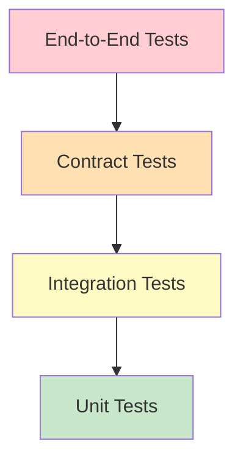

# 🧪 Testing Microservices in Go

## Introduction

Testing in microservice architectures presents unique challenges. Unlike monoliths where all code runs in a single process, microservices communicate over networks, depend on external data stores, and evolve independently. A bug in one service can cascade through the system, making comprehensive testing not just a quality measure but a resilience requirement.

Go's built-in testing framework is intentionally minimal, encouraging clarity and composability. Combined with tools like `testify`, `mockery`, and `testcontainers-go`, Go developers can construct a multi-layered testing strategy that covers individual functions, service integrations, and cross-service contracts. This module explores each layer of the testing pyramid with practical Go implementations.

The testing strategies here validate the HTTP handlers from [[01 - Building APIs with Gin and Fiber|API modules]], secure the middleware in [[02 - Middleware, Auth, and JWT|auth layers]], and verify data consistency in [[03 - Database Integration (SQL, NoSQL)|database repositories]].

## 1. Unit Testing with Table-Driven Tests and Mocks

Table-driven tests are idiomatic in Go. They allow a single test function to exercise multiple scenarios by iterating over a slice of anonymous structs containing inputs and expected outputs. This pattern reduces code duplication and makes adding new test cases trivial.

Mocking isolates the unit under test by replacing dependencies with controlled implementations. In Go, this is achieved through interfaces. Tools like `mockery` auto-generate mocks from interfaces, while `testify/mock` provides a manual but flexible alternative.

⚠️ **Warning:** Over-mocking leads to tests that pass while the real system fails. Always include integration tests for critical paths that touch databases, HTTP clients, or message queues.

💡 **Tip:** Use `t.Parallel()` in table-driven tests to speed up execution. Ensure test cases don't share mutable state or use `t.Run` with closures carefully.

Real case: **Monzo**, a UK digital bank built on Go microservices, runs thousands of unit tests on every commit. Their engineering culture emphasizes fast feedback loops — unit tests must complete in under 30 seconds. They complement this with shadow traffic testing in production, where real requests are mirrored to canary deployments without affecting users.

## 2. Test Types and Tooling

| Test Type | Scope | Tools | Speed | Confidence |
|-----------|-------|-------|-------|------------|
| Unit | Function/Method | go test, testify, mockery | Very Fast | Low-Medium |
| Integration | Service + DB/Cache | testcontainers-go, docker-compose | Medium | Medium-High |
| Contract | Service ↔ Service | Pact, OpenAPI specs | Medium | High |
| E2E | Full System | Cypress, Go BDD frameworks | Slow | Very High |
| Load | Performance | k6, Vegeta, go-wrk | Slow | High |
| Chaos | Resilience | Gremlin, Chaos Monkey | Slow | High |

Unit tests provide rapid feedback during development. Integration tests catch database schema mismatches and connection issues. Contract tests ensure that service A's expectations of service B's API remain valid across versions. The combination creates a safety net that allows confident refactoring and deployment.

## 3. Testing Pyramid for Go Microservices




The testing pyramid dictates that you should have many fast, cheap unit tests at the base, fewer integration tests in the middle, and even fewer expensive end-to-end tests at the apex. In microservices, contract testing occupies a critical middle ground — it is faster than E2E but validates real API compatibility.

For Go specifically, the lower layers are well-served by the standard library, while the upper layers benefit from Docker-based orchestration via `testcontainers-go`.

## 4. Table-Driven Tests and Mock Example

Below is a complete example of a table-driven unit test with a mock repository, demonstrating testing of a service layer independent of its database dependency.

```go
package service

import (
	"context"
	"errors"
	"testing"

	"github.com/stretchr/testify/assert"
	"github.com/stretchr/testify/mock"
)

type MockProductRepository struct {
	mock.Mock
}

func (m *MockProductRepository) GetByID(ctx context.Context, id uint) (*Product, error) {
	args := m.Called(ctx, id)
	if args.Get(0) == nil {
		return nil, args.Error(1)
	}
	return args.Get(0).(*Product), args.Error(1)
}

func (m *MockProductRepository) Create(ctx context.Context, p *Product) error {
	args := m.Called(ctx, p)
	return args.Error(0)
}

func (m *MockProductRepository) Update(ctx context.Context, p *Product) error {
	args := m.Called(ctx, p)
	return args.Error(0)
}

func (m *MockProductRepository) Delete(ctx context.Context, id uint) error {
	args := m.Called(ctx, id)
	return args.Error(0)
}

type Product struct {
	ID    uint
	Name  string
	Price float64
}

type ProductService struct {
	repo ProductRepository
}

func NewProductService(repo ProductRepository) *ProductService {
	return &ProductService{repo: repo}
}

func (s *ProductService) GetProduct(ctx context.Context, id uint) (*Product, error) {
	return s.repo.GetByID(ctx, id)
}

func (s *ProductService) CreateProduct(ctx context.Context, name string, price float64) (*Product, error) {
	p := &Product{Name: name, Price: price}
	if err := s.repo.Create(ctx, p); err != nil {
		return nil, err
	}
	return p, nil
}

func TestProductService_GetProduct(t *testing.T) {
	tests := []struct {
		name      string
		id        uint
		mockSetup func(*MockProductRepository)
		want      *Product
		wantErr   bool
	}{
		{
			name: "existing product",
			id:   1,
			mockSetup: func(m *MockProductRepository) {
				m.On("GetByID", mock.Anything, uint(1)).Return(&Product{ID: 1, Name: "Book", Price: 10.0}, nil)
			},
			want:    &Product{ID: 1, Name: "Book", Price: 10.0},
			wantErr: false,
		},
		{
			name: "product not found",
			id:   99,
			mockSetup: func(m *MockProductRepository) {
				m.On("GetByID", mock.Anything, uint(99)).Return(nil, errors.New("not found"))
			},
			want:    nil,
			wantErr: true,
		},
		{
			name: "database error",
			id:   2,
			mockSetup: func(m *MockProductRepository) {
				m.On("GetByID", mock.Anything, uint(2)).Return(nil, errors.New("connection refused"))
			},
			want:    nil,
			wantErr: true,
		},
	}

	for _, tt := range tests {
		t.Run(tt.name, func(t *testing.T) {
			mockRepo := new(MockProductRepository)
			tt.mockSetup(mockRepo)

			svc := NewProductService(mockRepo)
			got, err := svc.GetProduct(context.Background(), tt.id)

			if tt.wantErr {
				assert.Error(t, err)
			} else {
				assert.NoError(t, err)
				assert.Equal(t, tt.want, got)
			}
			mockRepo.AssertExpectations(t)
		})
	}
}

func TestProductService_CreateProduct(t *testing.T) {
	mockRepo := new(MockProductRepository)
	mockRepo.On("Create", mock.Anything, mock.AnythingOfType("*service.Product")).Return(nil)

	svc := NewProductService(mockRepo)
	product, err := svc.CreateProduct(context.Background(), "New Book", 15.99)

	assert.NoError(t, err)
	assert.NotNil(t, product)
	assert.Equal(t, "New Book", product.Name)
	assert.Equal(t, 15.99, product.Price)
	mockRepo.AssertExpectations(t)
}
```

Code coverage is calculated as:

$$Coverage = \frac{Tested\ Lines}{Total\ Lines} \times 100$$

While aiming for 100% coverage is admirable, focus on covering critical paths, error handling, and edge cases rather than chasing a number. A service with 80% coverage of business logic is more valuable than one with 95% coverage including trivial getters and setters.

---

## 📦 Compression Code

Complete Go script running table-driven tests against an in-memory map repository.

```go
package main

import (
	"context"
	"errors"
	"fmt"
	"testing"
)

type User struct {
	ID   int
	Name string
}

type UserRepo interface {
	FindByID(ctx context.Context, id int) (*User, error)
}

type MemoryUserRepo struct {
	data map[int]*User
}

func (r *MemoryUserRepo) FindByID(ctx context.Context, id int) (*User, error) {
	if u, ok := r.data[id]; ok {
		return u, nil
	}
	return nil, errors.New("not found")
}

func TestMemoryUserRepo(t *testing.T) {
	repo := &MemoryUserRepo{data: map[int]*User{1: {ID: 1, Name: "Alice"}}}

	tests := []struct {
		name    string
		id      int
		want    *User
		wantErr bool
	}{
		{"find existing", 1, &User{ID: 1, Name: "Alice"}, false},
		{"find missing", 99, nil, true},
	}

	for _, tt := range tests {
		t.Run(tt.name, func(t *testing.T) {
			got, err := repo.FindByID(context.Background(), tt.id)
			if (err != nil) != tt.wantErr {
				t.Errorf("FindByID() error = %v, wantErr %v", err, tt.wantErr)
				return
			}
			if fmt.Sprintf("%v", got) != fmt.Sprintf("%v", tt.want) {
				t.Errorf("FindByID() = %v, want %v", got, tt.want)
			}
		})
	}
}

func main() {
	testing.Main(func(pat, str string) (bool, error) { return true, nil },
		[]testing.InternalTest{{Name: "TestMemoryUserRepo", F: TestMemoryUserRepo}},
		nil, nil)
}
```

## 🎯 Documented Project

### Description

**GoShop Order Service Test Suite** — A comprehensive testing strategy for the order processing microservice. It includes unit tests for pricing calculations and inventory validation, integration tests against a real MySQL instance via testcontainers-go, and contract tests verifying communication with the payment service using Pact.

### Functional Requirements
1. Unit test all pricing logic (subtotal, tax, discount, shipping) with 100% branch coverage.
2. Integration test order creation flow with MySQL and Redis running in Docker containers.
3. Contract test the API between Order Service and Payment Service to prevent breaking changes.
4. Mock the inventory repository in unit tests to isolate order logic from stock management.
5. Generate and publish coverage reports on every CI build.

### Main Components
- **Unit Test Package**: Table-driven tests for service layer using testify and mockery-generated mocks.
- **Integration Test Suite**: `testcontainers-go` spinning up MySQL and Redis for repository tests.
- **Contract Tests**: Pact consumer tests for Order Service and provider tests for Payment Service.
- **CI Pipeline**: GitHub Actions workflow running test matrix across Go 1.21 and 1.22.
- **Coverage Reporter**: `go test -coverprofile` integrated with Codecov or similar.

### Success Metrics
- Unit test execution time under 10 seconds for the entire service.
- Integration test suite completing in under 2 minutes including container startup.
- 100% contract test pass rate before any service deployment.
- Code coverage of at least 80% for business logic packages.
- Zero post-deployment bugs caught by E2E tests that should have been caught by unit tests.

### References
- [Go Testing Package](https://pkg.go.dev/testing)
- [testify](https://github.com/stretchr/testify)
- [mockery](https://github.com/vektra/mockery)
- [testcontainers-go](https://github.com/testcontainers/testcontainers-go)
- [Pact.io](https://pact.io/)
- [Monzo Engineering Blog](https://monzo.com/blog/)
