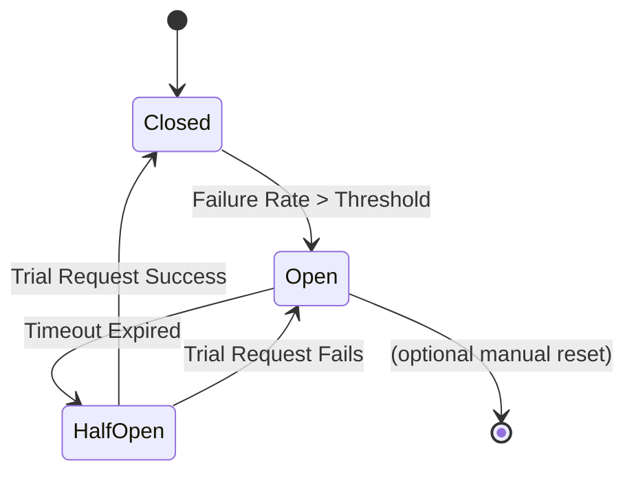

# ⏱️ Rate Limiting and Circuit Breakers

## Introduction

Microservices operate in an unpredictable network environment. Sudden traffic spikes, cascading failures, and misbehaving clients can transform a healthy system into a pile of cascading timeouts. Rate limiting and circuit breakers are the two primary resilience patterns that prevent overload and isolate faults before they spread.

Rate limiting controls inbound traffic by enforcing a maximum request rate per client or endpoint. Circuit breakers monitor outbound calls to dependencies and temporarily block requests when failure rates exceed thresholds, giving failing services time to recover. Together, they form a defensive perimeter around each microservice.

These patterns complement the API construction skills from [[01 - Building APIs with Gin and Fiber|routing modules]] and protect the data access layers in [[03 - Database Integration (SQL, NoSQL)|database integrations]]. They also reduce the need for excessive [[04 - Testing Microservices in Go|retry logic in tests]] by making failure modes explicit.

## 1. Rate Limiting Algorithms

Four primary algorithms dominate rate limiting implementations:

- **Token Bucket**: A bucket holds tokens. Each request consumes a token. Tokens refill at a constant rate. Bursts are allowed up to bucket capacity.
- **Leaky Bucket**: Requests enter a queue and exit at a fixed rate. Smooths traffic but can introduce latency under bursts.
- **Fixed Window**: Counts requests in time windows (e.g., per minute). Simple but vulnerable to stampede at window boundaries.
- **Sliding Window**: Tracks requests over a rolling time window. More accurate but requires more memory.

⚠️ **Warning:** Distributed rate limiting requires shared state (Redis, etcd). Local in-memory rate limiters work for single-instance deployments but fail when load balancers distribute traffic across replicas.

💡 **Tip:** Use token buckets for APIs that need to allow occasional bursts (e.g., checkout flows). Use leaky buckets for webhook processing where steady throughput matters more than latency.

Real case: **Stripe** processes billions of API requests annually. Their rate limiting infrastructure uses multi-tiered token buckets: per-account, per-IP, and per-endpoint limits. This prevents API abuse while allowing legitimate merchants to process spikes during flash sales. They publish `Retry-After` headers and return 429 status codes, enabling client-side exponential backoff.

## 2. Algorithm Comparison

| Algorithm | Burst Tolerance | Memory Usage | Accuracy | Implementation Complexity |
|-----------|-----------------|--------------|----------|---------------------------|
| Token Bucket | High | Low | Medium | Low |
| Leaky Bucket | None | Low | High | Medium |
| Fixed Window | Medium | Very Low | Low | Very Low |
| Sliding Window | Medium | High | Very High | High |
| Sliding Window Counter | Medium | Medium | High | Medium |

Token bucket remains the most popular choice for HTTP APIs due to its simplicity and burst-friendly behavior. Sliding window algorithms are preferred when strict per-second adherence is required, such as in financial trading APIs.

## 3. Circuit Breaker State Machine

A circuit breaker monitors failure rates and transitions between three states:




- **Closed**: Requests pass through normally. Failure rate is monitored.
- **Open**: Requests are immediately rejected (fast-fail). No load is sent to the failing dependency.
- **Half-Open**: After a cooldown period, a limited number of trial requests are allowed. Success closes the circuit; failure reopens it.

This pattern prevents thread pool exhaustion and cascading failures. When a database is struggling, the circuit breaker stops sending queries, allowing connection pools to recover.

## 4. Token Bucket and Circuit Breaker Middleware

Below is a Gin middleware implementing both patterns using `golang.org/x/time/rate` and `sony/gobreaker`.

```go
package main

import (
	"net/http"
	"sync"
	"time"

	"github.com/gin-gonic/gin"
	"github.com/sony/gobreaker"
	"golang.org/x/time/rate"
)

type ClientLimiter struct {
	limiter  *rate.Limiter
	lastSeen time.Time
}

var (
	clients = make(map[string]*ClientLimiter)
	mu      sync.RWMutex
)

func getLimiter(clientID string, r rate.Limit, b int) *rate.Limiter {
	mu.Lock()
	defer mu.Unlock()

	if limiter, exists := clients[clientID]; exists {
		limiter.lastSeen = time.Now()
		return limiter.limiter
	}

	limiter := rate.NewLimiter(r, b)
	clients[clientID] = &ClientLimiter{limiter: limiter, lastSeen: time.Now()}
	return limiter
}

func RateLimitMiddleware(r rate.Limit, b int) gin.HandlerFunc {
	return func(c *gin.Context) {
		clientID := c.ClientIP()
		limiter := getLimiter(clientID, r, b)

		if !limiter.Allow() {
			c.AbortWithStatusJSON(http.StatusTooManyRequests, gin.H{
				"error": "rate limit exceeded",
			})
			return
		}
		c.Next()
	}
}

var cb *gobreaker.CircuitBreaker

func init() {
	var settings gobreaker.Settings
	settings.MaxRequests = 3
	settings.Interval = 10 * time.Second
	settings.Timeout = 5 * time.Second
	settings.ReadyToTrip = func(counts gobreaker.Counts) bool {
		failureRatio := float64(counts.TotalFailures) / float64(counts.Requests)
		return counts.Requests >= 3 && failureRatio >= 0.6
	}

	cb = gobreaker.NewCircuitBreaker(settings)
}

func CircuitBreakerMiddleware() gin.HandlerFunc {
	return func(c *gin.Context) {
		_, err := cb.Execute(func() (interface{}, error) {
			c.Next()
			if c.IsAborted() && c.Writer.Status() >= 500 {
				return nil, http.ErrAbortHandler
			}
			return nil, nil
		})

		if err != nil {
			if err == gobreaker.ErrOpenState {
				c.AbortWithStatusJSON(http.StatusServiceUnavailable, gin.H{
					"error": "service temporarily unavailable",
				})
			}
		}
	}
}

func main() {
	go cleanupOldLimiters(1 * time.Minute)

	r := gin.Default()
	r.Use(RateLimitMiddleware(rate.Limit(10), 20)) // 10 req/sec, burst 20
	r.Use(CircuitBreakerMiddleware())

	r.GET("/api/data", func(c *gin.Context) {
		c.JSON(http.StatusOK, gin.H{"message": "success"})
	})

	r.Run(":8080")
}

func cleanupOldLimiters(interval time.Duration) {
	for {
		time.Sleep(interval)
		mu.Lock()
		for ip, client := range clients {
			if time.Since(client.lastSeen) > interval {
				delete(clients, ip)
			}
		}
		mu.Unlock()
	}
}
```

The token bucket allowance formula is:

$$Allowance = min(Bucket\_Capacity, Current\_Tokens + Fill\_Rate \times \Delta t)$$

Where `Δt` is the time elapsed since the last request. This formula ensures the bucket never exceeds its capacity while continuously replenishing tokens at the fill rate.

---

## 📦 Compression Code

Complete Go script benchmarking rate limiter overhead.

```go
package main

import (
	"fmt"
	"net/http"
	"net/http/httptest"
	"sync"
	"time"

	"github.com/gin-gonic/gin"
	"golang.org/x/time/rate"
)

func main() {
	gin.SetMode(gin.TestMode)
	r := gin.New()

	limiter := rate.NewLimiter(rate.Limit(1000), 2000)
	r.Use(func(c *gin.Context) {
		if !limiter.Allow() {
			c.AbortWithStatus(429)
			return
		}
		c.Next()
	})

	r.GET("/test", func(c *gin.Context) {
		c.String(200, "ok")
	})

	req, _ := http.NewRequest("GET", "/test", nil)

	start := time.Now()
	var wg sync.WaitGroup
	for i := 0; i < 10000; i++ {
		wg.Add(1)
		go func() {
			defer wg.Done()
			r.ServeHTTP(httptest.NewRecorder(), req)
		}()
	}
	wg.Wait()
	fmt.Printf("10k requests in %v\n", time.Since(start))
}
```

## 🎯 Documented Project

### Description

**GoShop API Gateway Resilience Layer** — A middleware stack for the GoShop API Gateway implementing per-client rate limiting and circuit breakers for all downstream service calls. It prevents abuse, protects inventory services during high-traffic events, and isolates failing payment providers.

### Functional Requirements
1. Enforce per-IP rate limits of 100 requests/minute on public endpoints and 1000/minute on authenticated endpoints.
2. Implement per-user rate limits for checkout endpoints to prevent botting and inventory hoarding.
3. Circuit-break calls to the Payment Service when error rate exceeds 50% over 30 seconds.
4. Return standardized 429 (Too Many Requests) and 503 (Service Unavailable) responses with JSON error bodies.
5. Expose metrics for rate limit hits and circuit breaker state transitions via a `/metrics` endpoint.

### Main Components
- **Rate Limiter Middleware**: Token bucket per client IP and per authenticated user using `golang.org/x/time/rate`.
- **Circuit Breaker Middleware**: `sony/gobreaker` wrapping all proxy calls to downstream services.
- **Cleanup Routine**: Background goroutine evicting inactive client limiters to prevent memory leaks.
- **Metrics Handler**: Prometheus-compatible exposition of limiter and breaker statistics.
- **Config Loader**: Dynamic reload of rate limits and breaker thresholds from environment variables.

### Success Metrics
- 99.9% of legitimate traffic served without rate limit interference.
- Circuit breaker activation within 5 seconds of dependency failure.
- Zero cascading failures from Payment Service outages during peak load.
- Memory usage stable under 100MB for 1 million tracked client limiters.
- p99 latency overhead of resilience middleware under 1ms.

### References
- [golang.org/x/time/rate](https://pkg.go.dev/golang.org/x/time/rate)
- [sony/gobreaker](https://github.com/sony/gobreaker)
- [Stripe Rate Limits](https://stripe.com/docs/rate-limits)
- [Circuit Breaker Pattern (Martin Fowler)](https://martinfowler.com/bliki/CircuitBreaker.html)
- [Redis Cell Rate Limiter](https://github.com/brandur/redis-cell)
