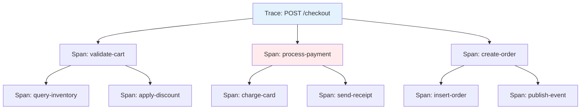

# 🔍 Distributed Tracing and Logging

## Introduction

In a monolith, debugging is straightforward: tail a single log file and trace execution through one codebase. In microservices, a single user request may traverse dozens of services, databases, message queues, and third-party APIs. Without observability, diagnosing a 500ms latency spike becomes a forensic nightmare.

Structured logging and distributed tracing are the twin pillars of modern observability. Logs provide human-readable context about discrete events, while traces reconstruct the end-to-end journey of a request across service boundaries. Go's ecosystem offers world-class tools for both, from Uber's blazing-fast zap logger to the OpenTelemetry standard for vendor-neutral tracing.

This module builds upon the API foundations from [[01 - Building APIs with Gin and Fiber|API construction]], secures the audit trails started in [[02 - Middleware, Auth, and JWT|auth middleware]], and complements the resilience patterns in [[05 - Rate Limiting and Circuit Breakers|circuit breakers]] by making failures visible.

## 1. Structured Logging and Context Propagation

Unstructured logs ("User logged in") are difficult to query at scale. Structured logs ("{\"event\":\"login\",\"user_id\":42,\"duration_ms\":15}") enable precise filtering, aggregation, and alerting. In Go, this means emitting JSON objects with consistent field names across all services.

Context propagation ensures that trace IDs, request IDs, and user IDs flow through every goroutine and service call. Go's `context.Context` is the vehicle for this propagation. When a request enters your API gateway, generate a trace ID, stuff it into the context, and pass that context to every downstream function, database query, and HTTP client call.

⚠️ **Warning:** Never log sensitive data such as passwords, tokens, or PII at INFO level. Use DEBUG level with sampling, or better, exclude sensitive fields entirely from logs to comply with GDPR and SOC2.

💡 **Tip:** Use `slog` from Go 1.21+ if you want a standard library solution with structured output. For maximum performance in high-throughput services, prefer `zap` or `zerolog`.

Real case: **Datadog** writes their tracing agent in Go. It collects traces and metrics from thousands of hosts, processes them with sub-millisecond latency, and forwards them to Datadog's backend. Their agent uses a custom high-performance ring buffer for log aggregation and OpenTelemetry-compatible trace serialization, demonstrating Go's strength in systems programming and observability infrastructure.

## 2. Logging Libraries Comparison

| Library | Stdlib? | Performance | Allocations | Features | Best For |
|---------|---------|-------------|-------------|----------|----------|
| log | Yes | Baseline | High | Minimal | Scripts, prototypes |
| slog (1.21+) | Yes | Good | Medium | Structured, levels, groups | Standard library adherence |
| zap | No | Very High | Very Low | Structured, sampling, hooks | High-throughput services |
| zerolog | No | Very High | Very Low | Chain API, contextual logs | JSON-first APIs |
| logrus | No | Moderate | High | Hooks, formatters | Ecosystem compatibility |

`slog` bridges the gap between the standard library and high-performance structured logging. `zap` remains the performance champion, using reflection-free encoders and object pools. `zerolog` offers an elegant chain API that minimizes boilerplate.

## 3. Trace Span Hierarchy

A trace is a directed acyclic graph of spans. Each span represents a named unit of work with a start time, duration, and optional tags/events.




In this checkout trace, the root span spans the entire request. Child spans represent service calls, database queries, and message queue publications. Parallel spans (like validate-cart and process-payment) execute concurrently, and their combined duration plus network overhead determines total latency.

## 4. Zap Logger and OpenTelemetry Spans

Below is a complete example integrating `zap` for logging and `opentelemetry-go` for tracing in a Gin handler.

```go
package main

import (
	"context"
	"fmt"
	"log"
	"net/http"
	"time"

	"github.com/gin-gonic/gin"
	"go.opentelemetry.io/otel"
	"go.opentelemetry.io/otel/attribute"
	"go.opentelemetry.io/otel/exporters/stdout/stdouttrace"
	"go.opentelemetry.io/otel/sdk/resource"
	sdktrace "go.opentelemetry.io/otel/sdk/trace"
	semconv "go.opentelemetry.io/otel/semconv/v1.24.0"
	"go.opentelemetry.io/otel/trace"
	"go.uber.org/zap"
	"go.uber.org/zap/zapcore"
)

var tracer trace.Tracer
var logger *zap.Logger

func initTracer() func() {
	exporter, err := stdouttrace.New(stdouttrace.WithPrettyPrint())
	if err != nil {
		log.Fatal(err)
	}

	tp := sdktrace.NewTracerProvider(
		sdktrace.WithBatcher(exporter),
		sdktrace.WithResource(resource.NewWithAttributes(
			semconv.SchemaURL,
			semconv.ServiceName("goshop-api"),
		)),
	)
	otel.SetTracerProvider(tp)
	tracer = tp.Tracer("goshop-api")

	return func() {
		ctx, cancel := context.WithTimeout(context.Background(), 5*time.Second)
		defer cancel()
		if err := tp.Shutdown(ctx); err != nil {
			log.Printf("Error shutting down tracer provider: %v", err)
		}
	}
}

func initLogger() {
	config := zap.NewProductionConfig()
	config.EncoderConfig.TimeKey = "timestamp"
	config.EncoderConfig.EncodeTime = zapcore.ISO8601TimeEncoder
	var err error
	logger, err = config.Build()
	if err != nil {
		log.Fatal(err)
	}
}

func TraceMiddleware() gin.HandlerFunc {
	return func(c *gin.Context) {
		ctx, span := tracer.Start(c.Request.Context(), fmt.Sprintf("%s %s", c.Request.Method, c.Request.URL.Path))
		defer span.End()

		span.SetAttributes(
			attribute.String("http.method", c.Request.Method),
			attribute.String("http.path", c.Request.URL.Path),
			attribute.String("http.client_ip", c.ClientIP()),
		)

		c.Request = c.Request.WithContext(ctx)
		c.Next()

		span.SetAttributes(attribute.Int("http.status_code", c.Writer.Status()))
	}
}

func LoggingMiddleware() gin.HandlerFunc {
	return func(c *gin.Context) {
		start := time.Now()
		c.Next()

		logger.Info("incoming request",
			zap.String("method", c.Request.Method),
			zap.String("path", c.Request.URL.Path),
			zap.Int("status", c.Writer.Status()),
			zap.Duration("duration", time.Since(start)),
			zap.String("trace_id", getTraceID(c.Request.Context())),
		)
	}
}

func getTraceID(ctx context.Context) string {
	span := trace.SpanFromContext(ctx)
	if span.SpanContext().HasTraceID() {
		return span.SpanContext().TraceID().String()
	}
	return "none"
}

func main() {
	initLogger()
	cleanup := initTracer()
	defer cleanup()

	r := gin.Default()
	r.Use(LoggingMiddleware())
	r.Use(TraceMiddleware())

	r.GET("/api/order/:id", func(c *gin.Context) {
		ctx := c.Request.Context()
		orderID := c.Param("id")

		_, dbSpan := tracer.Start(ctx, "db.query-order")
		time.Sleep(10 * time.Millisecond) // Simulate DB call
		dbSpan.SetAttributes(attribute.String("db.statement", "SELECT * FROM orders WHERE id = ?"))
		dbSpan.End()

		_, cacheSpan := tracer.Start(ctx, "cache.get-user")
		time.Sleep(2 * time.Millisecond) // Simulate cache hit
		cacheSpan.SetAttributes(attribute.String("cache.key", fmt.Sprintf("user:%s", orderID)))
		cacheSpan.End()

		logger.Info("order fetched", zap.String("order_id", orderID), zap.String("trace_id", getTraceID(ctx)))
		c.JSON(http.StatusOK, gin.H{"order_id": orderID})
	})

	r.Run(":8080")
}
```

The total duration of a trace is:

$$Trace\_Duration = \sum(span\_durations) + network\_overhead$$

Network overhead includes DNS resolution, TCP handshake, TLS negotiation, and serialization latency between services. In practice, trace duration often exceeds the sum of span durations because child spans may execute sequentially while the parent waits, and network delays are not always captured as explicit spans.

---

## 📦 Compression Code

Complete Go script demonstrating structured logging with correlation IDs.

```go
package main

import (
	"context"
	"fmt"
	"math/rand"
	"sync"
	"time"

	"go.uber.org/zap"
)

func main() {
	logger, _ := zap.NewProduction()
	defer logger.Sync()

	ctx := context.WithValue(context.Background(), "request_id", fmt.Sprintf("req-%d", rand.Int()))

	var wg sync.WaitGroup
	for i := 0; i < 3; i++ {
		wg.Add(1)
		go worker(ctx, logger, i, &wg)
	}
	wg.Wait()
}

func worker(ctx context.Context, logger *zap.Logger, id int, wg *sync.WaitGroup) {
	defer wg.Done()
	reqID := ctx.Value("request_id").(string)
	logger.Info("worker started",
		zap.String("request_id", reqID),
		zap.Int("worker_id", id),
	)
	time.Sleep(time.Duration(rand.Intn(100)) * time.Millisecond)
	logger.Info("worker finished",
		zap.String("request_id", reqID),
		zap.Int("worker_id", id),
	)
}
```

## 🎯 Documented Project

### Description

**GoShop Observability Platform** — A unified logging and tracing infrastructure for the GoShop microservices ecosystem. Every service emits JSON-structured logs via zap and exports OpenTelemetry traces to Jaeger. Correlation IDs tie logs and traces together, enabling engineers to diagnose issues from a single trace ID.

### Functional Requirements
1. Emit structured JSON logs from all services with fields: timestamp, level, service, message, trace_id, and span_id.
2. Instrument all HTTP handlers and database queries with OpenTelemetry spans.
3. Propagate trace context across service boundaries using W3C Trace Context headers.
4. Collect and visualize traces in Jaeger with dependency graphs between services.
5. Alert on error log rate spikes and p99 latency degradation via log-based metrics.

### Main Components
- **Zap Logger**: Per-service configured logger with consistent field schema and sampling.
- **OpenTelemetry SDK**: TracerProvider with Jaeger OTLP exporter and batch span processor.
- **Gin Middleware**: `TraceMiddleware` and `LoggingMiddleware` applied to all routes.
- **Context Propagator**: W3C traceparent header injection/extraction in HTTP client transports.
- **Jaeger Deployment**: All-in-one Jaeger container for local development and production backend.

### Success Metrics
- 100% of incoming HTTP requests associated with a trace ID.
- Log query response time under 2 seconds for 24-hour windows.
- p99 trace ingestion latency under 5 seconds from span creation to Jaeger visibility.
- Zero log events lost during normal operation (use async zap core with buffer).
- Correlation of any production error to a full distributed trace within 30 seconds.

### References
- [OpenTelemetry Go](https://github.com/open-telemetry/opentelemetry-go)
- [uber-go/zap](https://github.com/uber-go/zap)
- [rs/zerolog](https://github.com/rs/zerolog)
- [Go slog](https://pkg.go.dev/log/slog)
- [Jaeger Tracing](https://www.jaegertracing.io/)
- [Datadog Agent (Go)](https://github.com/DataDog/datadog-agent)
