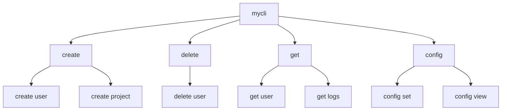
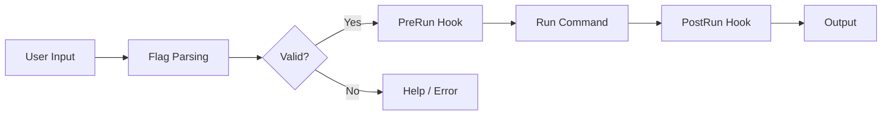

# ⌨️ Building CLIs with Cobra

## Introduction

Command-line interfaces (CLIs) are the backbone of developer tooling, automation scripts, and cloud-native utilities. In the Go ecosystem, CLI design is not merely about parsing flags — it is about creating intuitive command hierarchies, discoverable help systems, and composable subcommands that scale from simple scripts to complex platforms like [[02 - Go Engineering/04 - DevSecOps and CLI Tools/00 - Welcome|Kubernetes]] and Docker.

This module explores CLI design patterns and the Cobra framework, the de facto standard for building professional CLIs in Go. You will learn how commands, flags, arguments, and configuration sources interact to produce user-friendly tools. Understanding these patterns is essential before moving into [[02 - Security Scanning and Hardening|security automation]] and [[03 - CI-CD Pipelines for Go Projects|CI/CD tooling]].

## 1. CLI Design Patterns

A well-designed CLI follows consistent patterns that make behavior predictable:

- **Commands** represent actions (e.g., `kubectl get`, `docker build`)
- **Flags** modify command behavior (`--verbose`, `--namespace=default`)
- **Arguments** are positional inputs (e.g., the image name in `docker run nginx`)
- **Subcommands** group related functionality under a parent command

These elements combine to create a command hierarchy. The complexity of a CLI can be estimated as:

```
CLI Complexity = Commands × Flags × Config_Sources
```

As this number grows, the need for structured help generation, configuration management, and validation increases exponentially.

⚠️ **Warning:** Avoid creating deep subcommand hierarchies beyond three levels. Usability studies show that developers struggle to remember paths like `tool service config set --key=x`.

💡 **Tip:** Use `kubectl` as your mental model. Its pattern of `kubectl <action> <resource> <name>` is one of the most studied CLI designs in production systems.

**Real case: Kubernetes (kubectl)** — The Kubernetes project uses Cobra to manage over 50 top-level commands and hundreds of subcommands. Every command follows the same pattern: verb + resource + optional flags. This consistency allows operators to guess commands they have never used before. Docker CLI uses a similar architecture, with Cobra handling command routing, flag parsing, and help generation across all platforms.

## 2. The Cobra Framework

Cobra provides a powerful foundation for CLI development in Go:

| Feature | Description | Example |
|---|---|---|
| Commands | Define actions as structs with Run/RunE methods | `cobra.Command{Use: "get"}` |
| Persistent Flags | Available to a command and all descendants | `--config` on root command |
| Local Flags | Only available to the specific command | `--output` on `get` only |
| Pre/Post Run Hooks | Execute logic before/after the main handler | Validate auth before run |
| Help Generation | Auto-generated flags and usage text | `cmd --help` |
| Bash/Zsh Completion | Shell completion scripts | `kubectl completion bash` |

### Comparison of Go CLI Frameworks

| Framework | Maturity | Subcommands | Config Integration | Best For |
|---|---|---|---|---|
| Cobra | Very High | Native | Viper | Large, hierarchical CLIs |
| urfave/cli | High | Supported | Manual | Simple to medium CLIs |
| flaggy | Medium | Supported | Manual | Ultra-lightweight tools |

Cobra wins when you need deep subcommand trees and automatic help generation. urfave/cli is excellent for single-level commands. flaggy has zero dependencies and compiles extremely fast.

## 3. Visualizing CLI Architecture

### Command Hierarchy



### CLI Data Flow




## 4. Building a Complete Cobra CLI

### Project Structure

```
mycli/
├── cmd/
│   ├── root.go
│   ├── create.go
│   └── delete.go
├── main.go
└── go.mod
```

### main.go

```go
package main

import "mycli/cmd"

func main() {
    cmd.Execute()
}
```

### cmd/root.go

```go
package cmd

import (
    "fmt"
    "os"

    "github.com/spf13/cobra"
    "github.com/spf13/viper"
)

var cfgFile string

var rootCmd = &cobra.Command{
    Use:   "mycli",
    Short: "A brief description of your application",
    Long: `A longer description that spans multiple lines
and likely contains examples and usage of using your application.`,
    Run: func(cmd *cobra.Command, args []string) {
        fmt.Println("Welcome to mycli!")
    },
}

func Execute() {
    if err := rootCmd.Execute(); err != nil {
        fmt.Println(err)
        os.Exit(1)
    }
}

func init() {
    cobra.OnInitialize(initConfig)

    rootCmd.PersistentFlags().StringVar(&cfgFile, "config", "", "config file")
    rootCmd.PersistentFlags().StringP("verbose", "v", "false", "verbose output")
    viper.BindPFlag("verbose", rootCmd.PersistentFlags().Lookup("verbose"))
}

func initConfig() {
    if cfgFile != "" {
        viper.SetConfigFile(cfgFile)
    } else {
        viper.AddConfigPath(".")
        viper.SetConfigName(".mycli")
    }

    viper.AutomaticEnv()
    _ = viper.ReadInConfig()
}
```

### cmd/create.go

```go
package cmd

import (
    "fmt"

    "github.com/spf13/cobra"
)

var createName string

var createCmd = &cobra.Command{
    Use:   "create [resource]",
    Short: "Create a resource",
    Args:  cobra.MinimumNArgs(1),
    RunE: func(cmd *cobra.Command, args []string) error {
        resource := args[0]
        fmt.Printf("Creating %s with name=%s\n", resource, createName)
        return nil
    },
}

func init() {
    rootCmd.AddCommand(createCmd)
    createCmd.Flags().StringVarP(&createName, "name", "n", "", "Name of the resource")
    _ = createCmd.MarkFlagRequired("name")
}
```

### cmd/delete.go

```go
package cmd

import (
    "fmt"

    "github.com/spf13/cobra"
)

var deleteCmd = &cobra.Command{
    Use:   "delete [resource] [name]",
    Short: "Delete a resource",
    Args:  cobra.ExactArgs(2),
    PreRunE: func(cmd *cobra.Command, args []string) error {
        fmt.Println("⚠️  Warning: This action is irreversible.")
        return nil
    },
    RunE: func(cmd *cobra.Command, args []string) error {
        fmt.Printf("Deleting %s/%s\n", args[0], args[1])
        return nil
    },
}

func init() {
    rootCmd.AddCommand(deleteCmd)
}
```

## 5. Viper for Configuration Management

Viper integrates seamlessly with Cobra to support environment variables, config files, and flags:

```go
viper.SetDefault("log_level", "info")
viper.SetEnvPrefix("MYCLI")
viper.AutomaticEnv()

level := viper.GetString("log_level")
```

The precedence order is: explicit flag > environment variable > config file > default value.

---

## 📦 Compression Code

```go
package main

import (
    "archive/tar"
    "compress/gzip"
    "fmt"
    "io"
    "os"
    "path/filepath"
)

func compressDir(source, target string) error {
    out, err := os.Create(target)
    if err != nil {
        return err
    }
    defer out.Close()

    gw := gzip.NewWriter(out)
    defer gw.Close()

    tw := tar.NewWriter(gw)
    defer tw.Close()

    return filepath.Walk(source, func(file string, fi os.FileInfo, err error) error {
        if err != nil {
            return err
        }

        header, err := tar.FileInfoHeader(fi, file)
        if err != nil {
            return err
        }

        header.Name = filepath.ToSlash(file)
        if err := tw.WriteHeader(header); err != nil {
            return err
        }

        if !fi.IsDir() {
            f, err := os.Open(file)
            if err != nil {
                return err
            }
            defer f.Close()
            _, err = io.Copy(tw, f)
            return err
        }
        return nil
    })
}

func main() {
    if err := compressDir("./myproject", "./myproject.tar.gz"); err != nil {
        fmt.Println("Compression failed:", err)
    } else {
        fmt.Println("Compressed successfully.")
    }
}
```

## 🎯 Documented Project

### Description

Build `gitops-cli`, a command-line tool for managing GitOps-style deployments. The tool supports creating deployment manifests, validating Kubernetes YAML, and syncing cluster state through subcommands.

### Functional Requirements

1. Implement `gitops-cli create deployment --image= --replicas=<n>` to generate valid Kubernetes Deployment YAML.
2. Implement `gitops-cli validate <file>` to check YAML syntax and required fields using a PreRun hook.
3. Implement `gitops-cli sync --context=<ctx>` to output a simulated sync command for the given Kubernetes context.
4. Support a persistent `--config` flag to load default values from a YAML file using Viper.
5. Auto-generate shell completion scripts via `gitops-cli completion bash`.

### Main Components

- `cmd/root.go` — Root command with persistent flags and Viper initialization
- `cmd/create.go` — Subcommand for manifest generation with local flags
- `cmd/validate.go` — Subcommand with PreRun validation hook
- `cmd/sync.go` — Subcommand with argument parsing for context selection
- `pkg/manifest/` — Library for Kubernetes YAML construction

### Success Metrics

- All commands produce `--help` text automatically without manual maintenance
- Flags work consistently across subcommands via persistent flag inheritance
- Configuration file overrides default values, and environment variables override files
- CLI passes `cobra.Command` validation for required args and flags
- Completion script works in Bash and Zsh without errors

### References

- [Cobra GitHub Repository](https://github.com/spf13/cobra)
- [Viper GitHub Repository](https://github.com/spf13/viper)
- [Kubernetes kubectl Command Reference](https://kubernetes.io/docs/reference/kubectl/)
- [CLI Guidelines by Axiom](https://clig.dev/)
