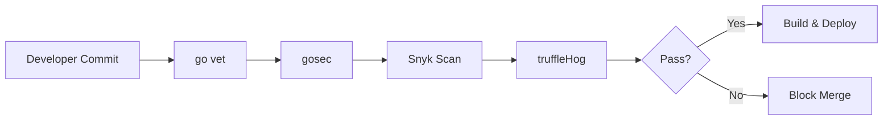

# 🔒 Security Scanning and Hardening

## Introduction

Security in software engineering is no longer a final gate before release — it is a continuous practice embedded in every commit, build, and deployment. For Go applications, this means combining static analysis, dependency auditing, secret detection, and secure coding patterns into a unified workflow. This module explores how to harden Go codebases from the inside out.

The practices covered here directly support [[03 - CI-CD Pipelines for Go Projects|CI/CD integration]] and [[05 - Container Security with Go|container hardening]]. Without scanning and hardening, even a well-architected Go binary can leak secrets, ship vulnerable dependencies, or expose unsafe system calls. Understanding these layers allows you to quantify and reduce risk systematically.

## 1. Static Application Security Testing (SAST)

SAST analyzes source code without executing it, identifying patterns that lead to vulnerabilities:

- **gosec** — Inspects Go source for security problems by scanning the AST. Detects hardcoded credentials, SQL injection risks, unsafe pointer usage, and weak cryptography.
- **semgrep** — A lightweight static analysis engine with a growing rule repository for Go. It supports custom rules written in YAML and can enforce organizational security policies.
- **go vet** — The built-in Go analyzer catches common mistakes that often overlap with security issues, such as incorrect format strings or unreachable code.

⚠️ **Warning:** SAST tools produce false positives. A flagged `G204` (command injection) might be a legitimate use of `exec.Command` with validated input. Always review findings manually before suppressing rules.

💡 **Tip:** Run `gosec` with `-fmt sarif` to generate reports compatible with GitHub Advanced Security and other SARIF consumers.

**Real case: Cloudflare** — Cloudflare hardens its Go services by running `gosec` in every pull request and blocking merges on high-severity findings. They maintain a custom suppression file for intentional unsafe operations in low-level networking code, but require two security team approvals for any suppression. This balance prevents alert fatigue while maintaining strict boundaries.

## 2. Dependency and Secret Scanning

Modern Go projects rely on dozens of indirect dependencies. Each one is a potential attack vector.

| Scanning Type | Tool | Detects | Integration Point |
|---|---|---|---|
| Dependency Vulnerabilities | Snyk | Known CVEs in go.mod | PR checks, CI |
| Dependency Vulnerabilities | Dependabot | GitHub advisory DB matches | Automated PRs |
| Dependency Vulnerabilities | OWASP dependency-check | CVEs across ecosystems | CI pipeline |
| Secret Leaks | git-secrets | AWS keys, passwords in commits | Pre-commit hooks |
| Secret Leaks | truffleHog | High-entropy strings, regex patterns | CI, historical scans |
| Secret Leaks | GitHub Secret Scanning | Partner token patterns | Repository level |

Dependency scanners parse `go.mod` and `go.sum` to identify modules with known CVEs. Secret scanners inspect commit history and working directories for credentials that should never be stored in version control.

## 3. Security Scanning Pipeline



### Security Tools Mapped to Vulnerability Types

| Vulnerability | SAST (gosec) | Dependency Scan | Secret Scan | Mitigation |
|---|---|---|---|---|
| Hardcoded credentials | G101 | — | truffleHog | Environment variables, vaults |
| SQL Injection | G201/G202 | — | — | Parameterized queries |
| Weak cryptography | G401/G501 | — | — | Use `crypto/argon2`, `x/crypto` |
| Known CVE in dependency | — | Snyk/Dependabot | — | `go get -u`, replace module |
| Leaked API token | — | — | git-secrets | Rotate keys, use pre-commit hooks |
| Unsafe deserialization | G104/G110 | — | — | Validate input schemas |

## 4. Secure Coding Patterns in Go

### gosec Configuration File (.gosec.json)

```json
{
  "G101": {
    "confidence": "low",
    "severity": "high"
  },
  "G104": {
    "confidence": "medium",
    "severity": "medium"
  },
  "global": {
    "nosec": "false",
    "audit": "true"
  }
}
```

### Secure Go Patterns

```go
package secure

import (
    "crypto/rand"
    "database/sql"
    "encoding/hex"
    "fmt"
)

// GenerateSecureToken creates a cryptographically secure random token.
func GenerateSecureToken(length int) (string, error) {
    b := make([]byte, length)
    if _, err := rand.Read(b); err != nil {
        return "", err
    }
    return hex.EncodeToString(b), nil
}

// SafeQuery uses parameterized queries to prevent SQL injection.
func SafeQuery(db *sql.DB, userID string) (*sql.Rows, error) {
    return db.Query("SELECT name FROM users WHERE id = ?", userID)
}

// Avoid: cmd := exec.Command("sh", "-c", userInput)
// Prefer: validate against allowlist, or use dedicated libraries
```

Risk in security engineering is often quantified as:

```
Risk = Threat × Vulnerability × Impact
```

By reducing any factor — through scanning (vulnerability reduction), hardening (impact reduction), or architecture changes (threat reduction) — you decrease overall risk.

## 5. Integrating Scans into Development Workflow

### Makefile Targets

```makefile
.PHONY: vet sec deps lint

vet:
	go vet ./...

sec:
	gosec -fmt sarif -out gosec.sarif ./...

deps:
	snyk test --file=go.mod

lint:
	golangci-lint run
```

Running these targets before every push ensures that security feedback is immediate and local, reducing the cost of fixing issues compared to discovering them in CI.

---

## 📦 Compression Code

```go
package main

import (
    "bufio"
    "fmt"
    "os"
    "strings"
)

// ScanFileForSecrets reads a file and reports lines matching common secret patterns.
func ScanFileForSecrets(path string) ([]string, error) {
    f, err := os.Open(path)
    if err != nil {
        return nil, err
    }
    defer f.Close()

    var findings []string
    scanner := bufio.NewScanner(f)
    lineNum := 1
    for scanner.Scan() {
        line := strings.ToLower(scanner.Text())
        if strings.Contains(line, "password=") ||
            strings.Contains(line, "api_key=") ||
            strings.Contains(line, "secret=") {
            findings = append(findings, fmt.Sprintf("%s:%d: potential secret", path, lineNum))
        }
        lineNum++
    }
    return findings, scanner.Err()
}

func main() {
    findings, err := ScanFileForSecrets("main.go")
    if err != nil {
        fmt.Println("Error:", err)
        return
    }
    for _, f := range findings {
        fmt.Println(f)
    }
}
```

## 🎯 Documented Project

### Description

Build `go-sentry`, a Go CLI tool that scans a project directory for security issues. It runs `gosec`-style pattern checks, detects high-entropy strings that may be secrets, and produces a JSON report of all findings.

### Functional Requirements

1. Recursively scan `.go` files for dangerous patterns (`exec.Command` with variables, hardcoded credentials, weak crypto imports).
2. Detect potential secrets using entropy calculation on long alphanumeric strings.
3. Output findings as SARIF-compatible JSON for CI ingestion.
4. Support a `--severity` filter to show only high/medium/low issues.
5. Return a non-zero exit code if any high-severity finding is present.

### Main Components

- `cmd/scan.go` — CLI entry point using Cobra with `--path` and `--severity` flags
- `pkg/sast/` — Pattern matching engine for Go AST nodes
- `pkg/secrets/` — Entropy-based secret detector
- `pkg/report/` — SARIF JSON report generator

### Success Metrics

- Detects at least 80% of intentionally planted vulnerable patterns in test files
- Entropy scanner flags strings above 4.5 Shannon entropy
- CI pipeline fails on high-severity findings without manual intervention
- Report is accepted by GitHub Advanced Security SARIF upload

### References

- [gosec GitHub Repository](https://github.com/securego/gosec)
- [OWASP Top 10 for 2021](https://owasp.org/Top10/)
- [SARIF Specification](https://sarifweb.azurewebsites.net/)
- [Cloudflare Blog: Go Security](https://blog.cloudflare.com/tag/go/)
- [semgrep Rules for Go](https://semgrep.dev/explore?language=go)
