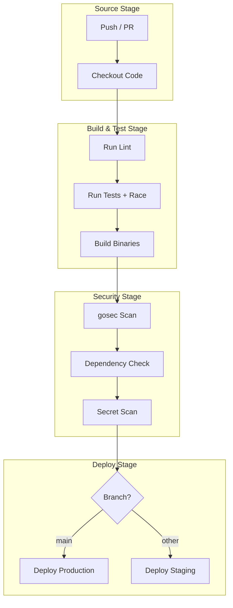
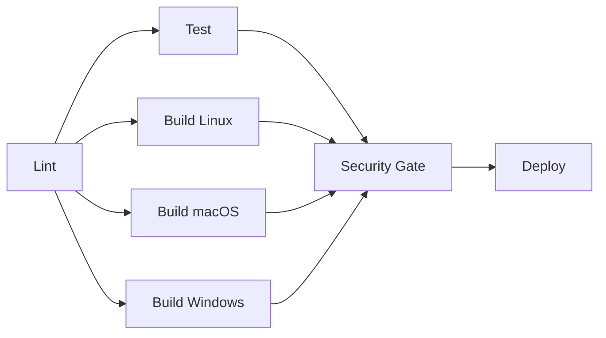

# 🔄 CI-CD Pipelines for Go Projects

## Introduction

Continuous Integration and Continuous Deployment (CI/CD) transform software development from a manual, error-prone process into an automated, repeatable pipeline. For Go projects, CI/CD is especially powerful because Go compiles quickly, produces static binaries, and has excellent built-in testing. This module covers how to build pipelines that lint, test, build, scan, and deploy Go applications with confidence.

Understanding CI/CD pipelines is essential for integrating the security practices from [[02 - Security Scanning and Hardening|security scanning]] and the automation patterns from [[04 - GitHub Actions and Automation|GitHub Actions]]. A well-designed pipeline reduces the lead time from commit to production while maintaining quality gates at every stage.

## 1. Pipeline Stages for Go

A robust Go CI/CD pipeline follows a linear progression of stages, each acting as a gate:

- **Lint** — Enforce coding standards with `golangci-lint` and catch issues before review
- **Test** — Run unit tests with race detection, coverage thresholds, and benchmark comparisons
- **Build** — Cross-compile binaries for target platforms (Linux, macOS, Windows, ARM64)
- **Security Scan** — Execute `gosec`, dependency checks, and secret scanning
- **Deploy** — Push artifacts to registries, trigger container builds, or deploy to Kubernetes

⚠️ **Warning:** Never skip the test stage to save time. Go's race detector (`-race`) catches concurrency bugs that pass normal tests and only manifest under production load.

💡 **Tip:** Use `go test -count=1` in CI to disable test caching. Cached test results can hide flaky tests that need attention.

**Real case: GitHub** — GitHub uses GitHub Actions to manage its Go monorepos, which contain hundreds of Go modules. They employ a matrix strategy to test across Go versions (current and previous), use module caching to reduce `go mod download` time by 90%, and split large test suites across parallel jobs using a custom test partitioner. This allows them to run thousands of tests in under five minutes.

## 2. CI/CD Platform Comparison for Go

| Platform | Go Support | Self-Hosted Runners | Matrix Builds | Native Caching | Cost Model |
|---|---|---|---|---|---|
| GitHub Actions | Excellent | Yes | Yes | `actions/cache` | Free tier + usage |
| GitLab CI | Excellent | Yes | Yes | Cache keywords | Free tier + usage |
| CircleCI | Good | Yes | Yes | `save_cache` | Usage-based |
| Travis CI | Good | Yes | Yes | `cache` | Usage-based |
| Azure Pipelines | Good | Yes | Yes | `CacheBeta` | Usage-based |
| Jenkins | Manual setup | Yes | Via plugins | Manual | Infrastructure |

GitHub Actions and GitLab CI are the most popular for open-source Go projects due to their native integration with repository features and extensive marketplace of reusable actions.

## 3. CI/CD Pipeline Flowchart



### Parallel Job Strategy




## 4. GitHub Actions Workflow for Go

### Complete Workflow (`.github/workflows/go.yml`)

```yaml
name: Go CI/CD

on:
  push:
    branches: [main]
  pull_request:
    branches: [main]

jobs:
  lint:
    runs-on: ubuntu-latest
    steps:
      - uses: actions/checkout@v4
      - uses: actions/setup-go@v5
        with:
          go-version: '1.22'
      - name: golangci-lint
        uses: golangci/golangci-lint-action@v6
        with:
          version: latest

  test:
    runs-on: ubuntu-latest
    strategy:
      matrix:
        go-version: ['1.21', '1.22']
    steps:
      - uses: actions/checkout@v4
      - uses: actions/setup-go@v5
        with:
          go-version: ${{ matrix.go-version }}
      - uses: actions/cache@v4
        with:
          path: ~/go/pkg/mod
          key: ${{ runner.os }}-go-${{ hashFiles('**/go.sum') }}
      - run: go mod download
      - run: go test -race -coverprofile=coverage.out ./...
      - run: go tool cover -func=coverage.out

  build:
    runs-on: ubuntu-latest
    needs: [lint, test]
    strategy:
      matrix:
        os: [linux, darwin, windows]
        arch: [amd64, arm64]
    steps:
      - uses: actions/checkout@v4
      - uses: actions/setup-go@v5
        with:
          go-version: '1.22'
      - name: Build
        env:
          GOOS: ${{ matrix.os }}
          GOARCH: ${{ matrix.arch }}
        run: go build -o bin/app-${{ matrix.os }}-${{ matrix.arch }} ./cmd/app

  security:
    runs-on: ubuntu-latest
    needs: build
    steps:
      - uses: actions/checkout@v4
      - uses: securego/gosec@master
        with:
          args: '-fmt sarif -out gosec.sarif ./...'
      - uses: github/codeql-action/upload-sarif@v3
        with:
          sarif_file: gosec.sarif

  deploy:
    runs-on: ubuntu-latest
    needs: [build, security]
    if: github.ref == 'refs/heads/main'
    steps:
      - uses: actions/checkout@v4
      - name: Deploy
        run: echo "Deploying to production..."
```

### Makefile for Go Projects

```makefile
.PHONY: all build test lint clean security

APP_NAME := myapp
BUILD_DIR := ./bin
GO_FILES := $(shell find . -name '*.go' -not -path './vendor/*')

all: lint test build

build:
	mkdir -p $(BUILD_DIR)
	GOOS=linux GOARCH=amd64 go build -o $(BUILD_DIR)/$(APP_NAME)-linux-amd64 ./cmd/$(APP_NAME)
	GOOS=darwin GOARCH=amd64 go build -o $(BUILD_DIR)/$(APP_NAME)-darwin-amd64 ./cmd/$(APP_NAME)
	GOOS=windows GOARCH=amd64 go build -o $(BUILD_DIR)/$(APP_NAME)-windows-amd64.exe ./cmd/$(APP_NAME)

test:
	go test -race -coverprofile=coverage.out ./...

lint:
	golangci-lint run ./...

security:
	gosec ./...

clean:
	rm -rf $(BUILD_DIR) coverage.out
```

The lead time from commit to production is the ultimate CI/CD metric:

```
Lead Time = Commit → Production
```

Reducing this metric requires parallelization, caching, and eliminating manual approval bottlenecks while maintaining quality gates.

## 5. Pipeline Optimization Strategies

- **Module Caching** — Cache `~/go/pkg/mod` between runs to avoid redundant downloads
- **Binary Artifacts** — Use `actions/upload-artifact` to pass compiled binaries between jobs
- **Conditional Jobs** — Skip deploy jobs on pull requests using `if: github.ref == 'refs/heads/main'`
- **Matrix Builds** — Test across Go versions and operating systems simultaneously

---

## 📦 Compression Code

```go
package main

import (
    "archive/zip"
    "fmt"
    "io"
    "os"
    "path/filepath"
)

func zipArtifacts(sourceDir, target string) error {
    out, err := os.Create(target)
    if err != nil {
        return err
    }
    defer out.Close()

    w := zip.NewWriter(out)
    defer w.Close()

    return filepath.Walk(sourceDir, func(path string, info os.FileInfo, err error) error {
        if err != nil {
            return err
        }
        if info.IsDir() {
            return nil
        }

        rel, err := filepath.Rel(sourceDir, path)
        if err != nil {
            return err
        }

        f, err := w.Create(rel)
        if err != nil {
            return err
        }

        src, err := os.Open(path)
        if err != nil {
            return err
        }
        defer src.Close()

        _, err = io.Copy(f, src)
        return err
    })
}

func main() {
    if err := zipArtifacts("./bin", "./artifacts.zip"); err != nil {
        fmt.Println("Error:", err)
    } else {
        fmt.Println("Artifacts compressed.")
    }
}
```

## 🎯 Documented Project

### Description

Build `go-pipeline`, a Go project template with a complete CI/CD pipeline. The project includes a small HTTP service, a Makefile, and a GitHub Actions workflow that enforces linting, testing, cross-compilation, security scanning, and conditional deployment.

### Functional Requirements

1. The HTTP service exposes `/health` and `/metrics` endpoints using the standard library.
2. A Makefile supports `make lint`, `make test`, `make build`, and `make security`.
3. GitHub Actions runs lint, test (with race detection), and build jobs in parallel where possible.
4. Security job runs `gosec` and uploads SARIF results to GitHub.
5. Deployment job only triggers on the `main` branch after all other jobs succeed.

### Main Components

- `cmd/server/main.go` — HTTP server with health and metrics endpoints
- `internal/handlers/` — Request handlers with test coverage
- `Makefile` — Standardized build and test commands
- `.github/workflows/ci.yml` — Complete CI/CD pipeline definition
- `go.mod` / `go.sum` — Module dependencies

### Success Metrics

- Pipeline completes in under 3 minutes for clean builds using caching
- Test coverage is reported as a CI artifact
- Cross-compiled binaries are generated for Linux, macOS, and Windows
- High-severity security findings block the deployment stage
- Deployment only occurs on `main` branch pushes

### References

- [GitHub Actions Documentation](https://docs.github.com/en/actions)
- [golangci-lint Configuration](https://golangci-lint.run/usage/configuration/)
- [Go Race Detector](https://go.dev/doc/articles/race_detector)
- [Makefile Tutorial](https://makefiletutorial.com/)
- [DORA Metrics](https://cloud.google.com/blog/products/devops-sre/using-the-four-keys-to-measure-your-devops-performance)
