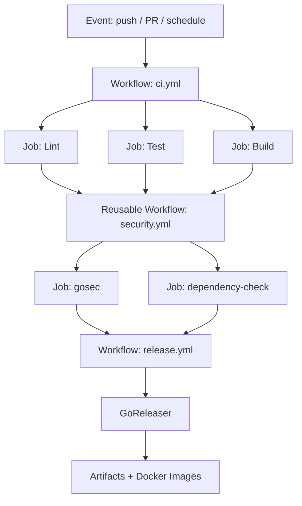
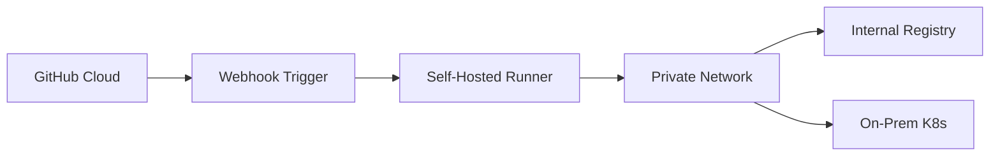

# 🤖 GitHub Actions and Automation

## Introduction

GitHub Actions has become the dominant automation platform for Go projects, offering tight integration with repositories, a vast marketplace of reusable components, and native support for matrix builds and artifact management. Beyond simple CI, Actions enables release automation, issue triage, documentation generation, and even infrastructure provisioning — all defined in YAML and versioned alongside your code.

This module builds directly on [[03 - CI-CD Pipelines for Go Projects|CI/CD pipeline fundamentals]] by exploring advanced Action patterns. You will learn to compose workflows, manage secrets securely, and automate Go releases with GoReleaser. These skills are critical for shipping professional Go tools that users can install with a single command.

## 1. Action Composition and Reusable Workflows

GitHub Actions supports multiple levels of reuse:

- **Composite Actions** — Bundle multiple steps into a single reusable action within a repository
- **Reusable Workflows** — Call an entire workflow from another workflow using `workflow_call`
- **Workflow Dispatch** — Trigger workflows manually via the GitHub UI or API
- **Event Triggers** — React to pushes, pull requests, releases, schedules, and webhooks

⚠️ **Warning:** Reusable workflows run in the caller's context. Never pass untrusted inputs directly into shell commands without sanitization, as this can lead to command injection attacks.

💡 **Tip:** Pin third-party actions to a specific commit SHA instead of a version tag. Tags can be force-moved, but SHAs are immutable and guarantee reproducible builds.

**Real case: Prometheus** — The Prometheus project automates every release using GoReleaser triggered by GitHub Actions. When a maintainer pushes a version tag, Actions cross-compiles binaries for Linux, macOS, Windows, and FreeBSD across amd64, arm64, and armv7 architectures. GoReleaser generates checksums, signs artifacts with Cosign, and publishes Docker images to multiple registries — all without manual intervention. This pattern has been adopted by thousands of Go projects in the cloud-native ecosystem.

## 2. Advanced Workflow Features

| Feature | Purpose | Go Project Use Case |
|---|---|---|
| Matrix Strategy | Run jobs across multiple configurations | Test Go 1.21 + 1.22 on Ubuntu/macOS/Windows |
| Self-Hosted Runners | Execute on private infrastructure | Build air-gapped enterprise Go tools |
| Conditional Jobs | Skip or run based on expressions | Deploy only on `main` branch |
| Environment Protection | Require approval for deployments | Manual gate before production release |
| Secrets Management | Inject tokens and keys securely | Sign binaries with GPG, push to Docker Hub |
| Caching | Persist data between runs | Cache `~/go/pkg/mod` for faster builds |

### Automation Use Cases Mapped to Actions Features

| Use Case | Actions Feature | Implementation |
|---|---|---|
| Run tests on every PR | `pull_request` trigger | Standard workflow |
| Cross-compile releases | Matrix + GoReleaser | Release workflow |
| Sign binaries | Secrets + Cosign | Post-build step |
| Publish to Homebrew | Custom action | GoReleaser integration |
| Update Go modules | Scheduled trigger + script | Weekly dependency refresh |
| Notify Slack on failure | `if: failure()` step | Alerting step |

## 3. GitHub Actions Workflow Architecture



### Self-Hosted Runner Topology




## 4. Release Automation with GoReleaser

### Release Workflow (`.github/workflows/release.yml`)

```yaml
name: Release

on:
  push:
    tags:
      - 'v*'

permissions:
  contents: write
  packages: write

jobs:
  release:
    runs-on: ubuntu-latest
    steps:
      - uses: actions/checkout@v4
        with:
          fetch-depth: 0

      - uses: actions/setup-go@v5
        with:
          go-version: '1.22'

      - name: Login to GitHub Container Registry
        uses: docker/login-action@v3
        with:
          registry: ghcr.io
          username: ${{ github.actor }}
          password: ${{ secrets.GITHUB_TOKEN }}

      - name: Run GoReleaser
        uses: goreleaser/goreleaser-action@v6
        with:
          distribution: goreleaser
          version: '~> v2'
          args: release --clean
        env:
          GITHUB_TOKEN: ${{ secrets.GITHUB_TOKEN }}
```

### GoReleaser Configuration (`.goreleaser.yml`)

```yaml
version: 2

project_name: mytool

before:
  hooks:
    - go mod tidy
    - go generate ./...

builds:
  - env:
      - CGO_ENABLED=0
    goos:
      - linux
      - darwin
      - windows
      - freebsd
    goarch:
      - amd64
      - arm64
      - arm
    goarm:
      - "7"
    ldflags:
      - -s -w -X main.version={{.Version}} -X main.commit={{.Commit}}

archives:
  - format: tar.gz
    format_overrides:
      - goos: windows
        format: zip
    name_template: >-
      {{ .ProjectName }}_
      {{- .Version }}_
      {{- .Os }}_
      {{- .Arch }}

checksum:
  name_template: 'checksums.txt'

snapshot:
  version_template: "{{ incpatch .Version }}-next"

changelog:
  sort: asc
  filters:
    exclude:
      - '^docs:'
      - '^test:'

dockers:
  - image_templates:
      - "ghcr.io/myuser/{{ .ProjectName }}:{{ .Version }}-amd64"
      - "ghcr.io/myuser/{{ .ProjectName }}:latest-amd64"
    dockerfile: Dockerfile
    use: buildx
    build_flag_templates:
      - "--platform=linux/amd64"
  - image_templates:
      - "ghcr.io/myuser/{{ .ProjectName }}:{{ .Version }}-arm64"
      - "ghcr.io/myuser/{{ .ProjectName }}:latest-arm64"
    dockerfile: Dockerfile
    use: buildx
    goarch: arm64
    build_flag_templates:
      - "--platform=linux/arm64"

docker_manifests:
  - name_template: "ghcr.io/myuser/{{ .ProjectName }}:{{ .Version }}"
    image_templates:
      - "ghcr.io/myuser/{{ .ProjectName }}:{{ .Version }}-amd64"
      - "ghcr.io/myuser/{{ .ProjectName }}:{{ .Version }}-arm64"
```

## 5. Secrets and Security in Actions

- Use `secrets.GITHUB_TOKEN` for repository-scoped operations — it is automatically generated and rotated
- Store long-lived credentials (Docker Hub, AWS, signing keys) as encrypted repository secrets
- Enable branch protection rules to require status checks before merging
- Use OpenID Connect (OIDC) for cloud provider authentication instead of storing static credentials

---

## 📦 Compression Code

```go
package main

import (
    "fmt"
    "os"
    "os/exec"
    "runtime"
)

// VerifyGoVersion runs `go version` and prints the output.
func VerifyGoVersion() error {
    cmd := exec.Command("go", "version")
    cmd.Stdout = os.Stdout
    cmd.Stderr = os.Stderr
    return cmd.Run()
}

// GetTargetTriple returns OS and arch suitable for build tags.
func GetTargetTriple() string {
    return fmt.Sprintf("%s/%s", runtime.GOOS, runtime.GOARCH)
}

func main() {
    fmt.Println("Target triple:", GetTargetTriple())
    if err := VerifyGoVersion(); err != nil {
        fmt.Println("Go not found:", err)
        os.Exit(1)
    }
}
```

## 🎯 Documented Project

### Description

Build `releasebot`, a Go CLI tool that automates release preparation. It validates version tags, generates changelogs from conventional commits, and triggers GitHub Actions workflows via the REST API. The project itself is released using GoReleaser and GitHub Actions.

### Functional Requirements

1. Implement `releasebot validate <tag>` to ensure the tag follows SemVer and no duplicate exists on GitHub.
2. Implement `releasebot changelog --from=<tag> --to=<tag>` to output a markdown changelog grouped by commit type (feat, fix, chore).
3. Implement `releasebot trigger --workflow=release.yml` to dispatch a workflow run using the GitHub API.
4. The project repository must include a GoReleaser config that builds for Linux, macOS, and Windows.
5. A GitHub Actions workflow must run tests on PRs and release on version tag pushes.

### Main Components

- `cmd/validate.go` — Tag validation command
- `cmd/changelog.go` — Changelog generator from git history
- `cmd/trigger.go` — GitHub Actions workflow dispatcher
- `.github/workflows/ci.yml` — PR testing pipeline
- `.github/workflows/release.yml` — GoReleaser release pipeline
- `.goreleaser.yml` — Multi-platform build and Docker manifest configuration

### Success Metrics

- Release workflow triggers automatically on `v*` tag pushes
- Binaries are downloadable for all target platforms from GitHub Releases
- Docker images are published to GHCR with multi-arch manifests
- Changelog generation correctly categorizes 100% of conventional commits
- No manual steps are required between tag push and published release

### References

- [GitHub Actions: Reusable Workflows](https://docs.github.com/en/actions/using-workflows/reusing-workflows)
- [GoReleaser Documentation](https://goreleaser.com/)
- [GitHub REST API: Actions](https://docs.github.com/en/rest/actions)
- [Conventional Commits](https://www.conventionalcommits.org/)
- [Cosign: Signing Containers](https://docs.sigstore.dev/cosign/overview/)
