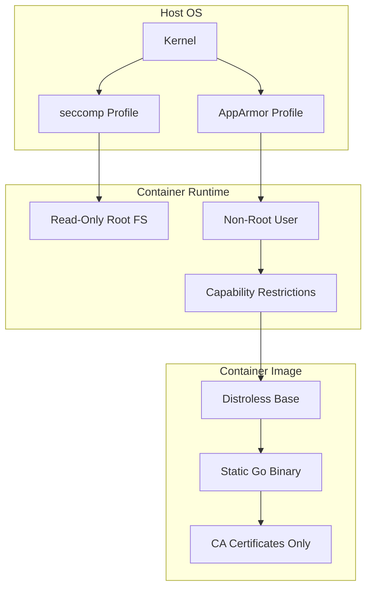

# 🐳 Container Security with Go

## Introduction

Containers have become the standard unit of deployment for Go applications, but with convenience comes risk. A container image bundles your application with an operating system layer, system libraries, and tooling — each of which expands the attack surface. For Go specifically, the language's ability to produce static binaries creates a unique opportunity: we can build images with virtually no operating system at all.

This module teaches you how to construct secure container images for Go applications, scan them for vulnerabilities, and apply runtime security policies. These practices complement [[02 - Security Scanning and Hardening|code-level security]] and are essential for production deployments managed through [[03 - CI-CD Pipelines for Go Projects|CI/CD pipelines]].

## 1. Minimal Base Images for Go

Go compiles to static binaries that require no runtime interpreter or JVM. This makes it an ideal candidate for minimal base images:

- **Scratch** — An empty image. Contains nothing but your binary. The smallest possible attack surface.
- **Distroless** — Google's minimal images containing only essential runtime dependencies (ca-certificates, timezone data, glibc). No shell, no package manager.
- **Alpine** — A minimal Linux distribution (~5MB) with musl libc and a package manager. Popular but introduces a package management layer.
- **Debian Slim** — A trimmed Debian image (~22MB) with glibc. Larger but maximally compatible.

⚠️ **Warning:** Alpine uses musl libc instead of glibc. Go binaries that use cgo or depend on C libraries compiled against glibc may fail silently or crash at runtime. Test Alpine-based images thoroughly before production use.

💡 **Tip:** When building from `scratch`, you must explicitly copy CA certificates if your application makes HTTPS requests. Distroless handles this automatically while still eliminating the shell.

**Real case: Google Container Tools (distroless)** — Google created distroless images to solve the "curl | bash" problem in containers. By removing shells and package managers, they prevent attackers who gain code execution from installing additional tools. Google's internal Go services run on distroless, and the images are maintained by the same team that manages Google's production container infrastructure. The `gcr.io/distroless/static` image is specifically designed for static Go binaries.

## 2. Image Scanning and Runtime Security

Even minimal images can contain vulnerabilities. Scanning must be integrated into the build pipeline:

| Scanner | Focus | Speed | CI Integration |
|---|---|---|---|
| Trivy | OS packages, app dependencies, misconfigurations | Fast | Official GitHub Action |
| Snyk Container | Vulnerabilities, licensing | Medium | CLI + GitHub Action |
| Clair | OS package vulnerabilities | Medium | Quay/Registry integration |

Runtime security hardens the container execution environment:

- **seccomp** — Filters system calls available to the container. Go's runtime uses a limited set of syscalls, making seccomp profiles effective.
- **AppArmor** — Mandatory access control that restricts file and network access per container profile.
- **Capabilities** — Drop all capabilities (`--cap-drop=ALL`) and add back only those required (e.g., `NET_BIND_SERVICE` for ports <1024).

## 3. Container Security Layers



### Base Image Comparison

| Image | Size | Shell | Package Manager | libc | Best For |
|---|---|---|---|---|---|
| Scratch | ~0 MB | No | No | None | Pure static Go binaries |
| Distroless | ~2 MB | No | No | glibc | Static Go + TLS/timezone |
| Alpine | ~5 MB | Yes (sh, ash) | apk | musl | When you need basic tools |
| Debian Slim | ~22 MB | Yes (bash) | apt | glibc | Maximum compatibility |
| Ubuntu | ~25 MB | Yes (bash) | apt | glibc | Development, not production |

The attack surface of a container can be modeled as:

```
Attack Surface = Open_Ports + Packages + Capabilities
```

Reducing any term reduces the overall attack surface. Scratch and distroless excel at minimizing `Packages`.


## 4. Secure Dockerfile and Scanning

### Multi-Stage Dockerfile

```dockerfile
# Build stage
FROM golang:1.22-alpine AS builder
WORKDIR /app
COPY go.mod go.sum ./
RUN go mod download
COPY . .
RUN CGO_ENABLED=0 GOOS=linux go build -ldflags="-s -w" -o /bin/server ./cmd/server

# Runtime stage
FROM gcr.io/distroless/static:nonroot
COPY --from=builder /bin/server /server
COPY --from=builder /etc/ssl/certs/ca-certificates.crt /etc/ssl/certs/
USER nonroot:nonroot
EXPOSE 8080
ENTRYPOINT ["/server"]
```

### Trivy Scan in CI

```yaml
name: Container Security Scan

on:
  push:
    branches: [main]

jobs:
  scan:
    runs-on: ubuntu-latest
    steps:
      - uses: actions/checkout@v4

      - name: Build image
        run: docker build -t myapp:latest .

      - name: Run Trivy vulnerability scanner
        uses: aquasecurity/trivy-action@master
        with:
          image-ref: 'myapp:latest'
          format: 'sarif'
          output: 'trivy-results.sarif'

      - name: Upload Trivy scan results
        uses: github/codeql-action/upload-sarif@v3
        with:
          sarif_file: 'trivy-results.sarif'
```

### Kubernetes Runtime Security

```yaml
apiVersion: v1
kind: Pod
spec:
  containers:
    - name: server
      image: myapp:latest
      securityContext:
        allowPrivilegeEscalation: false
        readOnlyRootFilesystem: true
        runAsNonRoot: true
        capabilities:
          drop:
            - ALL
      ports:
        - containerPort: 8080
```

## 5. Hardening Checklist

- [ ] Use multi-stage builds to exclude build tools from the final image
- [ ] Choose `scratch` or `distroless` over full distributions
- [ ] Run as non-root user
- [ ] Mount the root filesystem as read-only
- [ ] Drop all Linux capabilities
- [ ] Scan every image build with Trivy or equivalent
- [ ] Pin base image digests instead of tags
- [ ] Sign images with Cosign or Notary

---

## 📦 Compression Code

```go
package main

import (
    "bytes"
    "compress/gzip"
    "fmt"
    "io"
)

// GzipString compresses a string and returns the compressed bytes.
func GzipString(input string) ([]byte, error) {
    var buf bytes.Buffer
    zw := gzip.NewWriter(&buf)
    if _, err := zw.Write([]byte(input)); err != nil {
        return nil, err
    }
    if err := zw.Close(); err != nil {
        return nil, err
    }
    return buf.Bytes(), nil
}

// GunzipString decompresses gzip bytes to a string.
func GunzipString(data []byte) (string, error) {
    zr, err := gzip.NewReader(bytes.NewReader(data))
    if err != nil {
        return "", err
    }
    defer zr.Close()
    out, err := io.ReadAll(zr)
    if err != nil {
        return "", err
    }
    return string(out), nil
}

func main() {
    original := "This is a test string for compression inside a secure container."
    compressed, err := GzipString(original)
    if err != nil {
        fmt.Println("Compression error:", err)
        return
    }
    fmt.Printf("Original: %d bytes, Compressed: %d bytes\n", len(original), len(compressed))

    decompressed, err := GunzipString(compressed)
    if err != nil {
        fmt.Println("Decompression error:", err)
        return
    }
    fmt.Println("Decompressed:", decompressed)
}
```

## 🎯 Documented Project

### Description

Build `secureserver`, a minimal Go HTTP service packaged in a distroless container. The project includes a hardened Dockerfile, a GitHub Actions workflow that builds and scans the image with Trivy, and Kubernetes manifests with runtime security policies.

### Functional Requirements

1. The Go service exposes `/health` and responds with JSON `{"status":"ok"}`.
2. The Dockerfile must be multi-stage, compiling in `golang:1.22-alpine` and running on `gcr.io/distroless/static:nonroot`.
3. A GitHub Actions workflow builds the image on every push and runs Trivy scan.
4. The Trivy scan blocks the pipeline if HIGH or CRITICAL vulnerabilities are found.
5. Kubernetes deployment manifest sets `runAsNonRoot: true`, `readOnlyRootFilesystem: true`, and drops all capabilities.

### Main Components

- `cmd/server/main.go` — Minimal HTTP server with `/health` endpoint
- `Dockerfile` — Multi-stage build with distroless runtime
- `.github/workflows/container-security.yml` — Build + Trivy scan pipeline
- `k8s/deployment.yaml` — Hardened Kubernetes deployment
- `k8s/service.yaml` — Kubernetes service definition

### Success Metrics

- Final image size is under 15 MB
- Trivy scan reports zero HIGH/CRITICAL vulnerabilities
- Container runs successfully with no shell access (`docker exec` fails)
- Kubernetes security context prevents privilege escalation
- Image build time is under 2 minutes with module caching

### References

- [Google Distroless GitHub](https://github.com/GoogleContainerTools/distroless)
- [Trivy Documentation](https://aquasecurity.github.io/trivy/)
- [Docker Security Best Practices](https://docs.docker.com/develop/dev-best-practices/)
- [Kubernetes Security Context](https://kubernetes.io/docs/tasks/configure-pod-container/security-context/)
- [OWASP Container Security Verification Standard](https://owasp.org/www-project-container-security-verification-standard/)
