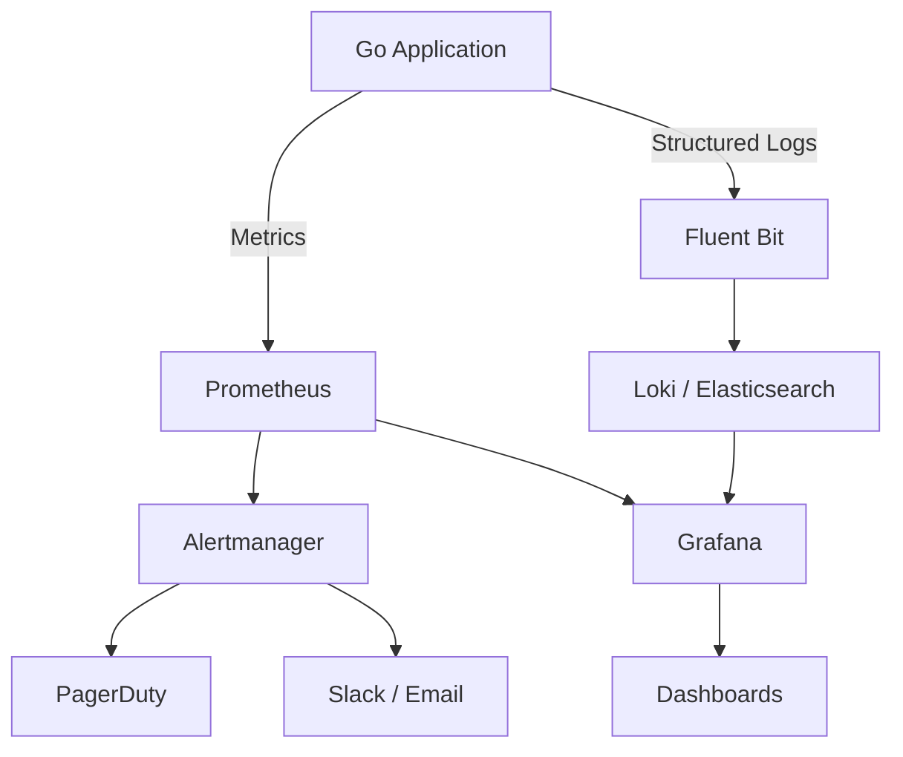

# 🧰 Building a DevOps Toolkit

## Introduction

Observability is the ability to understand a system's internal state by examining its outputs — logs, metrics, and traces. For Go applications running in production, building a DevOps toolkit means instrumenting code with metrics, aggregating logs, and configuring alerts that wake engineers when things go wrong. Unlike debugging locally, production observability must be non-intrusive, high-cardinality tolerant, and cost-efficient.

This module brings together the CLI skills from [[01 - Building CLIs with Cobra|Cobra]] and the deployment patterns from [[04 - GitHub Actions and Automation|GitHub Actions]] to construct a complete monitoring and alerting stack. You will build a custom Prometheus exporter in Go, wire it to Grafana dashboards, and configure Alertmanager to route notifications to PagerDuty.

## 1. Infrastructure Monitoring with Prometheus

Prometheus is a time-series database that scrapes metrics from HTTP endpoints. Go applications expose metrics using the `prometheus/client_golang` library:

- **Counters** — Monotonically increasing values (requests served, errors occurred)
- **Gauges** — Values that go up and down (current memory usage, queue depth)
- **Histograms** — Observations bucketed by value (request latency, response size)
- **Summaries** — Like histograms but calculate quantiles over a sliding window

⚠️ **Warning:** High-cardinality labels destroy Prometheus performance. Never use unbounded values like user IDs or request paths as label values without aggregation or allowlisting.

💡 **Tip:** Use `promhttp.Handler()` to expose the `/metrics` endpoint. It includes Go runtime metrics (GC, goroutines, memory) automatically, giving you system-level visibility for free.

**Real case: Grafana Labs** — Grafana Labs builds its entire observability platform in Go. Prometheus, Loki, Tempo, and Grafana itself are either written in Go or heavily use Go components. Their engineers maintain the official Prometheus Go client and have demonstrated that a single Go process can expose millions of time-series with sub-millisecond scrape latency by carefully managing label cardinality and using efficient data structures.

## 2. Log Aggregation and Alerting

Logs provide narrative context that metrics cannot capture. The modern log stack for Go projects typically uses:

| Component | Purpose | Go Integration |
|---|---|---|
| Fluentd / Fluent Bit | Log collection and forwarding | Sidecar or DaemonSet in K8s |
| Elasticsearch / OpenSearch | Log storage and search | Index logs via HTTP API |
| Loki | Lightweight log aggregation (Grafana Labs) | Direct integration with Grafana |
| Alertmanager | Alert routing, grouping, silencing | Receives alerts from Prometheus |
| PagerDuty | On-call incident management | Webhook or API integration |

For Go applications, structured logging with `slog` (standard library as of Go 1.21) or `zap` ensures logs are machine-parseable:

```go
logger := slog.New(slog.NewJSONHandler(os.Stdout, nil))
logger.Info("request handled", "method", "GET", "duration_ms", 42)
```

## 3. DevOps Observability Stack



### Monitoring Stack Components

| Layer | Tool | Data Type | Retention | Query Language |
|---|---|---|---|---|
| Metrics | Prometheus | Time-series | 15 days local | PromQL |
| Metrics (long-term) | Thanos / Mimir | Time-series | Configurable | PromQL |
| Logs | Loki | Log streams | Configurable | LogQL |
| Traces | Tempo / Jaeger | Spans | Configurable | TraceQL / Jaeger Query |
| Visualization | Grafana | All types | N/A | UI |
| Alerting | Alertmanager | Alert events | Ephemeral | N/A |

Service Level Objectives (SLOs) define the reliability target for a service:

```
SLO = (1 - Error_Budget) × 100
```

If your SLO is 99.9%, your error budget is 0.1% of requests that may fail. Alerts should fire before the error budget is exhausted, not after.


## 4. Custom Prometheus Exporter in Go

### Complete Exporter

```go
package main

import (
    "fmt"
    "net/http"
    "time"

    "github.com/prometheus/client_golang/prometheus"
    "github.com/prometheus/client_golang/prometheus/promauto"
    "github.com/prometheus/client_golang/prometheus/promhttp"
)

var (
    httpRequestsTotal = promauto.NewCounterVec(
        prometheus.CounterOpts{
            Name: "http_requests_total",
            Help: "Total number of HTTP requests",
        },
        []string{"method", "status"},
    )

    httpRequestDuration = promauto.NewHistogramVec(
        prometheus.HistogramOpts{
            Name:    "http_request_duration_seconds",
            Help:    "HTTP request latency",
            Buckets: prometheus.DefBuckets,
        },
        []string{"method"},
    )

    activeConnections = promauto.NewGauge(
        prometheus.GaugeOpts{
            Name: "active_connections",
            Help: "Number of active connections",
        },
    )
)

func helloHandler(w http.ResponseWriter, r *http.Request) {
    start := time.Now()
    activeConnections.Inc()
    defer activeConnections.Dec()

    fmt.Fprintf(w, "Hello, DevOps!")

    duration := time.Since(start).Seconds()
    httpRequestDuration.WithLabelValues(r.Method).Observe(duration)
    httpRequestsTotal.WithLabelValues(r.Method, "200").Inc()
}

func main() {
    http.Handle("/metrics", promhttp.Handler())
    http.HandleFunc("/", helloHandler)

    fmt.Println("Server listening on :8080")
    if err := http.ListenAndServe(":8080", nil); err != nil {
        fmt.Println("Server error:", err)
    }
}
```

### Alertmanager Configuration

```yaml
global:
  smtp_smarthost: 'localhost:587'
  smtp_from: 'alerts@example.com'

route:
  receiver: 'pagerduty'
  group_by: ['alertname']
  group_wait: 10s
  group_interval: 5m
  repeat_interval: 12h

receivers:
  - name: 'pagerduty'
    pagerduty_configs:
      - service_key: '<integration-key>'
        description: '{{ .GroupLabels.alertname }}'

inhibit_rules:
  - source_match:
      severity: 'critical'
    target_match:
      severity: 'warning'
    equal: ['alertname']
```

### Prometheus Scrape Config

```yaml
scrape_configs:
  - job_name: 'go-app'
    static_configs:
      - targets: ['localhost:8080']
    scrape_interval: 15s
```

## 5. Building the Complete Toolkit

A production-ready DevOps toolkit for Go includes:

1. **Instrumentation** — Metrics and structured logging embedded in every service
2. **Collection** — Prometheus scraping metrics; Fluent Bit forwarding logs
3. **Storage** — Prometheus local TSDB + Loki for logs
4. **Visualization** — Grafana dashboards with RED (Rate, Errors, Duration) panels
5. **Alerting** — Alertmanager routing to PagerDuty with escalation policies

---

## 📦 Compression Code

```go
package main

import (
    "bufio"
    "fmt"
    "os"
    "strings"
)

// CountLogLevel reads a log file and counts occurrences of each level.
func CountLogLevel(path string) (map[string]int, error) {
    f, err := os.Open(path)
    if err != nil {
        return nil, err
    }
    defer f.Close()

    counts := make(map[string]int)
    scanner := bufio.NewScanner(f)
    for scanner.Scan() {
        line := scanner.Text()
        if strings.Contains(line, `"level":"ERROR"`) {
            counts["ERROR"]++
        } else if strings.Contains(line, `"level":"WARN"`) {
            counts["WARN"]++
        } else if strings.Contains(line, `"level":"INFO"`) {
            counts["INFO"]++
        }
    }
    return counts, scanner.Err()
}

func main() {
    counts, err := CountLogLevel("app.log")
    if err != nil {
        fmt.Println("Error:", err)
        return
    }
    for level, count := range counts {
        fmt.Printf("%s: %d\n", level, count)
    }
}
```

## 🎯 Documented Project

### Description

Build `observability-agent`, a Go daemon that collects system metrics and exposes them via a Prometheus `/metrics` endpoint. It also writes structured logs to stdout for Fluent Bit aggregation. The project includes a Grafana dashboard JSON model and an Alertmanager configuration.

### Functional Requirements

1. Expose Prometheus metrics for CPU usage, memory usage, disk usage, and network I/O using `prometheus/client_golang`.
2. Implement a `/health` endpoint that returns HTTP 200 with JSON status.
3. Emit structured JSON logs on every scrape request using `slog`.
4. Provide a Grafana dashboard JSON that visualizes all four system metrics.
5. Include an Alertmanager config that sends PagerDuty alerts when memory usage exceeds 90%.

### Main Components

- `cmd/agent/main.go` — Daemon with HTTP server, metrics collection, and logging
- `pkg/collector/` — System metric collectors (CPU, memory, disk, network)
- `grafana/dashboard.json` — Pre-configured Grafana dashboard
- `alertmanager/alertmanager.yml` — Alert routing and PagerDuty integration
- `prometheus/prometheus.yml` — Scrape configuration for the agent

### Success Metrics

- Prometheus successfully scrapes all metrics every 15 seconds
- Grafana dashboard displays real-time graphs without manual data source configuration
- Alertmanager triggers a test alert within 1 minute of threshold breach
- Log output is valid JSON and parseable by Fluent Bit / Loki
- Binary runs with less than 20 MB RAM usage under normal load

### References

- [Prometheus Go Client](https://github.com/prometheus/client_golang)
- [Grafana Documentation](https://grafana.com/docs/)
- [Alertmanager Configuration](https://prometheus.io/docs/alerting/latest/configuration/)
- [Go slog Package](https://pkg.go.dev/log/slog)
- [PagerDuty Integration Guide](https://developer.pagerduty.com/docs/events-api-v2-overview)
- [Google SRE Book: Monitoring](https://sre.google/sre-book/monitoring-distributed-systems/)
