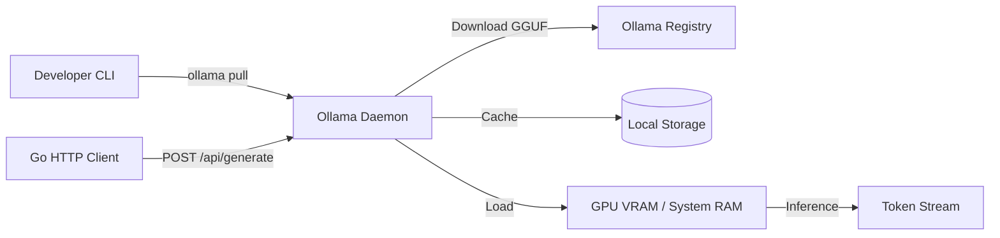

# 🦙 Running LLMs Locally with Ollama

## Introduction

Running Large Language Models locally has become a cornerstone of private AI development. Unlike cloud-based APIs, local inference ensures data never leaves your machine, eliminates API latency, and removes usage costs. [[Ollama]] abstracts the complexity of model serving by packaging weights, configuration, and runtime into a single daemon that behaves like a Docker engine for LLMs.

In this module, you will learn the architectural principles behind Ollama, how quantization reduces memory footprint, and the hardware requirements for running models ranging from 7B to 70B parameters. We will also explore how to interact with Ollama programmatically from Go using raw HTTP requests. This foundational knowledge is essential before building SDKs, chatbots, or RAG systems in subsequent modules.

## 1. Ollama Architecture and Core Concepts

Ollama operates as a model server daemon that manages the entire lifecycle of local LLMs. Its architecture consists of three primary layers:

- **Daemon / Model Server:** A persistent background process (listening on `localhost:11434`) that loads models into RAM/VRAM, handles concurrent requests, and caches weights across sessions.
- **Modelfile:** A declarative configuration format (similar to a Dockerfile) that defines the base model, system prompts, parameters (`temperature`, `top_p`), and adapter weights (LoRA).
- **Model Repository:** Ollama downloads quantized GGUF weights from its registry, storing them locally in `~/.ollama/models/`.

When you execute `ollama run llama3`, the daemon checks for the model binary, loads it into GPU memory (or system RAM if no GPU is available), and exposes a REST API for generation.

⚠️ **Warning:** Running multiple large models simultaneously can cause system OOM (Out Of Memory) crashes. Always monitor `nvidia-smi` or `htop` before loading a second model instance.

💡 **Tip:** You can create custom models by writing a `Modelfile` with a `FROM ./model.gguf` directive, allowing you to fine-tune behavior without re-quantizing weights.

Real case: **Private AI startups** frequently use Ollama in air-gapped environments to ensure customer data never traverses public networks. By deploying Ollama on internal servers, they achieve SOC 2 compliance without sacrificing LLM capabilities.

## 2. Quantization and Hardware Requirements

Quantization compresses model weights from 32-bit or 16-bit floats to lower-precision integers (4-bit, 5-bit, 8-bit). This drastically reduces VRAM requirements at the cost of minor accuracy degradation.

| Quantization | Bits per Weight | Approx. Quality Loss | Typical Use Case |
|-------------|----------------|---------------------|------------------|
| Q4_0 | 4 | Moderate | Fast inference, limited VRAM |
| Q4_K_M | 4 | Low | Balanced speed/quality |
| Q5_K_M | 5 | Very Low | High quality, more VRAM |
| Q8_0 | 8 | Minimal | Maximum local quality |
| FP16 | 16 | None | Research, maximum fidelity |

VRAM requirements can be estimated with the following formula:

**VRAM_needed ≈ Model_Params × Quantization_Bits / 8**

For example, a 7B parameter model at Q4 quantization requires approximately:

`7,000,000,000 × 4 / 8 = 3,500,000,000 bytes ≈ 3.5 GB`

Real case: **Solo developers** running [[CodeLlama]] on laptops with 8GB VRAM rely on Q4 quantization to enable code completion without upgrading to cloud instances.

Hardware considerations:
- **GPU (CUDA/ROCm):** NVIDIA GPUs with CUDA provide the fastest inference. AMD GPUs are supported via ROCm on Linux.
- **CPU Inference:** Fallback when no GPU is available. Performance depends heavily on AVX/AVX2 support and core count.
- **RAM:** System RAM must exceed the model size. For a 13B Q5 model (~8GB), a machine with 16GB RAM is recommended to leave room for the OS and other processes.

## 3. Downloading and Running Models

Ollama simplifies model acquisition to a single command. The daemon handles downloading, verifying, and caching layers.

```bash
# Pull a model
ollama pull llama3

# Run interactively
ollama run llama3

# Run a code-specific model
ollama run codellama:7b-code

# List local models
ollama list
```

Popular models available in the Ollama registry:
- **Llama 3:** General-purpose conversational model, strong reasoning.
- **Mistral:** High performance with smaller parameter counts (7B).
- **CodeLlama:** Specialized for code generation and infilling.



## 4. Go HTTP Client for Ollama

Since Ollama exposes a REST API, any language with an HTTP client can interact with it. Go's `net/http` package is ideal for building lightweight, high-performance clients.

```go
package main

import (
	"bytes"
	"encoding/json"
	"fmt"
	"io"
	"net/http"
	"time"
)

type GenerateRequest struct {
	Model  string `json:"model"`
	Prompt string `json:"prompt"`
	Stream bool   `json:"stream"`
}

type GenerateResponse struct {
	Response string `json:"response"`
	Done     bool   `json:"done"`
}

func generateWithOllama(prompt string) (string, error) {
	reqBody := GenerateRequest{
		Model:  "llama3",
		Prompt: prompt,
		Stream: false,
	}
	jsonData, _ := json.Marshal(reqBody)

	client := &http.Client{Timeout: 120 * time.Second}
	resp, err := client.Post(
		"http://localhost:11434/api/generate",
		"application/json",
		bytes.NewBuffer(jsonData),
	)
	if err != nil {
		return "", err
	}
	defer resp.Body.Close()

	body, _ := io.ReadAll(resp.Body)
	var result GenerateResponse
	if err := json.Unmarshal(body, &result); err != nil {
		return "", err
	}
	return result.Response, nil
}

func main() {
	response, err := generateWithOllama("Explain goroutines in one paragraph.")
	if err != nil {
		fmt.Println("Error:", err)
		return
	}
	fmt.Println(response)
}
```

This client sends a synchronous request. In [[02 - Ollama Go SDK and API Integration|Module 02]], we will extend this with streaming, retries, and structured wrappers.

---

## 📦 Compression Code

```go
package main

import (
	"bufio"
	"bytes"
	"encoding/json"
	"fmt"
	"net/http"
	"os"
	"strings"
	"time"
)

type OllamaClient struct {
	BaseURL string
	Client  *http.Client
}

func NewOllamaClient(base string) *OllamaClient {
	return &OllamaClient{
		BaseURL: base,
		Client:  &http.Client{Timeout: 120 * time.Second},
	}
}

func (o *OllamaClient) Generate(model, prompt string) (string, error) {
	payload := map[string]any{"model": model, "prompt": prompt, "stream": false}
	b, _ := json.Marshal(payload)
	resp, err := o.Client.Post(o.BaseURL+"/api/generate", "application/json", bytes.NewReader(b))
	if err != nil {
		return "", err
	}
	defer resp.Body.Close()
	var r struct{ Response string `json:"response"` }
	json.NewDecoder(resp.Body).Decode(&r)
	return r.Response, nil
}

func (o *OllamaClient) Chat(model string, messages []map[string]string) (string, error) {
	payload := map[string]any{"model": model, "messages": messages, "stream": false}
	b, _ := json.Marshal(payload)
	resp, err := o.Client.Post(o.BaseURL+"/api/chat", "application/json", bytes.NewReader(b))
	if err != nil {
		return "", err
	}
	defer resp.Body.Close()
	var r struct {
		Message struct{ Content string `json:"content"` } `json:"message"`
	}
	json.NewDecoder(resp.Body).Decode(&r)
	return r.Message.Content, nil
}

func main() {
	client := NewOllamaClient("http://localhost:11434")
	reader := bufio.NewReader(os.Stdin)
	fmt.Println("Ollama Go Client. Type 'exit' to quit.")
	for {
		fmt.Print("> ")
		input, _ := reader.ReadString('\n')
		input = strings.TrimSpace(input)
		if input == "exit" {
			break
		}
		res, err := client.Generate("llama3", input)
		if err != nil {
			fmt.Println("Error:", err)
			continue
		}
		fmt.Println(res)
	}
}
```

## 🎯 Documented Project

### Description

Build a command-line model manager that lists available Ollama models, estimates VRAM requirements for different quantization levels, and allows users to pull and delete models programmatically.

### Functional Requirements

1. Fetch and display all locally available models using Ollama's `/api/tags` endpoint.
2. Accept a model name and quantization level (Q4, Q5, Q8) as input and calculate estimated VRAM using `VRAM_needed ≈ Params × Bits / 8`.
3. Trigger model downloads via `/api/pull` and display progress.
4. Allow deletion of local models via `/api/delete`.
5. Validate hardware constraints before recommending a model to load.

### Main Components

- **Hardware Profiler:** Detects available RAM and GPU VRAM using OS-level calls.
- **Model Calculator:** Implements the quantization VRAM formula with safety buffers.
- **Ollama Controller:** Thin HTTP client wrapping the Ollama daemon API.
- **CLI Interface:** Uses `bufio` scanner for interactive model management.

### Success Metrics

- VRAM estimation is within 10% of actual Ollama memory usage.
- Model pull/delete operations complete without manual CLI intervention.
- Application prevents users from loading models that exceed available memory.

### References

- Ollama Documentation: https://github.com/ollama/ollama/blob/main/docs/api.md
- GGUF Quantization Formats: https://github.com/ggerganov/ggml/blob/master/docs/gguf.md
- Ollama Modelfile Reference: https://github.com/ollama/ollama/blob/main/docs/modelfile.md
