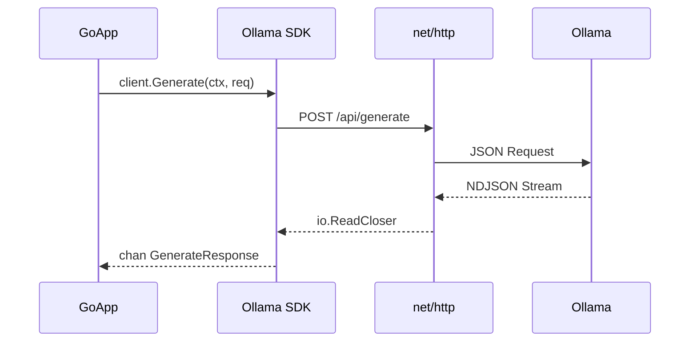
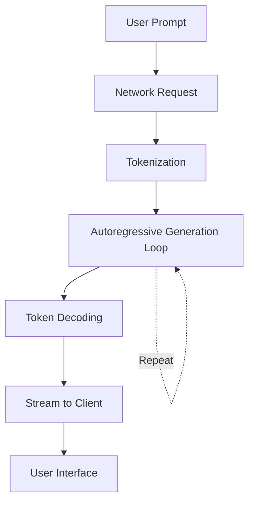

# 🔌 Ollama Go SDK and API Integration

## Introduction

While raw HTTP requests suffice for simple interactions, production Go applications demand robust SDK patterns: structured error handling, configurable timeouts, automatic retries, and streaming response parsing. This module transforms the basic Ollama client from [[01 - Running LLMs Locally with Ollama|Module 01]] into a fully-featured Go library.

You will learn how to map Ollama's REST API surface—generate, chat, embeddings, list, and pull—to idiomatic Go interfaces. We will also analyze latency components in LLM inference to help you optimize client behavior. By the end, you will have a reusable Ollama client package suitable for chatbots, RAG pipelines, and desktop applications.

## 1. Ollama REST API Surface

Ollama exposes a comprehensive REST API on `localhost:11434`. Understanding each endpoint's purpose is critical for designing an effective SDK wrapper.

| Endpoint | Method | Use Case | Key Parameters |
|----------|--------|----------|----------------|
| `/api/generate` | POST | Single-turn text completion | `model`, `prompt`, `stream`, `options` |
| `/api/chat` | POST | Multi-turn conversational AI | `model`, `messages`, `stream`, `format` |
| `/api/embeddings` | POST | Vector generation for RAG | `model`, `prompt` |
| `/api/tags` | GET | List downloaded models | None |
| `/api/pull` | POST | Download a model from registry | `name`, `insecure` |
| `/api/delete` | DELETE | Remove a local model | `name` |
| `/api/ps` | GET | List running models | None |

⚠️ **Warning:** The `/api/generate` endpoint maintains no conversation state. For multi-turn interactions, always use `/api/chat` with a `messages` array.

💡 **Tip:** Use the `format: "json"` option in the chat API to constrain model output to valid JSON, enabling reliable programmatic parsing.

Real case: **LangChain Go** (https://github.com/tmc/langchaingo) integrates with Ollama by implementing a standard `llms.Model` interface over these endpoints, allowing developers to swap Ollama for OpenAI with a single configuration change.

## 2. Go HTTP Client Patterns

Production Go clients must handle the unreliable nature of LLM inference: network hiccups, long generation times, and streaming JSON fragments.

**Timeouts:** LLM generation can take 30-120 seconds. Use `http.Client` with generous timeouts, or better, use context cancellation.

**Retries:** Implement exponential backoff for transient 5xx errors or connection timeouts.

**Streaming:** Ollama returns newline-delimited JSON (NDJSON) when `stream: true`. Go's `bufio.Scanner` can split on newlines to yield tokens in real time.

```go
client := &http.Client{
    Timeout: 0, // No global timeout; use context
    Transport: &http.Transport{
        MaxIdleConns:        10,
        MaxIdleConnsPerHost: 10,
        IdleConnTimeout:     90 * time.Second,
    },
}
```

## 3. Building a Go Wrapper/SDK for Ollama

A well-designed SDK separates transport concerns from domain models. We define structs for requests/responses and a client struct to hold configuration.



Here is a complete streaming Ollama client in Go:

```go
package ollama

import (
	"bufio"
	"bytes"
	"context"
	"encoding/json"
	"fmt"
	"io"
	"net/http"
	"time"
)

const DefaultBaseURL = "http://localhost:11434"

type Client struct {
	BaseURL    string
	HTTPClient *http.Client
}

func NewClient(baseURL string) *Client {
	if baseURL == "" {
		baseURL = DefaultBaseURL
	}
	return &Client{
		BaseURL:    baseURL,
		HTTPClient: &http.Client{Timeout: 0},
	}
}

type GenerateRequest struct {
	Model   string            `json:"model"`
	Prompt  string            `json:"prompt"`
	Stream  bool              `json:"stream"`
	Options map[string]any    `json:"options,omitempty"`
}

type GenerateResponse struct {
	Model     string `json:"model"`
	Response  string `json:"response"`
	Done      bool   `json:"done"`
}

func (c *Client) GenerateStream(ctx context.Context, req GenerateRequest) (<-chan GenerateResponse, <-chan error) {
	resCh := make(chan GenerateResponse)
	errCh := make(chan error, 1)

	go func() {
		defer close(resCh)
		defer close(errCh)

		body, _ := json.Marshal(req)
		httpReq, _ := http.NewRequestWithContext(ctx, "POST", c.BaseURL+"/api/generate", bytes.NewReader(body))
		httpReq.Header.Set("Content-Type", "application/json")

		resp, err := c.HTTPClient.Do(httpReq)
		if err != nil {
			errCh <- err
			return
		}
		defer resp.Body.Close()

		if resp.StatusCode != http.StatusOK {
			errCh <- fmt.Errorf("unexpected status: %s", resp.Status)
			return
		}

		scanner := bufio.NewScanner(resp.Body)
		for scanner.Scan() {
			var chunk GenerateResponse
			if err := json.Unmarshal(scanner.Bytes(), &chunk); err != nil {
				errCh <- err
				return
			}
			select {
			case resCh <- chunk:
			case <-ctx.Done():
				errCh <- ctx.Err()
				return
			}
			if chunk.Done {
				break
			}
		}
	}()

	return resCh, errCh
}
```

## 4. Latency Analysis in LLM Inference

Understanding where time is spent helps optimize the user experience. Total latency decomposes as:

**Latency = Network + Tokenization + Generation + Decoding**

- **Network:** Round-trip to `localhost:11434` is negligible, but significant if Ollama runs on a remote server.
- **Tokenization:** Converting text to token IDs. Fast but adds ~1-5ms per request.
- **Generation:** The autoregressive loop. Grows linearly with output token count. GPU-bound.
- **Decoding:** Converting token IDs back to text. Minimal overhead.

To minimize perceived latency, always use streaming (as shown above) so the user sees tokens as they are generated rather than waiting for the full response.

Real case: **Internal developer tools** at tech companies stream Ollama responses directly into IDEs. By parsing NDJSON chunks in Go and forwarding them over WebSockets, they achieve sub-100ms time-to-first-token.



---

## 📦 Compression Code

```go
package main

import (
	"bufio"
	"bytes"
	"context"
	"encoding/json"
	"fmt"
	"net/http"
	"os"
	"strings"
	"time"
)

type OllamaSDK struct {
	url string
	c   *http.Client
}

func NewSDK(u string) *OllamaSDK {
	if u == "" {
		u = "http://localhost:11434"
	}
	return &OllamaSDK{url: u, c: &http.Client{Timeout: 0}}
}

func (s *OllamaSDK) Stream(model, prompt string) {
	ctx, cancel := context.WithTimeout(context.Background(), 2*time.Minute)
	defer cancel()

	body, _ := json.Marshal(map[string]any{"model": model, "prompt": prompt, "stream": true})
	req, _ := http.NewRequestWithContext(ctx, "POST", s.url+"/api/generate", bytes.NewReader(body))
	req.Header.Set("Content-Type", "application/json")

	resp, err := s.c.Do(req)
	if err != nil {
		fmt.Println("Request failed:", err)
		return
	}
	defer resp.Body.Close()

	scanner := bufio.NewScanner(resp.Body)
	for scanner.Scan() {
		var chunk struct {
			Response string `json:"response"`
			Done     bool   `json:"done"`
		}
		json.Unmarshal(scanner.Bytes(), &chunk)
		fmt.Print(chunk.Response)
		if chunk.Done {
			break
		}
	}
	fmt.Println()
}

func main() {
	sdk := NewSDK("")
	reader := bufio.NewReader(os.Stdin)
	for {
		fmt.Print("> ")
		line, _ := reader.ReadString('\n')
		line = strings.TrimSpace(line)
		if line == "exit" {
			break
		}
		sdk.Stream("llama3", line)
	}
}
```

## 🎯 Documented Project

### Description

Create a reusable Go package (`ollamaclient`) that exposes a high-level interface for Ollama operations. The package must support synchronous calls, streaming, chat history, and embedding generation with proper error handling and context support.

### Functional Requirements

1. Provide `Generate(ctx, model, prompt)` returning a complete string.
2. Provide `GenerateStream(ctx, model, prompt)` returning a channel of response chunks.
3. Provide `Chat(ctx, model, messages)` supporting multi-turn conversation.
4. Provide `Embed(ctx, model, text)` returning a `[]float64` vector.
5. Implement request/response logging via an optional `io.Writer`.

### Main Components

- **Client:** Configurable struct with `BaseURL`, `HTTPClient`, and `Logger`.
- **Request Builders:** Internal helpers for each API endpoint.
- **Stream Parser:** `bufio.Scanner` splitting NDJSON with graceful EOF handling.
- **Error Types:** Distinguishable errors for network, timeout, and API failures.

### Success Metrics

- 100% test coverage on JSON marshaling/unmarshaling.
- Streaming time-to-first-token under 500ms for Llama 3 8B on GPU.
- Package compiles with zero external dependencies beyond the Go standard library.

### References

- Ollama API Documentation: https://github.com/ollama/ollama/blob/main/docs/api.md
- Go `net/http` Best Practices: https://go.dev/src/net/http/example_test.go
- LangChain Go Ollama Integration: https://pkg.go.dev/github.com/tmc/langchaingo/llms/ollama
