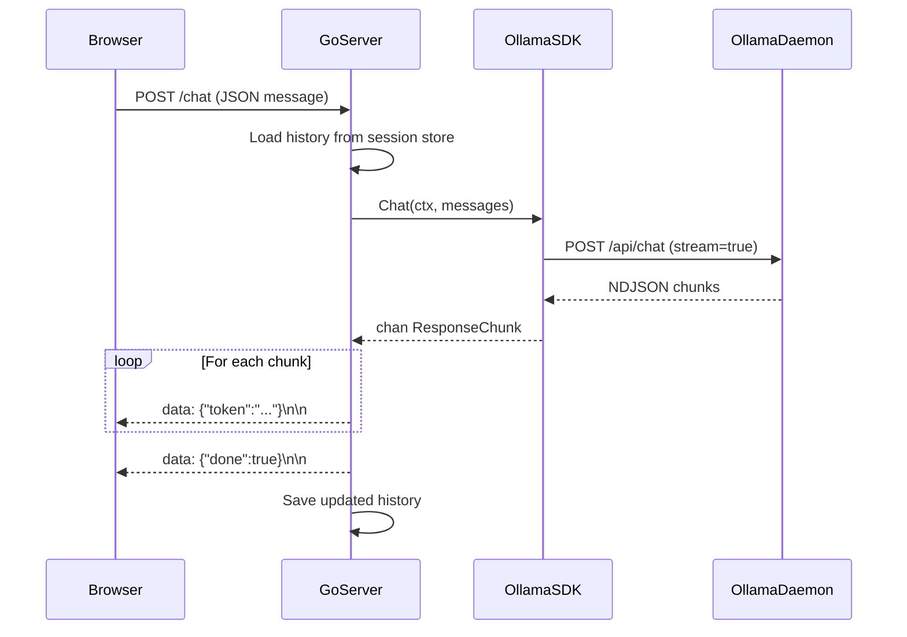

# 💬 Building Chatbots with Go + LLMs

## Introduction

A chatbot is more than a wrapper around an LLM API. It requires stateful conversation management, careful handling of context windows, and real-time streaming to create a responsive user experience. In this module, you will architect a chatbot backend in Go that maintains message history, manages system prompts, and streams Server-Sent Events (SSE) to a frontend.

Building on the Ollama SDK from [[02 - Ollama Go SDK and API Integration|Module 02]], we will explore how to structure conversation state, handle context truncation, and implement common interaction patterns like question-answering and multi-turn reasoning. This module bridges backend Go engineering with frontend real-time communication.

## 1. Chat Architecture and State Management

Chatbots must persist conversation state across multiple HTTP requests, as LLM APIs are inherently stateless. A typical architecture involves:

- **Session Store:** Maps session IDs to message histories. Can be in-memory (`sync.Map`), Redis, or a database.
- **Context Assembler:** Concatenates system prompt + history + current input before sending to the LLM.
- **Token Counter:** Estimates total tokens to prevent exceeding the model's context window.
- **Streamer:** Forwards LLM tokens to the client via SSE or WebSockets.

⚠️ **Warning:** Storing unbounded conversation history leads to context window overflow. Always implement truncation strategies (e.g., sliding window, summarization, or token-based eviction).

💡 **Tip:** Keep the system prompt concise. Every token consumed by the system prompt reduces the available history capacity.

Real case: **Discord bots** built with Go (using libraries like `discordgo`) frequently integrate with local Ollama instances. They maintain per-channel message histories in Redis, allowing communities to have persistent, context-aware AI moderators and assistants without cloud API costs.

## 2. Conversation Patterns and UX Strategies

Different use cases demand different conversation structures. Mapping the right pattern to the user experience is essential.

| Pattern | Description | UX Strategy | Context Management |
|---------|-------------|-------------|--------------------|
| Single-Turn QA | One question, one answer | Fast, stateless UI | No history stored |
| Multi-Turn Chat | Back-and-forth dialogue | Streaming tokens, typing indicators | Full history, sliding window |
| Guided Workflow | LLM asks clarifying questions | Form-like progressive disclosure | Structured state machine |
| Agentic Tool Use | LLM decides to call functions | Inline cards, confirmation buttons | Tool results appended to history |
| Summarization | Condense long conversations | Collapsible history, timeline view | Summarize older turns |

The context window is a finite resource. Its composition can be expressed as:

**Context_Window = System_Prompt + History + Current_Input**

When `System_Prompt + History + Current_Input` exceeds the model's limit (e.g., 4096, 8192, or 128k tokens), you must truncate or summarize. Common strategies:
- **Sliding Window:** Keep only the last N messages.
- **Token Budgeting:** Evict oldest messages until the total fits.
- **Summarization Chain:** Periodically summarize old history into a compact system note.

## 3. Streaming SSE Responses to Frontend

Server-Sent Events (SSE) provide a unidirectional stream from server to client over standard HTTP. They are ideal for LLM token streaming because they work over corporate firewalls and reconnect automatically.



## 4. Chatbot Server with History Management

Below is a complete Go HTTP server implementing a stateful chatbot with SSE streaming.

```go
package main

import (
	"bufio"
	"bytes"
	"encoding/json"
	"fmt"
	"net/http"
	"strings"
	"sync"
	"time"
)

// --- Models ---

type Message struct {
	Role    string `json:"role"` // system, user, assistant
	Content string `json:"content"`
}

type ChatRequest struct {
	SessionID string `json:"session_id"`
	Message   string `json:"message"`
}

// --- Session Store ---

var (
	sessions = make(map[string][]Message)
	sessionMu sync.RWMutex
)

func getHistory(sessionID string) []Message {
	sessionMu.RLock()
	defer sessionMu.RUnlock()
	history := make([]Message, len(sessions[sessionID]))
	copy(history, sessions[sessionID])
	return history
}

func appendMessage(sessionID string, msg Message) {
	sessionMu.Lock()
	defer sessionMu.Unlock()
	sessions[sessionID] = append(sessions[sessionID], msg)
}

// --- Ollama Streaming Client ---

func streamChatFromOllama(messages []Message, w http.ResponseWriter) error {
	payload := map[string]any{
		"model":    "llama3",
		"messages": messages,
		"stream":   true,
	}
	body, _ := json.Marshal(payload)

	resp, err := http.Post("http://localhost:11434/api/chat", "application/json", bytes.NewReader(body))
	if err != nil {
		return err
	}
	defer resp.Body.Close()

	flusher, ok := w.(http.Flusher)
	if !ok {
		return fmt.Errorf("streaming unsupported")
	}

	scanner := bufio.NewScanner(resp.Body)
	var fullResponse strings.Builder

	for scanner.Scan() {
		var chunk struct {
			Message Message `json:"message"`
			Done    bool    `json:"done"`
		}
		if err := json.Unmarshal(scanner.Bytes(), &chunk); err != nil {
			continue
		}
		if chunk.Message.Content != "" {
			fullResponse.WriteString(chunk.Message.Content)
			event := map[string]any{"token": chunk.Message.Content, "done": false}
			data, _ := json.Marshal(event)
			fmt.Fprintf(w, "data: %s\n\n", data)
			flusher.Flush()
		}
		if chunk.Done {
			break
		}
	}

	// Send completion event
	event := map[string]any{"token": "", "done": true}
	data, _ := json.Marshal(event)
	fmt.Fprintf(w, "data: %s\n\n", data)
	flusher.Flush()

	return nil
}

// --- HTTP Handlers ---

func chatHandler(w http.ResponseWriter, r *http.Request) {
	if r.Method != http.MethodPost {
		http.Error(w, "Method not allowed", http.StatusMethodNotAllowed)
		return
	}

	var req ChatRequest
	if err := json.NewDecoder(r.Body).Decode(&req); err != nil {
		http.Error(w, "Bad request", http.StatusBadRequest)
		return
	}

	// Set SSE headers
	w.Header().Set("Content-Type", "text/event-stream")
	w.Header().Set("Cache-Control", "no-cache")
	w.Header().Set("Connection", "keep-alive")
	w.Header().Set("Access-Control-Allow-Origin", "*")

	// Build messages
	history := getHistory(req.SessionID)
	messages := append(history, Message{Role: "user", Content: req.Message})

	// Prepend system prompt if new session
	if len(history) == 0 {
		system := Message{Role: "system", Content: "You are a helpful assistant. Answer concisely."}
		messages = append([]Message{system}, messages...)
	}

	// Stream response
	if err := streamChatFromOllama(messages, w); err != nil {
		fmt.Println("Streaming error:", err)
		return
	}

	// Save to history (Note: in production, capture assistant response from stream)
	appendMessage(req.SessionID, Message{Role: "user", Content: req.Message})
	// For simplicity, we omit saving the assistant reply in this snippet.
}

func main() {
	http.HandleFunc("/chat", chatHandler)
	fmt.Println("Chatbot server on :8080")
	http.ListenAndServe(":8080", nil)
}
```

Real case: **Customer support platforms** use Go chatbot backends to handle thousands of concurrent SSE connections. By storing histories in PostgreSQL with session IDs, they provide persistent conversations across browser refreshes and device switches.

---

## 📦 Compression Code

```go
package main

import (
	"bufio"
	"bytes"
	"encoding/json"
	"fmt"
	"net/http"
	"strings"
	"sync"
)

type Msg struct{ Role, Content string }

var store sync.Map

func chat(w http.ResponseWriter, r *http.Request) {
	var req struct {
		SessionID string `json:"session_id"`
		Message   string `json:"message"`
	}
	json.NewDecoder(r.Body).Decode(&req)

	w.Header().Set("Content-Type", "text/event-stream")
	w.Header().Set("Cache-Control", "no-cache")

	var hist []Msg
	if v, ok := store.Load(req.SessionID); ok {
		hist = v.([]Msg)
	}
	msgs := append(hist, Msg{"user", req.Message})

	body, _ := json.Marshal(map[string]any{"model": "llama3", "messages": msgs, "stream": true})
	resp, _ := http.Post("http://localhost:11434/api/chat", "application/json", bytes.NewReader(body))
	defer resp.Body.Close()

	f, _ := w.(http.Flusher)
	scan := bufio.NewScanner(resp.Body)
	var reply strings.Builder

	for scan.Scan() {
		var c struct {
			Message Msg  `json:"message"`
			Done    bool `json:"done"`
		}
		json.Unmarshal(scan.Bytes(), &c)
		if c.Message.Content != "" {
			reply.WriteString(c.Message.Content)
			b, _ := json.Marshal(map[string]any{"token": c.Message.Content})
			fmt.Fprintf(w, "data: %s\n\n", b)
			f.Flush()
		}
		if c.Done {
			break
		}
	}
	store.Store(req.SessionID, append(msgs, Msg{"assistant", reply.String()}))
}

func main() {
	http.HandleFunc("/chat", chat)
	http.ListenAndServe(":8080", nil)
}
```

## 🎯 Documented Project

### Description

Build a production-ready chatbot API with session management, context window truncation, and a web frontend. The backend will be pure Go, using Ollama for inference, and the frontend will consume SSE to display streaming responses.

### Functional Requirements

1. Accept `POST /chat` with `session_id` and `message`; return SSE stream.
2. Maintain per-session message history in memory (extendable to Redis).
3. Implement sliding window truncation: when history exceeds 4000 tokens, drop oldest user/assistant pairs.
4. Support a configurable system prompt per session.
5. Provide a `POST /reset` endpoint to clear a session's history.

### Main Components

- **Session Manager:** `sync.Map` wrapper with TTL eviction.
- **Token Estimator:** Simple word-count heuristic for context truncation.
- **SSE Controller:** HTTP handler managing `text/event-stream` formatting and flushing.
- **History Truncator:** Ensures prompt payload stays within model context limits.

### Success Metrics

- API handles 100 concurrent SSE streams without goroutine leaks.
- Context window never exceeds 4096 tokens (measured via estimation).
- Sessions persist for 24 hours before automatic cleanup.

### References

- Ollama Chat API: https://github.com/ollama/ollama/blob/main/docs/api.md#generate-a-chat-completion
- Go `http.Flusher`: https://pkg.go.dev/net/http#Flusher
- Server-Sent Events Spec: https://html.spec.whatwg.org/multipage/server-sent-events.html
