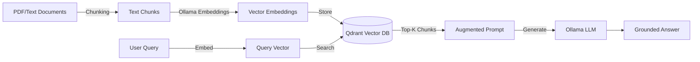
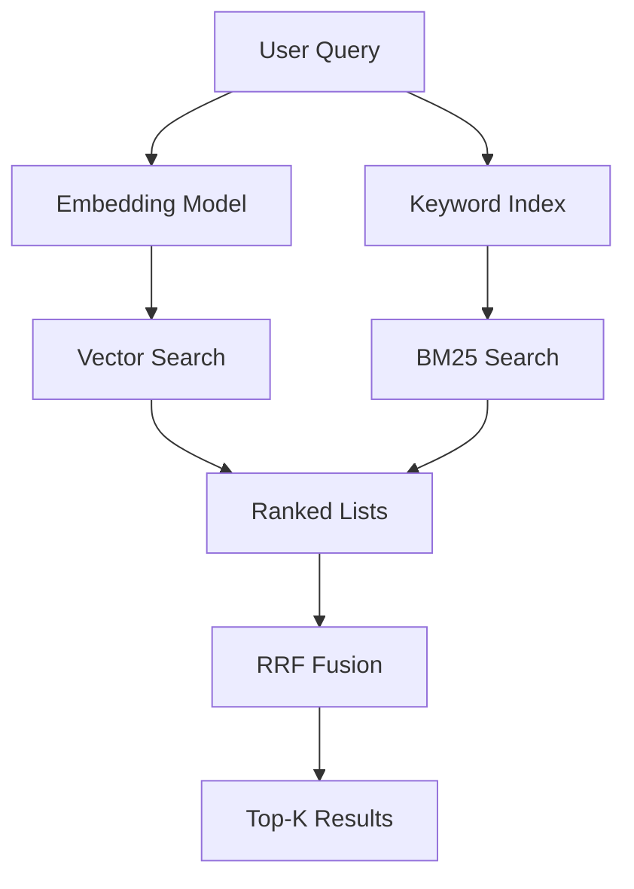

# 🔍 RAG Pipelines with Go and Vector DBs

## Introduction

Retrieval-Augmented Generation (RAG) enhances LLMs by grounding their responses in external knowledge. Instead of relying solely on parametric memory (weights learned during training), a RAG system retrieves relevant documents from a vector database and injects them into the prompt as context. This eliminates hallucinations on proprietary data and keeps answers current without retraining models.

In this module, you will build a complete RAG pipeline in Go. We will cover text chunking strategies, embedding generation via Ollama, vector search using [[Qdrant]], and hybrid retrieval combining keyword and semantic matching. This pipeline is the core engine behind modern local knowledge bases and AI assistants.

## 1. RAG Architecture in Go

A production RAG system consists of four stages:

- **Ingestion:** Documents are loaded, parsed, and split into chunks.
- **Embedding:** Each chunk is converted into a high-dimensional vector using an embedding model (e.g., `nomic-embed-text`).
- **Indexing:** Vectors are stored in a vector database with metadata (source, page, chunk ID).
- **Retrieval:** At query time, the user's question is embedded and used to find the nearest neighbor vectors.



⚠️ **Warning:** Chunk size drastically affects retrieval quality. Chunks that are too small lose context; chunks that are too large dilute semantic focus. Experiment with 200-500 tokens and overlapping windows.

💡 **Tip:** Use recursive character text splitting: first split by paragraphs, then by sentences, then by words. This preserves semantic boundaries better than fixed-size splitting.

Real case: **Legal tech companies** build local RAG systems with Go + Ollama to search private contract libraries. By keeping all data on-premise, they satisfy client confidentiality requirements while delivering GPT-4-class question answering.

## 2. Vector Databases and Go Clients

Vector databases specialize in approximate nearest neighbor (ANN) search. Several options offer first-class Go support.

| Database | Go Client | Deployment | ANN Algorithm | Metadata Filtering | Best For |
|----------|-----------|------------|---------------|--------------------|----------|
| **Qdrant** | Official `qdrant/go-client` | Docker, Cloud | HNSW | Yes | Local dev, scalable RAG |
| **Weaviate** | Official `weaviate/weaviate-go-client` | Docker, Cloud | HNSW | Yes | Semantic search, GraphQL |
| **Chroma** | Community REST wrapper | Docker, Local | HNSW | Limited | Prototyping, small scale |
| **pgvector** | `pgvector/pgvector` + `lib/pq` | PostgreSQL | IVFFlat, HNSW | SQL | Existing Postgres users |

Cosine similarity measures the angle between two vectors, which is the standard metric for semantic search:

**Similarity = cos(θ) = (A · B) / (||A|| × ||B||)**

Where:
- `A · B` is the dot product of the two vectors.
- `||A||` and `||B||` are the Euclidean norms (magnitudes) of the vectors.

Most vector databases normalize embeddings during indexing, allowing optimized dot-product search equivalent to cosine similarity.

## 3. Hybrid Search: Keyword + Semantic

Pure vector search can miss exact keyword matches (e.g., product SKUs, legal citations). Hybrid search combines:
- **Dense Retrieval:** Vector similarity for semantic meaning.
- **Sparse Retrieval:** BM25 or TF-IDF for exact lexical matches.

Results from both methods are fused using Reciprocal Rank Fusion (RRF):

`RRF_score(d) = Σ 1 / (k + rank_i(d))`

Where `k` is a constant (typically 60) and `rank_i(d)` is the rank of document `d` in method `i`.



## 4. RAG Pipeline with Qdrant in Go

This example demonstrates ingestion and retrieval using Qdrant's Go gRPC client.

```go
package main

import (
	"context"
	"fmt"
	"log"
	"time"

	"github.com/qdrant/go-client/qdrant"
	"google.golang.org/grpc"
	"google.golang.org/grpc/credentials/insecure"
)

const (
	qdrantHost = "localhost:6334"
	collection = "documents"
	vectorSize = 768 // nomic-embed-text dimension
)

func createCollection(ctx context.Context, client qdrant.CollectionsClient) error {
	_, err := client.Create(ctx, &qdrant.CreateCollection{
		CollectionName: collection,
		VectorsConfig: &qdrant.VectorsConfig{
			Config: &qdrant.VectorsConfig_Params{
				Params: &qdrant.VectorParams{
					Size:     vectorSize,
					Distance: qdrant.Distance_Cosine,
				},
			},
		},
	})
	return err
}

func upsertPoints(ctx context.Context, client qdrant.PointsClient, points []*qdrant.PointStruct) error {
	_, err := client.Upsert(ctx, &qdrant.UpsertPoints{
		CollectionName: collection,
		Points:         points,
	})
	return err
}

func search(ctx context.Context, client qdrant.PointsClient, vector []float32) ([]*qdrant.ScoredPoint, error) {
	result, err := client.Search(ctx, &qdrant.SearchPoints{
		CollectionName: collection,
		Vector:         vector,
		Limit:          3,
		WithPayload:    &qdrant.WithPayloadSelector{SelectorOptions: &qdrant.WithPayloadSelector_Enable{Enable: true}},
	})
	if err != nil {
		return nil, err
	}
	return result.Result, nil
}

func main() {
	conn, err := grpc.Dial(qdrantHost, grpc.WithTransportCredentials(insecure.NewCredentials()))
	if err != nil {
		log.Fatal(err)
	}
	defer conn.Close()

	ctx, cancel := context.WithTimeout(context.Background(), 10*time.Second)
	defer cancel()

	collectionsClient := qdrant.NewCollectionsClient(conn)
	pointsClient := qdrant.NewPointsClient(conn)

	// Create collection
	if err := createCollection(ctx, collectionsClient); err != nil {
		log.Println("Collection may already exist:", err)
	}

	// Example: ingest a chunk (in production, generate via Ollama embeddings)
	vector := make([]float32, vectorSize)
	for i := range vector {
		vector[i] = 0.1 // placeholder embedding
	}

	points := []*qdrant.PointStruct{
		{
			Id: &qdrant.PointId{
				PointIdOptions: &qdrant.PointId_Num{Num: 1},
			},
			Vectors: &qdrant.Vectors{
				VectorsOptions: &qdrant.Vectors_Vector{Vector: &qdrant.Vector{Data: vector}},
			},
			Payload: map[string]*qdrant.Value{
				"text": {Kind: &qdrant.Value_StringValue{StringValue: "Go is a statically typed language designed at Google."}},
				"source": {Kind: &qdrant.Value_StringValue{StringValue: "go_docs.md"}},
			},
		},
	}

	if err := upsertPoints(ctx, pointsClient, points); err != nil {
		log.Fatal(err)
	}

	// Search
	results, err := search(ctx, pointsClient, vector)
	if err != nil {
		log.Fatal(err)
	}

	for _, r := range results {
		fmt.Printf("Score: %.4f | Text: %s\n", r.Score, r.Payload["text"].GetStringValue())
	}
}
```

Real case: **Open-source knowledge management tools** like Logseq and Obsidian plugins use Go backends with Qdrant to index personal notes. Users query their second brain via natural language without sending data to external APIs.

---

## 📦 Compression Code

```go
package main

import (
	"bytes"
	"context"
	"encoding/json"
	"fmt"
	"net/http"
	"time"
)

// Minimal Ollama embedding client
func getEmbedding(text string) ([]float32, error) {
	payload := map[string]any{"model": "nomic-embed-text", "prompt": text}
	b, _ := json.Marshal(payload)
	resp, err := http.Post("http://localhost:11434/api/embeddings", "application/json", bytes.NewReader(b))
	if err != nil {
		return nil, err
	}
	defer resp.Body.Close()
	var r struct{ Embedding []float32 `json:"embedding"` }
	json.NewDecoder(resp.Body).Decode(&r)
	return r.Embedding, nil
}

// Simplified in-memory vector store
type MemStore struct {
	vectors []struct {
		id      string
		vec     []float32
		payload map[string]string
	}
}

func (s *MemStore) Add(id string, vec []float32, payload map[string]string) {
	s.vectors = append(s.vectors, struct {
		id      string
		vec     []float32
		payload map[string]string
	}{id, vec, payload})
}

func (s *MemStore) Search(query []float32, topK int) []struct {
		id      string
		score   float32
		payload map[string]string
	} {
	var results []struct {
		id      string
		score   float32
		payload map[string]string
	}
	for _, v := range s.vectors {
		score := dotProduct(v.vec, query)
		results = append(results, struct {
			id      string
			score   float32
			payload map[string]string
		}{v.id, score, v.payload})
	}
	// In real code, sort and limit
	if len(results) > topK {
		results = results[:topK]
	}
	return results
}

func dotProduct(a, b []float32) float32 {
	var sum float32
	for i := range a {
		sum += a[i] * b[i]
	}
	return sum
}

func main() {
	ctx, cancel := context.WithTimeout(context.Background(), 30*time.Second)
	defer cancel()
	_ = ctx

	vec, err := getEmbedding("What is Go used for?")
	if err != nil {
		fmt.Println("Embed error:", err)
		return
	}
	fmt.Println("Embedding length:", len(vec))
}
```

## 🎯 Documented Project

### Description

Construct a CLI tool that ingests a directory of Markdown files, chunks them, generates embeddings via Ollama, stores them in Qdrant, and answers questions using retrieved context.

### Functional Requirements

1. Recursively read `.md` files from a given directory.
2. Split files into 300-token chunks with 50-token overlap.
3. Generate embeddings for each chunk using Ollama's `nomic-embed-text` model.
4. Store vectors and metadata (filename, chunk index, text) in Qdrant.
5. Accept a user query, embed it, retrieve top-5 chunks, and generate an answer via Ollama chat with context injected.

### Main Components

- **Chunker:** Recursive text splitter preserving paragraph boundaries.
- **Embedding Bridge:** Go HTTP client calling Ollama `/api/embeddings`.
- **Qdrant Manager:** gRPC client for collection and point operations.
- **RAG Engine:** Query embedder, retriever, and prompt assembler.

### Success Metrics

- Retrieval precision: top-1 chunk contains answer in 80% of test queries.
- End-to-end latency under 5 seconds for a 100-document corpus.
- Zero data leaves the local machine (fully air-gapped capable).

### References

- Qdrant Go Client: https://github.com/qdrant/go-client
- Nomic Embed Text: https://ollama.com/library/nomic-embed-text
- RAG Survey Paper: https://arxiv.org/abs/2312.10997
