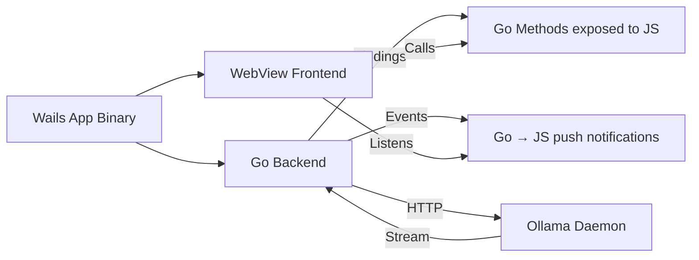

# 🖥️ Desktop Apps with Wails

## Introduction

Modern AI tools are not limited to the terminal or browser. Desktop applications provide native performance, offline capabilities, and direct access to local resources like GPU and filesystem. For Go developers, [[Wails]] offers a unique value proposition: a Go backend handling business logic and AI integration, paired with any modern frontend framework (Svelte, Vue, React) for the user interface.

In this module, you will learn Wails architecture, IPC mechanisms between Go and JavaScript, and how to package a complete AI assistant as a cross-platform desktop application. We will integrate the Ollama client from [[02 - Ollama Go SDK and API Integration|Module 02]] into a Wails app, creating a seamless local AI experience.

## 1. Wails Architecture

Wails v2 compiles a Go application into a native binary with an embedded WebView. Unlike Electron, which bundles Chromium, Wails uses the operating system's native web renderer (WebKit on macOS, WebView2 on Windows, WebKitGTK on Linux). This results in dramatically smaller bundle sizes and lower memory footprints.



Key architectural components:
- **Bindings:** Go methods annotated with `//exposed` are callable from JavaScript via generated TypeScript definitions.
- **Events:** Bidirectional pub/sub system. Go can emit events that JavaScript listens to, and vice versa.
- **Context Menu / Dialogs:** Native OS dialogs for file pickers, messages, and menus.
- **Asset Embedding:** Frontend build output is embedded into the Go binary using `//go:embed`.

⚠️ **Warning:** WebView2 on Windows requires a runtime installation. Wails handles this with an installer bootstrapper, but you must test on clean Windows VMs to ensure first-run success.

💡 **Tip:** Use Svelte for the frontend if you want minimal bundle overhead. Its compiled output is significantly smaller than React or Vue.

Real case: **Independent developers** building AI coding assistants use Wails to create IDE-adjacent tools that monitor clipboard content, query local Ollama models, and suggest refactors via native desktop notifications.

## 2. IPC: Bindings, Events, and Dialogs

Wails provides two primary IPC mechanisms:

| Mechanism | Direction | Use Case | Latency |
|-----------|-----------|----------|---------|
| **Bindings** | JS → Go | Method calls, AI requests, file I/O | ~1ms |
| **Events** | Bidirectional | Streaming tokens, progress updates, notifications | ~0.5ms |
| **Dialogs** | Go → User | File pickers, confirmation modals | Native |

Binding Example:
```go
// Go backend
func (a *App) Greet(name string) string {
    return fmt.Sprintf("Hello %s!", name)
}
```
```javascript
// Frontend
let result = await window.go.main.App.Greet('World');
```

Event Example (streaming LLM tokens from Go to frontend):
```go
runtime.EventsEmit(ctx, "token", chunk.Response)
```
```javascript
window.runtime.EventsOn("token", (token) => {
    appendToChat(token);
});
```

Bundle size estimation for a Wails app:

**Bundle_Size = Go_Binary + Frontend_Assets + Runtime**

- Go Binary: ~10-20MB (statically linked, stripped).
- Frontend Assets: ~100KB-2MB (depends on framework, Svelte is leanest).
- Runtime: ~0MB on macOS/Linux (system WebView), ~130KB bootstrapper on Windows.

Compare this to Electron, where the runtime alone adds ~150MB.

## 3. Desktop Frameworks Comparison

Choosing the right framework depends on your team's expertise and deployment constraints.

| Feature | Wails | Fyne | Electron | Tauri |
|---------|-------|------|----------|-------|
| Backend Language | Go | Go | JavaScript/Node | Rust |
| Frontend Tech | Any JS framework | Custom Canvas | Any JS framework | Any JS framework |
| Bundle Size | ~15MB | ~15MB | ~150MB+ | ~5MB |
| Memory Usage | Low | Low | High | Very Low |
| Native Look | Yes (WebView) | Yes (Custom) | No | Yes (WebView) |
| IPC Performance | High | High | Moderate | High |
| Mobile Support | No | Yes | No | Planned |

## 4. Wails App Skeleton with Ollama Integration

Below is a minimal Wails v2 application structure integrating Ollama streaming.

```go
// app.go
package main

import (
	"context"
	"fmt"
	"time"

	"github.com/wailsapp/wails/v2/pkg/runtime"
)

// App struct
type App struct {
	ctx context.Context
}

// NewApp creates a new App application struct
func NewApp() *App {
	return &App{}
}

// startup is called when the app starts
func (a *App) startup(ctx context.Context) {
	a.ctx = ctx
}

// Generate calls Ollama and streams tokens via events
func (a *App) Generate(prompt string) error {
	// In production, use the SDK from Module 02
	// Here we simulate streaming
	tokens := []string{"Go", " is", " a", " powerful", " language", "."}
	for _, tok := range tokens {
		runtime.EventsEmit(a.ctx, "token", tok)
		time.Sleep(100 * time.Millisecond)
	}
	runtime.EventsEmit(a.ctx, "done", true)
	return nil
}

// GetModels returns available models (stub)
func (a *App) GetModels() []string {
	return []string{"llama3", "mistral", "codellama"}
}
```

```go
// main.go
package main

import (
	"embed"

	"github.com/wailsapp/wails/v2"
	"github.com/wailsapp/wails/v2/pkg/options"
	"github.com/wailsapp/wails/v2/pkg/options/assetserver"
)

//go:embed all:frontend/dist
var assets embed.FS

func main() {
	app := NewApp()

	err := wails.Run(&options.App{
		Title:  "Local AI Assistant",
		Width:  1024,
		Height: 768,
		AssetServer: &assetserver.Options{
			Assets: assets,
		},
		BackgroundColour: &options.RGBA{R: 27, G: 38, B: 54, A: 1},
		OnStartup:        app.startup,
		Bind: []interface{}{
			app,
		},
	})

	if err != nil {
		println("Error:", err.Error())
	}
}
```

Frontend (Svelte snippet):
```svelte
<script>
  import { onMount } from 'svelte';
  let prompt = "";
  let response = "";

  onMount(() => {
    window.runtime.EventsOn("token", (token) => {
      response += token;
    });
  });

  async function ask() {
    response = "";
    await window.go.main.App.Generate(prompt);
  }
</script>

<input bind:value={prompt} placeholder="Ask anything..." />
<button on:click={ask}>Generate</button>
<p>{response}</p>
```

Real case: **AI desktop utilities** for writers use Wails to provide a distraction-free interface to local LLMs. The Go backend handles document parsing, vector search (from [[04 - RAG Pipelines with Go and Vector DBs|Module 04]]), and streaming, while the Svelte frontend manages markdown rendering and export.

---

## 📦 Compression Code

```go
package main

import (
	"context"
	"embed"
	"fmt"

	"github.com/wailsapp/wails/v2"
	"github.com/wailsapp/wails/v2/pkg/options"
	"github.com/wailsapp/wails/v2/pkg/options/assetserver"
	"github.com/wailsapp/wails/v2/pkg/runtime"
)

//go:embed all:frontend/dist
var assets embed.FS

type App struct{ ctx context.Context }

func NewApp() *App { return &App{} }

func (a *App) startup(ctx context.Context) { a.ctx = ctx }

func (a *App) Greet(name string) string {
	return fmt.Sprintf("Hello %s, It works!", name)
}

func (a *App) StreamTokens(prompt string) {
	for _, t := range []string{"Local", " AI", " is", " awesome", "!"} {
		runtime.EventsEmit(a.ctx, "token", t)
	}
	runtime.EventsEmit(a.ctx, "done", true)
}

func main() {
	app := NewApp()
	wails.Run(&options.App{
		Title:            "AI App",
		Width:            800,
		Height:           600,
		BackgroundColour: &options.RGBA{R: 255, G: 255, B: 255, A: 1},
		AssetServer:      &assetserver.Options{Assets: assets},
		OnStartup:        app.startup,
		Bind:             []interface{}{app},
	})
}
```

## 🎯 Documented Project

### Description

Build a Wails desktop application named "LocalMind" that serves as a universal interface to Ollama. It will feature a chat interface, model selector, conversation history sidebar, and a settings panel for configuring the Ollama base URL.

### Functional Requirements

1. Display a scrollable chat history with user and assistant messages.
2. Allow users to select models from a dropdown populated by `/api/tags`.
3. Stream responses from Ollama into the chat window in real time.
4. Persist conversation history to a local SQLite database via Go.
5. Support Markdown rendering for assistant responses (code blocks, lists).

### Main Components

- **Wails App Shell:** `main.go` and `app.go` with bindings and events.
- **Chat Service:** Go struct managing HTTP calls to Ollama and SSE parsing.
- **History Repository:** SQLite wrapper using `database/sql` and `modernc.org/sqlite`.
- **Svelte Frontend:** Components for ChatBubble, ModelSelector, and Sidebar.

### Success Metrics

- Application bundles to a single executable under 25MB.
- Time-to-first-token under 1 second for Llama 3 8B.
- Supports 10,000 messages in history without UI lag.

### References

- Wails Documentation: https://wails.io/docs/introduction
- Wails Examples: https://github.com/wailsapp/wails/tree/master/v2/examples
- WebView2 Runtime: https://developer.microsoft.com/en-us/microsoft-edge/webview2
