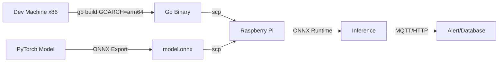
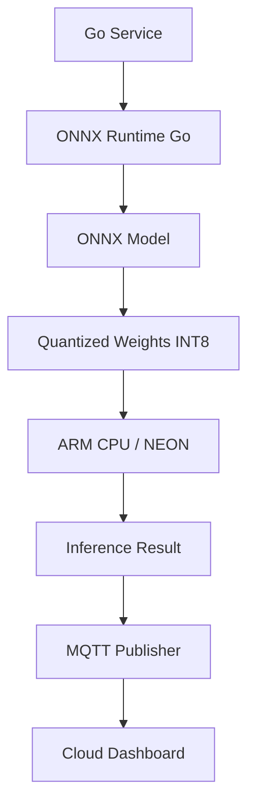

# 📱 Edge AI Deployment with Go

## Introduction

Edge AI refers to running inference directly on local devices—raspberry Pis, industrial gateways, drones, and smartphones—rather than in the cloud. This paradigm is essential for applications requiring low latency, offline operation, and data privacy. Go is uniquely suited for edge deployment due to its small binary size, efficient concurrency, and cross-compilation support for ARM architectures.

In this module, you will learn how to optimize models for edge constraints through quantization and pruning, cross-compile Go applications for ARM devices, and perform inference using ONNX Runtime Go bindings. We will deploy a lightweight image classification pipeline on a Raspberry Pi, demonstrating a complete edge AI workflow.

## 1. Edge Constraints and Optimization

Edge devices operate under severe resource limitations:

- **Compute:** ARM CPUs with 1-4 cores, often without GPUs.
- **Memory:** 512MB to 4GB RAM shared across OS and applications.
- **Power:** Battery-operated devices require sustained low wattage.
- **Network:** Intermittent or absent connectivity rules out cloud fallback.

To fit models into these constraints, two primary techniques are used:

- **Quantization:** Reduces weight precision (FP32 → INT8 → INT4). INT8 models are 4x smaller and run 2-4x faster on ARM NEON instructions.
- **Pruning:** Removes weights with near-zero contribution, reducing FLOPs. Structured pruning (removing entire channels) is hardware-friendly.

⚠️ **Warning:** INT8 quantization can degrade accuracy on tasks requiring fine-grained distinctions (e.g., medical imaging). Always validate quantized model accuracy against a test set before deployment.

💡 **Tip:** Use ONNX Runtime's quantization-aware training (QAT) tools to minimize accuracy loss when converting to INT8.

Real case: **Precision agriculture companies** deploy Go-based edge AI on solar-powered Raspberry Pis in remote fields. These devices run quantized plant-disease detection models, alerting farmers via LoRaWAN only when a disease is detected—minimizing bandwidth and maximizing battery life.

## 2. Go on ARM Devices

Go's cross-compilation makes ARM deployment trivial. No ARM toolchain is required on the host machine.

```bash
# Cross-compile for Raspberry Pi (ARM64)
GOOS=linux GOARCH=arm64 go build -o edge_app .

# Cross-compile for older Raspberry Pi (ARMv7)
GOOS=linux GOARCH=arm GOARM=7 go build -o edge_app .
```

Deployment workflow:
1. Build the Go binary on your development machine.
2. `scp` the binary and ONNX model to the device.
3. Run as a systemd service for production uptime.



## 3. Edge Platforms Comparison

Selecting hardware depends on inference requirements and power budgets.

| Platform | CPU | GPU/NN Accelerator | RAM | Power | Best For |
|----------|-----|-------------------|-----|-------|----------|
| **Raspberry Pi 5** | ARM Cortex-A76 | VideoCore VII | 4-8GB | 5-15W | General edge, prototyping |
| **NVIDIA Jetson Nano** | ARM Cortex-A57 | 128-core Maxwell | 4GB | 5-10W | CUDA-accelerated CV |
| **Coral Dev Board** | ARM Cortex-A53 | Edge TPU | 1GB | 3W | TensorFlow Lite, low power |
| **Intel NUC** | x86_64 | Intel iGPU | 8-64GB | 15-65W | High-performance edge |
| **Apple Silicon (M-series)** | ARM (M1/M2/M3) | Neural Engine | 8-128GB | 10-30W | Development, macOS apps |

Inference time is determined by computational requirements versus hardware throughput:

**Inference_Time = FLOPs / (OPS_per_Second)**

Where:
- **FLOPs:** Floating-point operations required for one forward pass.
- **OPS_per_Second:** Hardware throughput (e.g., ARM NEON ~20 GFLOPS, Jetson Nano GPU ~100 GFLOPS).

Real case: **Maritime monitoring systems** use Jetson Nano boards on buoys to detect illegal fishing vessels. Go services manage sensor fusion, run quantized YOLOv8 via ONNX Runtime, and compress alerts for satellite uplink.

## 4. ONNX Runtime Go on Raspberry Pi

ONNX Runtime is a cross-platform inference engine. The `github.com/microsoft/onnxruntime-go` bindings (or CGO wrappers) enable Go applications to load and execute `.onnx` models.

```go
package main

import (
	"fmt"
	"log"

	onnx "github.com/microsoft/onnxruntime-go"
)

func main() {
	// Initialize ONNX Runtime
	env, err := onnx.NewEnvironment()
	if err != nil {
		log.Fatal(err)
	}
	defer env.Release()

	// Load model
	session, err := onnx.NewAdvancedSession(
		"model.onnx",
		[]string{"input"},   // input names
		[]string{"output"}, // output names
		[]*onnx.Tensor{},
		[]*onnx.Tensor{},
		env,
	)
	if err != nil {
		log.Fatal(err)
	}
	defer session.Release()

	// Prepare input tensor (example: 1x3x224x224 float32 image)
	inputShape := []int64{1, 3, 224, 224}
	inputData := make([]float32, 1*3*224*224)
	// ... populate inputData with preprocessed image ...

	inputTensor, err := onnx.NewTensor(inputShape, inputData)
	if err != nil {
		log.Fatal(err)
	}
	defer inputTensor.Release()

	outputShape := []int64{1, 1000} // Example: 1000-class classification
	outputData := make([]float32, 1000)
	outputTensor, err := onnx.NewTensor(outputShape, outputData)
	if err != nil {
		log.Fatal(err)
	}
	defer outputTensor.Release()

	// Run inference
	err = session.Run(
		[]*onnx.Tensor{inputTensor},
		[]*onnx.Tensor{outputTensor},
	)
	if err != nil {
		log.Fatal(err)
	}

	// Read output
	results := outputTensor.GetData().([]float32)
	fmt.Println("Output sample:", results[:5])
}
```

For pure Go without CGO (useful when cross-compiling is difficult), consider:
- **TensorFlow Lite Go:** bindings for TFLite interpreters.
- **GGML / llama.cpp bindings:** Community Go wrappers for running LLMs on CPU.
- **Ollama on ARM:** Ollama itself runs on ARM64 Linux, making it viable for edge LLM inference on Raspberry Pi 4/5 with 8GB RAM.



---

## 📦 Compression Code

```go
package main

import (
	"fmt"
	"log"
	"os/exec"
	"runtime"
	"time"
)

// Simple edge inference orchestrator without external ML libs
func main() {
	fmt.Println("Edge AI Node Starting...")
	fmt.Printf("OS: %s, Arch: %s\n", runtime.GOOS, runtime.GOARCH)

	// Simulate calling an external ONNX Runtime binary or Python stub
	// In production, replace with onnxruntime-go bindings
	cmd := exec.Command("python3", "-c", `
import time
print("Model loaded")
for i in range(5):
    print(f"Inference batch {i}: OK")
    time.sleep(0.5)
`)
	out, err := cmd.CombinedOutput()
	if err != nil {
		log.Fatal(err)
	}
	fmt.Println(string(out))

	// Heartbeat loop
	ticker := time.NewTicker(30 * time.Second)
	defer ticker.Stop()
	for range ticker.C {
		fmt.Println("[HEARTBEAT] System OK at", time.Now().Format(time.RFC3339))
	}
}
```

## 🎯 Documented Project

### Description

Develop an edge AI gateway called "FieldNode" that runs on a Raspberry Pi 4/5. It captures images from a USB camera, runs a quantized MobileNetV3 ONNX model for crop-health classification, and sends alerts via MQTT when disease is detected. The entire stack is written in Go, including image preprocessing and MQTT publishing.

### Functional Requirements

1. Capture frames from a V4L2 USB camera at 1 FPS using a Go V4L2 library or external trigger.
2. Preprocess images (resize to 224x224, normalize) using pure Go or OpenCV bindings.
3. Load and run a quantized `mobilenetv3.onnx` model via ONNX Runtime Go.
4. Classify output into healthy, early_blight, or late_blight with confidence thresholds.
5. Publish alerts to an MQTT broker (e.g., Mosquitto) when confidence exceeds 85%.

### Main Components

- **Camera Reader:** Go module interfacing with V4L2 or raspistill subprocess.
- **Preprocessor:** Image resizing and normalization pipeline.
- **ONNX Engine:** Session manager wrapping `onnxruntime-go` for model execution.
- **MQTT Publisher:** Paho MQTT client for alert transmission.
- **Systemd Service:** Unit file for auto-start on boot.

### Success Metrics

- Inference latency under 2 seconds per frame on Raspberry Pi 4.
- Binary size under 30MB (excluding ONNX model).
- 72-hour continuous operation without memory leaks.
- Power consumption under 7 watts average.

### References

- ONNX Runtime Go: https://github.com/microsoft/onnxruntime-go
- Go Cross Compilation: https://go.dev/doc/install/source#environment
- Raspberry Pi Documentation: https://www.raspberrypi.com/documentation/
- ONNX Quantization: https://onnxruntime.ai/docs/performance/model-optimizations/quantization.html
