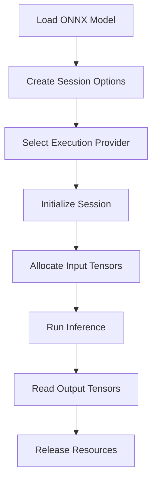

# 🔢 ONNX Runtime Go

## Introduction

The Open Neural Network Exchange (ONNX) format has emerged as the lingua franca of machine learning model serialization. It provides an open standard that enables models trained in PyTorch, TensorFlow, scikit-learn, or MATLAB to be exported into a single interoperable representation. For Go engineers, this interoperability is transformative: you can serve models without maintaining a Python runtime in production.

This note explores ONNX Runtime Go, the official C API bindings that allow Go programs to load, optimize, and execute ONNX models. You will learn the architecture of ONNX Runtime, how execution providers accelerate inference on different hardware, and how to write complete inference pipelines in pure Go. Understanding ONNX Runtime is foundational because it decouples model training from serving, enabling teams to deploy models in edge devices, cloud containers, and microservices with identical behavior.

By the end of this note, you will understand how ONNX Runtime manages session state, tensor memory, and execution provider delegation, and you will have written a production-ready Go inference client.

## 1. ONNX Format and Runtime Architecture

ONNX is not merely a file format; it is a computational graph specification. When you export a model to ONNX, you serialize a directed acyclic graph of operations (nodes) and multidimensional arrays (tensors). The ONNX Runtime engine parses this graph, applies optimizations (constant folding, operator fusion, memory planning), and dispatches execution to hardware-specific backends called **execution providers**.

- **Interoperability:** A model trained in PyTorch can be exported to ONNX and served in Go without conversion loss
- **Optimization:** ONNX Runtime applies graph optimizations before inference, reducing redundant computations
- **Execution Providers:** CPU, CUDA (NVIDIA GPU), DirectML (Windows GPU), OpenVINO (Intel), TensorRT, and more
- **Versioning:** ONNX opset versions ensure backward compatibility across runtime releases

⚠️ **Warning:** Not all PyTorch/TensorFlow operations have ONNX equivalents. Dynamic shapes and control flow may fail during export. Always validate the exported model with ONNX Runtime's correctness checker before deploying.

Real case: **Microsoft** uses ONNX Runtime as the inference engine for Office 365's intelligent features, including real-time grammar suggestions and image analysis. By using ONNX Runtime with DirectML execution providers, they achieve hardware-accelerated inference across Windows, macOS, iOS, and Android from a single model artifact.

💡 **Tip:** Use the ONNX Runtime profiling API (`EnableProfiling`) during development to identify which graph nodes consume the most time. This helps you decide whether to use a different execution provider or quantize specific operators.

## 2. Execution Providers Comparison

| Provider | Hardware | Best For | Latency | Setup Complexity |
|---|---|---|---|---|
| CPU (Default) | Any CPU | Portability, edge devices | Baseline | Minimal |
| CUDA | NVIDIA GPU | Large batch CNN/Transformer | Low | Requires CUDA toolkit |
| DirectML | Windows GPU/DirectX 12 | Cross-vendor GPU on Windows | Low | Windows-only |
| OpenVINO | Intel CPU/GPU/VPU | Intel edge devices | Low-Medium | Intel OpenVINO toolkit |
| TensorRT | NVIDIA GPU | Maximum throughput | Very Low | Requires TensorRT SDK |
| CoreML | Apple Neural Engine | iOS/macOS deployment | Low | macOS/iOS only |

The choice of execution provider directly impacts the latency formula for inference.

## 3. ONNX Runtime Inference Flow

### ONNX Runtime Session Lifecycle



### Tensor Memory Layout


The image above represents the tensor abstraction used across ML frameworks. ONNX Runtime manages tensor memory as contiguous buffers with shape metadata, enabling zero-copy transfers when execution providers support it.

## 4. Writing Inference Code in Go

The `onnxruntime_go` package wraps the C API. The core pattern is: create an environment, create a session, prepare input tensors, run, and extract outputs.

The total inference latency follows this formula:

$$
Latency = Session\_Init + Input\_Copy + Inference + Output\_Copy
$$

Session initialization is a one-time cost, while input/output copy and inference recur per request. GPU execution providers reduce inference time but may increase copy overhead due to PCI-e transfers.

```go
package main

import (
	"fmt"
	"log"

	onnx "github.com/yalue/onnxruntime_go"
)

func main() {
	// Initialize ONNX Runtime environment
	onnx.SetSharedLibraryPath("/path/to/onnxruntime.so")
	err := onnx.InitializeEnvironment()
	if err != nil {
		log.Fatal("Failed to initialize ONNX Runtime:", err)
	}
	defer onnx.DestroyEnvironment()

	// Create session options and select CPU execution provider
	sessionOptions, err := onnx.NewSessionOptions()
	if err != nil {
		log.Fatal(err)
	}
	defer sessionOptions.Destroy()

	// Load model
	session, err := onnx.NewAdvancedSession(
		"model.onnx",
		[]string{"input"},   // Input names
		[]string{"output"}, // Output names
		[]onnx.Tensor{},    // Input tensors (set later)
		[]onnx.Tensor{},    // Output tensors (set later)
		sessionOptions,
	)
	if err != nil {
		log.Fatal("Failed to load model:", err)
	}
	defer session.Destroy()

	// Prepare input: batch=1, channels=3, height=224, width=224
	inputShape := onnx.NewShape(1, 3, 224, 224)
	inputData := make([]float32, 1*3*224*224)
	// ... populate inputData with preprocessed image ...

	inputTensor, err := onnx.NewTensor(inputShape, inputData)
	if err != nil {
		log.Fatal(err)
	}
	defer inputTensor.Destroy()

	// Prepare output tensor
	outputShape := onnx.NewShape(1, 1000) // 1000 classes
	outputData := make([]float32, 1*1000)
	outputTensor, err := onnx.NewTensor(outputShape, outputData)
	if err != nil {
		log.Fatal(err)
	}
	defer outputTensor.Destroy()

	// Run inference
	err = session.RunInputOutput(
		[]onnx.Tensor{inputTensor},
		[]onnx.Tensor{outputTensor},
	)
	if err != nil {
		log.Fatal("Inference failed:", err)
	}

	fmt.Println("Output:", outputData)
}
```

## 5. Model Optimization and Quantization

Before deploying to Go backends, optimize the ONNX graph:

- **Graph Optimization:** Use `onnxruntime.Transformers` or `ortools` to fuse Conv+ReLU, MatMul+Add patterns
- **Dynamic Quantization:** Convert weights to INT8 for 2-4x faster CPU inference with minimal accuracy loss
- **Static Quantization:** Requires calibration data but yields better accuracy than dynamic quantization

⚠️ **Warning:** Quantized models may not be supported by all execution providers. CUDA and TensorRT often require FP16 or FP32 inputs. Always verify provider compatibility with your quantized opset.

---

## 📦 Compression Code

```go
package main

import (
	"fmt"
	"log"
	"os"

	onnx "github.com/yalue/onnxruntime_go"
)

// CompressedONNXInference demonstrates loading an ONNX model,
// preparing float32 tensors, and running inference with cleanup.
func CompressedONNXInference(modelPath string) ([]float32, error) {
	onnx.SetSharedLibraryPath(os.Getenv("ONNX_RUNTIME_PATH"))
	if err := onnx.InitializeEnvironment(); err != nil {
		return nil, fmt.Errorf("init env: %w", err)
	}
	defer onnx.DestroyEnvironment()

	opts, err := onnx.NewSessionOptions()
	if err != nil {
		return nil, err
	}
	defer opts.Destroy()

	// For CUDA provider (optional):
	// opts.AppendExecutionProviderCUDA(0)

	session, err := onnx.NewAdvancedSession(
		modelPath,
		[]string{"input"},
		[]string{"output"},
		[]onnx.Tensor{},
		[]onnx.Tensor{},
		opts,
	)
	if err != nil {
		return nil, fmt.Errorf("load model: %w", err)
	}
	defer session.Destroy()

	input := make([]float32, 1*3*224*224)
	inTensor, err := onnx.NewTensor(onnx.NewShape(1, 3, 224, 224), input)
	if err != nil {
		return nil, err
	}
	defer inTensor.Destroy()

	output := make([]float32, 1*1000)
	outTensor, err := onnx.NewTensor(onnx.NewShape(1, 1000), output)
	if err != nil {
		return nil, err
	}
	defer outTensor.Destroy()

	if err := session.RunInputOutput([]onnx.Tensor{inTensor}, []onnx.Tensor{outTensor}); err != nil {
		return nil, fmt.Errorf("inference: %w", err)
	}

	return output, nil
}

func main() {
	result, err := CompressedONNXInference("resnet50.onnx")
	if err != nil {
		log.Fatal(err)
	}
	fmt.Printf("Top class score: %.4f\n", result[0])
}
```

## 🎯 Documented Project

### Description

A **Go ONNX Microservice** that exposes a gRPC API for image classification using a ResNet-50 ONNX model. The service preprocesses incoming image bytes, runs inference via ONNX Runtime, and returns the top-5 predicted classes with confidence scores.

### Functional Requirements

1. Accept gRPC `ClassifyImage` requests containing raw JPEG/PNG bytes
2. Preprocess images to 224x224 RGB float32 tensors with ImageNet normalization
3. Load the ONNX model at startup and reuse the session across requests
4. Return the top-5 class indices and probabilities sorted by score
5. Expose a `/health` HTTP endpoint for Kubernetes liveness probes

### Main Components

- **Preprocessor:** Go `image` package decoding + resize + normalization pipeline
- **ONNX Session Manager:** Singleton wrapper around `onnxruntime_go` with connection pooling
- **gRPC Server:** Protocol Buffers API with unary RPC for synchronous inference
- **Health Server:** HTTP 1.1 endpoint for load balancer health checks
- **Telemetry:** Prometheus metrics for request count, latency histogram, and error rate

### Success Metrics

- P99 inference latency under 50ms on CPU (batch size = 1)
- Throughput greater than 100 requests per second per core
- Memory footprint under 512 MB at steady state
- Zero model loading errors after 7 days of continuous uptime

### References

- [ONNX Runtime Documentation](https://onnxruntime.ai/docs/)
- [onnxruntime-go Bindings](https://github.com/yalue/onnxruntime_go)
- [Microsoft ONNX Runtime Blog](https://cloudblogs.microsoft.com/opensource/2020/01/21/onnx-runtime-machine-learning-inferencing/)
- [ONNX Model Zoo](https://github.com/onnx/models)
