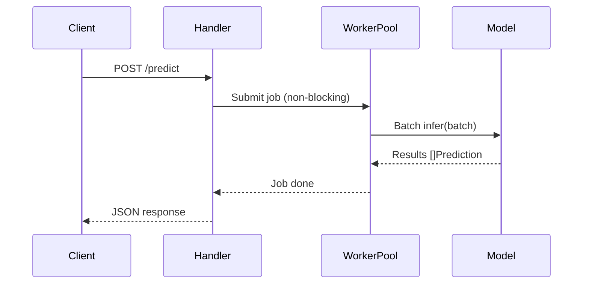

# 🚀 High-Throughput Model Serving

## Introduction

Machine learning model serving is the critical bridge between trained artifacts and user-facing value. A serving system must load models, accept requests, batch inputs when possible, run inference, and return results with minimal latency and maximal throughput. In Go, this challenge maps elegantly to goroutines, channels, and worker pools, yielding systems that outperform traditional Python-based servers on I/O-bound and compute-bound workloads alike.

This note explores serving patterns: single-model, multi-model, and ensemble architectures. You will learn how to implement batch inference to amortize model invocation overhead across multiple requests, and how async request handling in Go can saturate GPU resources without blocking client connections. High-throughput serving is not merely about raw speed; it is about resource efficiency, queue management, and graceful degradation under load.

By the end of this note, you will understand the mechanics of building a batching inference server in Go and how to reason about throughput in terms of batch size, concurrency, and model latency. This knowledge directly feeds into the design of ML gateways and real-time pipelines covered in later notes.

## 1. Model Serving Patterns

Modern model serving architectures fall into three primary patterns. Each pattern represents a trade-off between resource utilization, deployment complexity, and isolation guarantees.

- **Single-Model Serving:** One process hosts one model. Simple to deploy and monitor, but wastes memory if you have many small models. Best for monolithic applications with a dominant model
- **Multi-Model Serving:** A single server loads and unloads multiple models dynamically. Reduces memory overhead through sharing but increases complexity in lifecycle management and resource contention
- **Ensemble Serving:** Multiple models execute in parallel or sequence, and their outputs are aggregated (e.g., voting, weighted averaging). Used in competitions and production systems where diversity reduces variance

Real case: **Uber** serves thousands of models across its Michelangelo platform. For high-throughput use cases, Uber deploys Go microservices that handle request routing, authentication, and batching, forwarding tensor payloads to optimized inference workers. This separation of concerns allows the ML team to iterate on models independently from the serving infrastructure.

⚠️ **Warning:** Dynamic batching can introduce latency jitter. If your P99 latency SLA is strict (e.g., < 100ms), set a maximum batch wait timeout rather than waiting indefinitely for the batch to fill.

💡 **Tip:** Use Go's `context.Context` with deadlines in your serving handlers. If a model inference exceeds the SLA, cancel the context and return a 503 error, preventing cascading queue buildup.

## 2. Serving Frameworks Comparison

| Framework | Language | Dynamic Batching | Multi-Model | Best For |
|---|---|---|---|---|
| NVIDIA Triton | C++ | Yes | Yes | GPU-heavy, heterogeneous models |
| TorchServe | Python/Java | Yes | Yes | PyTorch ecosystems |
| BentoML | Python | Yes | Yes | Rapid prototyping, Python-native |
| TensorFlow Serving | C++ | Yes | Yes | TensorFlow models exclusively |
| Custom Go | Go | Manual | Manual | Low-level control, minimal overhead |

Custom Go serving excels when you need minimal memory footprint, fast startup times, and direct control over batching logic. While Triton offers more features out of the box, a Go server adds less than 20 MB of overhead and starts in milliseconds, making it ideal for serverless and edge deployments.

## 3. Model Serving Architecture

### Batching Inference Server


### Async Request Handling in Go




## 4. Batch Inference Server with Worker Pool

Throughput in a batching system depends on how many requests you can group together without violating latency constraints:

$$
Throughput = Batch\_Size \times Requests\_Per\_Second
$$

If a model processes a batch of 8 in 20ms, your effective throughput is 400 requests per second. Without batching, 8 separate calls might take 80ms total, yielding only 100 requests per second.

```go
package main

import (
	"context"
	"encoding/json"
	"fmt"
	"log"
	"net/http"
	"sync"
	"time"
)

// PredictionRequest represents a single inference request
type PredictionRequest struct {
	ID     string    `json:"id"`
	Input  []float32 `json:"input"`
	Result chan []float32
}

// BatchingServer groups requests and runs inference
type BatchingServer struct {
	batchSize     int
	batchTimeout  time.Duration
	queue         chan *PredictionRequest
	model         func([][]float32) [][]float32
	workerCount   int
}

func NewBatchingServer(batchSize int, timeout time.Duration, modelFunc func([][]float32) [][]float32) *BatchingServer {
	return &BatchingServer{
		batchSize:    batchSize,
		batchTimeout: timeout,
		queue:        make(chan *PredictionRequest, 1000),
		model:        modelFunc,
		workerCount:  4,
	}
}

func (s *BatchingServer) Start() {
	for i := 0; i < s.workerCount; i++ {
		go s.workerLoop()
	}
}

func (s *BatchingServer) workerLoop() {
	for {
		batch := make([]*PredictionRequest, 0, s.batchSize)
		timeout := time.After(s.batchTimeout)

		// Collect batch
		for len(batch) < s.batchSize {
			select {
			case req := <-s.queue:
				batch = append(batch, req)
			case <-timeout:
				goto process
			}
		}

	process:
		if len(batch) == 0 {
			continue
		}

		// Extract inputs
		inputs := make([][]float32, len(batch))
		for i, req := range batch {
			inputs[i] = req.Input
		}

		// Run batched inference
		outputs := s.model(inputs)

		// Fan out results
		for i, req := range batch {
			req.Result <- outputs[i]
		}
	}
}

func (s *BatchingServer) Predict(ctx context.Context, input []float32) ([]float32, error) {
	req := &PredictionRequest{
		ID:     fmt.Sprintf("req-%d", time.Now().UnixNano()),
		Input:  input,
		Result: make(chan []float32, 1),
	}

	select {
	case s.queue <- req:
	case <-ctx.Done():
		return nil, ctx.Err()
	}

	select {
	case result := <-req.Result:
		return result, nil
	case <-ctx.Done():
		return nil, ctx.Err()
	}
}

// Mock model: identity function for demonstration
func mockModel(inputs [][]float32) [][]float32 {
	outputs := make([][]float32, len(inputs))
	for i, in := range inputs {
		out := make([]float32, len(in))
		copy(out, in)
		outputs[i] = out
	}
	return outputs
}

func main() {
	server := NewBatchingServer(8, 10*time.Millisecond, mockModel)
	server.Start()

	http.HandleFunc("/predict", func(w http.ResponseWriter, r *http.Request) {
		var req struct {
			Input []float32 `json:"input"`
		}
		if err := json.NewDecoder(r.Body).Decode(&req); err != nil {
			http.Error(w, err.Error(), http.StatusBadRequest)
			return
		}

		ctx, cancel := context.WithTimeout(r.Context(), 5*time.Second)
		defer cancel()

		result, err := server.Predict(ctx, req.Input)
		if err != nil {
			http.Error(w, err.Error(), http.StatusInternalServerError)
			return
		}

		json.NewEncoder(w).Encode(map[string]interface{}{
			"prediction": result,
		})
	})

	log.Println("Serving on :8080")
	log.Fatal(http.ListenAndServe(":8080", nil))
}
```

## 5. Queue Theory and Load Shedding

Under high load, request queues grow unbounded without backpressure. Go's buffered channels naturally provide backpressure: when `s.queue` is full, new requests are rejected immediately rather than accumulating memory. Combine this with `context.WithTimeout` to ensure clients fail fast rather than waiting indefinitely.

⚠️ **Warning:** Never use unbounded channels for request queues in production. An unbounded channel will eventually exhaust memory during traffic spikes, leading to OOM kills and cascading failures.

---

## 📦 Compression Code

```go
package main

import (
	"context"
	"fmt"
	"time"
)

// BatchWorker collects requests and processes them in batches.
type BatchWorker struct {
	queue      chan Job
	batchSize  int
	maxWait    time.Duration
	processor  func([][]float32) [][]float32
}

type Job struct {
	Input  []float32
	Result chan []float32
}

func NewBatchWorker(size int, wait time.Duration, proc func([][]float32) [][]float32) *BatchWorker {
	return &BatchWorker{
		queue:     make(chan Job, 500),
		batchSize: size,
		maxWait:   wait,
		processor: proc,
	}
}

func (w *BatchWorker) Run() {
	for {
		batch := make([]Job, 0, w.batchSize)
		timer := time.NewTimer(w.maxWait)

		collect := true
		for collect && len(batch) < w.batchSize {
			select {
			case job := <-w.queue:
				batch = append(batch, job)
			case <-timer.C:
				collect = false
			}
		}
		timer.Stop()

		if len(batch) == 0 {
			continue
		}

		inputs := make([][]float32, len(batch))
		for i, j := range batch {
			inputs[i] = j.Input
		}
		outputs := w.processor(inputs)
		for i, j := range batch {
			j.Result <- outputs[i]
		}
	}
}

func (w *BatchWorker) Submit(ctx context.Context, input []float32) ([]float32, error) {
	job := Job{Input: input, Result: make(chan []float32, 1)}
	select {
	case w.queue <- job:
	case <-ctx.Done():
		return nil, ctx.Err()
	}
	select {
	case res := <-job.Result:
		return res, nil
	case <-ctx.Done():
		return nil, ctx.Err()
	}
}

func main() {
	identity := func(in [][]float32) [][]float32 { return in }
	worker := NewBatchWorker(4, 5*time.Millisecond, identity)
	go worker.Run()

	ctx := context.Background()
	res, err := worker.Submit(ctx, []float32{1.0, 2.0, 3.0})
	fmt.Println(res, err)
}
```

## 🎯 Documented Project

### Description

A **High-Throughput Inference API** written in Go that serves multiple ONNX classification models using a dynamic batching worker pool. The server exposes REST and gRPC endpoints, collects requests into batches, and dispatches them to GPU-backed inference sessions. It includes Prometheus metrics, graceful shutdown, and configurable batch size timeouts.

### Functional Requirements

1. Accept concurrent REST and gRPC prediction requests for multiple model versions
2. Dynamically batch requests up to a configurable size or timeout threshold
3. Load and cache ONNX models in memory with reference counting
4. Export Prometheus metrics for queue depth, batch size distribution, and inference latency
5. Implement graceful shutdown that drains the request queue before exiting

### Main Components

- **API Gateway Layer:** HTTP/2 and gRPC handlers with request validation
- **Batching Engine:** Channel-based request aggregator with timeout-based flushing
- **Model Registry:** Map of model name → ONNX session with lazy loading
- **Worker Pool:** Fixed number of goroutines executing batched inference
- **Observability:** Prometheus counters, histograms, and structured logging

### Success Metrics

- Throughput exceeds 2,000 requests per second at batch size 16 on a single GPU
- P99 latency remains under 150ms including network round-trip
- Queue depth stays below 100 under 3x normal load
- Zero request loss during rolling deployments with graceful shutdown

### References

- [Uber Michelangelo](https://eng.uber.com/michelangelo-machine-learning-platform/)
- [NVIDIA Triton Architecture](https://docs.nvidia.com/deeplearning/triton-inference-server/user-guide/docs/architecture.html)
- [Dynamic Batching in Deep Learning](https://arxiv.org/abs/1708.07422)
- [Go Context Package Best Practices](https://go.dev/blog/context)
