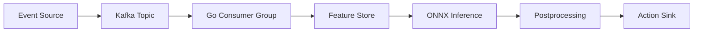
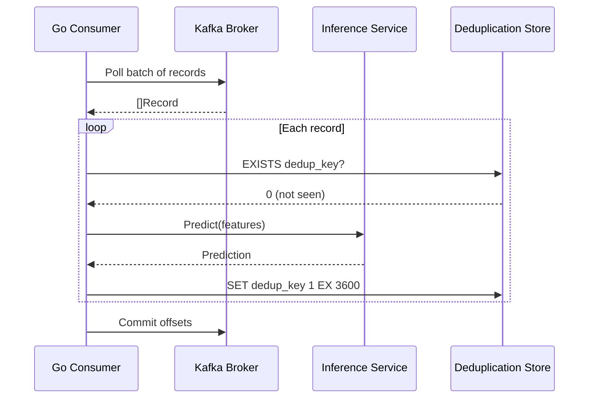

# ⚡ Real-time Inference Pipelines

## Introduction

Real-time inference pipelines process data streams as they arrive, applying machine learning models to events within milliseconds or seconds of generation. Unlike batch prediction, where data accumulates before processing, stream inference enables immediate action: fraud detection on payment events, content ranking on user clicks, or anomaly detection on IoT sensor readings. The architecture of such pipelines is fundamentally event-driven, requiring durable message brokers, idempotent consumers, and low-latency serving layers.

This note covers stream processing platforms (Kafka, NATS, Redis Streams) and their integration with Go inference services. You will learn how to structure a pipeline from ingestion through action, how to guarantee exactly-once semantics, and why idempotency is non-negotiable in distributed ML systems. Real-time pipelines are the backbone of modern reactive systems, and Go's concurrency model makes it an exceptional choice for building them.

By the end of this note, you will be able to design a Kafka-to-Go inference pipeline with proper error handling, state management, and latency monitoring.

## 1. Stream Processing and Event-Driven Inference

An event-driven inference pipeline follows a standard pattern: an external event triggers a chain of transformations that culminate in an automated decision or notification.

- **Trigger:** A raw event enters the system (payment transaction, log entry, sensor reading)
- **Preprocess:** The event is validated, enriched with features from the feature store, and formatted as a model input tensor
- **Predict:** The model produces a score, classification, or embedding
- **Postprocess:** The raw prediction is calibrated, thresholded, or combined with business rules
- **Act:** The system takes action (block transaction, reorder feed, alert engineer)

Real case: **LinkedIn** uses real-time inference for its feed ranking pipeline. When a member interacts with content, events flow through Kafka to a Samza streaming job that enriches the event with hundreds of features. A TensorFlow model scores the candidate content, and the results are written back to Redis for the frontend to consume. The entire pipeline from click to re-ranked feed must complete in under 200ms to feel instantaneous to the user.

⚠️ **Warning:** Stream processing systems are susceptible to duplicate events during consumer group rebalances or broker failovers. Always design your inference consumer to be idempotent: the same event processed twice must produce the same outcome without corrupting state.

💡 **Tip:** Use a deterministic deduplication key derived from the event content (e.g., hash of transaction ID + timestamp). Store processed keys in a TTL-backed Redis set to skip duplicates within a window without unbounded memory growth.

## 2. Streaming Platforms Comparison

| Platform | Model | Persistence | Ordering | Go Client Maturity | Best For |
|---|---|---|---|---|---|
| Apache Kafka | Pub/Sub with consumer groups | Durable log (disk) | Partition-level | Excellent | High throughput, replayability |
| NATS JetStream | Pub/Sub + streaming | File/memory | Stream-level | Excellent | Simplicity, cloud-native |
| Redis Streams | Pub/Sub + log | Memory (optional AOF) | Stream-level | Excellent | Low latency, small scale |
| Apache Pulsar | Tiered storage | Durable + offload | Partition-level | Good | Multi-tenancy, geo-replication |
| AWS Kinesis | Managed streaming | 24h-365h retention | Shard-level | Good | AWS-native, no ops |

For Go-based ML backends, Kafka and NATS JetStream are the most common choices. Kafka offers superior durability and ecosystem maturity, while NATS provides simpler operational semantics and lower latency for small-to-medium deployments.

## 3. Real-time Pipeline Architecture

### End-to-End Inference Pipeline



### Consumer Offset Management




## 4. Kafka Consumer + Inference Pipeline

The total latency experienced by the end user is the sum of every stage in the pipeline:

$$
End\_to\_End\_Latency = Ingestion + Preprocessing + Inference + Action
$$

To minimize this, use Kafka consumer prefetching, Go goroutine pools for parallel preprocessing, and Redis pipelining for feature lookups.

```go
package main

import (
	"context"
	"encoding/json"
	"fmt"
	"log"
	"time"

	"github.com/IBM/sarama"
	"github.com/redis/go-redis/v9"
)

// Event represents an incoming stream event
type Event struct {
	EventID   string                 `json:"event_id"`
	EntityID  string                 `json:"entity_id"`
	Payload   map[string]interface{} `json:"payload"`
	Timestamp time.Time              `json:"timestamp"`
}

// PredictionResult wraps model output with metadata
type PredictionResult struct {
	EventID    string    `json:"event_id"`
	Score      float64   `json:"score"`
	Label      string    `json:"label"`
	InferredAt time.Time `json:"inferred_at"`
}

// InferenceConsumer handles Kafka messages and runs inference
type InferenceConsumer struct {
	redisClient *redis.Client
	ready       chan bool
}

func NewInferenceConsumer(redisAddr string) *InferenceConsumer {
	return &InferenceConsumer{
		redisClient: redis.NewClient(&redis.Options{Addr: redisAddr}),
		ready:       make(chan bool),
	}
}

func (c *InferenceConsumer) Setup(sarama.ConsumerGroupSession) error {
	close(c.ready)
	return nil
}

func (c *InferenceConsumer) Cleanup(sarama.ConsumerGroupSession) error {
	return nil
}

func (c *InferenceConsumer) ConsumeClaim(session sarama.ConsumerGroupSession, claim sarama.ConsumerGroupClaim) error {
	ctx := context.Background()

	for msg := range claim.Messages() {
		var event Event
		if err := json.Unmarshal(msg.Value, &event); err != nil {
			log.Printf("unmarshal error: %v", err)
			session.MarkMessage(msg, "")
			continue
		}

		// Idempotency check
		dedupKey := fmt.Sprintf("dedup:%s", event.EventID)
		exists, err := c.redisClient.Exists(ctx, dedupKey).Result()
		if err != nil {
			log.Printf("redis error: %v", err)
			continue
		}
		if exists > 0 {
			log.Printf("duplicate event skipped: %s", event.EventID)
			session.MarkMessage(msg, "")
			continue
		}

		// Preprocess: enrich with features
		features := preprocessEvent(event)

		// Inference: mock model call
		result := runInference(features)

		// Postprocess and act
		if result.Score > 0.8 {
			triggerAlert(event.EntityID, result)
		}

		// Mark as processed
		c.redisClient.Set(ctx, dedupKey, "1", 24*time.Hour)
		session.MarkMessage(msg, "")
	}
	return nil
}

func preprocessEvent(event Event) []float32 {
	// In production: query feature store, normalize, encode
	return []float32{float32(event.Timestamp.Unix()), 1.0, 0.5}
}

func runInference(features []float32) PredictionResult {
	// In production: call ONNX Runtime session
	score := 0.0
	for _, f := range features {
		score += float64(f)
	}
	return PredictionResult{
		EventID:    fmt.Sprintf("evt-%d", time.Now().UnixNano()),
		Score:      score / float64(len(features)),
		Label:      "anomaly",
		InferredAt: time.Now().UTC(),
	}
}

func triggerAlert(entityID string, result PredictionResult) {
	log.Printf("ALERT: entity=%s score=%.2f", entityID, result.Score)
}

func main() {
	config := sarama.NewConfig()
	config.Version = sarama.V3_6_0_0
	config.Consumer.Group.Rebalance.Strategy = sarama.NewBalanceStrategyRoundRobin()
	config.Consumer.Offsets.Initial = sarama.OffsetOldest

	group, err := sarama.NewConsumerGroup([]string{"localhost:9092"}, "inference-group", config)
	if err != nil {
		log.Fatal(err)
	}
	defer group.Close()

	consumer := NewInferenceConsumer("localhost:6379")
	ctx := context.Background()

	for {
		err := group.Consume(ctx, []string{"events"}, consumer)
		if err != nil {
			log.Printf("consume error: %v", err)
		}
		if ctx.Err() != nil {
			return
		}
		consumer.ready = make(chan bool)
	}
}
```

## 5. Exactly-Once Semantics

Exactly-once processing in a distributed streaming pipeline requires coordination between the message broker, the consumer, and any external state stores. In practice, this is implemented as:

1. **Idempotent writes:** Every side effect (database update, alert) uses a deterministic key so duplicate processing is harmless
2. **Transactional outbox:** Write the prediction result and the Kafka offset to the same database transaction
3. **Two-phase commit:** Advanced systems use Kafka transactions to commit offsets and produce output messages atomically

For ML inference, idempotency is usually sufficient. Since model inference is deterministic (given the same inputs), processing the same event twice yields the same prediction. The critical step is ensuring that the action triggered by the prediction (e.g., blocking a payment) is also idempotent.

⚠️ **Warning:** Do not use external system clocks for ordering or deduplication in distributed pipelines. Clock skew between consumers can cause events to be processed out of order or deduplicated incorrectly. Use broker-assigned offsets or event timestamps with vector clocks.

---

## 📦 Compression Code

```go
package main

import (
	"context"
	"encoding/json"
	"fmt"
	"log"
	"time"

	"github.com/IBM/sarama"
	"github.com/redis/go-redis/v9"
)

type StreamEvent struct {
	ID   string  `json:"id"`
	Data float64 `json:"data"`
}

type StreamConsumer struct {
	rdb *redis.Client
}

func (c *StreamConsumer) Setup(sarama.ConsumerGroupSession) error   { return nil }
func (c *StreamConsumer) Cleanup(sarama.ConsumerGroupSession) error { return nil }

func (c *StreamConsumer) ConsumeClaim(sess sarama.ConsumerGroupSession, claim sarama.ConsumerGroupClaim) error {
	ctx := context.Background()
	for msg := range claim.Messages() {
		var e StreamEvent
		json.Unmarshal(msg.Value, &e)

		dk := "dedup:" + e.ID
		if c.rdb.Exists(ctx, dk).Val() > 0 {
			sess.MarkMessage(msg, "")
			continue
		}

		score := e.Data * 0.5 // mock inference
		fmt.Printf("inference: id=%s score=%.2f\n", e.ID, score)

		c.rdb.Set(ctx, dk, "1", time.Hour)
		sess.MarkMessage(msg, "")
	}
	return nil
}

func main() {
	cfg := sarama.NewConfig()
	cfg.Version = sarama.V3_6_0_0
	cfg.Consumer.Offsets.Initial = sarama.OffsetOldest

	g, err := sarama.NewConsumerGroup([]string{"localhost:9092"}, "ml-group", cfg)
	if err != nil {
		log.Fatal(err)
	}

	c := &StreamConsumer{rdb: redis.NewClient(&redis.Options{Addr: "localhost:6379"})}
	for {
		if err := g.Consume(context.Background(), []string{"ml-events"}, c); err != nil {
			log.Println(err)
		}
	}
}
```

## 🎯 Documented Project

### Description

A **Real-Time Fraud Detection Pipeline** built in Go that consumes payment events from Kafka, enriches them with customer features from Redis, runs inference through an ONNX fraud model, and publishes alerts to a downstream topic. The system guarantees idempotency via Redis deduplication and exposes consumer lag metrics.

### Functional Requirements

1. Consume events from a Kafka topic with at-least-once delivery semantics
2. Enrich each event with a precomputed feature vector from Redis in under 10ms
3. Run ONNX inference to produce a fraud probability score
4. Publish high-risk transactions (>0.9 score) to an `alerts` Kafka topic
5. Skip duplicate events using a Redis-backed deduplication cache with 24h TTL

### Main Components

- **Kafka Consumer Group:** Sarama-based consumer with manual offset management
- **Feature Enricher:** Pipelined Redis HMGET for batch feature retrieval
- **ONNX Inference Engine:** Session-per-worker goroutine with input tensor reuse
- **Alert Producer:** Async Kafka producer for downstream action systems
- **Deduplication Layer:** Redis SET with TTL for processed event IDs

### Success Metrics

- End-to-end latency from Kafka ingestion to alert publication under 100ms at P99
- Consumer lag stays below 1,000 messages during 10x traffic spikes
- Duplicate event processing rate below 0.001%
- Pipeline throughput exceeds 50,000 events per second per consumer instance

### References

- [LinkedIn Real-Time Feature Engineering](https://engineering.linkedin.com/blog/2019/feature-engineering-linkedin)
- [Apache Kafka Consumer API](https://kafka.apache.org/documentation/)
- [Sarama Go Client](https://github.com/IBM/sarama)
- [Exactly-Once Semantics in Kafka](https://www.confluent.io/blog/exactly-once-semantics-are-possible-heres-how-apache-kafka-does-it/)
