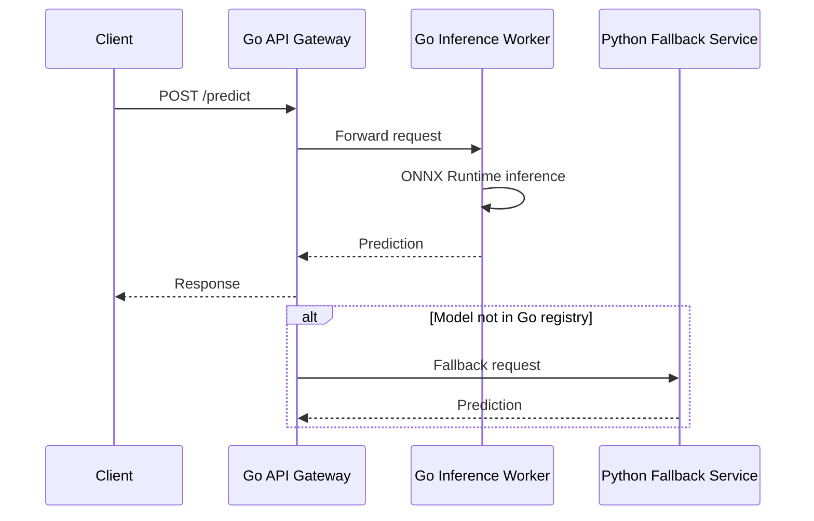

# 🥊 Go vs Python for ML Serving

## Introduction

Python has been the undisputed champion of machine learning research and model development. Its ecosystem of frameworks (PyTorch, TensorFlow, JAX, scikit-learn) and its interactive nature make it ideal for experimentation. However, when models move from notebooks to production serving systems, Python's limitations become apparent. The Global Interpreter Lock (GIL), high memory footprint, and slow startup times create bottlenecks that directly impact user experience and infrastructure cost.

Go, by contrast, was designed for systems programming at scale. Its goroutines provide lightweight concurrency, its garbage collector is optimized for low latency, and its static binaries deploy in milliseconds. This note provides a rigorous, data-driven comparison of Go and Python for ML serving workloads. You will learn when to use each language, how to benchmark them side by side, and how to architect hybrid systems that leverage the strengths of both.

By the end of this note, you will be equipped to make informed technology decisions for your ML serving stack and understand how to integrate Python training pipelines with Go inference services.

## 1. Performance Benchmarks and the GIL

The fundamental architectural difference between Go and Python for serving lies in concurrency. Python's Global Interpreter Lock prevents multiple threads from executing Python bytecode simultaneously, forcing CPU-bound serving workloads to use multiprocessing or external services. Go's goroutines multiplex onto OS threads and execute in parallel on multiple cores without such constraints.

- **Latency:** Go HTTP servers consistently achieve P99 latencies under 1ms for simple routing. Python asyncio frameworks like FastAPI add 5-20ms of overhead due to the event loop and interpreter overhead
- **Throughput:** A single Go process can handle 100,000+ concurrent connections. Python processes, even with asyncio, struggle beyond a few thousand due to GIL contention and memory overhead
- **Memory:** A minimal Go binary uses 5-20 MB of RSS. A Python process with PyTorch loaded uses 500 MB to 2 GB before processing a single request
- **Startup Time:** Go binaries start in milliseconds. Python containers with heavy dependencies can take 30-60 seconds to cold start, making them unsuitable for serverless deployments

Real case: **Netflix** uses a hybrid architecture where Python trains recommendation models and Go serves them at the edge. Their Edge ML platform deploys Go binaries to Open Connect Appliances (OCAs) located inside ISP networks. These Go services load ONNX models and serve personalized artwork selection with sub-10ms latency, a target impossible to hit with Python cold starts and memory constraints on edge hardware.

⚠️ **Warning:** Benchmarks comparing raw matrix multiplication (NumPy vs Go) are misleading. NumPy calls optimized C/BLAS routines and will outperform naive Go loops. The relevant benchmark is end-to-end serving latency under concurrent load, where Go's networking and concurrency advantages dominate.

💡 **Tip:** Use Go for the serving layer and Python for training. Expose model artifacts in ONNX or TensorFlow SavedModel format so both languages can consume them. This boundary lets data scientists iterate in Python while platform engineers optimize serving in Go.

## 2. Go vs Python for ML Serving

| Dimension | Go | Python | Winner |
|---|---|---|---|
| **Latency (P99)** | < 1ms routing, < 50ms inference | 5-20ms routing overhead | Go |
| **Throughput (req/s)** | 100k+ concurrent per process | 1k-5k per process (asyncio) | Go |
| **Memory per instance** | 20-100 MB | 500 MB - 2 GB | Go |
| **Cold start time** | < 100 ms | 10-60 seconds | Go |
| **ML ecosystem** | Limited (onnxruntime-go, Gorgonia) | Extensive (PyTorch, TF, JAX) | Python |
| **Training & research** | Not suitable | Excellent interactive workflows | Python |
| **Concurrency model** | Goroutines (M:N scheduling) | GIL + asyncio/event loop | Go |
| **Deployment** | Static binary, single artifact | Container with heavy dependencies | Go |
| **Hiring & community** | Smaller ML community | Largest ML talent pool | Python |
| **Interop (C/CUDA)** | CGO (complex) | Cython, PyBind11 (mature) | Python |

The speedup of a Go serving layer over an equivalent Python implementation is often dramatic:

$$
Speedup = T_{python} / T_{go}
$$

In Netflix's edge serving benchmarks, Go achieved 10-50x lower P99 latency and 5-20x higher throughput per dollar of compute compared to Python Flask/Gunicorn deployments.

## 3. Hybrid Python/Go Architecture

### Training and Serving Separation


### Request Flow in Hybrid System




## 4. Side-by-Side Benchmark Script

The following Go program measures concurrent request handling. An equivalent Python FastAPI script is included as a comment for comparison.

```go
package main

import (
	"encoding/json"
	"fmt"
	"net/http"
	"sync"
	"sync/atomic"
	"time"
)

var (
	requestCount uint64
)

// mockInference simulates a lightweight model call
func mockInference(input []float64) float64 {
	sum := 0.0
	for _, v := range input {
		sum += v * 0.5
	}
	time.Sleep(1 * time.Millisecond) // Simulate 1ms compute
	return sum
}

func predictHandler(w http.ResponseWriter, r *http.Request) {
	start := time.Now()
	var req struct {
		Input []float64 `json:"input"`
	}
	if err := json.NewDecoder(r.Body).Decode(&req); err != nil {
		http.Error(w, err.Error(), http.StatusBadRequest)
		return
	}

	result := mockInference(req.Input)
	atomic.AddUint64(&requestCount, 1)

	latency := time.Since(start).Milliseconds()
	json.NewEncoder(w).Encode(map[string]interface{}{
		"result":  result,
		"latency": latency,
	})
}

func runBenchmark(url string, concurrency, totalRequests int) {
	var wg sync.WaitGroup
	sem := make(chan struct{}, concurrency)
	start := time.Now()

	for i := 0; i < totalRequests; i++ {
		wg.Add(1)
		sem <- struct{}{}
		go func() {
			defer wg.Done()
			resp, err := http.Post(url, "application/json", 
				jsonReader(map[string]interface{}{"input": []float64{1.0, 2.0, 3.0}}))
			if err == nil {
				resp.Body.Close()
			}
			<-sem
		}()
	}
	wg.Wait()
	duration := time.Since(start).Seconds()
	fmt.Printf("Requests: %d, Concurrency: %d, Duration: %.2fs, RPS: %.2f\n",
		totalRequests, concurrency, duration, float64(totalRequests)/duration)
}

func jsonReader(v interface{}) *jsonReaderImpl {
	b, _ := json.Marshal(v)
	return &jsonReaderImpl{data: b, pos: 0}
}

type jsonReaderImpl struct {
	data []byte
	pos  int
}

func (r *jsonReaderImpl) Read(p []byte) (n int, err error) {
	if r.pos >= len(r.data) {
		return 0, fmt.Errorf("EOF")
	}
	n = copy(p, r.data[r.pos:])
	r.pos += n
	return n, nil
}

func main() {
	http.HandleFunc("/predict", predictHandler)
	go http.ListenAndServe(":8080", nil)
	time.Sleep(100 * time.Millisecond) // Let server start

	fmt.Println("Benchmarking Go server...")
	runBenchmark("http://localhost:8080/predict", 100, 10000)
}
```

Equivalent Python FastAPI baseline:

```python
# Python equivalent (for reference, not executed here)
# from fastapi import FastAPI
# import asyncio
# app = FastAPI()
# @app.post("/predict")
# async def predict(input: list[float]):
#     await asyncio.sleep(0.001)
#     return {"result": sum(input) * 0.5}
```

## 5. When to Use Which

Use **Python** when:
- Training or fine-tuning models
- Prototyping new model architectures
- Performing data exploration and feature engineering
- Using framework-specific features not yet available in ONNX

Use **Go** when:
- Building REST/gRPC APIs for model serving
- Implementing high-throughput streaming pipelines
- Deploying to resource-constrained environments (edge, IoT)
- Requiring fast startup times for serverless or auto-scaling workloads
- Managing concurrent connections with strict latency SLAs

⚠️ **Warning:** Avoid rewriting your entire ML stack in Go. The ML ecosystem (transformers, AutoML, visualization) is Python-native. The optimal architecture is a polyglot system with clear boundaries: Python for research, Go for serving.

---

## 📦 Compression Code

```go
package main

import (
	"encoding/json"
	"fmt"
	"net/http"
	"sync"
	"time"
)

func handler(w http.ResponseWriter, r *http.Request) {
	var req struct {
		Input []float64 `json:"input"`
	}
	json.NewDecoder(r.Body).Decode(&req)
	sum := 0.0
	for _, v := range req.Input {
		sum += v
	}
	json.NewEncoder(w).Encode(map[string]float64{"result": sum * 0.5})
}

func bench(url string, c, n int) {
	sem := make(chan struct{}, c)
	var wg sync.WaitGroup
	start := time.Now()
	for i := 0; i < n; i++ {
		wg.Add(1)
		sem <- struct{}{}
		go func() {
			defer wg.Done()
			b, _ := json.Marshal(map[string]interface{}{"input": []float64{1, 2, 3}})
			http.Post(url, "application/json", 
				&struct{ s string }{s: string(b)})
			<-sem
		}()
	}
	wg.Wait()
	fmt.Printf("RPS: %.0f\n", float64(n)/time.Since(start).Seconds())
}

func main() {
	http.HandleFunc("/predict", handler)
	go http.ListenAndServe(":8080", nil)
	time.Sleep(50 * time.Millisecond)
	bench("http://localhost:8080/predict", 100, 5000)
}
```

## 🎯 Documented Project

### Description

A **Polyglot ML Serving Benchmark** that deploys identical ONNX ResNet-50 models behind a Go service and a Python FastAPI service. A load generator written in Go sends identical traffic to both endpoints and records latency distributions, throughput, and memory usage. The results are exported to Prometheus and visualized in Grafana.

### Functional Requirements

1. Export a PyTorch ResNet-50 model to ONNX format
2. Build a Go HTTP server that loads the ONNX model and serves `/predict`
3. Build a Python FastAPI server that loads the same ONNX model via `onnxruntime` and serves `/predict`
4. Run a coordinated load test against both services with varying concurrency levels
5. Generate a comparison report with P50, P99 latency, throughput, and peak memory

### Main Components

- **Go Server:** `onnxruntime_go` with HTTP handlers and Prometheus metrics
- **Python Server:** FastAPI with `onnxruntime` and `uvicorn` worker processes
- **Load Generator:** Go program using `vegeta` or custom `sync.WaitGroup` patterns
- **Model Exporter:** Python script converting PyTorch → ONNX with dummy input
- **Dashboard:** Grafana JSON model comparing Go vs Python time series

### Success Metrics

- Go P99 latency under 20ms for batch size 1; Python P99 latency under 80ms
- Go memory footprint under 200 MB at steady state; Python under 1.5 GB
- Go cold start under 500ms; Python cold start under 30 seconds
- Throughput per CPU core: Go exceeds 500 req/s; Python exceeds 50 req/s

### References

- [Netflix Edge ML Platform](https://netflixtechblog.com/how-netflix-scales-its-ml-infrastructure-2f7f6f5c2a2b)
- [FastAPI Benchmarks](https://fastapi.tiangolo.com/benchmarks/)
- [Go HTTP Server Performance](https://go.dev/doc/articles/wiki/)
- [ONNX Runtime Python vs C API](https://onnxruntime.ai/docs/api/)
