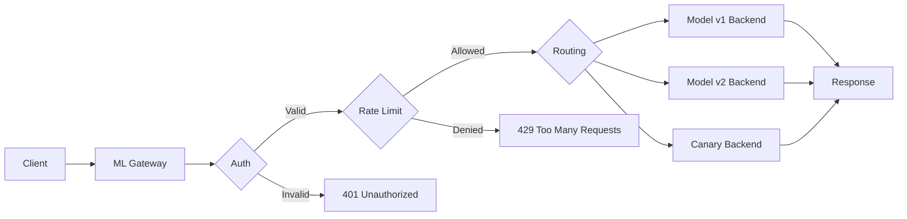
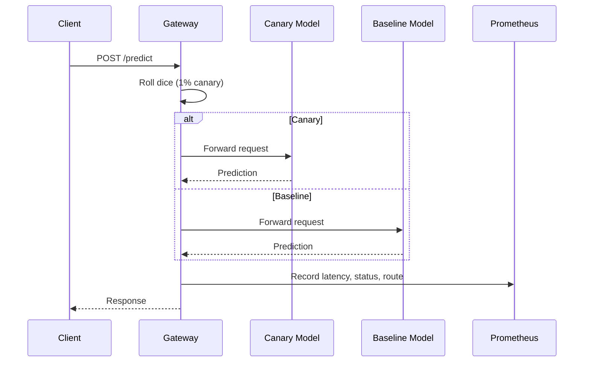

# 🚪 Building a Production ML Gateway

## Introduction

An ML gateway is the control plane for model serving infrastructure. It sits between clients and inference services, handling cross-cutting concerns that no single model server should manage alone: request routing, model versioning, A/B testing, canary deployments, authentication, rate limiting, and observability. Without a gateway, every inference service must independently implement these concerns, leading to inconsistent security policies, fragmented telemetry, and risky deployment practices.

This note covers the architectural patterns and Go implementation strategies for building a production-grade ML gateway. You will learn how to route requests to different model versions based on headers or user segments, how to implement token bucket rate limiting, and how to emit distributed traces and metrics for ML-specific observability. A well-designed gateway transforms a collection of model endpoints into a reliable, measurable, and secure platform.

By the end of this note, you will have a complete Go-based ML gateway implementation that can be deployed in front of ONNX, TensorFlow, or custom inference services.

## 1. Gateway Pattern for ML Serving

The gateway pattern decouples clients from the underlying model topology. Clients send requests to a stable endpoint (`/v1/predict`), while the gateway dynamically maps those requests to the appropriate backend based on routing rules.

- **Routing:** Direct requests to specific model versions using HTTP headers (`X-Model-Version: v2`) or URL paths (`/models/v2/predict`)
- **A/B Testing:** Split traffic between model variants using weighted random selection or user-id hashing for sticky assignment
- **Canary Deployments:** Gradually shift traffic from a stable model to a new candidate (1%, 5%, 25%, 100%) while monitoring error rates and latency
- **Authentication:** Validate JWT tokens or API keys before allowing inference requests to reach backends
- **Rate Limiting:** Protect expensive models from abuse using token bucket or sliding window algorithms

Real case: **Stripe** operates a sophisticated ML gateway for its fraud detection stack. When a payment event arrives, the gateway authenticates the merchant, applies rate limits based on pricing tier, routes the request to one of several fraud model versions (some merchant-specific), and emits structured logs for compliance auditing. The gateway's routing layer enables Stripe to test new fraud models on 1% of traffic without risking the remaining 99%.

⚠️ **Warning:** Canary deployments for ML models require monitoring prediction distribution shifts, not just system metrics. A new model may have low latency and zero errors but produce biased predictions. Always compare prediction histograms between canary and baseline.

💡 **Tip:** Use consistent hashing on the user ID for A/B test assignment. This ensures the same user always hits the same model variant across requests, preventing jarring user experiences where behavior flips between API calls.

## 2. Gateway Features Checklist

| Feature | Description | Implementation in Go |
|---|---|---|
| **Request Routing** | Map requests to backends by path, header, or body field | `map[string]*httputil.ReverseProxy` with middleware |
| **A/B Testing** | Weighted traffic split between model versions | `rand.Float64()` or hash-based routing |
| **Canary** | Progressive traffic shift with automatic rollback | Configurable weights + error rate threshold watcher |
| **Authentication** | JWT/API key validation | `golang-jwt/jwt` middleware |
| **Rate Limiting** | Token bucket per client | `golang.org/x/time/rate` |
| **Request Validation** | JSON schema or Protobuf validation | `go-playground/validator` |
| **Metrics** | Request count, latency, error rate | Prometheus `client_golang` |
| **Tracing** | Distributed request tracing | OpenTelemetry Go SDK |
| **Circuit Breaker** | Fail fast on unhealthy backends | `sony/gobreaker` or custom implementation |
| **Caching** | Cache identical prediction requests | Redis or in-memory LRU |

## 3. ML Gateway Architecture

### Request Lifecycle Through Gateway



### Canary Deployment Flow




## 4. Complete ML Gateway with Routing and Metrics

The availability of a gateway serving `N` independent model backends is higher than any single backend, assuming failures are uncorrelated:

$$
Availability\_Gateway = 1 - (1 - Availability\_Model)^N
$$

If one model has 99.9% availability, a gateway with 3 redundant backends achieves 99.9999% availability for routed requests.

```go
package main

import (
	"context"
	"fmt"
	"log"
	"math/rand"
	"net/http"
	"net/http/httputil"
	"net/url"
	"strings"
	"sync"
	"time"

	"github.com/golang-jwt/jwt/v5"
	"github.com/prometheus/client_golang/prometheus"
	"github.com/prometheus/client_golang/prometheus/promhttp"
	"golang.org/x/time/rate"
)

var (
	requestDuration = prometheus.NewHistogramVec(prometheus.HistogramOpts{
		Name:    "ml_gateway_request_duration_seconds",
		Help:    "Request latency",
		Buckets: prometheus.DefBuckets,
	}, []string{"route", "status"})

	requestCount = prometheus.NewCounterVec(prometheus.CounterOpts{
		Name: "ml_gateway_requests_total",
		Help: "Total requests",
	}, []string{"route", "status"})
)

func init() {
	prometheus.MustRegister(requestDuration)
	prometheus.MustRegister(requestCount)
}

// ModelBackend holds proxy and metadata for a model version
type ModelBackend struct {
	Name   string
	Proxy  *httputil.ReverseProxy
	Weight float64 // For A/B testing
}

// Gateway orchestrates routing, auth, and rate limiting
type Gateway struct {
	backends   map[string]*ModelBackend
	limiters   map[string]*rate.Limiter
	mu         sync.RWMutex
	jwtSecret  []byte
}

func NewGateway(secret string) *Gateway {
	return &Gateway{
		backends:  make(map[string]*ModelBackend),
		limiters:  make(map[string]*rate.Limiter),
		jwtSecret: []byte(secret),
	}
}

func (g *Gateway) AddBackend(name, targetURL string, weight float64) error {
	u, err := url.Parse(targetURL)
	if err != nil {
		return err
	}
	g.mu.Lock()
	defer g.mu.Unlock()
	g.backends[name] = &ModelBackend{
		Name:   name,
		Proxy:  httputil.NewSingleHostReverseProxy(u),
		Weight: weight,
	}
	return nil
}

func (g *Gateway) getLimiter(clientID string) *rate.Limiter {
	g.mu.Lock()
	defer g.mu.Unlock()
	if lim, ok := g.limiters[clientID]; ok {
		return lim
	}
	lim := rate.NewLimiter(rate.Limit(10), 20) // 10 req/s, burst 20
	g.limiters[clientID] = lim
	return lim
}

func (g *Gateway) authMiddleware(next http.HandlerFunc) http.HandlerFunc {
	return func(w http.ResponseWriter, r *http.Request) {
		tokenStr := strings.TrimPrefix(r.Header.Get("Authorization"), "Bearer ")
		if tokenStr == "" {
			http.Error(w, "missing token", http.StatusUnauthorized)
			return
		}
		token, err := jwt.Parse(tokenStr, func(t *jwt.Token) (interface{}, error) {
			return g.jwtSecret, nil
		})
		if err != nil || !token.Valid {
			http.Error(w, "invalid token", http.StatusUnauthorized)
			return
		}
		next(w, r)
	}
}

func (g *Gateway) rateLimitMiddleware(next http.HandlerFunc) http.HandlerFunc {
	return func(w http.ResponseWriter, r *http.Request) {
		clientID := r.Header.Get("X-Client-ID")
		if clientID == "" {
			clientID = "anonymous"
		}
		lim := g.getLimiter(clientID)
		if !lim.Allow() {
			http.Error(w, "rate limit exceeded", http.StatusTooManyRequests)
			return
		}
		next(w, r)
	}
}

func (g *Gateway) routeRequest(r *http.Request) *ModelBackend {
	g.mu.RLock()
	defer g.mu.RUnlock()

	// Header-based routing
	if ver := r.Header.Get("X-Model-Version"); ver != "" {
		if b, ok := g.backends[ver]; ok {
			return b
		}
	}

	// Weighted A/B routing
	totalWeight := 0.0
	for _, b := range g.backends {
		totalWeight += b.Weight
	}
	pick := rand.Float64() * totalWeight
	cumulative := 0.0
	for _, b := range g.backends {
		cumulative += b.Weight
		if pick <= cumulative {
			return b
		}
	}
	return nil
}

func (g *Gateway) predictHandler(w http.ResponseWriter, r *http.Request) {
	start := time.Now()
	backend := g.routeRequest(r)
	if backend == nil {
		http.Error(w, "no backend available", http.StatusServiceUnavailable)
		requestCount.WithLabelValues("unknown", "503").Inc()
		return
	}

	// Record metrics after proxying
	recorder := &responseRecorder{ResponseWriter: w, statusCode: 200}
	backend.Proxy.ServeHTTP(recorder, r)

	duration := time.Since(start).Seconds()
	status := fmt.Sprintf("%d", recorder.statusCode)
	requestDuration.WithLabelValues(backend.Name, status).Observe(duration)
	requestCount.WithLabelValues(backend.Name, status).Inc()
}

type responseRecorder struct {
	http.ResponseWriter
	statusCode int
}

func (r *responseRecorder) WriteHeader(code int) {
	r.statusCode = code
	r.ResponseWriter.WriteHeader(code)
}

func main() {
	gw := NewGateway("super-secret-jwt-key")

	// Register backends
	gw.AddBackend("v1", "http://localhost:9001", 0.9)
	gw.AddBackend("v2", "http://localhost:9002", 0.1) // 10% canary

	mux := http.NewServeMux()
	mux.HandleFunc("/predict", gw.rateLimitMiddleware(gw.authMiddleware(gw.predictHandler)))
	mux.Handle("/metrics", promhttp.Handler())

	log.Println("ML Gateway listening on :8080")
	log.Fatal(http.ListenAndServe(":8080", mux))
}
```

## 5. Observability for ML APIs

Standard HTTP metrics (latency, errors, throughput) are necessary but not sufficient for ML serving. You must also track:

- **Prediction Distribution:** Histogram of model outputs to detect drift between versions
- **Feature Null Rates:** Percentage of requests missing expected features
- **Model Cache Hit Rates:** If your gateway caches predictions, monitor effectiveness
- **Business Metrics:** Conversion rate, fraud catch rate, or recommendation click-through rate correlated with model version

Integrate OpenTelemetry into your Go gateway to propagate trace IDs from the client through the gateway to the backend model service. This enables end-to-end latency analysis and makes it easy to identify whether slowdowns originate in routing, feature retrieval, or inference.

⚠️ **Warning:** Never log raw feature vectors or predictions containing PII (personally identifiable information). If you must log for debugging, hash or tokenize sensitive fields first. GDPR and CCPA violations in ML logs are a common source of compliance incidents.

---

## 📦 Compression Code

```go
package main

import (
	"fmt"
	"net/http"
	"net/http/httputil"
	"net/url"
	"strings"

	"github.com/golang-jwt/jwt/v5"
	"github.com/prometheus/client_golang/prometheus/promhttp"
	"golang.org/x/time/rate"
)

type GW struct {
	proxies map[string]*httputil.ReverseProxy
	secret  []byte
	limits  map[string]*rate.Limiter
}

func NewGW(secret string) *GW {
	return &GW{
		proxies: make(map[string]*httputil.ReverseProxy),
		secret:  []byte(secret),
		limits:  make(map[string]*rate.Limiter),
	}
}

func (g *GW) Add(name, addr string) {
	u, _ := url.Parse(addr)
	g.proxies[name] = httputil.NewSingleHostReverseProxy(u)
}

func (g *GW) ServeHTTP(w http.ResponseWriter, r *http.Request) {
	tok := strings.TrimPrefix(r.Header.Get("Authorization"), "Bearer ")
	if _, err := jwt.Parse(tok, func(t *jwt.Token) (interface{}, error) { return g.secret, nil }); err != nil {
		http.Error(w, "unauthorized", http.StatusUnauthorized)
		return
	}
	cid := r.Header.Get("X-Client-ID")
	if cid == "" {
		cid = "anon"
	}
	if g.limits[cid] == nil {
		g.limits[cid] = rate.NewLimiter(10, 20)
	}
	if !g.limits[cid].Allow() {
		http.Error(w, "rate limited", http.StatusTooManyRequests)
		return
	}
	ver := r.Header.Get("X-Model-Version")
	if ver == "" {
		ver = "v1"
	}
	p, ok := g.proxies[ver]
	if !ok {
		http.Error(w, "unknown version", http.StatusNotFound)
		return
	}
	p.ServeHTTP(w, r)
}

func main() {
	gw := NewGW("secret")
	gw.Add("v1", "http://localhost:9001")
	gw.Add("v2", "http://localhost:9002")
	http.Handle("/", gw)
	http.Handle("/metrics", promhttp.Handler())
	fmt.Println("Gateway on :8080")
	http.ListenAndServe(":8080", nil)
}
```

## 🎯 Documented Project

### Description

A **Production ML Gateway** in Go that sits in front of multiple ONNX model serving instances. It provides JWT authentication, per-client rate limiting, canary routing based on configurable weights, Prometheus metrics, and OpenTelemetry distributed tracing. The gateway supports graceful backend health checks and automatic circuit breaker tripping when error rates exceed thresholds.

### Functional Requirements

1. Authenticate all requests via JWT Bearer tokens with RS256 signature validation
2. Enforce per-client rate limits using token bucket algorithm with configurable limits per API key
3. Route requests to model versions based on `X-Model-Version` header or weighted canary rules
4. Emit Prometheus histograms for latency and counters for requests/errors per route
5. Implement circuit breaker pattern: trip after 50% error rate over 30 seconds, half-open after 60 seconds

### Main Components

- **Auth Middleware:** JWT parsing and validation with JWKS endpoint support
- **Rate Limiter:** Per-client `golang.org/x/time/rate` limiters stored in a sync.Map
- **Router:** Weighted random selection with header override for deterministic testing
- **Reverse Proxy:** `httputil.ReverseProxy` with custom transport for connection pooling
- **Circuit Breaker:** `sony/gobreaker` wrapping each backend proxy
- **Telemetry:** OpenTelemetry HTTP instrumentation + Prometheus metrics endpoint

### Success Metrics

- Gateway P99 latency overhead under 2ms compared to direct backend access
- Authentication rejection rate below 0.1% of total traffic (indicates misconfigured clients)
- Rate limiting triggers below 1% of requests for paid-tier clients
- Canary deployments complete with zero manual intervention and rollback on error rate > 1%
- Gateway availability above 99.99% over a 30-day window

### References

- [Stripe ML Infrastructure](https://stripe.com/blog/machine-learning-infrastructure)
- [API Gateway Pattern](https://microservices.io/patterns/apigateway.html)
- [Prometheus Go Client](https://github.com/prometheus/client_golang)
- [OpenTelemetry Go](https://opentelemetry.io/docs/instrumentation/go/)
- [Circuit Breaker Pattern](https://martinfowler.com/bliki/CircuitBreaker.html)
