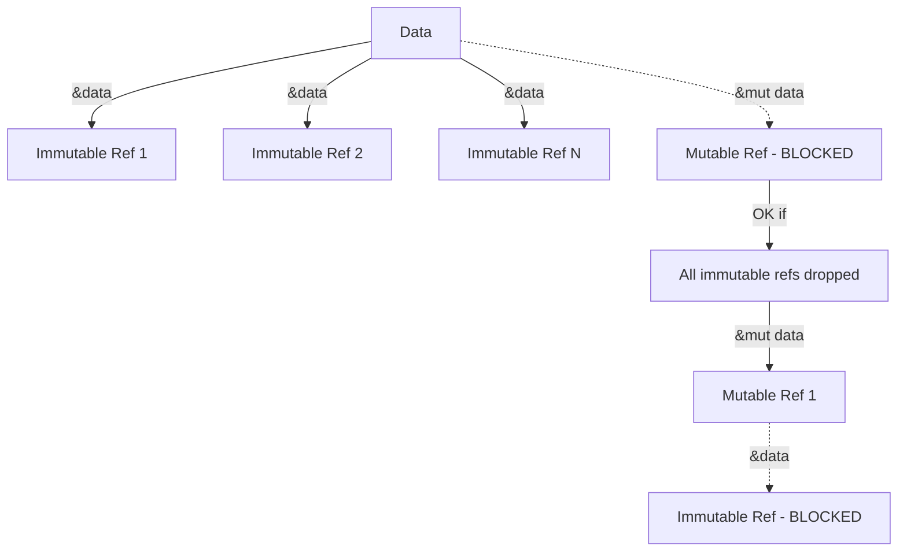

# 🔒 Ownership, Borrowing, and Lifetimes

## Introduction

Rust's ownership system is the language's most distinctive and powerful feature. Unlike C++ where memory safety is the programmer's responsibility, or Java and Go which rely on garbage collectors, Rust enforces memory safety at compile time through a set of ownership rules. This system eliminates dangling pointers, double frees, and data races without runtime overhead.

Understanding ownership is essential before writing any non-trivial Rust code. Every value in Rust has a single owner, and when that owner goes out of scope, the value is automatically dropped. This seemingly simple rule has profound implications for how you structure programs, pass data between functions, and design APIs. Mastery of ownership transforms the borrow checker from an obstacle into a reliable safety net.

This module explores the three pillars of Rust's memory management: ownership, borrowing, and lifetimes. You will learn not just the rules, but the reasoning behind them, with practical examples drawn from real-world systems like Firefox's Quantum engine.

## 1. Ownership Rules

Rust's ownership system rests on three immutable rules enforced by the compiler:

- **One owner at a time:** Each value in Rust has exactly one variable that owns it
- **Move semantics:** When a value is assigned to another variable or passed to a function, ownership is transferred (moved), and the original variable becomes invalid
- **Drop on scope exit:** When the owner goes out of scope, the value is automatically deallocated

These rules ensure that memory is freed exactly once, preventing both memory leaks and use-after-free bugs. The compiler inserts the appropriate `drop` calls at compile time, meaning there is zero runtime cost for this safety guarantee.

Real case: **Mozilla Firefox's Quantum engine** was one of the first major projects to adopt Rust at scale. By rewriting the CSS engine (Stylo) in Rust, Mozilla eliminated entire categories of memory safety bugs that had plagued the C++ codebase for decades. The ownership model allowed parallel traversal of the DOM tree without fear of data races, because the borrow checker proved at compile time that no two threads could mutate the same data simultaneously.

⚠️ **Warning:** Attempting to use a variable after its value has been moved will result in a compile-time error. This is not a limitation — it is Rust preventing you from accessing deallocated or invalid memory. Embrace the error message and restructure your code to explicitly clone the data or pass a reference instead.

💡 **Tip:** Use `Clone` trait explicitly when you need duplicate ownership. Writing `.clone()` makes the potentially expensive copy operation visible in your code, unlike implicit copy semantics in other languages.

### Ownership Transfer in Action

```rust
fn main() {
    let s1 = String::from("hello");
    let s2 = s1; // ownership moved to s2
    
    // println!("{}", s1); // ERROR: value borrowed after move
    println!("{}", s2); // OK: s2 owns the string
    
    takes_ownership(s2);
    // s2 is no longer valid here
} // s1 was invalidated after move, s2 dropped inside takes_ownership

fn takes_ownership(s: String) {
    println!("{}", s);
} // s dropped here
```

### The Copy Trait

Types that implement the `Copy` trait (scalars like `i32`, `bool`, `f64`, and tuples of `Copy` types) are duplicated rather than moved. This is because they have a fixed size known at compile time and live entirely on the stack.

```rust
fn main() {
    let x = 5;
    let y = x; // x is copied, not moved
    
    println!("x = {}, y = {}", x, y); // Both are valid
}
```

## 2. Borrowing: Immutable and Mutable References

Borrowing allows you to access data without taking ownership. Rust provides two types of references:

| Reference Type | Syntax | Rules | Use Case |
|---|---|---|---|
| Immutable | `&T` | Many allowed, no mutation | Read-only access, shared data |
| Mutable | `&mut T` | One allowed, exclusive | Modification required |

The borrowing rules are:

- You can have either one mutable reference **or** any number of immutable references to a particular piece of data in a particular scope
- References must always be valid (no dangling references)

These rules prevent data races at compile time. A data race occurs when two or more pointers access the same data concurrently, at least one is writing, and there's no synchronization. Rust's borrow checker eliminates this entire class of bugs.

### Borrowing Examples

```rust
fn main() {
    let mut s = String::from("hello");
    
    // Multiple immutable borrows are fine
    let r1 = &s;
    let r2 = &s;
    println!("{} {}", r1, r2);
    
    // r1 and r2 are no longer used after this point
    
    // Now we can borrow mutably
    let r3 = &mut s;
    r3.push_str(" world");
    println!("{}", r3);
}
```

⚠️ **Warning:** Creating a mutable reference while immutable references are still in scope will fail to compile, even if the immutable references are never used again. The compiler uses scope-based analysis, not use-based analysis. Restructure your code so the immutable references go out of scope before the mutable borrow begins.

### Dangling References

Rust prevents dangling references — references that point to memory that has been freed — at compile time.

```rust
// This will NOT compile
fn dangle() -> &String {
    let s = String::from("hello"); // s created here
    &s // returns reference to s
} // s dropped here, reference would dangle!
```

The fix is to return the `String` itself (transferring ownership) or use a type with a longer lifetime.

## 3. Lifetimes

Lifetimes are Rust's way of ensuring references are always valid. Every reference has a lifetime, which is the scope for which that reference is valid. Most of the time, lifetimes are inferred through **lifetime elision**, but sometimes you must annotate them explicitly.

### Lifetime Elision Rules

The compiler applies three rules to infer lifetimes in function signatures:

1. Each parameter that is a reference gets its own lifetime parameter
2. If there is exactly one input lifetime parameter, it is assigned to all output lifetime parameters
3. If there are multiple input lifetime parameters but one is `&self` or `&mut self`, the lifetime of `self` is assigned to all output lifetime parameters

### Explicit Lifetime Annotations

When elision rules don't apply, you must annotate lifetimes using apostrophe syntax:

```rust
fn longest<'a>(x: &'a str, y: &'a str) -> &'a str {
    if x.len() > y.len() {
        x
    } else {
        y
    }
}
```

The `'a` annotation means the returned reference will live at least as long as the shorter of the two input references.

### The `'static` Lifetime

The `'static` lifetime denotes that a reference lives for the entire duration of the program. All string literals have `'static` lifetime because they are baked into the program's binary.

```rust
let s: &'static str = "I live forever in the binary";
```

💡 **Tip:** Use `'static` sparingly. It's often better to tie lifetimes to specific scopes rather than claiming they live forever, as this gives the borrow checker more information to work with.

### Mermaid: Ownership Transfer Diagram

```mermaid
graph LR
    A[Variable s1] -->|owns| B[Heap String "hello"]
    B -->|moved| C[Variable s2]
    A -.->|invalidated| D[Compiler Error]
    C -->|passed to| E[Function takes_ownership]
    E -->|drops| F[Memory Freed]
```

### Mermaid: Borrowing Rules Diagram



## 4. Ownership Comparison

| Feature | Rust Ownership | C++ Raw Pointers | Go Garbage Collector |
|---|---|---|---|
| Memory Safety | Compile-time guaranteed | Manual, error-prone | Runtime guaranteed |
| Performance | Zero-cost | Zero-cost (unsafe) | GC pause overhead |
| Concurrency | Data-race free | Manual synchronization | Goroutines + channels |
| Learning Curve | Steep initially | Moderate | Gentle |
| Dangling References | Impossible | Common bug | Impossible |
| Use-after-free | Impossible | Common security vulnerability | Impossible |
| Double Free | Impossible | Possible | Impossible |

## 5. Practical Code: Lifetime Annotations

```rust
struct Book<'a> {
    title: &'a str,
    author: &'a str,
}

impl<'a> Book<'a> {
    fn new(title: &'a str, author: &'a str) -> Self {
        Book { title, author }
    }
    
    fn description(&self) -> String {
        format!("{} by {}", self.title, self.author)
    }
}

fn main() {
    let title = "The Rust Programming Language";
    let author = "Steve Klabnik and Carol Nichols";
    
    let book = Book::new(title, author);
    println!("{}", book.description());
}
```

### Complex Lifetime Example

```rust
struct Parser<'a> {
    text: &'a str,
    position: usize,
}

impl<'a> Parser<'a> {
    fn new(text: &'a str) -> Self {
        Parser { text, position: 0 }
    }
    
    fn next_word(&mut self) -> Option<&'a str> {
        let start = self.position;
        while self.position < self.text.len() 
              && !self.text[self.position..].starts_with(' ') {
            self.position += 1;
        }
        
        if start == self.position {
            None
        } else {
            let word = &self.text[start..self.position];
            self.position += 1; // skip space
            Some(word)
        }
    }
}

fn main() {
    let text = "hello world from rust";
    let mut parser = Parser::new(text);
    
    while let Some(word) = parser.next_word() {
        println!("Word: {}", word);
    }
}
```

---

## 📦 Compression Code

Complete Rust script demonstrating ownership, borrowing, and lifetimes:

```rust
use std::fs;

fn main() {
    let content = fs::read_to_string("input.txt")
        .expect("Failed to read file");
    
    let compressed = compress(&content);
    println!("Original: {} bytes", content.len());
    println!("Compressed: {} bytes", compressed.len());
}

fn compress<'a>(input: &'a str) -> Vec<u8> {
    let mut result = Vec::new();
    let bytes = input.as_bytes();
    
    if bytes.is_empty() {
        return result;
    }
    
    let mut current = bytes[0];
    let mut count = 1;
    
    for &byte in &bytes[1..] {
        if byte == current && count < 255 {
            count += 1;
        } else {
            result.push(current);
            result.push(count);
            current = byte;
            count = 1;
        }
    }
    
    result.push(current);
    result.push(count);
    result
}
```

## 🎯 Documented Project

### Description

Build a **Memory-Safe Text Buffer** library that manages a large text document with multiple cursors. Each cursor holds references to positions in the buffer without owning the data. The library must enforce that cursors cannot outlive the buffer they reference, and that no two cursors can mutate overlapping regions simultaneously.

### Functional Requirements

1. A `TextBuffer` struct that owns a `String` and tracks line boundaries
2. A `Cursor<'a>` struct that holds an immutable reference to a `TextBuffer` and a byte position
3. A `MutableCursor<'a>` struct that holds a mutable reference and can modify the buffer
4. The compiler must reject any code where a cursor outlives its buffer
5. Overlapping mutable cursors must be rejected at compile time

### Main Components

- `TextBuffer`: owns the document text and provides slice access
- `Cursor<'a>`: read-only view into the buffer with line/column tracking
- `MutableCursor<'a>`: exclusive write access to a specific region
- `BufferError`: enum for runtime errors like out-of-bounds access

### Success Metrics

- All unsafe code is rejected or explicitly wrapped in safe abstractions
- The library compiles with zero warnings under `#![warn(rust_2018_idioms)]`
- Memory usage remains proportional to the text size plus cursor metadata
- Operations on non-overlapping regions can occur in parallel (Send + Sync)

### References

- [The Rust Programming Language - Ownership](https://doc.rust-lang.org/book/ch04-00-understanding-ownership.html)
- [Rust By Example - Lifetimes](https://doc.rust-lang.org/rust-by-example/scope/lifetime.html)
- [Mozilla Hacks - Quantum CSS](https://hacks.mozilla.org/2017/08/inside-a-super-fast-css-engine-quantum-css-aka-stylo/)
- [Wikimedia Commons - Memory Layout Diagram](https://commons.wikimedia.org/wiki/File:Virtual_address_space_and_physical_address_space_relationship.svg)
