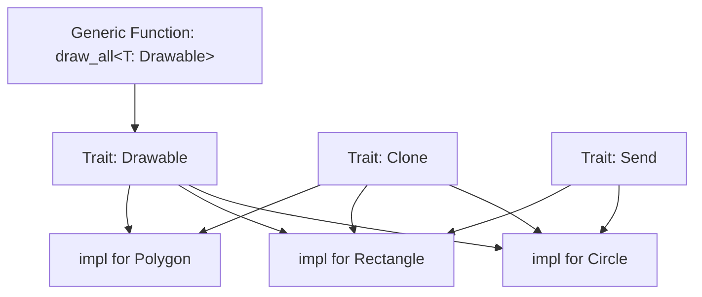

# 📐 Types, Traits, and Generics

## Introduction

Rust's type system is one of the most expressive in modern programming, drawing inspiration from ML-family languages while maintaining the performance characteristics of systems programming. At its core, the type system prevents invalid operations at compile time, eliminating null pointer dereferences, type confusion, and many other runtime errors before the program ever executes.

Traits are the backbone of Rust's abstraction mechanism. Unlike object-oriented inheritance, traits define shared behavior through interfaces that types can implement. This approach, similar to Haskell's typeclasses, enables ad-hoc polymorphism without the overhead of virtual method tables when monomorphized. Combined with generics, traits allow you to write code that works over any type satisfying a set of constraints, while still generating optimal machine code for each concrete type.

This module explores the full depth of Rust's type machinery. You will learn to leverage the type system to make illegal states unrepresentable, design trait hierarchies that compose cleanly, and use generics to eliminate code duplication without sacrificing performance.

## 1. The Rust Type System

Rust's type system is static, strong, and nominal with type inference. Every value has a type known at compile time, and implicit conversions are limited to non-lossy coercions.

### Scalar Types

- **Integers:** `i8`, `i16`, `i32`, `i64`, `i128`, `isize` (signed) and `u8`, `u16`, `u32`, `u64`, `u128`, `usize` (unsigned)
- **Floating-point:** `f32` and `f64` (IEEE 754 standard)
- **Boolean:** `bool` with values `true` and `false`
- **Character:** `char` representing a Unicode Scalar Value (4 bytes)

### Compound Types

- **Tuple:** Fixed-size, heterogeneous: `(i32, String, bool)`
- **Array:** Fixed-size, homogeneous: `[i32; 5]`
- **Slice:** Dynamically-sized view into an array: `&[i32]`

### Type Inference

Rust's compiler uses Hindley-Milner-style inference extended with trait solving. Most of the time you don't need explicit type annotations:

```rust
let guess = "42".parse().expect("Not a number!"); // ERROR: type annotation needed
let guess: u32 = "42".parse().expect("Not a number!"); // OK
```

💡 **Tip:** When the compiler asks for a type annotation, it's not being pedantic — there's genuinely ambiguity in your code. Adding the annotation documents your intent and often reveals logical errors in how you're using values.

⚠️ **Warning:** Integer overflow behavior differs between debug and release builds. In debug, panics occur on overflow. In release, two's complement wrapping occurs. Always use `checked_add`, `saturating_add`, or `wrapping_add` explicitly when overflow semantics matter.

## 2. Traits: Defining Shared Behavior

Traits define a set of methods that a type must implement. They are Rust's primary mechanism for abstraction and polymorphism.

### Defining and Implementing Traits

```rust
trait Drawable {
    fn draw(&self);
    fn bounds(&self) -> (f64, f64, f64, f64);
}

struct Circle {
    x: f64, y: f64, radius: f64,
}

impl Drawable for Circle {
    fn draw(&self) {
        println!("Drawing circle at ({}, {}) with radius {}", 
                 self.x, self.y, self.radius);
    }
    
    fn bounds(&self) -> (f64, f64, f64, f64) {
        (self.x - self.radius, self.y - self.radius,
         self.x + self.radius, self.y + self.radius)
    }
}
```

### Trait Bounds

Trait bounds constrain generic types to those implementing specific traits:

```rust
fn draw_all<T: Drawable>(shapes: &[T]) {
    for shape in shapes {
        shape.draw();
    }
}
```

Multiple bounds use the `+` operator:

```rust
fn process<T: Drawable + Clone + Send>(item: T) { }
```

### Associated Types

Associated types connect a type placeholder with a trait, allowing each implementation to specify its own type:

```rust
trait Iterator {
    type Item;
    fn next(&mut self) -> Option<Self::Item>;
}
```

This is preferred over generic traits when there should be exactly one `Item` type per `Iterator` implementation.

Real case: **Polars**, a DataFrame library written in Rust, uses traits extensively for zero-cost abstractions. The `SeriesTrait` trait defines operations on columns of data, with different implementations for `Int32`, `Float64`, `Utf8`, and other types. By using associated types and generic traits, Polars achieves C-level performance while providing a unified API across all data types. The compiler monomorphizes each generic call, eliminating virtual dispatch overhead.

### Mermaid: Trait Hierarchy Diagram



## 3. Generics

Generics allow you to write code that works with multiple types while maintaining type safety and performance.

### Generic Functions

```rust
fn largest<T: PartialOrd>(list: &[T]) -> &T {
    let mut largest = &list[0];
    for item in list {
        if item > largest {
            largest = item;
        }
    }
    largest
}
```

### Generic Structs and Enums

```rust
struct Point<T> {
    x: T,
    y: T,
}

struct MultiPoint<T, U> {
    x: T,
    y: U,
}

enum Result<T, E> {
    Ok(T),
    Err(E),
}
```

### Monomorphization

Rust implements generics through **monomorphization** — generating specific code for each concrete type at compile time. This eliminates runtime overhead but increases binary size:

```
Monomorphization_Size = Σ(Size_of_T_for_each_concrete_type)
```

| Aspect | Rust Monomorphization | Java Generics (Erasure) | C++ Templates |
|---|---|---|---|
| Implementation | Compile-time code generation | Type erasure to Object | Compile-time code generation |
| Runtime Cost | Zero | Boxing/unboxing for primitives | Zero |
| Binary Size | Grows with type combinations | Constant | Grows with type combinations |
| Compile Time | Slower with many instantiations | Fast | Slower, complex error messages |
| Cross-Crate | Supported with generics | Supported | Header-only or modules |

### Trait Comparison Across Languages

| Feature | Rust Traits | Java Interfaces | Go Interfaces | Haskell Typeclasses |
|---|---|---|---|---|
| Implementation | Explicit `impl` | Explicit `implements` | Implicit (structural) | Explicit `instance` |
| Multiple Implementations | One per type | One per type | One per type | Multiple (with extensions) |
| Associated Types | Yes | No (generics instead) | No | Yes |
| Default Methods | Yes | Yes (Java 8+) | No | Yes |
| Orphan Rules | Strict | Loose | N/A | Strict |
| Performance | Monomorphized or dynamic | Virtual dispatch | Virtual dispatch | Dictionary passing or specialization |

## 4. Advanced Trait Patterns

### Trait Objects

When you need runtime polymorphism, use trait objects (`dyn Trait`) with dynamic dispatch:

```rust
fn draw_any(shapes: &[Box<dyn Drawable>]) {
    for shape in shapes {
        shape.draw();
    }
}
```

⚠️ **Warning:** Trait objects have a runtime cost (vtable lookup) and require the trait to be "object-safe" (no generic methods, no `Self: Sized` bounds). Prefer generics when the concrete type is known at compile time.

### Operator Overloading

Rust allows operator overloading through traits in `std::ops`:

```rust
use std::ops::Add;

#[derive(Debug, Clone, Copy)]
struct Vector2 {
    x: f64,
    y: f64,
}

impl Add for Vector2 {
    type Output = Self;
    
    fn add(self, other: Self) -> Self::Output {
        Vector2 {
            x: self.x + other.x,
            y: self.y + other.y,
        }
    }
}
```

### Supertraits

Traits can depend on other traits:

```rust
trait Drawable: Clone + Send {
    fn draw(&self);
}
```

Any type implementing `Drawable` must also implement `Clone` and `Send`.

## 5. Practical Code: Custom Trait System

```rust
use std::fmt;

// Define a trait for numeric types
trait Numeric: Copy + PartialOrd + fmt::Display {
    fn zero() -> Self;
    fn one() -> Self;
    fn add(self, other: Self) -> Self;
}

// Implement for i32
impl Numeric for i32 {
    fn zero() -> Self { 0 }
    fn one() -> Self { 1 }
    fn add(self, other: Self) -> Self { self + other }
}

// Implement for f64
impl Numeric for f64 {
    fn zero() -> Self { 0.0 }
    fn one() -> Self { 1.0 }
    fn add(self, other: Self) -> Self { self + other }
}

// Generic function using the trait
fn sum<T: Numeric>(values: &[T]) -> T {
    let mut total = T::zero();
    for &v in values {
        total = total.add(v);
    }
    total
}

fn main() {
    let ints = vec![1, 2, 3, 4, 5];
    let floats = vec![1.5, 2.5, 3.5];
    
    println!("Sum of ints: {}", sum(&ints));
    println!("Sum of floats: {}", sum(&floats));
}
```

### Generic Matrix Type

```rust
#[derive(Debug, Clone)]
struct Matrix<T, const R: usize, const C: usize> {
    data: [[T; C]; R],
}

impl<T: Default + Copy, const R: usize, const C: usize> Matrix<T, R, C> {
    fn new() -> Self {
        Matrix {
            data: [[T::default(); C]; R],
        }
    }
    
    fn get(&self, row: usize, col: usize) -> Option<&T> {
        self.data.get(row)?.get(col)
    }
    
    fn set(&mut self, row: usize, col: usize, value: T) -> Result<(), &'static str> {
        if row >= R || col >= C {
            return Err("Index out of bounds");
        }
        self.data[row][col] = value;
        Ok(())
    }
}

fn main() {
    let mut m: Matrix<f64, 3, 3> = Matrix::new();
    m.set(1, 1, 3.14).unwrap();
    println!("{:?}", m);
}
```

---

## 📦 Compression Code

Complete Rust script using traits and generics for a compression abstraction:

```rust
use std::fs;

// Trait defining compression algorithm
trait Compressor {
    fn compress(&self, data: &[u8]) -> Vec<u8>;
    fn name(&self) -> &'static str;
}

// Run-Length Encoding implementation
struct RleCompressor;

impl Compressor for RleCompressor {
    fn compress(&self, data: &[u8]) -> Vec<u8> {
        let mut result = Vec::new();
        if data.is_empty() { return result; }
        
        let mut current = data[0];
        let mut count = 1u8;
        
        for &byte in &data[1..] {
            if byte == current && count < 255 {
                count += 1;
            } else {
                result.push(current);
                result.push(count);
                current = byte;
                count = 1;
            }
        }
        result.push(current);
        result.push(count);
        result
    }
    
    fn name(&self) -> &'static str { "RLE" }
}

// No-op compressor for benchmarking
struct IdentityCompressor;

impl Compressor for IdentityCompressor {
    fn compress(&self, data: &[u8]) -> Vec<u8> {
        data.to_vec()
    }
    
    fn name(&self) -> &'static str { "Identity" }
}

// Generic function that works with any compressor
fn compress_file<C: Compressor>(path: &str, compressor: C) -> std::io::Result<Vec<u8>> {
    let data = fs::read(path)?;
    let compressed = compressor.compress(&data);
    println!("{}: {} -> {} bytes", compressor.name(), data.len(), compressed.len());
    Ok(compressed)
}

fn main() -> std::io::Result<()> {
    let data = b"AAAAABBBBCCCCCDDDDD";
    
    let rle = RleCompressor;
    let identity = IdentityCompressor;
    
    compress_file("dummy.txt", rle)?;
    compress_file("dummy.txt", identity)?;
    
    Ok(())
}
```

## 🎯 Documented Project

### Description

Build a **Type-Safe Configuration Parser** library that can deserialize configuration files into strongly-typed Rust structs. The library should use traits to support multiple input formats (JSON, TOML, YAML) and generics to work with any deserializable type. The trait system should enforce at compile time that only supported formats can be parsed.

### Functional Requirements

1. A `ConfigParser` trait with methods `parse` and `extension`
2. Implementations for at least JSON and TOML parsers
3. A generic `load_config<T: DeserializeOwned>` function that selects the parser based on file extension
4. Custom derive macro support for automatic config struct generation
5. Validation trait that checks config values against constraints at parse time

### Main Components

- `ConfigParser` trait: abstraction over different serialization formats
- `JsonParser` and `TomlParser`: concrete implementations
- `Validatable` trait: ensures configs meet business rules
- `ConfigLoader<T>`: generic loader with format auto-detection
- `ConfigError` enum: structured error type for parse failures

### Success Metrics

- Adding a new format requires only implementing `ConfigParser` (open/closed principle)
- Invalid configs are rejected at parse time, not at use time
- Zero runtime overhead compared to parsing a specific format directly
- The library compiles with `#![forbid(unsafe_code)]`

### References

- [The Rust Programming Language - Traits](https://doc.rust-lang.org/book/ch10-02-traits.html)
- [Rust By Example - Generics](https://doc.rust-lang.org/rust-by-example/generics.html)
- [Polars Documentation](https://docs.rs/polars/latest/polars/)
- [Wikimedia Commons - Type System Diagram](https://commons.wikimedia.org/wiki/File:Type_system.svg)
