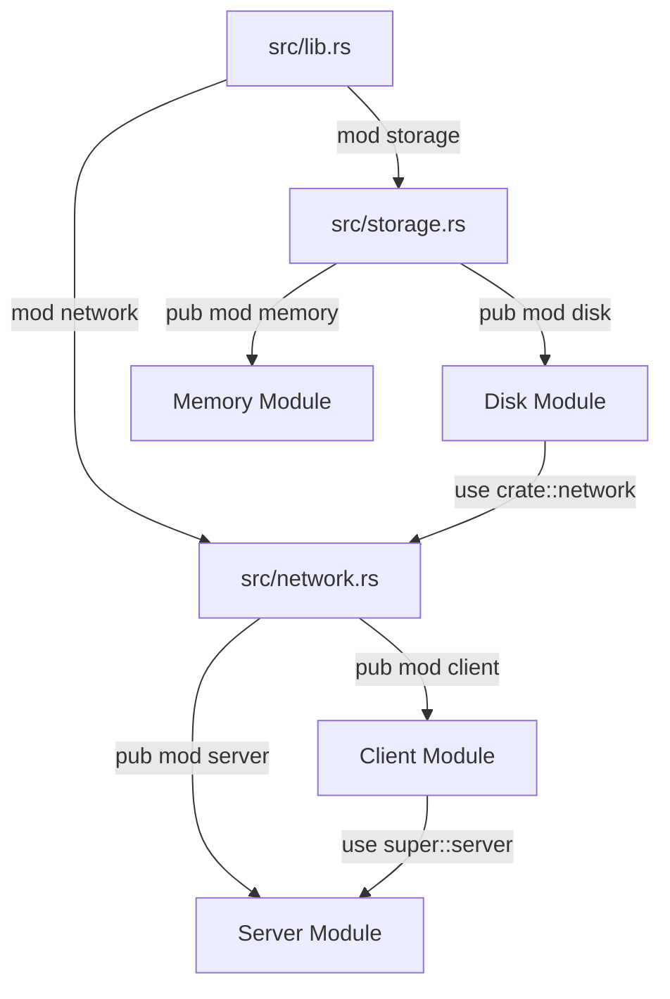

# 📦 Cargo, Crates, and the Module System

## Introduction

Rust's tooling ecosystem is centered around Cargo, a build system and package manager that handles compilation, dependency resolution, testing, and distribution. Unlike C++ where build systems vary by project (Make, CMake, Bazel), or JavaScript's npm-centric but fragmented tooling, Cargo provides a unified, batteries-included experience that works consistently across the entire Rust ecosystem.

The module system defines how code is organized and encapsulated within a Rust project. It determines which items are public or private, how names are resolved, and how large codebases are decomposed into manageable units. Understanding modules, crates, and workspaces is essential for building anything beyond a single-file script.

This module covers the complete project lifecycle: creating a new project with Cargo, managing dependencies from crates.io, structuring code with modules, and scaling to multi-crate workspaces. You will learn to leverage Rust's crate ecosystem safely and effectively.

## 1. Cargo: Build System and Package Manager

Cargo is the de facto standard for Rust development. It handles:

- **Building:** Compiling projects with `cargo build`
- **Testing:** Running test suites with `cargo test`
- **Documentation:** Generating docs with `cargo doc`
- **Dependency Management:** Fetching and resolving crates from crates.io
- **Publishing:** Uploading packages to crates.io with `cargo publish`

### Key Configuration

The `Cargo.toml` file defines a package's metadata and dependencies:

```toml
[package]
name = "my-project"
version = "1.0.0"
edition = "2021"
authors = ["Your Name <you@example.com>"]

[dependencies]
serde = { version = "1.0", features = ["derive"] }
tokio = { version = "1", features = ["full"] }

[dev-dependencies]
mockall = "0.12"
```

💡 **Tip:** Always specify the `edition` in `Cargo.toml`. The edition determines which language features and syntax are available. The 2021 edition introduced disjoint capture in closures, consistent `panic!` macros, and other improvements.

### Cargo.lock

Cargo generates a `Cargo.lock` file that pins exact dependency versions. For applications, commit this file to version control to ensure reproducible builds. For libraries, do not commit it — downstream users will resolve their own versions.

⚠️ **Warning:** Running `cargo update` will modify `Cargo.lock` to pull in the latest compatible versions of dependencies. Review changes carefully, as semantic versioning violations in the ecosystem can introduce breaking changes even in patch releases.

## 2. Crates: Binary vs Library

A crate is the smallest unit of code compilation in Rust. Every crate has a single root source file:

| Crate Type | Root File | Output | Use Case |
|---|---|---|---|
| Binary | `src/main.rs` | Executable | Applications, CLI tools |
| Library | `src/lib.rs` | `.rlib` or `.so` | Reusable code, APIs |

A package (defined by `Cargo.toml`) can contain multiple binary crates in `src/bin/` and at most one library crate.

### Crate Root

The crate root is where the compiler starts. All modules are declared relative to this root:

```rust
// src/lib.rs
pub mod config;
pub mod engine;
pub mod utils;
```

Real case: **Rust's crate ecosystem** enables safe dependencies through its combination of semantic versioning, Cargo's resolver, and the crates.io registry. The Rust Security Working Group actively monitors for vulnerable crates, and tools like `cargo-audit` automatically flag known security issues in your dependency tree. This ecosystem-level approach to safety means that even when pulling in third-party code, Rust's type system and ownership rules prevent many classes of bugs from propagating into your project.

## 3. The Module System

Modules organize code within a crate, control visibility, and manage namespaces.

### Declaring Modules

Use the `mod` keyword to declare a module:

```rust
// src/lib.rs
mod front_of_house {
    pub mod hosting {
        pub fn add_to_waitlist() {}
        fn seat_at_table() {} // private by default
    }
    
    mod serving {
        fn take_order() {}
    }
}
```

### Visibility with `pub`

By default, everything in Rust is private. Use `pub` to make items accessible:

- `pub` — visible everywhere
- `pub(crate)` — visible within the current crate
- `pub(super)` — visible to the parent module
- `pub(in path)` — visible within a specific path

### Bringing Names into Scope

The `use` keyword creates shortcuts to reduce repetition:

```rust
use std::collections::HashMap;
use std::io::{self, Write};
use std::fmt::Result as FmtResult;
```

The `self` and `super` keywords provide relative paths:

```rust
use self::config::Settings;    // current module
use super::utils::helpers;     // parent module
```

### Module File Organization

Modules can be declared inline or in separate files:

| Declaration | File Location |
|---|---|
| `mod config;` | `src/config.rs` or `src/config/mod.rs` |
| `mod config { ... }` | Inline in parent file |

💡 **Tip:** Prefer the `src/module.rs` style (introduced in Rust 2018) over `src/module/mod.rs` for flat module hierarchies. It reduces directory nesting and makes module boundaries clearer.

### Mermaid: Module Hierarchy Diagram



## 4. Workspaces

Workspaces allow you to manage multiple related packages in a single Cargo.lock file:

```toml
# Cargo.toml (workspace root)
[workspace]
members = [
    "crates/core",
    "crates/cli",
    "crates/web-api",
]

[workspace.dependencies]
serde = "1.0"
tokio = "1"
```

Benefits:

- Shared `Cargo.lock` ensures all crates use compatible dependency versions
- Cross-crate dependencies use path references for local development
- Unified testing with `cargo test --workspace`

### Build Time Dependencies

```
Compile_Time = f(Dependencies × LOC)
```

Where `f` is influenced by:

- Dependency tree depth and breadth
- Amount of generic code requiring monomorphization
- Procedural macro usage
- Parallel compilation units (controlled by `cargo build -j`)

| Tool | Language | Registry | Lock File | Workspace Support | Build Script |
|---|---|---|---|---|---|
| Cargo | Rust | crates.io | Cargo.lock | Native | build.rs |
| npm | JavaScript | npm registry | package-lock.json | Lerna/Nx | package.json scripts |
| pip | Python | PyPI | requirements.txt (manual) | Limited | setup.py |
| Go Modules | Go | Proxy/index | go.sum | Native (go.work) | //go:generate |
| Maven | Java | Maven Central | N/A (version ranges) | Multi-module | pom.xml plugins |

## 5. Practical Code: Multi-Module Project

### Project Structure

```
my-app/
├── Cargo.toml
├── src/
│   ├── main.rs
│   ├── lib.rs
│   ├── config.rs
│   ├── engine/
│   │   ├── mod.rs
│   │   ├── parser.rs
│   │   └── renderer.rs
│   └── utils/
│       ├── mod.rs
│       └── helpers.rs
└── tests/
    └── integration_test.rs
```

### Source Files

```rust
// src/lib.rs
pub mod config;
pub mod engine;
pub mod utils;

pub use config::Settings;
pub use engine::Processor;
```

```rust
// src/config.rs
use serde::{Deserialize, Serialize};

#[derive(Debug, Clone, Serialize, Deserialize)]
pub struct Settings {
    pub timeout: u64,
    pub max_connections: usize,
}

impl Default for Settings {
    fn default() -> Self {
        Settings {
            timeout: 30,
            max_connections: 100,
        }
    }
}
```

```rust
// src/engine/mod.rs
pub mod parser;
pub mod renderer;

use crate::config::Settings;

pub struct Processor {
    settings: Settings,
}

impl Processor {
    pub fn new(settings: Settings) -> Self {
        Processor { settings }
    }
    
    pub fn process(&self, input: &str) -> String {
        let parsed = parser::parse(input);
        renderer::render(&parsed, self.settings.timeout)
    }
}
```

```rust
// src/engine/parser.rs
pub struct ParsedData {
    pub tokens: Vec<String>,
}

pub fn parse(input: &str) -> ParsedData {
    ParsedData {
        tokens: input.split_whitespace().map(String::from).collect(),
    }
}
```

```rust
// src/engine/renderer.rs
use super::parser::ParsedData;

pub fn render(data: &ParsedData, timeout: u64) -> String {
    format!("Rendered {} tokens with timeout {}", 
            data.tokens.len(), timeout)
}
```

```rust
// src/utils/mod.rs
pub mod helpers;
```

```rust
// src/utils/helpers.rs
pub fn sanitize(input: &str) -> String {
    input.trim().to_lowercase()
}
```

```rust
// src/main.rs
use my_app::{Settings, Processor};

fn main() {
    let settings = Settings::default();
    let processor = Processor::new(settings);
    let result = processor.process("Hello World");
    println!("{}", result);
}
```

---

## 📦 Compression Code

Complete Rust workspace with a compression library and CLI:

```rust
// crates/compress/src/lib.rs
pub mod algorithms;

use algorithms::rle::RleEncoder;

pub trait Encoder {
    fn encode(&self, data: &[u8]) -> Vec<u8>;
    fn name(&self) -> &'static str;
}

pub fn encode_with<E: Encoder>(data: &[u8], encoder: E) -> Vec<u8> {
    encoder.encode(data)
}

pub fn default_encoder() -> impl Encoder {
    RleEncoder::new()
}
```

```rust
// crates/compress/src/algorithms/mod.rs
pub mod rle;
```

```rust
// crates/compress/src/algorithms/rle.rs
use crate::Encoder;

pub struct RleEncoder;

impl RleEncoder {
    pub fn new() -> Self {
        RleEncoder
    }
}

impl Encoder for RleEncoder {
    fn encode(&self, data: &[u8]) -> Vec<u8> {
        let mut result = Vec::new();
        if data.is_empty() { return result; }
        
        let mut current = data[0];
        let mut count = 1u8;
        
        for &byte in &data[1..] {
            if byte == current && count < 255 {
                count += 1;
            } else {
                result.push(current);
                result.push(count);
                current = byte;
                count = 1;
            }
        }
        result.push(current);
        result.push(count);
        result
    }
    
    fn name(&self) -> &'static str {
        "RLE"
    }
}
```

```rust
// crates/cli/src/main.rs
use compress::{default_encoder, encode_with};
use std::env;
use std::fs;

fn main() {
    let args: Vec<String> = env::args().collect();
    if args.len() < 2 {
        eprintln!("Usage: {} <file>", args[0]);
        std::process::exit(1);
    }
    
    let data = fs::read(&args[1]).expect("Failed to read file");
    let encoder = default_encoder();
    let compressed = encode_with(&data, encoder);
    
    println!("Original: {} bytes", data.len());
    println!("Compressed: {} bytes", compressed.len());
}
```

## 🎯 Documented Project

### Description

Build a **Modular Plugin System** using Cargo workspaces. The project consists of a core library crate that defines a plugin trait, multiple plugin implementation crates, and a binary crate that dynamically loads and executes plugins. Each plugin is compiled as a separate crate but linked into a single workspace.

### Functional Requirements

1. A `plugin-sdk` library crate defining a `Plugin` trait with `name()` and `execute()` methods
2. At least two plugin crates (`plugin-logger`, `plugin-metrics`) implementing the trait
3. A `plugin-host` binary that discovers and runs all available plugins
4. Workspace-level dependency management for shared libraries
5. Integration tests at the workspace root verifying plugin interoperability

### Main Components

- `plugin-sdk`: Core trait definitions and shared types
- `plugin-logger`: File and console logging plugin
- `plugin-metrics`: Metrics collection and reporting plugin
- `plugin-host`: Binary crate loading and executing plugins
- `tests/`: Integration tests spanning multiple crates

### Success Metrics

- Adding a new plugin requires only creating a new crate and implementing the trait
- The host binary can enumerate all plugins without hardcoding their names
- Workspace builds successfully with `cargo build --workspace`
- Cross-crate type safety is enforced by the compiler

### References

- [The Cargo Book](https://doc.rust-lang.org/cargo/)
- [The Rust Reference - Modules](https://doc.rust-lang.org/reference/items/modules.html)
- [Crates.io](https://crates.io/)
- [Wikimedia Commons - Software Architecture Diagram](https://commons.wikimedia.org/wiki/File:Overview_of_a_three-tier_application_vectorVersion.svg)
