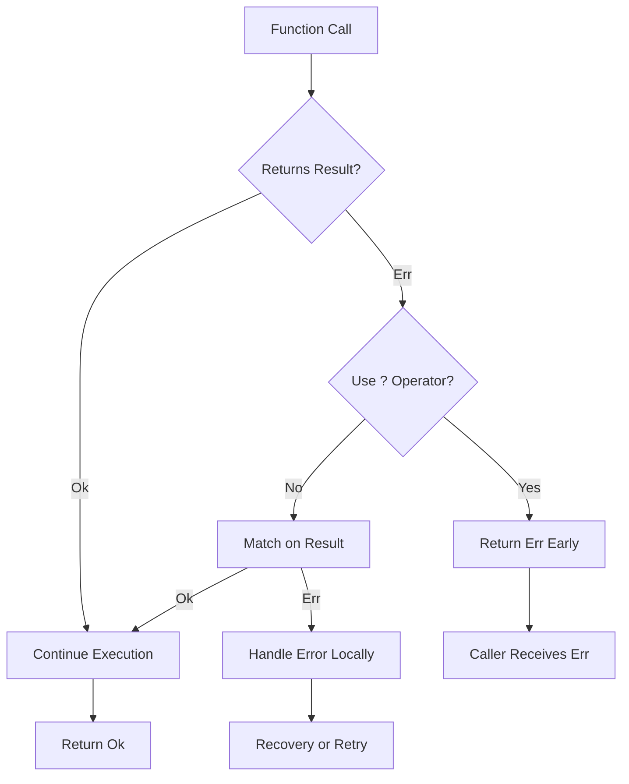

# ⚠️ Error Handling and Pattern Matching

## Introduction

Error handling is not an afterthought in Rust — it is a fundamental part of the type system. Rather than exceptions that unwind the stack, Rust uses explicit return types that force programmers to acknowledge and handle failures. The `Result<T, E>` and `Option<T>` types make error cases part of the function signature, transforming runtime crashes into compile-time obligations.

Pattern matching is the primary mechanism for working with these types and decomposing complex data structures. The `match` expression is exhaustive, meaning the compiler ensures every possible case is handled. This combination of explicit errors and exhaustive matching produces code that is both robust and self-documenting.

This module explores the full error handling toolkit: from basic `Result` propagation to custom error types using `thiserror` and `anyhow`, and from simple `if let` bindings to deep destructuring of nested enums. You will learn to write code that fails gracefully and communicates errors clearly.

## 1. The Result and Option Types

Rust represents recoverable errors with `Result<T, E>` and optional values with `Option<T>`:

```rust
enum Result<T, E> {
    Ok(T),
    Err(E),
}

enum Option<T> {
    Some(T),
    None,
}
```

These types are so central to Rust that they have dedicated operators and extensive standard library support.

### The `?` Operator

The `?` operator provides ergonomic error propagation:

```rust
fn read_username_from_file() -> Result<String, io::Error> {
    let mut file = File::open("hello.txt")?;
    let mut username = String::new();
    file.read_to_string(&mut username)?;
    Ok(username)
}
```

The `?` operator:

- Returns `Err(e)` early if the expression is an error
- Unwraps the `Ok` value otherwise
- Works with any type implementing the `FromResidual` trait (including `Option`)

💡 **Tip:** Chain multiple `?` operations in a single function, but keep the function focused. If you find yourself using `?` for wildly different error types, consider mapping them to a unified error type or splitting the function.

### Composing Results

```rust
fn divide(a: f64, b: f64) -> Result<f64, String> {
    if b == 0.0 {
        Err("Division by zero".to_string())
    } else {
        Ok(a / b)
    }
}

fn calculate() -> Result<f64, String> {
    let x = divide(10.0, 2.0)?;
    let y = divide(x, 3.0)?;
    let z = divide(y, 0.0)?; // Early return with Err
    Ok(z)
}
```

⚠️ **Warning:** Do not use `unwrap()` or `expect()` in production code except in truly exceptional cases where failure represents a programming bug (e.g., failed mutex lock due to poisoning). Prefer `?`, `match`, or proper error handling. Every `unwrap()` is a potential panic point.

## 2. Pattern Matching

The `match` expression is Rust's most powerful control flow construct. It compares a value against a series of patterns and executes the matching arm.

### Exhaustive Matching

```rust
enum Coin {
    Penny,
    Nickel,
    Dime,
    Quarter(String), // State name
}

fn value_in_cents(coin: Coin) -> u8 {
    match coin {
        Coin::Penny => 1,
        Coin::Nickel => 5,
        Coin::Dime => 10,
        Coin::Quarter(state) => {
            println!("State quarter from {:?}!", state);
            25
        }
    }
}
```

The compiler verifies that all variants are covered. If you add a new variant to `Coin`, the compiler will flag every `match` that doesn't handle it — a powerful refactoring aid.

### `if let` and `while let`

For single-pattern matches, use `if let` to reduce boilerplate:

```rust
if let Some(3) = some_value {
    println!("Three");
}

while let Some(value) = stack.pop() {
    println!("{}", value);
}
```

### Destructuring

Patterns can destructure structs, tuples, and enums:

```rust
struct Point { x: i32, y: i32 }

let p = Point { x: 0, y: 7 };

match p {
    Point { x, y: 0 } => println!("On the x axis at {}", x),
    Point { x: 0, y } => println!("On the y axis at {}", y),
    Point { x, y } => println!("On neither axis: ({}, {})", x, y),
}
```

### Guards and Ranges

```rust
match age {
    0 => println!("Newborn"),
    n if n < 13 => println!("Child"),
    n if n < 20 => println!("Teenager"),
    20..=65 => println!("Adult"),
    _ => println!("Senior"),
}
```

### Mermaid: Error Handling Flowchart



## 3. Error Handling Comparison

| Feature | Rust Result | Go Error | Python Exceptions |
|---|---|---|---|
| Return Type | Explicit `Result<T, E>` | Multiple return `(T, error)` | Implicit exception stack |
| Error Ignoring | Compiler warning (unused Result) | Easy to ignore `_` | Silent swallow with `pass` |
| Propagation | `?` operator | Manual `if err != nil` | Automatic stack unwinding |
| Stack Trace | Optional (backtrace crate) | Optional | Automatic |
| Performance | Zero-cost | Zero-cost | Stack unwinding overhead |
| Type Safety | Error type in signature | `error` interface | Untyped |
| Composition | `map`, `and_then`, `or_else` | Manual chaining | `try/except` blocks |

The formula for error propagation complexity:

```
Error_Propagation = Σ(match_branches)
```

Where `match_branches` represents each point where a `Result` or `Option` must be unwrapped or propagated. The `?` operator reduces this sum significantly by collapsing sequential operations.

Real case: **AWS SDK for Rust** handles errors across dozens of services by defining a unified `SdkError<E>` type. Each service has its own error enum, but they all compose under the SDK error type. The `?` operator allows requests to be chained across services — for example, reading from S3, processing with Lambda, and writing to DynamoDB — with each step's errors propagating transparently. This explicit error model has caught numerous misconfigurations at compile time that would have manifested as runtime failures in other SDKs.

## 4. Custom Error Types

For production applications, define structured error types that carry context.

### Manual Error Enums

```rust
#[derive(Debug)]
enum AppError {
    Io(io::Error),
    Parse(ParseIntError),
    Config { file: String, line: usize },
}

impl fmt::Display for AppError {
    fn fmt(&self, f: &mut fmt::Formatter) -> fmt::Result {
        match self {
            AppError::Io(e) => write!(f, "IO error: {}", e),
            AppError::Parse(e) => write!(f, "Parse error: {}", e),
            AppError::Config { file, line } => {
                write!(f, "Config error in {} at line {}", file, line)
            }
        }
    }
}

impl Error for AppError {}
```

### Using `thiserror`

The `thiserror` crate reduces boilerplate for custom error types:

```rust
use thiserror::Error;

#[derive(Error, Debug)]
enum AppError {
    #[error("IO error: {0}")]
    Io(#[from] io::Error),
    
    #[error("Parse error: {0}")]
    Parse(#[from] ParseIntError),
    
    #[error("Config error in {file} at line {line}")]
    Config { file: String, line: usize },
}
```

### Using `anyhow`

For applications where you don't need structured error types, `anyhow` provides easy error handling:

```rust
use anyhow::{Context, Result};

fn main() -> Result<()> {
    let config = std::fs::read_to_string("config.json")
        .context("Failed to read config file")?;
    
    let data: Config = serde_json::from_str(&config)
        .context("Failed to parse config")?;
    
    Ok(())
}
```

💡 **Tip:** Use `thiserror` for libraries where callers need to match on specific errors, and `anyhow` for applications where you just want to propagate errors with context. They can even be used together — `anyhow` will happily wrap `thiserror` types.

## 5. Practical Code: Error Handling in Practice

```rust
use std::fs::File;
use std::io::{self, BufRead, BufReader};
use thiserror::Error;

#[derive(Error, Debug)]
enum ProcessError {
    #[error("IO error: {0}")]
    Io(#[from] io::Error),
    
    #[error("Invalid number at line {line}: {value}")]
    InvalidNumber { line: usize, value: String },
    
    #[error("Division by zero at line {line}")]
    DivisionByZero { line: usize },
}

fn process_file(path: &str) -> Result<Vec<f64>, ProcessError> {
    let file = File::open(path)?;
    let reader = BufReader::new(file);
    let mut results = Vec::new();
    
    for (line_num, line) in reader.lines().enumerate() {
        let line = line?;
        let parts: Vec<&str> = line.split(',').collect();
        
        if parts.len() != 2 {
            continue;
        }
        
        let numerator: f64 = parts[0].parse()
            .map_err(|_| ProcessError::InvalidNumber {
                line: line_num + 1,
                value: parts[0].to_string(),
            })?;
        
        let denominator: f64 = parts[1].parse()
            .map_err(|_| ProcessError::InvalidNumber {
                line: line_num + 1,
                value: parts[1].to_string(),
            })?;
        
        if denominator == 0.0 {
            return Err(ProcessError::DivisionByZero {
                line: line_num + 1,
            });
        }
        
        results.push(numerator / denominator);
    }
    
    Ok(results)
}

fn main() {
    match process_file("data.csv") {
        Ok(values) => println!("Results: {:?}", values),
        Err(e) => eprintln!("Error: {}", e),
    }
}
```

---

## 📦 Compression Code

Complete Rust script with comprehensive error handling:

```rust
use std::fs::File;
use std::io::{self, Read, Write};
use thiserror::Error;

#[derive(Error, Debug)]
enum CompressError {
    #[error("IO error: {0}")]
    Io(#[from] io::Error),
    
    #[error("Empty input")]
    EmptyInput,
    
    #[error("Output larger than input: {input} -> {output}")]
    Ineffective { input: usize, output: usize },
}

fn compress(input_path: &str, output_path: &str) -> Result<usize, CompressError> {
    let mut input = Vec::new();
    File::open(input_path)?.read_to_end(&mut input)?;
    
    if input.is_empty() {
        return Err(CompressError::EmptyInput);
    }
    
    let mut output = Vec::new();
    let mut current = input[0];
    let mut count = 1u8;
    
    for &byte in &input[1..] {
        if byte == current && count < 255 {
            count += 1;
        } else {
            output.push(current);
            output.push(count);
            current = byte;
            count = 1;
        }
    }
    output.push(current);
    output.push(count);
    
    if output.len() > input.len() {
        return Err(CompressError::Ineffective {
            input: input.len(),
            output: output.len(),
        });
    }
    
    let mut file = File::create(output_path)?;
    file.write_all(&output)?;
    
    Ok(output.len())
}

fn main() {
    match compress("input.txt", "output.bin") {
        Ok(size) => println!("Compressed to {} bytes", size),
        Err(e) => {
            eprintln!("Compression failed: {}", e);
            std::process::exit(1);
        }
    }
}
```

## 🎯 Documented Project

### Description

Build a **Resilient Configuration Loader** that reads configuration from multiple sources (file, environment variables, command-line arguments) with layered overrides. The system must handle missing files gracefully, validate types strictly, and provide detailed error messages indicating exactly which source caused a failure.

### Functional Requirements

1. Read base configuration from a JSON file with `Result`-based error handling
2. Apply environment variable overrides using `Option` and `if let`
3. Parse command-line arguments and merge with existing config
4. Validate that all required fields are present, returning structured errors
5. Provide context in errors (e.g., "Failed to load config from /etc/app.conf: permission denied")

### Main Components

- `Config` struct: Represents the merged configuration
- `FileSource`, `EnvSource`, `ArgSource`: Individual configuration sources
- `ConfigError` enum: Structured errors with source attribution
- `Loader`: Orchestrates sources and applies overrides

### Success Metrics

- Missing optional config sources are handled gracefully without failure
- Every error message identifies the source file, line, or variable involved
- The loader never panics — all failure paths return `Result`
- Invalid config values are caught at load time, not at use time

### References

- [The Rust Programming Language - Error Handling](https://doc.rust-lang.org/book/ch09-00-error-handling.html)
- [The Rust Programming Language - Pattern Matching](https://doc.rust-lang.org/book/ch18-00-patterns.html)
- [thiserror crate](https://docs.rs/thiserror/latest/thiserror/)
- [anyhow crate](https://docs.rs/anyhow/latest/anyhow/)
- [AWS SDK for Rust Error Handling](https://github.com/awslabs/aws-sdk-rust)
