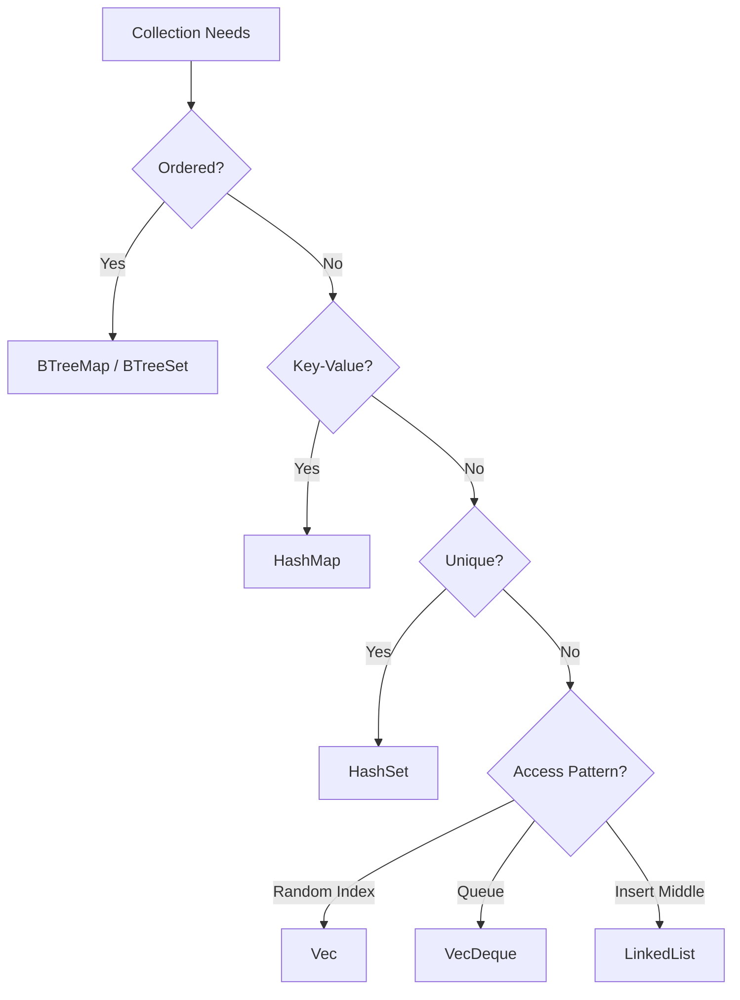

# 🗃️ Collections and Iterators

## Introduction

Collections are the workhorses of Rust's standard library, providing efficient, type-safe data structures for every common use case. From the ubiquitous `Vec<T>` to the ordered `BTreeMap`, Rust's collections are designed with zero-cost abstractions in mind — they provide high-level APIs while generating machine code comparable to hand-written C.

Iterators are the primary interface for processing collections. Unlike languages that use external iteration (explicit index-based loops), Rust embraces internal iteration where the iterator controls the loop. This design enables lazy evaluation, fusion of operations, and powerful parallel processing through libraries like Rayon. The `Iterator` trait is so central to Rust that `for` loops are syntactic sugar for iterator consumption.

This module examines the full collection hierarchy, the iterator protocol, and how to build your own iterators. You will learn to choose the right collection for your data, chain operations for expressive data pipelines, and leverage Rust's zero-cost iterator guarantees for production-grade performance.

## 1. Collections in the Standard Library

Rust's standard library provides collections for sequences, maps, sets, and linked structures:

| Collection | Description | Use Case | Average Complexity |
|---|---|---|---|
| `Vec<T>` | Contiguous growable array | General purpose sequence | Push: O(1)*, Index: O(1), Search: O(n) |
| `VecDeque<T>` | Double-ended queue | FIFO/LIFO with both ends | Push/Pop: O(1) |
| `LinkedList<T>` | Doubly-linked list | Frequent insertions at middle | Insert: O(1) with iterator |
| `HashMap<K, V>` | Unordered key-value map | Fast lookups by key | Insert/Lookup: O(1)* |
| `BTreeMap<K, V>` | Ordered key-value map | Range queries, ordered iteration | Insert/Lookup: O(log n) |
| `HashSet<T>` | Unordered set | Membership testing | Insert/Contains: O(1)* |
| `BTreeSet<T>` | Ordered set | Ordered unique elements | Insert/Contains: O(log n) |

*Amortized or average case; HashMap depends on hash quality

### Vector Operations

```rust
let mut v = Vec::new();
v.push(1);
v.push(2);
v.extend([3, 4, 5]);

let third = v.get(2);        // Returns Option<&T>
let first = &v[0];           // Panics if out of bounds

for x in &v {
    println!("{}", x);
}
```

💡 **Tip:** Pre-allocate vectors with `Vec::with_capacity(n)` when you know the final size. This avoids repeated reallocations and can significantly improve performance for large collections.

### HashMap Patterns

```rust
use std::collections::HashMap;

let mut scores = HashMap::new();
scores.insert("Alice", 10);
scores.insert("Bob", 20);

// Entry API for conditional insertion
scores.entry("Charlie").or_insert(0);
*scores.entry("Alice").or_insert(0) += 5;

// Safe access
match scores.get("Alice") {
    Some(score) => println!("Alice: {}", score),
    None => println!("Alice not found"),
}
```

⚠️ **Warning:** `HashMap` and `HashSet` require their keys to implement `Eq` and `Hash`. For custom types, derive these traits or implement them manually. Be cautious with floating-point keys — `NaN != NaN` breaks the `Eq` contract and can cause panics or incorrect behavior.

## 2. The Iterator Trait

All iterators implement the `Iterator` trait:

```rust
pub trait Iterator {
    type Item;
    fn next(&mut self) -> Option<Self::Item>;
    
    // Provided methods: map, filter, fold, collect, etc.
}
```

The `next` method is the only required method. All other methods (adapters and consumers) have default implementations built on top of it.

### Iterator Adapters (Lazy)

Adapters transform iterators without consuming them:

| Adapter | Description | Example |
|---|---|---|
| `map` | Transform each element | `.map(|x| x * 2)` |
| `filter` | Keep elements matching predicate | `.filter(|x| x > &5)` |
| `enumerate` | Yield (index, element) pairs | `.enumerate()` |
| `zip` | Pair with another iterator | `.zip(other)` |
| `take` | Limit to first n elements | `.take(10)` |
| `skip` | Skip first n elements | `.skip(5)` |
| `flatten` | Flatten nested iterators | `.flatten()` |

### Iterator Consumers (Eager)

Consumers evaluate the iterator and produce a value:

| Consumer | Description | Example |
|---|---|---|
| `collect` | Gather into a collection | `.collect::<Vec<_>>()` |
| `fold` | Aggregate with accumulator | `.fold(0, |a, b| a + b)` |
| `sum` | Sum numeric elements | `.sum::<i32>()` |
| `count` | Count elements | `.count()` |
| `any`/`all` | Boolean predicates | `.any(|x| x > 5)` |
| `find` | Find first matching element | `.find(|x| x > &5)` |
| `for_each` | Execute side effect | `.for_each(|x| println!("{}", x))` |

### Lazy Evaluation Benefits

```rust
let sum: i32 = (0..1_000_000)
    .map(|x| x * 2)
    .filter(|x| x % 3 == 0)
    .take(100)
    .sum();
```

This code allocates no intermediate collections. The iterator chain fuses into a single loop, demonstrating Rust's zero-cost abstraction:

```
Iterator_Overhead ≈ 0
```

Real case: **Rayon** is a data parallelism library that converts sequential iterator chains into parallel ones with a single method call. Changing `.iter()` to `.par_iter()` distributes work across CPU cores while maintaining the same lazy evaluation semantics. This is possible because Rust's type system proves at compile time that iterator adapters are side-effect free and safe to execute in parallel. Companies like Discord have used Rayon to parallelize hot paths in their Rust services, achieving near-linear speedups on multi-core machines.

### Mermaid: Iterator Pipeline Diagram

```mermaid
graph LR
    A[Source: 0..1000000] -->|map\|x\| x * 2| B[Transformed Stream]
    B -->|filter\|x\| x % 3 == 0| C[Filtered Stream]
    C -->|take 100| D[Limited Stream]
    D -->|sum| E[Final Value]
    style A fill:#f9f,stroke:#333
    style E fill:#bbf,stroke:#333
```

### Mermaid: Collections Comparison



## 3. Collection Comparison Across Languages

| Feature | Rust Vec/HashMap | Python list/dict | Go slice/map |
|---|---|---|---|
| Growth Strategy | Doubling | Over-allocation | Doubling |
| Heterogeneous | No (generic) | Yes | No (typed) |
| Iteration | Zero-cost adapters | Generator objects | Range loops |
| Ownership | Moves/clones | Reference counted | Values/copies |
| Thread Safety | Explicit (Arc/Mutex) | GIL-protected | Explicit (sync) |
| Memory Layout | Contiguous (Vec) | Pointer array | Hash table |

## 4. Custom Iterators

Implementing the `Iterator` trait allows your types to work with `for` loops and all standard adapters.

```rust
struct Fibonacci {
    curr: u64,
    next: u64,
}

impl Fibonacci {
    fn new() -> Self {
        Fibonacci { curr: 0, next: 1 }
    }
}

impl Iterator for Fibonacci {
    type Item = u64;
    
    fn next(&mut self) -> Option<Self::Item> {
        let current = self.curr;
        self.curr = self.next;
        self.next = current + self.next;
        Some(current)
    }
}

fn main() {
    let fib = Fibonacci::new();
    for n in fib.take(10) {
        print!("{} ", n);
    }
}
```

### Iterator with State

```rust
struct WordIterator<'a> {
    text: &'a str,
    position: usize,
}

impl<'a> WordIterator<'a> {
    fn new(text: &'a str) -> Self {
        WordIterator { text, position: 0 }
    }
}

impl<'a> Iterator for WordIterator<'a> {
    type Item = &'a str;
    
    fn next(&mut self) -> Option<Self::Item> {
        let bytes = self.text.as_bytes();
        
        // Skip whitespace
        while self.position < bytes.len() && bytes[self.position].is_ascii_whitespace() {
            self.position += 1;
        }
        
        if self.position >= bytes.len() {
            return None;
        }
        
        let start = self.position;
        while self.position < bytes.len() && !bytes[self.position].is_ascii_whitespace() {
            self.position += 1;
        }
        
        Some(&self.text[start..self.position])
    }
}
```

## 5. Practical Code: Complex Iterator Chain

```rust
use std::collections::HashMap;

fn analyze_text(text: &str) -> HashMap<char, usize> {
    text.to_lowercase()
        .chars()
        .filter(|c| c.is_alphabetic())
        .fold(HashMap::new(), |mut map, c| {
            *map.entry(c).or_insert(0) += 1;
            map
        })
}

fn main() {
    let text = "The quick brown fox jumps over the lazy dog";
    let frequencies = analyze_text(text);
    
    let mut pairs: Vec<_> = frequencies.iter().collect();
    pairs.sort_by(|a, b| b.1.cmp(a.1));
    
    for (letter, count) in pairs.iter().take(5) {
        println!("{}: {}", letter, count);
    }
}
```

### Advanced Iterator Pattern

```rust
#[derive(Debug)]
struct MovingAverage {
    window_size: usize,
    values: Vec<f64>,
}

impl MovingAverage {
    fn new(window_size: usize) -> Self {
        MovingAverage {
            window_size,
            values: Vec::new(),
        }
    }
    
    fn add(&mut self, value: f64) {
        self.values.push(value);
        if self.values.len() > self.window_size {
            self.values.remove(0);
        }
    }
    
    fn average(&self) -> Option<f64> {
        if self.values.is_empty() {
            None
        } else {
            Some(self.values.iter().sum::<f64>() / self.values.len() as f64)
        }
    }
}

fn main() {
    let data = vec![1.0, 2.0, 3.0, 4.0, 5.0, 6.0, 7.0];
    let window_size = 3;
    
    let averages: Vec<f64> = data
        .windows(window_size)
        .map(|w| w.iter().sum::<f64>() / w.len() as f64)
        .collect();
    
    println!("Moving averages: {:?}", averages);
}
```

---

## 📦 Compression Code

Complete Rust script using collections and iterators for compression:

```rust
use std::collections::HashMap;

fn frequency_analysis(data: &[u8]) -> HashMap<u8, usize> {
    data.iter()
        .fold(HashMap::new(), |mut map, &byte| {
            *map.entry(byte).or_insert(0) += 1;
            map
        })
}

fn compress_rle(data: &[u8]) -> Vec<u8> {
    if data.is_empty() {
        return Vec::new();
    }
    
    data.iter()
        .skip(1)
        .fold(
            (Vec::new(), data[0], 1u8),
            |(mut result, current, count), &byte| {
                if byte == current && count < 255 {
                    (result, current, count + 1)
                } else {
                    result.push(current);
                    result.push(count);
                    (result, byte, 1)
                }
            }
        )
        .0
}

fn main() {
    let data = b"AAAAABBBBCCCCCDDDDD";
    
    let freqs = frequency_analysis(data);
    println!("Frequencies: {:?}", freqs);
    
    let compressed = compress_rle(data);
    println!("Original: {} bytes", data.len());
    println!("Compressed: {} bytes", compressed.len());
}
```

## 🎯 Documented Project

### Description

Build a **Streaming Log Analyzer** that processes large log files using iterators without loading the entire file into memory. The analyzer should extract structured fields, filter by severity level, aggregate statistics, and identify error patterns — all using lazy iterator chains.

### Functional Requirements

1. Read log files line-by-line using `BufReader` and iterators
2. Parse each line into a structured `LogEntry` struct with timestamp, level, and message
3. Filter entries by log level (`Error`, `Warn`, `Info`) using iterator adapters
4. Aggregate statistics: count by level, frequency of error messages, time-based histograms
5. Identify top-N most frequent errors without storing all entries in memory

### Main Components

- `LogEntry` struct: Parsed representation of a log line
- `LogParser` iterator: Converts lines into structured entries lazily
- `LogAnalyzer`: Provides aggregation methods using iterator chains
- `TopN` struct: Maintains top-N items using a bounded heap

### Success Metrics

- Files larger than available RAM are processed without out-of-memory errors
- Iterator chains fuse into minimal intermediate allocations
- The analyzer can process 1GB log files in under 30 seconds on modern hardware
- Memory usage remains constant regardless of input file size

### References

- [The Rust Programming Language - Collections](https://doc.rust-lang.org/book/ch08-00-common-collections.html)
- [The Rust Programming Language - Iterators](https://doc.rust-lang.org/book/ch13-02-iterators.html)
- [Rayon Documentation](https://docs.rs/rayon/latest/rayon/)
- [Wikimedia Commons - Data Structure Diagrams](https://commons.wikimedia.org/wiki/File:Hash_table_3_1_1_0_1_0_0_SP.svg)
