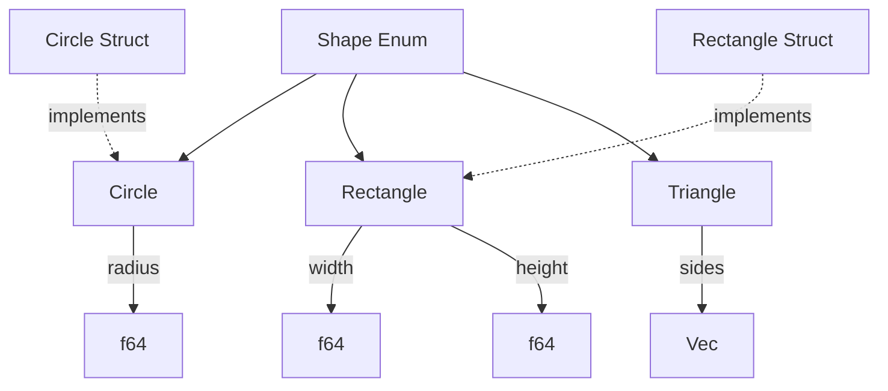

# 🏗️ Structs, Enums, and Advanced Patterns

## Introduction

Structs and enums are Rust's primary tools for creating custom data types. Unlike many languages where structs are simple record types and enums are just named constants, Rust elevates both to first-class algebraic data types (ADTs). Enums can carry data in their variants, enabling the elegant modeling of state machines, optional values, and error conditions that makes `Option<T>` and `Result<T, E>` possible.

Advanced patterns built on these foundations — smart pointers via `Deref`, resource management via `Drop`, value semantics via `Clone` and `Copy` — allow you to create types that integrate seamlessly with Rust's ownership system. These patterns are not merely convenient; they are the tools you use to make your types behave correctly under Rust's borrow checker rules.

This module covers the design space of structs and enums, from simple named fields to complex variants with multiple data payloads. You will learn how Serde leverages enums for deserialization, how to implement custom smart pointers, and how to use advanced patterns to build types that are both safe and ergonomic.

## 1. Structs

Rust provides three struct variants, each suited to different use cases:

| Struct Type | Syntax | Use Case |
|---|---|---|
| Named | `struct Point { x: f64, y: f64 }` | Most common, self-documenting fields |
| Tuple | `struct Color(u8, u8, u8)` | Simple wrappers, newtypes |
| Unit | `struct Empty;` | Marker types, zero-size types |

### Named Structs with Methods

```rust
#[derive(Debug, Clone)]
struct Rectangle {
    width: f64,
    height: f64,
}

impl Rectangle {
    // Constructor (convention, not syntax)
    fn new(width: f64, height: f64) -> Self {
        Rectangle { width, height }
    }
    
    // Method with &self
    fn area(&self) -> f64 {
        self.width * self.height
    }
    
    // Method with &mut self
    fn scale(&mut self, factor: f64) {
        self.width *= factor;
        self.height *= factor;
    }
    
    // Method taking ownership
    fn into_square(self) -> Self {
        let side = self.width.max(self.height);
        Rectangle { width: side, height: side }
    }
    
    // Associated function (no self)
    fn square(side: f64) -> Self {
        Rectangle { width: side, height: side }
    }
}
```

💡 **Tip:** Implement `Default` for structs with many optional fields. Combined with the struct update syntax (`..Default::default()`), this allows flexible construction without dozens of constructor variants.

### Tuple Structs as Newtypes

Tuple structs are ideal for creating distinct types with zero runtime overhead:

```rust
struct Meters(f64);
struct Kilometers(f64);

impl Meters {
    fn to_kilometers(self) -> Kilometers {
        Kilometers(self.0 / 1000.0)
    }
}
```

This pattern prevents mixing values of the same underlying type but different semantic meaning — a classic source of bugs in languages with only type aliases.

⚠️ **Warning:** Tuple struct fields are accessed by index (`self.0`, `self.1`), which is less readable than named fields. Use them when the field names would be obvious from context, or when the struct is primarily a wrapper.

## 2. Enums

Rust enums are **algebraic data types** where each variant can carry different data:

```rust
enum Message {
    Quit,                           // unit variant
    Move { x: i32, y: i32 },       // anonymous struct
    Write(String),                  // single value
    ChangeColor(i32, i32, i32),    // tuple variant
}
```

### Methods on Enums

```rust
impl Message {
    fn call(&self) {
        match self {
            Message::Quit => println!("Quitting"),
            Message::Move { x, y } => println!("Moving to ({}, {})", x, y),
            Message::Write(text) => println!("Writing: {}", text),
            Message::ChangeColor(r, g, b) => {
                println!("Changing color to RGB({}, {}, {})", r, g, b)
            }
        }
    }
    
    fn is_quit(&self) -> bool {
        matches!(self, Message::Quit)
    }
}
```

### Option and Result

The standard library's most important enums:

```rust
enum Option<T> {
    Some(T),
    None,
}

enum Result<T, E> {
    Ok(T),
    Err(E),
}
```

These enums are so foundational that they have dedicated syntax (`?` operator), extensive method APIs (`map`, `unwrap_or`, `and_then`), and compiler optimizations.

Real case: **Serde**, Rust's serialization framework, uses enums to model the full range of possible data types in a structured format. The `Value` enum represents any JSON-like value:

```rust
enum Value {
    Null,
    Bool(bool),
    Number(Number),
    String(String),
    Array(Vec<Value>),
    Object(Map<String, Value>),
}
```

This recursive enum allows Serde to deserialize unknown structures into a generic tree, then pattern-match on the expected shape. When deserializing to a known struct, Serde generates optimized code that maps directly from the wire format to struct fields, avoiding the intermediate `Value` representation entirely. This dual strategy — dynamic tree for exploration, static codegen for performance — is only possible because Rust enums can carry data and the compiler can optimize across enum variants.

### Mermaid: Struct/Enum Relationship Diagram



## 3. Advanced Patterns

### Deref and DerefMut

Implementing `Deref` allows your type to be treated as a reference to another type, enabling smart pointer patterns:

```rust
use std::ops::Deref;

struct MyBox<T>(T);

impl<T> MyBox<T> {
    fn new(x: T) -> MyBox<T> {
        MyBox(x)
    }
}

impl<T> Deref for MyBox<T> {
    type Target = T;
    
    fn deref(&self) -> &Self::Target {
        &self.0
    }
}

// Now MyBox<T> can be used anywhere &T is expected
fn main() {
    let x = MyBox::new(5);
    assert_eq!(*x, 5); // Deref coercion allows this
}
```

### Drop

The `Drop` trait provides custom cleanup code when a value goes out of scope:

```rust
struct FileGuard {
    name: String,
}

impl Drop for FileGuard {
    fn drop(&mut self) {
        println!("Closing file: {}", self.name);
    }
}
```

`Drop` is essential for RAII patterns — acquiring a resource in the constructor and releasing it in `drop`. This pattern ensures resources are never leaked, even if panics occur.

### Clone and Copy

| Trait | Behavior | Requirements |
|---|---|---|
| `Copy` | Bitwise duplicate | Only scalar-like types, no heap allocation |
| `Clone` | Explicit deep copy | Any type, may be expensive |

```rust
#[derive(Clone, Copy)]
struct Point {
    x: i32,
    y: i32,
}

#[derive(Clone)]
struct Container {
    data: Vec<i32>, // Clone will duplicate the Vec
}
```

💡 **Tip:** Derive `Copy` for small, immutable types. It enables implicit duplication and makes the type behave like primitives. Never derive `Copy` for types managing external resources or heap memory — use `Clone` instead so copies are always explicit.

### ADT Comparison Across Languages

| Feature | Rust Enums | C Unions | Swift Enums | Haskell ADTs |
|---|---|---|---|---|
| Tag Safety | Compile-time guaranteed | Manual | Compile-time | Compile-time |
| Variant Data | Yes | Unsafe union | Yes with associated values | Yes |
| Exhaustive Match | Yes | N/A | Yes | Yes |
| Memory Layout | Tagged union | Untagged | Tagged reference | Lazy evaluation |
| Pattern Matching | Deep destructuring | Limited | Deep destructuring | Deep destructuring |

## 4. Practical Code: Complex Enum with Methods

```rust
#[derive(Debug, Clone)]
enum Expr {
    Number(f64),
    Add(Box<Expr>, Box<Expr>),
    Subtract(Box<Expr>, Box<Expr>),
    Multiply(Box<Expr>, Box<Expr>),
    Divide(Box<Expr>, Box<Expr>),
    Negate(Box<Expr>),
}

impl Expr {
    fn number(n: f64) -> Self {
        Expr::Number(n)
    }
    
    fn add(left: Expr, right: Expr) -> Self {
        Expr::Add(Box::new(left), Box::new(right))
    }
    
    fn subtract(left: Expr, right: Expr) -> Self {
        Expr::Subtract(Box::new(left), Box::new(right))
    }
    
    fn multiply(left: Expr, right: Expr) -> Self {
        Expr::Multiply(Box::new(left), Box::new(right))
    }
    
    fn divide(left: Expr, right: Expr) -> Self {
        Expr::Divide(Box::new(left), Box::new(right))
    }
    
    fn negate(expr: Expr) -> Self {
        Expr::Negate(Box::new(expr))
    }
    
    fn evaluate(&self) -> Result<f64, String> {
        match self {
            Expr::Number(n) => Ok(*n),
            Expr::Add(a, b) => Ok(a.evaluate()? + b.evaluate()?),
            Expr::Subtract(a, b) => Ok(a.evaluate()? - b.evaluate()?),
            Expr::Multiply(a, b) => Ok(a.evaluate()? * b.evaluate()?),
            Expr::Divide(a, b) => {
                let denominator = b.evaluate()?;
                if denominator == 0.0 {
                    Err("Division by zero".to_string())
                } else {
                    Ok(a.evaluate()? / denominator)
                }
            }
            Expr::Negate(a) => Ok(-a.evaluate()?),
        }
    }
    
    fn to_string(&self) -> String {
        match self {
            Expr::Number(n) => n.to_string(),
            Expr::Add(a, b) => format!("({} + {})", a.to_string(), b.to_string()),
            Expr::Subtract(a, b) => format!("({} - {})", a.to_string(), b.to_string()),
            Expr::Multiply(a, b) => format!("({} * {})", a.to_string(), b.to_string()),
            Expr::Divide(a, b) => format!("({} / {})", a.to_string(), b.to_string()),
            Expr::Negate(a) => format!("(-{})", a.to_string()),
        }
    }
}

fn main() {
    let expr = Expr::multiply(
        Expr::add(Expr::number(2.0), Expr::number(3.0)),
        Expr::number(4.0)
    );
    
    println!("Expression: {}", expr.to_string());
    println!("Result: {:?}", expr.evaluate());
}
```

### Custom Smart Pointer with Deref

```rust
use std::ops::Deref;

struct Counted<T> {
    value: T,
    count: std::cell::RefCell<usize>,
}

impl<T> Counted<T> {
    fn new(value: T) -> Self {
        Counted {
            value,
            count: std::cell::RefCell::new(1),
        }
    }
    
    fn access_count(&self) -> usize {
        *self.count.borrow()
    }
}

impl<T> Deref for Counted<T> {
    type Target = T;
    
    fn deref(&self) -> &Self::Target {
        *self.count.borrow_mut() += 1;
        &self.value
    }
}

impl<T> Drop for Counted<T> {
    fn drop(&mut self) {
        println!("Counted value accessed {} times before drop", 
                 *self.count.borrow());
    }
}

fn main() {
    let counted = Counted::new(42);
    println!("Value: {}", *counted); // Deref increments count
    println!("Value: {}", *counted); // Deref increments count
    println!("Access count: {}", counted.access_count());
}
```

## 5. Serde and Enum Deserialization

```rust
use serde::{Deserialize, Serialize};

#[derive(Debug, Serialize, Deserialize)]
#[serde(tag = "type")]
enum Event {
    #[serde(rename = "user.login")]
    UserLogin { user_id: u64, timestamp: String },
    
    #[serde(rename = "user.logout")]
    UserLogout { user_id: u64, timestamp: String },
    
    #[serde(rename = "page.view")]
    PageView { url: String, referrer: Option<String> },
    
    #[serde(rename = "error")]
    Error { code: u32, message: String },
}

fn main() {
    let json = r#"{"type":"user.login","user_id":123,"timestamp":"2024-01-01T00:00:00Z"}"#;
    let event: Event = serde_json::from_str(json).unwrap();
    println!("{:?}", event);
}
```

---

## 📦 Compression Code

Complete Rust script using structs, enums, and advanced patterns:

```rust
use std::ops::Deref;

// Custom smart pointer for compressed data
struct CompressedData {
    original_size: usize,
    data: Vec<u8>,
}

impl CompressedData {
    fn new(data: Vec<u8>, original_size: usize) -> Self {
        CompressedData { original_size, data }
    }
    
    fn compression_ratio(&self) -> f64 {
        self.data.len() as f64 / self.original_size as f64
    }
}

impl Deref for CompressedData {
    type Target = [u8];
    
    fn deref(&self) -> &Self::Target {
        &self.data
    }
}

impl Drop for CompressedData {
    fn drop(&mut self) {
        println!("CompressedData dropped (ratio: {:.2})", self.compression_ratio());
    }
}

// Enum representing compression algorithms
#[derive(Debug, Clone, Copy)]
enum Algorithm {
    Rle,
    None,
}

impl Algorithm {
    fn compress(&self, data: &[u8]) -> CompressedData {
        match self {
            Algorithm::Rle => {
                if data.is_empty() {
                    return CompressedData::new(Vec::new(), 0);
                }
                
                let mut result = Vec::new();
                let mut current = data[0];
                let mut count = 1u8;
                
                for &byte in &data[1..] {
                    if byte == current && count < 255 {
                        count += 1;
                    } else {
                        result.push(current);
                        result.push(count);
                        current = byte;
                        count = 1;
                    }
                }
                result.push(current);
                result.push(count);
                
                CompressedData::new(result, data.len())
            }
            Algorithm::None => {
                CompressedData::new(data.to_vec(), data.len())
            }
        }
    }
}

fn main() {
    let data = b"AAAAABBBBCCCCCDDDDD";
    
    for algo in [Algorithm::Rle, Algorithm::None] {
        let compressed = algo.compress(data);
        println!("{:?}: {} -> {} bytes", algo, compressed.original_size, compressed.len());
    }
}
```

## 🎯 Documented Project

### Description

Build a **State Machine Protocol Parser** that uses enums to model the states of a network protocol handshake. The parser transitions between states based on incoming bytes, with each state variant carrying different context data. The implementation must use `Drop` to ensure connection resources are cleaned up, and `Deref` to provide ergonomic access to the underlying socket.

### Functional Requirements

1. A `ConnectionState` enum with variants for `Idle`, `Handshaking`, `Established`, and `Closed`
2. Each variant carries appropriate context (e.g., `Handshaking` carries a nonce buffer, `Established` carries session parameters)
3. A `Connection` struct with `Deref` to the underlying socket and `Drop` for cleanup
4. State transitions enforced at compile time where possible, runtime-checked otherwise
5. Methods on `Connection` that are only available in specific states

### Main Components

- `ConnectionState` enum: Represents all protocol states with associated data
- `Connection` struct: Wraps a socket and tracks current state
- `HandshakeParser`: Iterator that yields state transitions from raw bytes
- `SessionParams` struct: Configuration negotiated during handshake

### Success Metrics

- Invalid state transitions are caught early (compile-time preferred, runtime error otherwise)
- Connection resources are always released via `Drop`, even on panic
- The state machine is fully testable without a real network connection
- Adding a new state requires updating the enum and match arms — the compiler guides all necessary changes

### References

- [The Rust Programming Language - Structs](https://doc.rust-lang.org/book/ch05-00-structs.html)
- [The Rust Programming Language - Enums](https://doc.rust-lang.org/book/ch06-00-enums.html)
- [The Rust Programming Language - Smart Pointers](https://doc.rust-lang.org/book/ch15-00-smart-pointers.html)
- [Serde Documentation](https://serde.rs/)
- [Wikimedia Commons - State Machine Diagram](https://commons.wikimedia.org/wiki/File:Finite_state_machine_example_with_comments.svg)
