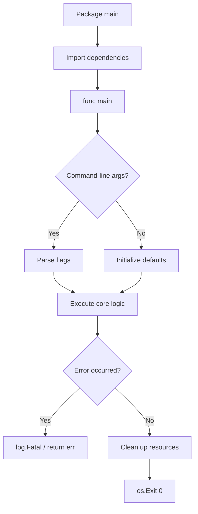

# 📜 Syntax, Types, and Control Flow

## Introduction

Machine learning and artificial intelligence systems are increasingly deployed as distributed microservices that demand both developer velocity and runtime efficiency. Go (Golang) strikes this balance with a deliberately minimal syntax that reduces cognitive load while compiling to native machine code. For ML engineers, Go serves as the backbone of infrastructure tools like Kubernetes, TensorFlow Serving, and feature stores such as Feast, where Python handles model training but Go orchestrates the serving layer.

The design philosophy behind Go emphasizes readability and simplicity over feature proliferation. Where C++ offers dozens of ways to accomplish a task and Python hides complexity behind dynamic typing, Go enforces a single idiomatic path. This consistency is critical in ML engineering teams where code must be reviewed, maintained, and debugged by scientists and engineers with diverse backgrounds. Understanding Go's type system and control flow is therefore not merely academic; it is the foundation upon which scalable inference pipelines are built.

This module explores the lexical structure of Go programs, from variable declarations to the powerful `range` loop. We will examine why Go eliminates certain constructs found in other languages and how this minimalism translates to fewer bugs in production systems. By internalizing these fundamentals, you will be prepared to tackle advanced topics like [[02 - Functions, Methods, and Interfaces]] and [[04 - Goroutines and Channels]] with confidence.

## 1. Go Design Philosophy

Go was created at Google in 2007 by Robert Griesemer, Rob Pike, and Ken Thompson to address the complexity and slow compilation times of C++ in large-scale distributed systems. The language specification is remarkably small, containing only 25 keywords compared to C++'s 90+ or Java's 50+. This minimalism is not an accident; it is a deliberate engineering decision to reduce the surface area for bugs and to make code review efficient.

The core tenets of Go's philosophy include:

- **Simplicity over power:** Go omits features like inheritance and operator overloading that exist in other languages. The designers believed that the cost of complexity in large teams outweighs the convenience for individual programmers.
- **Readability as a first-class concern:** Go code is formatted automatically by `gofmt`, eliminating style debates. The syntax is C-like but stripped of unnecessary parentheses and semicolons.
- **Composition over inheritance:** Instead of class hierarchies, Go uses structs and interfaces to build reusable abstractions. We explore this deeply in [[03 - Structs, Embedding, and Composition]].
- **Explicit is better than implicit:** Type conversions must be explicit, and unused imports or variables cause compilation errors. This prevents latent bugs from accumulating in large codebases.

Real case: **Google's internal codebase** contains over 2 billion lines of code. Before Go, C++ and Java dominated, but compilation times stretched to hours. Go was designed specifically so that a full build of a large project completes in seconds. This engineering constraint—fast compilation—directly influenced the simplicity of the type system and the decision to avoid complex dependency graphs. Today, Go powers critical internal services at Google, including parts of YouTube's serving infrastructure and Firebase's backend systems.

⚠️ **Warning:** Do not treat Go as "C with garbage collection." While the syntax is familiar, Go's memory model, concurrency primitives, and interface system are fundamentally different. Attempting to write C-style pointer arithmetic or Java-style inheritance will lead to brittle, unidiomatic code that reviewers will reject.

💡 **Tip:** Treat Go's 25 keywords as a constraint that forces clarity. If you find yourself fighting the language to express an abstraction, you are likely over-engineering. The idiomatic Go solution is usually the simplest one.

## 2. Variables, Constants, and Type System

Go is statically typed with automatic memory management. Every variable has a type that is known at compile time, which eliminates an entire class of runtime errors common in dynamically typed languages like Python.

### Variable Declarations

Go offers multiple forms of variable declaration:

```go
// Explicit type declaration
var count int = 42

// Type inference from initializer
var message = "Hello, Go"

// Short declaration (function body only)
name := "Alice"

// Multiple variables
var x, y int = 1, 2
a, b := 3, 4
```

The `var` keyword declares package-level or function-level variables, while `:=` is restricted to function bodies and infers the type from the right-hand side. This distinction is important: `var` is used when you want zero-value initialization or when declaring variables without an immediate initializer.

### Constants and Iota

Constants in Go are declared with `const` and can be untyped, giving them arbitrary precision until assigned to a typed variable:

```go
const Pi = 3.14159
const MaxConnections = 100

// iota: incrementing enumerator
type Priority int
const (
    Low Priority = iota  // 0
    Medium               // 1
    High                 // 2
)
```

`iota` is a powerful idiom for creating enumerated constants. It resets to zero in each `const` block and increments by one for each line. This is how the standard library defines flags and error codes.

### Type Inference and Underlying Types

Go's type inference via `:=` reduces verbosity, but the language remains strictly typed:

```go
price := 19.99        // inferred as float64
quantity := 3         // inferred as int
total := price * float64(quantity)  // explicit conversion required
```

Notice that `quantity` must be explicitly converted to `float64`. Go never performs implicit numeric conversions, preventing subtle bugs from precision loss.


## 3. Control Flow Constructs

Go's control flow is intentionally minimal. There is no `while` or `do-while` loop; `for` handles all iteration. There is no ternary operator; `if` statements must be explicit.

### The `if` Statement

Go's `if` supports a short statement before the condition:

```go
if err := validateInput(data); err != nil {
    return err
}
// err is scoped to this if block
```

This pattern is ubiquitous in Go for error handling and resource validation.

### The `switch` Statement

Go's `switch` does not fall through by default (no `break` needed). You can use `fallthrough` explicitly if needed:

```go
switch os := runtime.GOOS; os {
case "darwin":
    fmt.Println("macOS")
case "linux":
    fmt.Println("Linux")
default:
    fmt.Println("Other")
}
```

Switch can also be used without a condition, functioning like a cleaner `if-else if` chain:

```go
switch {
case x < 0:
    return -1
case x > 0:
    return 1
default:
    return 0
}
```

### The `for` Loop: The Only Loop

`for` is Go's sole looping construct, capable of emulating `while` and traditional three-clause loops:

```go
// Traditional for
for i := 0; i < 10; i++ {
    fmt.Println(i)
}

// While-style
for condition {
    // ...
}

// Infinite loop
for {
    // ...
}
```

### The `range` Keyword

`range` iterates over slices, arrays, maps, strings, and channels:

```go
// Slice
for i, v := range []int{10, 20, 30} {
    fmt.Printf("index %d: %d\n", i, v)
}

// Map
for k, v := range map[string]int{"a": 1, "b": 2} {
    fmt.Printf("%s -> %d\n", k, v)
}

// String (iterates over runes, not bytes)
for i, r := range "Go" {
    fmt.Printf("%d: %c\n", i, r)
}
```

**Complexity Analysis:** For a collection of size $n$, `range` executes exactly $n$ times:

$$Complexity = O(n)$$

This linear complexity holds for slices, arrays, maps, and strings. Note that maps iterate in random order; the Go runtime deliberately randomizes map iteration to prevent developers from relying on insertion order.

### Labels, Break, and Continue

Go supports labeled `break` and `continue` for nested loops:

```go
OuterLoop:
for i := 0; i < 3; i++ {
    for j := 0; j < 3; j++ {
        if i*j > 4 {
            break OuterLoop
        }
    }
}
```

The following diagram illustrates the execution flow of a typical Go program:



## 4. Type Switches and Advanced Patterns

A type switch allows you to switch on the dynamic type of an interface value:

```go
func describe(i interface{}) {
    switch v := i.(type) {
    case int:
        fmt.Printf("Integer: %d\n", v)
    case string:
        fmt.Printf("String: %s\n", v)
    case []int:
        fmt.Printf("Slice of ints: %v\n", v)
    default:
        fmt.Printf("Unknown type: %T\n", v)
    }
}
```

Type switches are essential for building generic algorithms before Go 1.18 and remain useful for JSON unmarshaling and reflection-based tasks.

The following diagram shows the decision logic of a type switch:

```mermaid
flowchart TD
    A[Value of type interface{}] --> B{Type assertion}
    B -->|int| C[Handle integer]
    B -->|string| D[Handle string]
    B -->|[]int| E[Handle slice]
    B -->|default| F[Handle unknown]
    C --> G[Return formatted result]
    D --> G
    E --> G
    F --> G
```

### Syntax Comparison Table

| Feature | Go | Python | Rust |
|---------|-----|--------|------|
| Variable declaration | `var x int` or `x := 5` | `x = 5` | `let x: i32 = 5` |
| Type system | Static, explicit conversions | Dynamic, duck typing | Static, ownership-based |
| Loop constructs | `for` only | `for`, `while` | `for`, `while`, `loop` |
| Error handling | Explicit return values | Exceptions | `Result<T, E>` |
| Concurrency | Goroutines + channels | `asyncio`, threading | `async/await`, threads` |
| Compilation | Native binary | Interpreted/bytecode | Native binary |
| Null safety | `nil` exists | `None` exists | `Option<T>` |

Real case: **Monzo**, a UK digital bank, processes millions of transactions daily using Go microservices. Their engineers chose Go specifically because its simple control flow and explicit error handling made it easy to reason about financial transaction logic. The absence of exceptions and implicit control flow means every error path is visible in the code, a critical requirement for regulatory compliance in banking software.

⚠️ **Warning:** Never ignore the second return value of `range` over a map unless you truly do not need the key. Writing `for _, v := range m` when you need the key is a common source of logic errors. Similarly, remember that `range` copies the value into the loop variable; modifying `v` does not affect the underlying collection.

💡 **Tip:** Use `for i := range slice` when you only need indices, and `for range slice` when you only need to execute the body $n$ times. Go 1.22+ allows integer ranging: `for i := range N`.

---

## 📦 Compression Code

```go
package main

import (
    "fmt"
    "runtime"
)

// iota-based enum
type LogLevel int
const (
    Debug LogLevel = iota
    Info
    Warn
    Error
)

// type switch demonstration
func describe(i interface{}) string {
    switch v := i.(type) {
    case int:
        return fmt.Sprintf("int: %d", v)
    case string:
        return fmt.Sprintf("string: %s", v)
    case []int:
        return fmt.Sprintf("[]int: %v", v)
    default:
        return fmt.Sprintf("unknown: %T", v)
    }
}

func main() {
    // Variable declarations
    var explicit int = 10
    inferred := "Go"
    a, b := 1, 2

    // Control flow
    for i := 0; i < 5; i++ {
        if i%2 == 0 {
            continue
        }
        fmt.Println(i)
    }

    // Range over map
    m := map[string]int{"x": 1, "y": 2}
    for k, v := range m {
        fmt.Printf("%s=%d ", k, v)
    }
    fmt.Println()

    // Switch with short statement
    switch os := runtime.GOOS; os {
    case "linux":
        fmt.Println("Running on Linux")
    default:
        fmt.Println("Running on", os)
    }

    fmt.Println(describe(42))
    fmt.Println(describe([]int{1, 2, 3}))
}
```

---

## 🎯 Documented Project

### Description

Build a configuration parser CLI tool that reads environment variables and command-line flags, validates them using Go's type system, and outputs a structured JSON representation. The tool demonstrates variable scoping, `switch` statements for environment detection, `range` for iterating over configuration keys, and type switches for handling mixed configuration values.

### Functional Requirements

1. Accept command-line flags for `port`, `env` (development, staging, production), and `debug` (boolean).
2. Validate that `port` is within the range 1024-65535 using `if` statements and return detailed errors.
3. Use a `map[string]interface{}` to store configuration keys and apply a type switch to format each value appropriately.
4. Iterate over the configuration map using `range` and print each key-value pair with its detected type.
5. Use `iota` to define an enumerated type for log levels and map the `env` flag to the appropriate level.

### Main Components

- `main.go`: Entry point with flag parsing and validation logic.
- `config.go`: Configuration struct with struct tags and validation methods.
- `types.go`: Custom types including the `LogLevel` enum using `iota`.
- `formatter.go`: Type switch implementation for pretty-printing mixed types.
- `README.md`: Usage documentation and example commands.

### Success Metrics

- All flags are parsed without using external libraries (only `flag` package).
- Invalid port ranges produce clear, actionable error messages.
- The program compiles with zero warnings under `go vet`.
- Output formatting handles at least five distinct Go types correctly.
- Code passes review for idiomatic Go style (no unused variables, no implicit conversions).

### References

- The Go Programming Language Specification: https://golang.org/ref/spec
- Effective Go: https://go.dev/doc/effective_go
- Go by Example - Range: https://gobyexample.com/range
