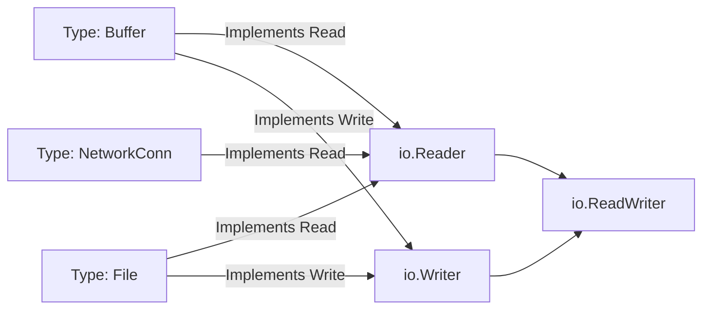

# 🔧 Functions, Methods, and Interfaces

## Introduction

Functions are the primary unit of abstraction in Go. Unlike object-oriented languages where classes encapsulate both state and behavior, Go separates data (structs) from operations (functions and methods). This separation creates a clean mental model where functions transform data through explicit inputs and outputs, making them ideal for building deterministic data pipelines common in machine learning workflows.

In ML engineering, functions and interfaces enable the creation of modular preprocessing pipelines, pluggable model serving backends, and testable abstractions. When you design a feature engineering pipeline in Go, you often compose functions that transform raw data into tensors. Interfaces allow you to swap implementations—whether you are using an in-memory cache or a Redis cluster—without changing the calling code. This polymorphism without inheritance is one of Go's most powerful contributions to software engineering.

This module delves into Go's functional and object-oriented capabilities, from variadic functions to interface composition. You will learn why Go uses implicit interface satisfaction and how this design decision enables loose coupling between packages. By mastering these concepts, you will be able to design APIs that rival the elegance of Go's standard library. These patterns connect directly to [[01 - Syntax, Types, and Control Flow]] and set the stage for [[03 - Structs, Embedding, and Composition]].

## 1. Functions in Go

Go functions are first-class citizens. They can be assigned to variables, passed as arguments, and returned from other functions. This functional programming support enables powerful patterns like middleware chains and strategy implementations.

### Variadic Functions

A variadic function accepts a variable number of arguments:

```go
func sum(nums ...int) int {
    total := 0
    for _, n := range nums {
        total += n
    }
    return total
}

// Usage
result := sum(1, 2, 3, 4)
```

The `...` syntax creates a slice of the specified type inside the function. Variadic parameters must be the last parameter in the signature.

### Named Returns

Go allows named return values, which act as variables declared at the top of the function:

```go
func split(sum int) (x, y int) {
    x = sum * 4 / 9
    y = sum - x
    return // naked return
}
```

Named returns improve documentation but should be used sparingly in long functions to avoid confusion.

### Closures and Higher-Order Functions

Functions can close over variables from their enclosing scope:

```go
func makeMultiplier(factor int) func(int) int {
    return func(x int) int {
        return x * factor
    }
}

double := makeMultiplier(2)
fmt.Println(double(5)) // 10
```

This pattern is used extensively in HTTP middleware, where a function returns a handler that wraps another handler.

Real case: **Uber's Go monorepo** contains thousands of microservices that share middleware for authentication, rate limiting, and logging. These middlewares are implemented as higher-order functions that take an `http.Handler` and return a wrapped `http.Handler`. This functional approach allows Uber to compose cross-cutting concerns without frameworks like Spring or Django, keeping binary sizes small and startup times under 100 milliseconds.

## 2. Methods and Receivers

A method is a function with a special receiver argument. Go supports two types of receivers: value and pointer.

### Value Receivers

Value receivers operate on a copy of the value:

```go
type Rectangle struct {
    Width, Height float64
}

func (r Rectangle) Area() float64 {
    return r.Width * r.Height
}
```

Use value receivers when the method does not modify the receiver and when the struct is small.

### Pointer Receivers

Pointer receivers modify the original value and avoid copying large structs:

```go
func (r *Rectangle) Scale(factor float64) {
    r.Width *= factor
    r.Height *= factor
}
```

Pointer receivers are also required when the struct contains a `sync.Mutex` or other synchronization primitives.

⚠️ **Warning:** Mixing value and pointer receivers on the same type is legal but dangerous. If you have a method with a pointer receiver, all methods should use pointer receivers for consistency. Otherwise, interface satisfaction becomes confusing—a value of type `T` satisfies an interface requiring methods with value receivers, but not one requiring pointer receivers.

💡 **Tip:** As a rule of thumb, if any method on a type uses a pointer receiver, use pointer receivers for all methods on that type. This eliminates an entire class of bugs related to method sets and interface satisfaction.

## 3. Interfaces and Implicit Satisfaction

An interface in Go defines a set of method signatures. A type satisfies an interface by implementing its methods—there is no `implements` keyword.

```go
type Writer interface {
    Write(p []byte) (n int, err error)
}

// File automatically satisfies Writer if it has a Write method
type File struct{}

func (f *File) Write(p []byte) (n int, err error) {
    // implementation
    return len(p), nil
}
```

### Interface Composition

Go interfaces can be composed from other interfaces:

```go
type Reader interface {
    Read(p []byte) (n int, err error)
}

type ReadWriter interface {
    Reader
    Writer
}
```

This is how the standard library builds the `io` package. `io.ReadWriter` is simply the union of `io.Reader` and `io.Writer`.

### The Empty Interface: `any`

Before Go 1.18, `interface{}` was the empty interface that all types satisfied. Since Go 1.18, `any` is an alias for `interface{}`:

$$Interface\{\} \equiv any \quad (Go\ 1.18+)$$

The empty interface is useful for generic containers (like `map[string]any`) but should be avoided when a more specific interface or generic type parameter can be used.

The following diagram illustrates how types implicitly satisfy interfaces in Go:



Real case: **Go's standard library** is built on interfaces. The `io.Reader` and `io.Writer` interfaces power everything from file I/O to HTTP request bodies to cryptographic hashing. Because interfaces are satisfied implicitly, a `bytes.Buffer`, an `os.File`, and a `net.Conn` can all be passed to `io.Copy` without any of them knowing about each other. This decoupling is why Go programs can compose functionality from disparate packages without import cycles or tight coupling.

## 4. Type Assertions and Type Switches

When working with interfaces, you sometimes need to recover the underlying concrete type:

### Type Assertion

```go
var r io.Reader = strings.NewReader("hello")

// Safe type assertion
if sr, ok := r.(*strings.Reader); ok {
    fmt.Println(sr.Len())
}
```

The two-value form (`value, ok`) prevents panics if the assertion fails.

### Type Switches Revisited

Type switches work with interfaces to dispatch on dynamic type:

```go
func stringify(v interface{}) string {
    switch s := v.(type) {
    case string:
        return s
    case fmt.Stringer:
        return s.String()
    case int:
        return strconv.Itoa(s)
    default:
        return fmt.Sprintf("%v", s)
    }
}
```

### Interface Comparison Table

| Feature | Go Interfaces | Java Interfaces | Rust Traits |
|---------|--------------|----------------|-------------|
| Satisfaction | Implicit | Explicit (`implements`) | Explicit (`impl`) |
| Multiple inheritance | Yes (composition) | No (single class, multiple interfaces) | Yes |
| Default methods | No | Yes (Java 8+) | No |
| Empty type | `any` / `interface{}` | N/A (Object is root) | No exact equivalent |
| Runtime cost | Zero (static dispatch) | Virtual table lookup | Zero (monomorphization) |
| Generic integration | Type parameters (1.18+) | Generics | Built into trait system |

⚠️ **Warning:** Type assertions on `nil` interfaces panic. A `nil` interface value is not the same as an interface holding a `nil` pointer. Always use the two-value form of type assertion in production code.

💡 **Tip:** Prefer type switches over chains of `if` type assertions when checking more than two types. They are cleaner, faster, and easier to extend.

---

## 📦 Compression Code

```go
package main

import (
    "fmt"
    "io"
    "strings"
)

// Custom interface
type Stringer interface {
    String() string
}

type Person struct {
    Name string
    Age  int
}

func (p Person) String() string {
    return fmt.Sprintf("%s (%d)", p.Name, p.Age)
}

// Higher-order function
func applyAll(items []int, fn func(int) int) []int {
    result := make([]int, len(items))
    for i, v := range items {
        result[i] = fn(v)
    }
    return result
}

// Type assertion and switch
func describe(v interface{}) string {
    switch s := v.(type) {
    case string:
        return "string: " + s
    case int:
        return fmt.Sprintf("int: %d", s)
    case Stringer:
        return "Stringer: " + s.String()
    default:
        return fmt.Sprintf("unknown: %T", s)
    }
}

func main() {
    // Methods
    p := Person{Name: "Alice", Age: 30}
    fmt.Println(p.String())

    // Higher-order function
    doubled := applyAll([]int{1, 2, 3}, func(x int) int { return x * 2 })
    fmt.Println(doubled)

    // Interface with type assertion
    var r io.Reader = strings.NewReader("hello")
    if sr, ok := r.(*strings.Reader); ok {
        fmt.Printf("Reader length: %d\n", sr.Len())
    }

    // Type switch
    fmt.Println(describe("hello"))
    fmt.Println(describe(42))
    fmt.Println(describe(p))
}
```

---

## 🎯 Documented Project

### Description

Implement a plugin-based metrics pipeline that collects system metrics (CPU, memory, disk) through a common `Collector` interface. The pipeline uses higher-order functions to apply transformations (filters, aggregators) and type assertions to handle different metric types (gauge, counter, histogram). The project demonstrates interface design, method sets, and functional composition.

### Functional Requirements

1. Define a `Collector` interface with `Collect() ([]Metric, error)` and `Name() string` methods.
2. Implement at least three concrete collectors: `CPUMetric`, `MemoryMetric`, and `DiskMetric`, each satisfying `Collector`.
3. Build a `Pipeline` type that accepts a slice of collectors and a variadic list of transformer functions.
4. Use type switches inside the pipeline to handle `Gauge`, `Counter`, and `Histogram` metric types differently.
5. Provide a `Registry` that stores collectors in a `map[string]Collector` and supports dynamic registration.

### Main Components

- `metric.go`: Interface definitions and metric type structs.
- `collectors/`: Package with CPU, memory, and disk collector implementations.
- `pipeline.go`: Pipeline orchestration with higher-order transformers.
- `registry.go`: Dynamic collector registration and lookup.
- `main.go`: CLI entry point that runs the pipeline and prints aggregated results.

### Success Metrics

- All collectors satisfy the `Collector` interface without explicit declaration.
- The pipeline correctly transforms metrics using at least two distinct transformer functions.
- Type switches handle all three metric types without panics.
- The registry supports adding and removing collectors at runtime.
- Code achieves 80%+ test coverage using table-driven tests.

### References

- Go Interfaces Specification: https://golang.org/ref/spec#Interface_types
- Effective Go - Interfaces: https://go.dev/doc/effective_go#interfaces
- Go by Example - Interfaces: https://gobyexample.com/interfaces
