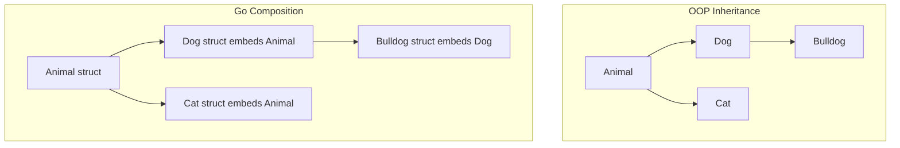

# 🏗️ Structs, Embedding, and Composition

## Introduction

Structs are the backbone of data modeling in Go. Unlike classes in object-oriented languages, Go structs are pure data containers without methods attached by default. This separation of data and behavior creates a clear contract: structs define what data looks like, while functions and methods define what operations can be performed. For ML engineers, this pattern is invaluable when defining feature vectors, model configurations, and API request payloads.

In AI systems, data structures evolve rapidly. A training pipeline configuration might start with simple hyperparameters and grow to include distributed training settings, checkpoint paths, and experiment tracking metadata. Go's composition model allows you to build these complex structures by embedding simpler ones, avoiding the rigid hierarchies of inheritance. This flexibility is why tools like Kubernetes, Docker, and Terraform—all critical infrastructure for ML platforms—are written in Go.

This module explores how to define, initialize, and manipulate structs. We will examine embedding as Go's answer to inheritance and demonstrate how struct tags enable seamless JSON serialization. By mastering these patterns, you will be able to design data models that are both type-safe and serialization-friendly. These concepts build directly on [[01 - Syntax, Types, and Control Flow]] and [[02 - Functions, Methods, and Interfaces]], forming the structural foundation of Go programs.

## 1. Structs: Definition and Initialization

A struct is a composite type that groups together zero or more named fields:

```go
type ModelConfig struct {
    Name       string
    Version    int
    LearningRate float64
    Tags       []string
}
```

Structs can be initialized in several ways:

```go
// Zero value initialization
var cfg ModelConfig

// Positional initialization (fragile, avoid in production)
cfg2 := ModelConfig{"ResNet", 1, 0.001, nil}

// Named field initialization (idiomatic)
cfg3 := ModelConfig{
    Name:       "ResNet",
    Version:    1,
    LearningRate: 0.001,
}
```

### Struct Tags

Struct tags are string metadata attached to fields, most commonly used for JSON marshaling:

```go
type Experiment struct {
    ID        string    `json:"id"`
    Name      string    `json:"name"`
    CreatedAt time.Time `json:"created_at"`
    Private   bool      `json:"private,omitempty"`
}
```

Tags are accessed via reflection and follow the convention `` `key:"value"` ``. The `omitempty` option skips the field during serialization if it holds a zero value.

Real case: **Kubernetes** defines its entire API surface using Go structs with JSON tags. A `Pod` spec is a deeply nested struct where fields like `Containers`, `Volumes`, and `NodeSelector` are tagged with `json:"containers,omitempty"` and `protobuf:"bytes,2,rep,name=containers"`. This dual-tagging allows Kubernetes to support both JSON and Protocol Buffers serialization from the same source of truth. The API server uses these structs to validate, store, and serve resource definitions across a cluster of thousands of nodes.

## 2. Embedding vs Inheritance

Go does not support inheritance. Instead, it uses embedding to promote fields and methods of one struct into another.

### Embedding Syntax

```go
type Base struct {
    ID int
}

func (b Base) Identify() int {
    return b.ID
}

type Derived struct {
    Base      // Embedded (anonymous field)
    Name string
}
```

With embedding, `Derived` gains direct access to `Base`'s fields and methods:

```go
d := Derived{Base: Base{ID: 42}, Name: "test"}
fmt.Println(d.ID)        // Promoted field
fmt.Println(d.Identify()) // Promoted method
```

### Composition Over Inheritance

Embedding is not inheritance. There is no `is-a` relationship, and method promotion follows specific rules. If `Derived` defines its own `Identify` method, it shadows the embedded `Base.Identify`.

The following diagram contrasts classical inheritance with Go's composition model:



### Inheritance vs Composition Table

| Aspect | OOP Inheritance | Go Composition |
|--------|----------------|----------------|
| Relationship | "is-a" (Dog is an Animal) | "has-a" (Dog has Animal behavior) |
| Method override | Virtual dispatch, dynamic | Static dispatch, promoted methods |
| Diamond problem | Exists (multiple inheritance) | Impossible (no inheritance) |
| Encapsulation | Protected/private visibility | Exported/unexported fields only |
| Flexibility | Rigid hierarchy at compile time | Flexible composition at struct level |
| Zero value | Inherited from parent | Embedded struct is zero-valued |

⚠️ **Warning:** Do not confuse embedding with subclassing. An embedded field does not become a true superclass. Type assertions like `derived.(Base)` will not compile because there is no polymorphic relationship. If you need polymorphism, use interfaces from [[02 - Functions, Methods, and Interfaces]].

💡 **Tip:** Use embedding to reuse implementation, not to model taxonomies. If you find yourself embedding a struct solely to reuse fields, consider whether a named field with an interface type would provide cleaner abstraction.

## 3. JSON Marshaling and Struct Tags

Go's `encoding/json` package uses reflection to convert structs to JSON and back. Struct tags control the mapping:

```go
type ServerConfig struct {
    Host     string `json:"host"`
    Port     int    `json:"port"`
    TLS      bool   `json:"tls,omitempty"`
    Password string `json:"-"` // ignored
}

func main() {
    cfg := ServerConfig{Host: "localhost", Port: 8080}
    data, _ := json.Marshal(cfg)
    fmt.Println(string(data))
    // {"host":"localhost","port":8080}
}
```

### Unmarshaling

```go
var parsed ServerConfig
json.Unmarshal(data, &parsed)
```

Unexported fields are ignored by the JSON encoder. This is a feature, not a bug—it enforces encapsulation at the serialization boundary.

## 4. Custom Marshaling

For complex types, you can implement `json.Marshaler` and `json.Unmarshaler`:

```go
type Duration time.Duration

func (d Duration) MarshalJSON() ([]byte, error) {
    return json.Marshal(time.Duration(d).String())
}

func (d *Duration) UnmarshalJSON(data []byte) error {
    var s string
    if err := json.Unmarshal(data, &s); err != nil {
        return err
    }
    dur, err := time.ParseDuration(s)
    if err != nil {
        return err
    }
    *d = Duration(dur)
    return nil
}
```

This pattern is used extensively in Kubernetes to serialize `time.Time` and `resource.Quantity` types in human-readable formats.


Real case: **HashiCorp Terraform** uses deeply nested structs with custom JSON and HCL marshaling to represent infrastructure as code. Providers define resource schemas as Go structs with validation tags, and the core engine uses reflection to diff the current state against the desired state. Without Go's struct tags and custom marshalers, Terraform would require a separate code generation step for every provider, significantly increasing maintenance burden.

⚠️ **Warning:** Custom `UnmarshalJSON` methods must handle `null` inputs gracefully. Failing to check for `null` before unmarshaling into a pointer can cause panics when the JSON source contains explicit `null` values.

💡 **Tip:** When defining APIs that will be consumed by multiple languages, use `camelCase` in JSON tags and add `omitempty` for optional fields. This produces payloads that are idiomatic in JavaScript and Python while keeping Go structs clean.

---

## 📦 Compression Code

```go
package main

import (
    "encoding/json"
    "fmt"
    "time"
)

// Embedded structs
type Metadata struct {
    CreatedAt time.Time `json:"created_at"`
    UpdatedAt time.Time `json:"updated_at"`
}

type Resource struct {
    Metadata    // embedded
    ID          string            `json:"id"`
    Name        string            `json:"name"`
    Labels      map[string]string `json:"labels,omitempty"`
}

// Custom marshaler
type Duration time.Duration

func (d Duration) MarshalJSON() ([]byte, error) {
    return json.Marshal(time.Duration(d).String())
}

func (d *Duration) UnmarshalJSON(data []byte) error {
    var s string
    if err := json.Unmarshal(data, &s); err != nil {
        return err
    }
    dur, err := time.ParseDuration(s)
    if err != nil {
        return err
    }
    *d = Duration(dur)
    return nil
}

type Task struct {
    Name     string   `json:"name"`
    Timeout  Duration `json:"timeout"`
}

func main() {
    r := Resource{
        Metadata: Metadata{
            CreatedAt: time.Now(),
            UpdatedAt: time.Now(),
        },
        ID:     "res-123",
        Name:   "ML Model",
        Labels: map[string]string{"env": "prod"},
    }

    data, _ := json.MarshalIndent(r, "", "  ")
    fmt.Println(string(data))

    t := Task{Name: "Training", Timeout: Duration(30 * time.Minute)}
    td, _ := json.Marshal(t)
    fmt.Println(string(td))
}
```

---

## 🎯 Documented Project

### Description

Design and implement a schema registry for ML feature definitions using nested structs, embedding, and custom JSON marshaling. The registry stores feature schemas with nested metadata, supports versioning through embedded structs, and serializes to JSON with human-readable timestamps and duration fields. The project demonstrates composition patterns that mirror real-world API design in tools like Feast and Tecton.

### Functional Requirements

1. Define a `FeatureSchema` struct with embedded `Metadata` (created time, version) and `Spec` (name, type, constraints).
2. Implement a `Version` type using embedded structs that supports semantic version fields (major, minor, patch).
3. Create a custom marshaler for `FeatureType` that serializes as lowercase strings (`"int64"`, `"float64"`, `"string"`, `"timestamp"`).
4. Build a `Registry` struct that contains a `map[string]FeatureSchema` and supports CRUD operations with JSON persistence.
5. Ensure that zero-valued optional fields are omitted from JSON output using `omitempty`.

### Main Components

- `schema.go`: Core struct definitions with embedding and tags.
- `types.go`: Custom types (`FeatureType`, `Version`) with marshaling logic.
- `registry.go`: In-memory registry with JSON load/save.
- `main.go`: CLI for adding, listing, and exporting feature schemas.
- `schemas.json`: Persistent storage file.

### Success Metrics

- All structs serialize and deserialize without data loss.
- Custom marshalers produce lowercase strings for feature types.
- Embedded `Metadata` fields are accessible directly on `FeatureSchema` instances.
- The registry persists to disk as valid JSON and reloads identically.
- `go test` passes with 100% coverage for marshaling and registry logic.

### References

- Go Struct Tags: https://pkg.go.dev/reflect#StructTag
- encoding/json Documentation: https://pkg.go.dev/encoding/json
- Kubernetes API Types: https://github.com/kubernetes/apimachinery
