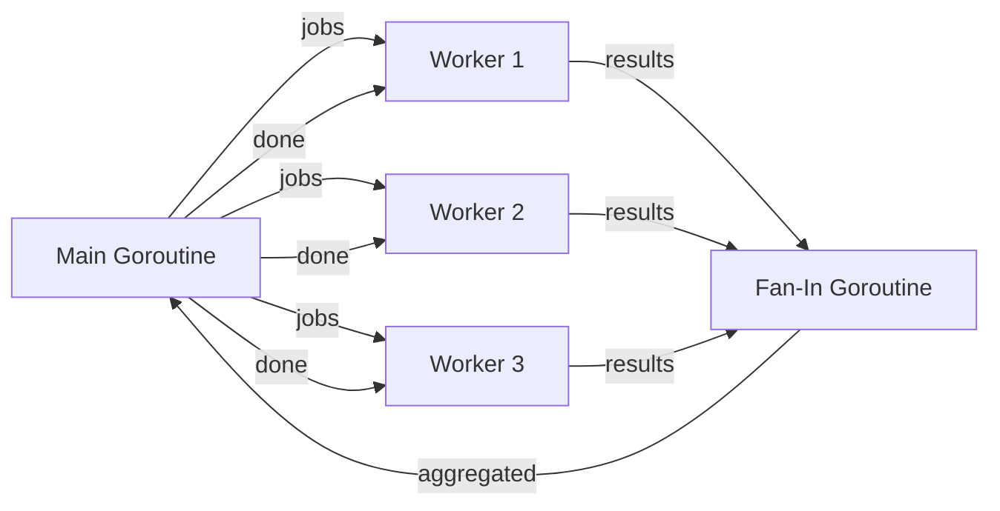

# 🧵 Goroutines and Channels

## Introduction

Concurrency is not parallelism, though the two are often conflated. Concurrency is about dealing with lots of things at once; parallelism is about doing lots of things at once. Go's concurrency model, centered on goroutines and channels, was explicitly designed to make concurrent programs easier to write and reason about than traditional thread-based models. For ML engineers, this model is transformative: training pipelines require concurrent data loading, model serving systems handle thousands of simultaneous inference requests, and distributed feature stores aggregate values from multiple backends in parallel.

Python's Global Interpreter Lock (GIL) forces ML infrastructure developers to reach for multiprocessing or external services when true parallelism is needed. Go removes this limitation entirely. A single Go process can spawn hundreds of thousands of goroutines, each communicating through channels that enforce safe data sharing by design. This makes Go the language of choice for building the control planes of ML platforms—Kubernetes schedules containers, Istio routes traffic, and Kubeflow orchestrates pipelines, all written in Go.

This module demystifies the Go scheduler, explores channel semantics in depth, and teaches the canonical concurrency patterns that appear in every production Go codebase. By understanding the difference between buffered and unbuffered channels, and by mastering patterns like worker pools and fan-out/fan-in, you will be able to build systems that saturate multi-core processors without data races. These concepts are the capstone of [[01 - Syntax, Types, and Control Flow]] and [[02 - Functions, Methods, and Interfaces]], applying them at scale.

## 1. Goroutines and the GMP Model

A goroutine is a lightweight thread managed by the Go runtime. Unlike OS threads, which consume megabytes of stack space, goroutines start with a stack of only 2KB that grows and shrinks dynamically.

$$Memory\ per\ Goroutine \approx 2KB$$

This is in stark contrast to OS threads, which typically require ~1MB of reserved memory. The Go scheduler uses the GMP model:

- **G (Goroutine):** A unit of execution with its own stack and state.
- **M (Machine):** An OS thread that executes goroutines.
- **P (Processor):** A logical processor that maintains a local run queue of goroutines.

The scheduler multiplexes thousands of goroutines onto a smaller number of OS threads, typically equal to `GOMAXPROCS` (the number of logical CPUs). When a goroutine blocks on a channel or system call, the scheduler detaches it from the M and runs another goroutine, minimizing OS thread context switches.

Starting a goroutine is trivial:

```go
go func() {
    fmt.Println("Running concurrently")
}()
```

The `go` keyword launches the function call in a new goroutine. There is no `Join` method; synchronization is achieved through channels or `sync.WaitGroup`.

Real case: **Netflix** uses Go extensively in its streaming backend infrastructure. Their Edge services, which handle content discovery and personalized recommendations, process millions of requests per second. Each incoming request spawns goroutines to fetch metadata from multiple microservices in parallel—one for viewing history, one for ratings, one for trending content. The lightweight nature of goroutines allows Netflix to maintain high connection counts with low memory overhead, while channels coordinate the aggregation of results before responding to the client.

## 2. Channels: Buffered and Unbuffered

Channels are typed conduits through which goroutines communicate. They are reference types, like slices and maps, and must be created with `make`:

```go
ch := make(chan int)      // Unbuffered
ch2 := make(chan int, 10) // Buffered with capacity 10
```

### Unbuffered Channels

An unbuffered channel has no capacity. Every send blocks until another goroutine receives, and every receive blocks until another goroutine sends. This synchronization property makes unbuffered channels ideal for handshakes and signaling:

```go
func worker(done chan bool) {
    // Do work
    done <- true
}

done := make(chan bool)
go worker(done)
<-done // Block until worker signals completion
```

### Buffered Channels

A buffered channel allows sends to proceed without blocking until the buffer is full:

```go
ch := make(chan int, 3)
ch <- 1
ch <- 2
ch <- 3
// ch <- 4 would block here
```

Buffered channels are useful for decoupling producers and consumers, but they hide synchronization. Use them when you know the exact throughput requirements.

### Closing and Ranging

The sender should close a channel when no more values will be sent. Receivers can use `range` or the `value, ok` idiom to detect closure:

```go
close(ch)

for v := range ch {
    fmt.Println(v)
}

// Or
v, ok := <-ch
if !ok {
    // Channel closed
}
```

⚠️ **Warning:** Only the sender should close a channel. Closing a channel from the receiver or from multiple goroutines causes a runtime panic. If you need multi-producer patterns, use a `sync.WaitGroup` and a separate done channel instead of closing the data channel from multiple senders.

💡 **Tip:** Prefer unbuffered channels for coordination and buffered channels only when you have measured a specific performance bottleneck. Unbuffered channels make backpressure explicit, which prevents memory explosions under load.

## 3. Concurrency Patterns

### Worker Pool

A worker pool distributes tasks across a fixed number of goroutines:

```go
func worker(id int, jobs <-chan int, results chan<- int) {
    for j := range jobs {
        results <- j * 2
    }
}

jobs := make(chan int, 100)
results := make(chan int, 100)

for w := 1; w <= 3; w++ {
    go worker(w, jobs, results)
}

for j := 1; j <= 9; j++ {
    jobs <- j
}
close(jobs)
```

### Fan-Out / Fan-In

Fan-out spawns multiple goroutines to read from a single channel. Fan-in multiplexes multiple channels into one:

```go
func fanIn(channels ...<-chan int) <-chan int {
    var wg sync.WaitGroup
    multiplexed := make(chan int)

    output := func(c <-chan int) {
        defer wg.Done()
        for v := range c {
            multiplexed <- v
        }
    }

    wg.Add(len(channels))
    for _, c := range channels {
        go output(c)
    }

    go func() {
        wg.Wait()
        close(multiplexed)
    }()

    return multiplexed
}
```

### Pipeline

A pipeline chains channels together, where each stage is a goroutine that transforms data:

```go
func generator(nums ...int) <-chan int {
    out := make(chan int)
    go func() {
        for _, n := range nums {
            out <- n
        }
        close(out)
    }()
    return out
}

func square(in <-chan int) <-chan int {
    out := make(chan int)
    go func() {
        for n := range in {
            out <- n * n
        }
        close(out)
    }()
    return out
}
```

## 4. Select and Synchronization

The `select` statement lets a goroutine wait on multiple communication operations:

```go
select {
case v1 := <-ch1:
    fmt.Println("ch1:", v1)
case v2 := <-ch2:
    fmt.Println("ch2:", v2)
case ch3 <- 100:
    fmt.Println("sent to ch3")
default:
    fmt.Println("no channel ready")
}
```

If multiple cases are ready, `select` picks one pseudo-randomly. This prevents starvation in multi-channel systems.

### Timeout Pattern

```go
select {
case res := <-ch:
    fmt.Println(res)
case <-time.After(1 * time.Second):
    fmt.Println("timeout")
}
```

### Done Channel Pattern

A done channel signals cancellation to multiple goroutines:

```go
func worker(jobs <-chan int, done <-chan struct{}, results chan<- int) {
    for {
        select {
        case j := <-jobs:
            results <- j * 2
        case <-done:
            return
        }
    }
}
```

The following diagram illustrates goroutine communication through channels:



### Concurrency Model Comparison

| Feature | Go Goroutines | OS Threads | Python asyncio |
|---------|--------------|------------|----------------|
| Startup cost | ~2KB stack | ~1MB stack | Event loop callback |
| Context switch | Cooperative (runtime) | Preemptive (kernel) | Cooperative (event loop) |
| Communication | Channels (typed, safe) | Shared memory + locks | Queues + futures |
| Parallelism | Yes (multi-core) | Yes (multi-core) | No (single-threaded) |
| Error handling | Explicit error returns | Exceptions | Exceptions |
| Scalability | Millions per process | Thousands per process | Thousands of coroutines |
| Scheduler | M:N (Go runtime) | 1:1 (OS kernel) | Single event loop |


Real case: **CockroachDB**, a distributed SQL database written in Go, uses goroutines and channels to implement its distributed consensus and transaction layers. Every node in a CockroachDB cluster runs tens of thousands of goroutines handling raft consensus, gossip protocol, and SQL execution. Channels are used to pass raft log entries between layers, and `select` statements multiplex between network I/O and local timeouts. The ability to spawn a goroutine per logical operation rather than per connection allows CockroachDB to scale to hundreds of nodes while maintaining predictable latency.

⚠️ **Warning:** Sharing memory by communicating (via channels) is idiomatic, but communicating by sharing memory (via mutexes) is sometimes necessary. Do not force channel-based solutions where a simple `sync.Mutex` around a map would be clearer. The Go proverb is "Share memory by communicating, don't communicate by sharing memory," but this is guidance, not dogma.

💡 **Tip:** Always use `make(chan T)` or `make(chan T, n)` to create channels. A `nil` channel blocks forever on both send and receive, which can cause deadlocks that are difficult to debug. Initialize channels before spawning goroutines that use them.

---

## 📦 Compression Code

```go
package main

import (
    "fmt"
    "sync"
    "time"
)

// Worker pool
func worker(id int, jobs <-chan int, results chan<- int, wg *sync.WaitGroup) {
    defer wg.Done()
    for j := range jobs {
        time.Sleep(10 * time.Millisecond)
        results <- j * j
    }
}

// Fan-in
func fanIn(chs ...<-chan int) <-chan int {
    out := make(chan int)
    var wg sync.WaitGroup
    wg.Add(len(chs))
    for _, ch := range chs {
        go func(c <-chan int) {
            defer wg.Done()
            for v := range c {
                out <- v
            }
        }(ch)
    }
    go func() {
        wg.Wait()
        close(out)
    }()
    return out
}

func main() {
    jobs := make(chan int, 100)
    results := make(chan int, 100)

    var wg sync.WaitGroup
    for w := 1; w <= 3; w++ {
        wg.Add(1)
        go worker(w, jobs, results, &wg)
    }

    go func() {
        wg.Wait()
        close(results)
    }()

    for j := 1; j <= 9; j++ {
        jobs <- j
    }
    close(jobs)

    for r := range results {
        fmt.Println("result:", r)
    }

    // Select with timeout
    ch := make(chan string, 1)
    go func() { ch <- "done" }()
    select {
    case msg := <-ch:
        fmt.Println(msg)
    case <-time.After(100 * time.Millisecond):
        fmt.Println("timeout")
    }
}
```

---

## 🎯 Documented Project

### Description

Build a distributed task scheduler that distributes ML preprocessing jobs across a pool of workers using goroutines and channels. The scheduler accepts jobs from an HTTP endpoint, fans them out to worker pools based on job type (data cleaning, feature extraction, normalization), and fans results back into a single aggregation channel. It supports graceful shutdown via a done channel and implements backpressure through bounded job channels.

### Functional Requirements

1. Accept job submissions via an in-memory queue with three distinct job types and route them to specialized worker pools.
2. Implement a fan-out stage that distributes jobs to 5 workers per job type, each running in its own goroutine.
3. Implement a fan-in stage that aggregates results from all worker pools into a single results channel.
4. Support graceful shutdown: when a shutdown signal is received, stop accepting new jobs, finish in-flight work, and close all channels safely.
5. Enforce backpressure by using buffered channels with a capacity of 20 jobs per pool; reject new jobs if buffers are full.

### Main Components

- `scheduler.go`: Main orchestrator with job routing logic.
- `workers.go`: Worker pool implementation with per-type goroutines.
- `aggregator.go`: Fan-in logic with result merging and deduplication.
- `api.go`: HTTP handler for job submission (simulated as function calls for testing).
- `main.go`: Entry point with signal handling for graceful shutdown.

### Success Metrics

- The scheduler processes at least 1000 jobs per second on a 4-core machine.
- Graceful shutdown completes within 5 seconds of receiving the signal.
- No goroutine leaks (verified with `goleak` or manual `sync.WaitGroup` tracking).
- Backpressure drops jobs explicitly rather than causing unbounded memory growth.
- Race detector (`go test -race`) passes with zero data races.

### References

- Go Memory Model: https://go.dev/ref/mem
- Concurrency in Go (Katherine Cox-Buday): https://www.oreilly.com/library/view/concurrency-in-go/9781491941294/
- Go by Example - Worker Pools: https://gobyexample.com/worker-pools
