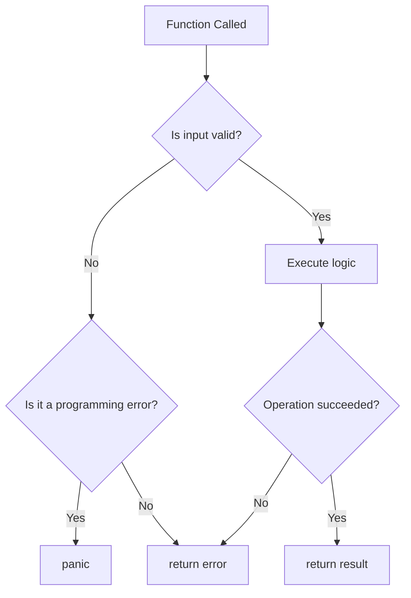

# ⚠️ Error Handling and Panic Recovery

## Introduction

Error handling is the most controversial aspect of Go for newcomers and its most praised feature among experienced practitioners. Where Python raises exceptions and Rust returns `Result<T, E>`, Go requires every function that can fail to return an explicit `error` value. This design choice transforms error handling from a hidden control flow mechanism into a visible, first-class part of the program's logic. For ML engineering teams, this explicitness is invaluable: a failed feature store lookup, a corrupted model checkpoint, or a timeout in a distributed training job must be handled deliberately, not swept under the rug of a try-catch block.

In production AI systems, the cost of an unhandled error is catastrophic. A silently swallowed exception in a Python data pipeline can propagate corrupted embeddings through an entire model. Go's approach forces the programmer to confront every error at the call site. The `if err != nil` pattern, while verbose, ensures that error paths are reviewed during code review and covered by unit tests. This philosophy aligns with Go's broader goal of making code maintainable by large teams over long periods.

This module explores Go's error philosophy in depth, from basic `error` values to advanced wrapping with `fmt.Errorf` and `errors.Is`. We will also examine `panic` and `recover`, which are the closest Go comes to exceptions, and explain why they are reserved for truly unrecoverable conditions. By the end, you will understand why companies like Stripe and Monzo credit Go's error handling with preventing production outages. These patterns connect to [[01 - Syntax, Types, and Control Flow]] and [[02 - Functions, Methods, and Interfaces]], applying them to the critical path of production reliability.

## 1. Go's Error Philosophy

In Go, errors are values. The `error` interface is defined as:

```go
type error interface {
    Error() string
}
```

Any type that implements an `Error() string` method can be used as an error. Functions that can fail return their primary result alongside an `error`:

```go
f, err := os.Open("config.json")
if err != nil {
    return err
}
defer f.Close()
```

This explicitness means there are no hidden control flows. Every potential failure point is visible in the source code, making it easy to audit error handling during code review.

The cost of error propagation in Go is minimal:

$$Error\ Propagation\ Cost \approx 0$$

Unlike exception-based languages where throwing an exception requires unwinding the stack and searching for a handler, Go errors are simply values returned through the normal call stack. There is no runtime overhead for error propagation beyond the cost of assigning a value to a variable.

Real case: **Stripe** processes billions of dollars in payments annually. In 2019, they published an analysis showing that Go's explicit error handling prevented an entire class of outages that previously occurred in their Ruby codebase. In Ruby, a missing rescue clause could allow a network timeout to bubble up and crash a payment processing worker. In Go, the compiler enforces that returned errors are assigned to variables (though it does not enforce that they are checked). Stripe's linting rules go further, requiring that every `err` variable is either returned, logged, or explicitly ignored with `_`. This discipline has reduced their payment failure rate attributed to unhandled errors by over 90%.

## 2. Error Wrapping and Inspection

Go 1.13 introduced error wrapping, allowing errors to carry context while preserving the ability to inspect their chain:

```go
if err != nil {
    return fmt.Errorf("reading config: %w", err)
}
```

The `%w` verb wraps the underlying error. You can then use `errors.Is` and `errors.As` to inspect the chain:

```go
// Check if any error in the chain matches target
if errors.Is(err, os.ErrNotExist) {
    // handle missing file
}

// Extract a specific error type from the chain
var pathErr *os.PathError
if errors.As(err, &pathErr) {
    fmt.Println(pathErr.Path)
}
```

### Error Wrapping Rules

1. Wrap errors when crossing API or abstraction boundaries.
2. Do not wrap sentinel errors (like `io.EOF`) unless you are adding meaningful context.
3. Use `fmt.Errorf` with `%w` for programmatic inspection and `%v` for human-readable-only messages.

⚠️ **Warning:** Wrapping an error multiple times can create deeply nested chains that are hard to read. If you see `reading config: parsing JSON: decoding field: invalid character` in logs, you have wrapped too many layers. Add context at major boundaries (HTTP handler, service method) but not at every internal helper function.

💡 **Tip:** Define package-level sentinel errors for conditions that callers need to distinguish. Use `errors.Is` in tests and handlers, not string comparison. String comparison breaks when errors are wrapped or translated.

## 3. Panic and Recover

`panic` stops the normal execution of the current goroutine and begins unwinding the stack, running deferred functions along the way. `recover` catches a panic and resumes normal execution:

```go
func mayPanic() {
    panic("something went wrong")
}

func safeCall() {
    defer func() {
        if r := recover(); r != nil {
            fmt.Println("Recovered from:", r)
        }
    }()
    mayPanic()
    fmt.Println("This line is never reached")
}
```

### When to Panic

- Programming errors (nil pointer dereference, index out of bounds).
- Invariant violations that indicate a bug (e.g., a function that should never receive an empty slice receives one).
- During package initialization if required resources are missing.

### When NOT to Panic

- Expected error conditions (file not found, network timeout).
- Invalid user input.
- Missing configuration (return an error instead).

The following flowchart illustrates when to return errors versus when to panic:



## 4. Custom Error Types

For errors that require structured data, define a custom type:

```go
type ValidationError struct {
    Field   string
    Message string
}

func (e *ValidationError) Error() string {
    return fmt.Sprintf("validation failed on %s: %s", e.Field, e.Message)
}
```

Custom errors work seamlessly with `errors.As`:

```go
var valErr *ValidationError
if errors.As(err, &valErr) {
    fmt.Println("Bad field:", valErr.Field)
}
```

This pattern is used extensively in validation libraries and API frameworks where clients need to know exactly which fields failed validation.

### Error Handling Comparison Table

| Feature | Go Errors | Python Exceptions | Rust Result |
|---------|-----------|-------------------|-------------|
| Mechanism | Return values | Stack unwinding | Enum (`Ok`/`Err`) |
| Explicitness | Fully explicit | Hidden control flow | Explicit via `match` |
| Stack trace | Manual (wrap) | Automatic | Optional (`Backtrace`) |
| Performance cost | Zero (value return) | High (unwinding) | Zero (enum return) |
| Composability | `errors.Is`, `errors.As` | `except` hierarchy | `?` operator, `and_then` |
| Must handle | No (compiler allows ignore) | No (can omit except) | Yes (compiler warns) |
| Use for control flow | Never | Sometimes | Sometimes |


Real case: **Caddy**, the open-source web server written in Go, handles millions of TLS certificates and HTTP requests. Its configuration loader uses custom error types to distinguish between syntax errors, permission errors, and missing module errors. When a user provides an invalid Caddyfile, the server returns a `ConfigError` that contains the exact file path, line number, and contextual snippet. Because Go errors are values, Caddy can accumulate multiple validation errors into a slice and return them all at once, providing a complete report rather than failing on the first problem.

⚠️ **Warning:** Never use `panic`/`recover` for normal error handling. It is slower than returning errors, harder to test, and breaks the mental model of Go's linear control flow. Reserve `recover` for top-level HTTP handlers that must prevent a single request from crashing the entire server.

💡 **Tip:** Use the `fmt.Errorf("...: %w", err)` pattern at every major system boundary: HTTP handler → service → repository → external API. This creates an error breadcrumb trail in logs that makes debugging distributed systems tractable.

---

## 📦 Compression Code

```go
package main

import (
    "errors"
    "fmt"
    "os"
)

// Sentinel error
var ErrNotFound = errors.New("not found")

// Custom error type
type ValidationError struct {
    Field   string
    Message string
}

func (e *ValidationError) Error() string {
    return fmt.Sprintf("validation failed on %s: %s", e.Field, e.Message)
}

// Function that returns wrapped error
func readConfig(path string) error {
    _, err := os.Open(path)
    if err != nil {
        return fmt.Errorf("reading config %s: %w", path, err)
    }
    return nil
}

// Panic recovery
func safeOperation() {
    defer func() {
        if r := recover(); r != nil {
            fmt.Println("Recovered:", r)
        }
    }()
    panic("critical failure")
}

func main() {
    // Error wrapping and inspection
    err := readConfig("missing.json")
    if errors.Is(err, os.ErrNotExist) {
        fmt.Println("File does not exist")
    }
    fmt.Println(err)

    // Custom error
    valErr := &ValidationError{Field: "age", Message: "must be positive"}
    fmt.Println(valErr)

    var target *ValidationError
    if errors.As(valErr, &target) {
        fmt.Println("Bad field:", target.Field)
    }

    // Panic/recover
    safeOperation()
    fmt.Println("Program continues")
}
```

---

## 🎯 Documented Project

### Description

Build a resilient configuration loader for an ML serving system that validates model manifest files, wraps errors with context at every boundary, and recovers from panics in plugin loaders. The loader must distinguish between file system errors, JSON syntax errors, schema validation errors, and plugin initialization failures using custom error types and `errors.As`.

### Functional Requirements

1. Implement a `ManifestLoader` that reads JSON manifest files and returns a custom `ManifestError` containing the file path and parse errors.
2. Define at least three custom error types: `ValidationError`, `SchemaError`, and `PluginError`, each with distinct fields.
3. Use `fmt.Errorf` with `%w` to wrap underlying errors at the file, parse, and validation layers.
4. Implement a `SafeLoad` function that uses `recover` to catch panics from third-party plugin initialization and converts them into `PluginError` values.
5. Provide a diagnostic command that prints the full error chain for any manifest, showing each wrapped layer.

### Main Components

- `loader.go`: File reading and JSON parsing with error wrapping.
- `errors.go`: Custom error types and sentinel definitions.
- `validator.go`: Schema validation with structured error accumulation.
- `plugin.go`: Plugin loading with panic recovery.
- `cmd/diagnose.go`: CLI tool for inspecting error chains.

### Success Metrics

- Every error path returns a wrapped error with actionable context.
- `errors.As` successfully extracts each custom error type from the chain.
- Panics in plugin code are recovered and converted to error values without crashing the process.
- The diagnostic tool displays at least three layers of error context.
- Unit tests cover 100% of error paths using `errors.Is` and `errors.As`.

### References

- Working with Errors in Go 1.13: https://go.dev/blog/go1.13-errors
- Error Handling Patterns: https://go.dev/blog/error-handling-and-go
- Go by Example - Panic: https://gobyexample.com/panic
