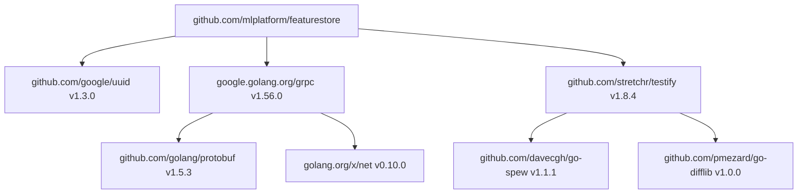

# 📦 Modules, Packages, and Tooling

## Introduction

Software engineering at scale is as much about tooling and dependency management as it is about language syntax. Go's module system, introduced in Go 1.11 and stabilized in Go 1.14, solved one of the most painful problems in software engineering: dependency hell. Before modules, Go relied on `GOPATH`, a single workspace where all source code lived. This model broke down in large organizations where different services required different versions of the same library. For ML engineering teams, this is a daily reality: the feature store might require protobuf v3.19, while the model serving proxy requires v3.21. Without proper version isolation, these conflicts grind development to a halt.

Go modules bring semantic versioning, reproducible builds, and minimal version selection (MVS) to dependency management. A `go.mod` file declares exactly what a module needs, while `go.sum` cryptographically verifies that the downloaded code has not been tampered with. This reproducibility is critical for ML systems where training pipelines must be bit-for-bit reproducible across environments. When a model is trained with a specific version of a data validation library, you must be able to recreate that exact environment six months later for audit purposes.

This module covers the full lifecycle of a Go project: from initializing a module to publishing versioned releases, and from running tests to profiling production binaries. You will learn how to structure multi-package projects, how to use `go vet` to catch bugs before they compile, and how `golangci-lint` enforces team-wide coding standards. These skills transform you from a Go programmer into a Go engineer capable of maintaining production systems. They draw on every previous module, from [[01 - Syntax, Types, and Control Flow]] to [[05 - Error Handling and Panic Recovery]], by showing how to organize and validate that code at scale.

## 1. From GOPATH to Go Modules

Before modules, all Go code lived under `$GOPATH/src`. If two projects needed different versions of a dependency, developers used vendoring—copying dependencies into the project directory. This was brittle and consumed gigabytes of duplicated code across repositories.

Go Modules introduced three key files:

- **`go.mod`**: Declares the module path, Go version, and direct dependencies with minimum versions.
- **`go.sum`**: Contains cryptographic hashes of the exact dependency contents downloaded.
- **`go.work`**: (Go 1.18+) Enables multi-module workspaces for local development.

### go.mod Structure

```go
module github.com/mlplatform/featurestore

go 1.21

require (
    github.com/google/uuid v1.3.0
    google.golang.org/grpc v1.56.0
    github.com/stretchr/testify v1.8.4
)

require (
    github.com/davecgh/go-spew v1.1.1 // indirect
    github.com/pmezard/go-difflib v1.0.0 // indirect
    gopkg.in/yaml.v3 v3.0.1 // indirect
)
```

The `// indirect` comment marks dependencies pulled in transitively. The Go toolchain automatically manages these entries.

### Multi-Package Project Structure

A well-structured Go project separates concerns into packages:

```
featurestore/
├── go.mod
├── go.sum
├── cmd/
│   └── server/
│       └── main.go
├── internal/
│   ├── storage/
│   │   └── redis.go
│   └── model/
│       └── schema.go
├── pkg/
│   └── api/
│       └── types.go
└── proto/
    └── feature.proto
```

- **`cmd/`**: Entry points for binaries. Each subdirectory becomes one executable.
- **`internal/`**: Private application code. The Go compiler enforces that packages outside the module cannot import `internal/` packages.
- **`pkg/`**: Public library code that external modules can import.

Real case: **Uber** migrated from a monolithic `GOPATH`-based repository to Go modules in 2020. Their Go monorepo contains over 100 million lines of code across thousands of services. Before modules, vendoring consumed over 30GB per developer workstation and merge conflicts in vendor directories were a daily occurrence. After migrating to modules, Uber adopted a centralized module proxy and used `go.mod` replace directives to manage internal dependencies. Build times improved by 40%, and the elimination of vendor directories freed up terabytes of storage across their CI fleet. Uber's tooling team open-sourced parts of this migration as `uber-go/guide`, now one of the most influential Go style guides in the industry.

## 2. Semantic Versioning and Dependencies

Go modules enforce Semantic Versioning (SemVer). A version tag like `v1.2.3` means:

- **Major (1)**: Breaking changes. Upgrading requires code changes.
- **Minor (2)**: New features, backward compatible.
- **Patch (3)**: Bug fixes, backward compatible.

Go's Minimal Version Selection (MVS) algorithm resolves dependencies conservatively. If your module requires `A v1.2.0` and `B` requires `A v1.3.0`, MVS selects `v1.3.0`—the minimum version that satisfies all requirements. This avoids the surprising upgrades that plague other package managers.

### Upgrading Dependencies

```bash
go get -u ./...           # Update all direct dependencies
go get -u=patch ./...     # Update only to latest patch versions
go mod tidy               # Remove unused dependencies, add missing ones
```

### Module Proxxy and Checksum Database

By default, `go` downloads modules from a module proxy (`proxy.golang.org`) and verifies them against the checksum database (`sum.golang.org`). This protects against:

- **Left-pad incidents**: A deleted dependency cannot break your build.
- **Supply chain attacks**: Tampered code fails checksum verification.

## 3. Core Go Tooling

Go ships with a comprehensive toolchain that covers formatting, vetting, testing, and building.

### go fmt

`gofmt` automatically formats Go code. Every major Go project enforces it in CI:

```bash
go fmt ./...
```

### go vet

`go vet` performs static analysis to catch suspicious constructs:

```bash
go vet ./...
```

It detects issues like:
- Passing a non-pointer to `Printf`'s `%p` verb.
- Calling `http.Response.Body.Close()` without checking the error.
- Shadowing variables in nested scopes.

### go test

The built-in test framework uses files ending in `_test.go`:

```bash
go test ./...              # Run all tests
go test -race ./...        # Enable race detector
go test -cover ./...       # Show coverage
go test -bench=. ./...     # Run benchmarks
```

### go build and go run

```bash
go build ./cmd/server      # Compile binary
go run ./cmd/server        # Compile and run
go install ./cmd/server    # Compile and install to $GOBIN
```

## 4. Advanced Tooling Ecosystem

Beyond the standard toolchain, the Go community maintains tools that are essential for production engineering.

### golangci-lint

`golangci-lint` aggregates dozens of linters into a single fast binary:

```bash
golangci-lint run ./...
```

It catches issues that `go vet` misses: unused code, incorrect error wrapping, cyclomatic complexity, and more. Most Go projects run it in CI.

### Delve Debugger

`dlv` is a source-level debugger for Go:

```bash
dlv debug ./cmd/server
dlv test ./... -run TestName
```

Unlike GDB, Delve understands Go's goroutines and channels, allowing you to inspect the scheduler state and channel buffers.

### pprof Profiler

Go's built-in `net/http/pprof` package serves CPU and memory profiles:

```go
import _ "net/http/pprof"
```

```bash
go tool pprof http://localhost:6060/debug/pprof/profile
go tool pprof http://localhost:6060/debug/pprof/heap
```

The following diagram shows a typical Go module dependency graph:



### Go Tools Comparison Table

| Tool | Purpose | Frequency | CI Integration |
|------|---------|-----------|----------------|
| `go fmt` | Code formatting | Every save / pre-commit | Mandatory |
| `go vet` | Static analysis | Every build | Mandatory |
| `go test` | Unit tests | Every commit | Mandatory |
| `go mod tidy` | Dependency cleanup | Before commits | Recommended |
| `golangci-lint` | Advanced linting | Every PR | Highly recommended |
| `dlv` | Debugging | During development | N/A |
| `pprof` | CPU/Memory profiling | Performance tuning | Optional |
| `go test -race` | Race detection | Before releases | Mandatory for concurrent code |
| `go build` | Compilation | Every change | Mandatory |


⚠️ **Warning:** Never commit `vendor/` directories unless your organization explicitly requires it. Go modules with a module proxy provide reproducible builds without the bloat of vendored code. If you must vendor, use `go mod vendor` and verify in CI that the vendor directory matches `go.mod`.

💡 **Tip:** Set up a `Makefile` or `taskfile` that runs `go fmt`, `go vet`, `go test -race`, and `golangci-lint` in sequence. Run this before every push. Many teams use pre-commit hooks to automate this, ensuring that only properly formatted and vetted code reaches the repository.

---

## 📦 Compression Code

```go
// go.mod
module github.com/example/mlserver

go 1.21

require (
    github.com/google/uuid v1.3.0
    github.com/stretchr/testify v1.8.4
)

// internal/storage/redis.go
package storage

import "context"

type Store interface {
    Get(ctx context.Context, key string) (string, error)
    Set(ctx context.Context, key, value string) error
}

type RedisStore struct{}

func (r *RedisStore) Get(ctx context.Context, key string) (string, error) {
    return "value", nil
}

func (r *RedisStore) Set(ctx context.Context, key, value string) error {
    return nil
}

// pkg/api/types.go
package api

type FeatureRequest struct {
    ModelID string   `json:"model_id"`
    Inputs  []string `json:"inputs"`
}

// cmd/server/main.go
package main

import (
    "fmt"
    "github.com/example/mlserver/internal/storage"
    "github.com/example/mlserver/pkg/api"
)

func main() {
    var store storage.Store = &storage.RedisStore{}
    _ = store

    req := api.FeatureRequest{ModelID: "abc", Inputs: []string{"x"}}
    fmt.Printf("%+v\n", req)
}
```

---

## 🎯 Documented Project

### Description

Create a multi-package Go module for an ML model registry service. The module uses `internal/` packages for business logic, `pkg/` for public APIs, and `cmd/` for the server binary. The project includes a complete `go.mod`, table-driven tests with race detection, benchmark tests for the registry lookup path, and a CI-ready `Makefile` that runs formatting, vetting, linting, and testing.

### Functional Requirements

1. Initialize a Go module at `github.com/mlplatform/registry` with at least three packages: `internal/registry`, `pkg/api`, and `cmd/server`.
2. Define a `ModelRegistry` interface in `pkg/api` and implement it in `internal/registry` using an in-memory map with mutex protection.
3. Write table-driven tests for all registry operations with at least 80% coverage.
4. Add a benchmark test for the `GetModel` operation and document the results.
5. Create a `Makefile` with targets for `fmt`, `vet`, `test`, `lint` (using `golangci-lint`), and `build`.

### Main Components

- `go.mod`: Module declaration with semantic version constraints.
- `internal/registry/`: Private implementation of model storage and retrieval.
- `pkg/api/`: Public interfaces and request/response types.
- `cmd/server/`: HTTP server entry point using the registry.
- `Makefile`: Build automation with format, vet, test, lint, and build targets.
- `.golangci.yml`: Linter configuration with race detection enabled.

### Success Metrics

- `go mod tidy` produces a clean `go.mod` and `go.sum` with no unused dependencies.
- `go test -race ./...` passes with zero data races.
- `golangci-lint run` reports zero issues.
- Benchmark tests show `GetModel` latency under 100 nanoseconds for 1000 entries.
- The module builds successfully with `go build ./cmd/server` and produces a static binary.

### References

- Go Modules Reference: https://go.dev/ref/modules
- Go Command Documentation: https://pkg.go.dev/cmd/go
- golangci-lint: https://golangci-lint.run/
- Uber Go Style Guide: https://github.com/uber-go/guide
